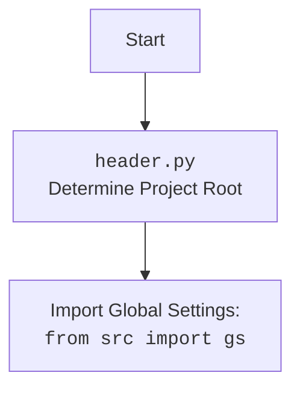

## АНАЛИЗ КОДА

### 1. <алгоритм>

**Блок-схема работы модуля `src.scenario`:**

1.  **Начало**: Запуск функции `main()`.
    *   Пример: `if __name__ == "__main__": main()`

2.  **Инициализация**: Инициализируется объект настроек `s`, содержащий информацию о конфигурации и соединениях с базами данных.
    *   Пример: `s = gs.settings`

3.  **Получение списка файлов сценариев**: Формируется список путей к JSON-файлам сценариев.
    *   Пример: `scenario_files_list = s.scenario_files_list`

4.  **Запуск обработки файлов сценариев**: Вызывается функция `run_scenario_files(s, scenario_files_list)` для обработки списка файлов.
    *   Пример: `run_scenario_files(s, scenario_files_list)`

5.  **Итерация по файлам сценариев**: Функция `run_scenario_files` итерирует по списку `scenario_files_list`. Для каждого файла вызывается функция `run_scenario_file`.
    *   Пример: `for scenario_file in scenario_files_list: run_scenario_file(s, scenario_file)`

6.  **Загрузка сценариев из файла**: Функция `run_scenario_file` загружает JSON-данные из файла в виде словаря.
    *   Пример: `with open(scenario_file, 'r', encoding='utf-8') as f: scenarios_data = json.load(f)`

7.  **Итерация по сценариям**: Функция `run_scenario_file` итерирует по сценариям в словаре `scenarios_data`.
    *   Пример: `for scenario_name, scenario in scenarios_data.get('scenarios', {}).items(): run_scenario(s, scenario)`

8.  **Обработка сценария**: Функция `run_scenario` переходит по URL, указанному в сценарии.
    *   Пример: `url = scenario['url']`
    *   Пример: `response = requests.get(url)`

9.  **Извлечение данных о продуктах**: Из HTML-кода страницы извлекаются данные о продуктах, используя инструменты веб-скрейпинга.
    *   Пример: `soup = BeautifulSoup(response.content, 'html.parser')`

10. **Итерация по продуктам**: Проходится итерация по списку продуктов, найденных на странице.

11. **Извлечение информации о каждом продукте**: Для каждого продукта, на его персональной странице, извлекаются необходимые поля, такие как название, описание, цена и т.д.

12. **Создание объекта продукта**: Создается объект продукта (словарь), содержащий извлеченные данные.
    *   Пример: `product_data = {'name': 'Product Name', 'price': 10.00, ...}`

13. **Сохранение продукта в базе данных**: Объект продукта передается в функцию, которая взаимодействует с базой данных (например, PrestaShop) для сохранения продукта.

14. **Обновление журнала**: Функция `run_scenario` обновляет журнал (`journal`) информацией о выполненном сценарии и его результатах.
    *   Пример: `journal.append({'scenario': scenario['name'], 'status': 'success', 'message': 'Product added successfully'})`

15. **Запись журнала**: После завершения обработки всех сценариев, журнал записывается в файл с помощью функции `dump_journal(s, journal)`.
    *   Пример: `dump_journal(s, journal)`

16. **Конец**: Завершение выполнения модуля.

### 2. <mermaid>

```mermaid
flowchart TD
    Start[Start] --> InitializeSettings[Initialize Settings<br><code>gs.settings</code>]
    InitializeSettings --> GetScenarioFiles[Get Scenario Files List]
    GetScenarioFiles --> RunScenarioFiles{Run Scenario Files<br><code>run_scenario_files(s, scenario_files_list)</code>}
    RunScenarioFiles -- Valid List --> IterateFiles{Iterate Through Each Scenario File}
    RunScenarioFiles -- Invalid List --> ErrorHandlingFiles[Error Handling]
    IterateFiles --> RunScenarioFile[Run Scenario File<br><code>run_scenario_file(s, scenario_file)</code>]
    RunScenarioFile --> LoadScenarios{Load Scenarios from JSON}
    LoadScenarios --> IterateScenarios{Iterate Through Each Scenario}
    IterateScenarios --> RunScenario[Run Scenario<br><code>run_scenario(s, scenario)</code>]
    RunScenario --> NavigateToURL[Navigate to URL<br><code>requests.get(url)</code>]
     NavigateToURL --> GetProductList[Get List of Products<br><code>BeautifulSoup(response.content, 'html.parser')</code>]
     GetProductList --> IterateProducts{Iterate Through Products}
    IterateProducts --> NavigateToProductPage[Navigate to Product Page]
    NavigateToProductPage --> GrabProductFields[Grab Product Fields]
    GrabProductFields --> CreateProductObject[Create Product Object]
    CreateProductObject --> InsertIntoPrestashop{Insert Product into PrestaShop}
    InsertIntoPrestashop -- Success --> SuccessLog[Success]
    InsertIntoPrestashop -- Failure --> ErrorHandlingProduct[Error Handling]
    SuccessLog --> UpdateJournal[Update Journal]
    ErrorHandlingProduct --> UpdateJournal
    UpdateJournal --> ReturnResult[Return True/False]
    ReturnResult --> DumpJournal{Dump Journal<br><code>dump_journal(s, journal)</code>}
    DumpJournal --> End[End]
    ErrorHandlingFiles --> End
```
**Объяснение:**

1. **Start**: Начало выполнения программы.
2.  **InitializeSettings**: Инициализация настроек проекта.
3.  **GetScenarioFiles**: Получение списка файлов сценариев.
4.  **RunScenarioFiles**: Запуск обработки файлов сценариев через функцию `run_scenario_files`.
5.  **IterateFiles**: Итерация по списку файлов сценариев.
6.  **RunScenarioFile**: Запуск обработки каждого файла сценария через функцию `run_scenario_file`.
7.  **LoadScenarios**: Загрузка сценариев из JSON-файла.
8.  **IterateScenarios**: Итерация по сценариям, загруженным из файла.
9.  **RunScenario**: Запуск обработки отдельного сценария через функцию `run_scenario`.
10. **NavigateToURL**: Переход по URL, указанному в сценарии, с помощью `requests.get(url)`.
11. **GetProductList**: Получение списка продуктов на странице используя `BeautifulSoup`.
12. **IterateProducts**: Итерация по списку продуктов.
13. **NavigateToProductPage**: Переход на страницу каждого продукта.
14. **GrabProductFields**: Извлечение данных полей продукта со страницы.
15. **CreateProductObject**: Создание объекта продукта для вставки в базу.
16. **InsertIntoPrestashop**: Вставка продукта в базу данных PrestaShop.
17. **SuccessLog**: Логирование успешной операции.
18. **ErrorHandlingProduct**: Обработка ошибок в процессе вставки продукта.
19. **UpdateJournal**: Обновление журнала выполнения.
20. **ReturnResult**: Возврат результата выполнения.
21. **DumpJournal**: Сохранение журнала выполнения в файл.
22. **End**: Завершение выполнения программы.

### 3. <объяснение>

**Импорты:**

*   **`json`**: Используется для работы с JSON-файлами, включая чтение сценариев из JSON-файлов. Это стандартная библиотека Python.
*   **`requests`**: Используется для отправки HTTP-запросов на веб-сайты поставщиков для получения данных о продуктах. Это внешняя библиотека, которую необходимо установить.
*   **`BeautifulSoup`**: Используется для парсинга HTML-кода, полученного с веб-сайтов, чтобы извлечь необходимую информацию о продуктах. Это также внешняя библиотека.
*   **`src.gs`**: Импортирует глобальные настройки проекта, используемые для доступа к конфигурации, например, списку файлов сценариев и настройкам подключения к базе данных.

**Функции:**

*   **`run_scenario_files(s, scenario_files_list)`**:
    *   **Аргументы**:
        *   `s` (объект): Объект настроек, содержащий общую конфигурацию проекта.
        *   `scenario_files_list` (list): Список путей к JSON-файлам сценариев.
    *   **Назначение**: Проходит по списку файлов сценариев и запускает функцию `run_scenario_file` для каждого файла.
    *   **Пример**: `run_scenario_files(s, ['scenario1.json', 'scenario2.json'])`
    *   **Возвращает**: `None`.

*   **`run_scenario_file(s, scenario_file)`**:
    *   **Аргументы**:
        *   `s` (объект): Объект настроек.
        *   `scenario_file` (str): Путь к файлу сценария.
    *   **Назначение**: Загружает JSON-данные из файла сценария и вызывает `run_scenario` для каждого сценария.
    *   **Пример**: `run_scenario_file(s, 'scenario1.json')`
    *   **Возвращает**: `None`.

*   **`run_scenario(s, scenario)`**:
    *   **Аргументы**:
        *   `s` (объект): Объект настроек.
        *   `scenario` (dict): Словарь, содержащий данные сценария (URL, категории и т.д.).
    *   **Назначение**: Обрабатывает отдельный сценарий, переходя по URL, извлекая данные и сохраняя их в БД.
    *   **Пример**: `run_scenario(s, {'url': 'https://example.com/products', 'name': 'Кремы'})`
    *   **Возвращает**: `None`.

*   **`dump_journal(s, journal)`**:
    *   **Аргументы**:
        *   `s` (объект): Объект настроек.
        *   `journal` (list): Список записей журнала выполнения.
    *   **Назначение**: Сохраняет журнал выполнения в файл.
    *   **Пример**: `dump_journal(s, [{'scenario': 'Кремы', 'status': 'success'}])`
    *   **Возвращает**: `None`.

*   **`main()`**:
    *   **Аргументы**: Нет.
    *   **Назначение**: Главная функция, запускающая весь процесс.
    *   **Пример**: `main()`
    *   **Возвращает**: `None`.

**Переменные:**

*   **`s`**: Объект настроек, полученный из `src.gs.settings`. Содержит общие настройки, такие как пути к файлам и параметры соединения с БД.
*   **`scenario_files_list`**: Список путей к файлам JSON-сценариев.
*   **`journal`**: Список словарей, содержащих информацию о выполнении сценариев.

**Связь с другими частями проекта:**

*   Модуль `src.scenario` зависит от `src.gs` для получения глобальных настроек.
*   Модуль предположительно взаимодействует с другими модулями для работы с базой данных PrestaShop (интеграция не показана в примере, но упоминается в описании).

**Потенциальные ошибки и области для улучшения:**

1.  **Обработка ошибок**: Реализована базовая обработка исключений, но можно добавить более детальное журналирование ошибок и механизм их обработки (например, повторные попытки).
2.  **Веб-скрейпинг**: Необходимо предусмотреть механизмы для обхода защиты от ботов и обработки изменений в структуре веб-страниц.
3.  **Масштабируемость**: Можно улучшить масштабируемость модуля, добавив асинхронные запросы к веб-сайтам.
4.  **Логирование**: Можно добавить более детальное логирование.
5.  **Универсальность**: Код может быть более универсальным, если сделать структуру JSON-сценариев более гибкой и добавить возможность обрабатывать различные типы данных.

**Дополнительно (header.py):**


**Объяснение `header.py`:**
*   **Start**: Начало выполнения.
*  **Header**: `header.py` устанавливает корень проекта.
*  **import**: импортирует глобальные настройки из `src.gs` для использования в других частях проекта.

В целом, модуль `src.scenario` является важной частью проекта, автоматизирующей сбор и обработку данных о продуктах с веб-сайтов поставщиков и их интеграцию с базой данных.