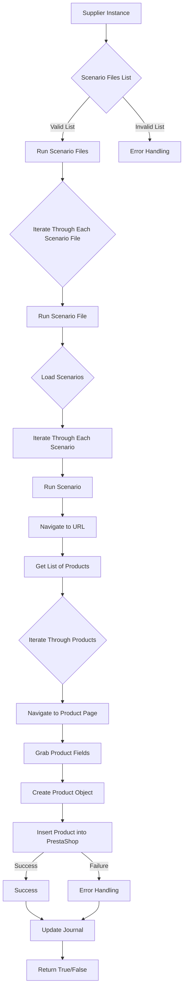
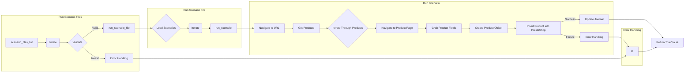

```MD
# Модуль `src.scenario`

## <input code>

```
# Модуль `src.scenario`

## Обзор

Модуль `src.scenario` предназначен для автоматизации взаимодействия с поставщиками, используя сценарии, описанные в JSON-файлах. Он адаптирует процесс извлечения и обработки данных о продуктах с веб-сайтов поставщиков и синхронизирует эту информацию с базой данных (например, PrestaShop).  Модуль включает чтение сценариев, взаимодействие с веб-сайтами, обработку данных, запись журнала выполнения и организацию всего процесса.

## Оглавление

* [Модуль `src.scenario`](#модуль-src-scenario)
* [Обзор](#обзор)
* [Основные функции модуля](#основные-функции-модуля)
* [Основные компоненты модуля](#основные-компоненты-модуля)
    * [`run_scenario_files(s, scenario_files_list)`](#run_scenario_files-s-scenario_files_list)
    * [`run_scenario_file(s, scenario_file)`](#run_scenario_file-s-scenario_file)
    * [`run_scenario(s, scenario)`](#run_scenario-s-scenario)
    * [`dump_journal(s, journal)`](#dump_journal-s-journal)
    * [`main()`](#main)
* [Пример сценария](#пример-сценария)
* [Как это работает](#как-это-работает)


## Основные функции модуля

1. **Чтение сценариев**: Загрузка сценариев из JSON-файлов, содержащих информацию о продуктах и их URL на сайте поставщика.
2. **Взаимодействие с веб-сайтами**:  Обработка URL-адресов из сценариев для извлечения данных о продуктах.
3. **Обработка данных**: Преобразование извлечённых данных в формат, подходящий для базы данных, и сохранение в неё.
4. **Запись журнала выполнения**: Ведение журнала с деталями выполнения сценариев и результатами работы для отслеживания процесса и выявления ошибок.



## <algorithm>

**Шаг 1:** Функция `run_scenario_files` получает список файлов сценариев.
**Шаг 2:**  Она итерируется по списку, вызывая `run_scenario_file` для каждого файла.
**Шаг 3:** `run_scenario_file` загружает сценарии из файла.
**Шаг 4:** Она итерируется по сценариям в файле.
**Шаг 5:** `run_scenario` обрабатывает каждый сценарий.
**Шаг 6:** В `run_scenario`: Идет переходам по URL.
**Шаг 7:** В `run_scenario`: Извлекаются данные о продуктах.
**Шаг 8:** В `run_scenario`: Данные создают объект продукта и загружаются в PrestaShop.
**Шаг 9:** Если всё прошло успешно, записывается запись в журнал. Если ошибка, то ошибка обрабатывается.

## <mermaid>



## <explanation>

* **Импорты**:  Нет импортов, описанных в коде. Присутствуют предположения о необходимости импортов для работы с веб-запросами (например, `requests`), обработкой JSON и взаимодействием с базой данных.
* **Классы**: Нет определенных классов в примере кода.  Предполагается использование какого-то объекта `s` для настройки параметров (например, соединения с базой данных, веб-драйвера), но сам объект не представлен.
* **Функции**:
    * `run_scenario_files`:  принимает список файлов сценариев и объект настроек, итерируется по ним, вызывая `run_scenario_file` для каждого.
    * `run_scenario_file`:  принимает файл сценария и объект настроек, загружает данные из файла, итерируется по сценариям, вызывая `run_scenario`.
    * `run_scenario`:  принимает сценарий и объект настроек, выполняет действия по сценарию: переходит по URL, получает список продуктов, итерируется по ним, забирает данные продукта, создает объект продукта и вставляет его в PrestaShop.  Возвращает `True/False` (подразумевается) или выбрасывает исключение.
    * `dump_journal`: записывает журнал выполнения в файл.
    * `main`: точка входа в программу, скорее всего, запускает выполнение `run_scenario_files` с заданным списком файлов.
* **Переменные**:  `s` (объект настроек), `scenario_files_list` (список файлов сценариев), `scenario_file` (имя файла), `scenario` (сценарий).
* **Возможные ошибки и улучшения**:
    * Нет обработки ошибок (например, `try...except` блоки). Важно перехватывать и обрабатывать исключения `FileNotFoundError`, `JSONDecodeError`, `requests.exceptions.RequestException` и другие, чтобы предотвратить сбой программы.
    * Не указан способ реализации `Create Product Object` и `Insert Product into PrestaShop`. Необходимо подробно описать эти этапы в соответствующих функциях.
    * Не описано, каким образом создается `scenario_files_list` - это требует дополнительных знаний о структуре проекта.
    * Отсутствует логика работы с различными типами ошибок (например, 404 ошибки на сайте).

**Взаимосвязи с другими частями проекта:**

Предполагается зависимость от `requests` для работы с веб-сайтами, библиотеки для работы с PrestaShop для взаимодействия с базой данных, а также модуля для загрузки и парсинга JSON-файлов. Модуль `src.scenario` зависит от данных, структурированных в формате JSON.

```