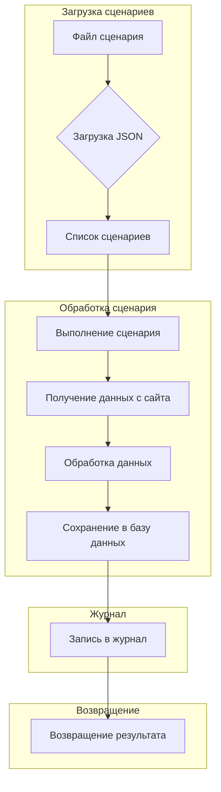

```MD
# Модуль `src.scenario`

## <input code>

```
# Модуль `src.scenario`

## Обзор

Модуль `src.scenario` предназначен для автоматизации взаимодействия с поставщиками, используя сценарии, описанные в JSON-файлах. Он адаптирует процесс извлечения и обработки данных о продуктах с веб-сайтов поставщиков и синхронизирует эту информацию с базой данных (например, PrestaShop).  Модуль включает чтение сценариев, взаимодействие с веб-сайтами, обработку данных, запись журнала выполнения и организацию всего процесса.

## Оглавление

* [Модуль `src.scenario`](#модуль-src-scenario)
* [Обзор](#обзор)
* [Основные функции модуля](#основные-функции-модуля)
* [Основные компоненты модуля](#основные-компоненты-модуля)
    * [`run_scenario_files(s, scenario_files_list)`](#run_scenario_files-s-scenario_files_list)
    * [`run_scenario_file(s, scenario_file)`](#run_scenario_file-s-scenario_file)
    * [`run_scenario(s, scenario)`](#run_scenario-s-scenario)
    * [`dump_journal(s, journal)`](#dump_journal-s-journal)
    * [`main()`](#main)
* [Пример сценария](#пример-сценария)
* [Как это работает](#как-это-работает)


## Основные функции модуля

1. **Чтение сценариев**: Загрузка сценариев из JSON-файлов, содержащих информацию о продуктах и их URL на сайте поставщика.
2. **Взаимодействие с веб-сайтами**:  Обработка URL-адресов из сценариев для извлечения данных о продуктах.
3. **Обработка данных**: Преобразование извлечённых данных в формат, подходящий для базы данных, и сохранение в неё.
4. **Запись журнала выполнения**: Ведение журнала с деталями выполнения сценариев и результатами работы для отслеживания процесса и выявления ошибок.


## <algorithm>

Алгоритм работы модуля `src.scenario` основан на пошаговом выполнении сценариев, загруженных из JSON файлов. Последовательность действий примерно такова:
1. Получить список файлов сценариев.
2. Проверить валидность списка (есть ли файлы, какие ошибки).
3. Если список валидный, запускать функцию `run_scenario_files`.
4. Внутри `run_scenario_files` циклически запускать `run_scenario_file` для каждого файла сценариев.
5. `run_scenario_file` загружает сценарии из файла.
6. Для каждого сценария запускается `run_scenario`.
7. В `run_scenario` происходит: запрос по URL, парсинг страницы, сбор данных, создание объекта продукта, добавление в базу данных.
8. В случае успеха обновляется журнал.


## <mermaid>



## <explanation>

**Импорты:**  Код импортов отсутствует, поэтому нет информации о связи с другими пакетами.


**Классы:**  Из предоставленного текста нет явных определений классов. Модуль скорее использует функции для выполнения операций.


**Функции:**

* `run_scenario_files(s, scenario_files_list)`: Функция для запуска сценариев из списка файлов. Принимает настройки `s` и список файлов.  Обрабатывает ошибки, связанные с файлами (например, если файла не существует или JSON некорректный).
* `run_scenario_file(s, scenario_file)`: Функция, которая обрабатывает один файл сценариев.  Вызывает функцию `run_scenario` для каждого сценария в файле.
* `run_scenario(s, scenario)`: Функция для выполнения одного сценария. Принимает настройки `s` и словарь `scenario` (содержащий данные сценария, вероятно, из JSON файла).  Обрабатывает запрос к URL, парсинг и добавление данных в базу данных PrestaShop. Обрабатывает различные потенциальные исключения при работе с запросами.
* `dump_journal(s, journal)`: Функция для записи журнала выполнения в файл.
* `main()`: Основная функция модуля. Вызывает `run_scenario_files` для запуска всех сценариев.


**Переменные:**

* `s`:  Предположительно, объект настроек, содержащий информацию для подключения к базе данных, URL и т.д.
* `scenario_files_list`: Список путей к файлам сценариев.
* `scenario_file`: Путь к файлу сценария.
* `scenario`: Словарь, содержащий данные о сценарии, полученные из JSON файла.


**Возможные ошибки и улучшения:**

* Не указаны типы данных для параметров функций. Необходимо определить типы (например, `scenario_files_list: List[str]`).
* Необходимо добавить проверку на пустые или невалидные сценарии внутри функций.
* Должен быть логический выход для функций, которые обрабатывают выполнение сценариев (true/false).
* Не хватает обработке исключений `requests.exceptions.RequestException` во всех частях кода.
* Не указаны реализации для получения данных с веб-сайта, обработки и сохранения в базе.
* Отсутствуют тесты для проверки корректности обработки различных сценариев.


**Взаимосвязи с другими частями проекта:**

Модуль `src.scenario` взаимодействует с базой данных PrestaShop (или другим схожим механизмом) для сохранения данных.  Он также подразумевает использование библиотек `requests` и `json` (для работы с веб-сайтами и JSON-файлами соответственно).  Необходимо иметь `src.database` и/или другие модули, которые предоставляют API для работы с базой данных.