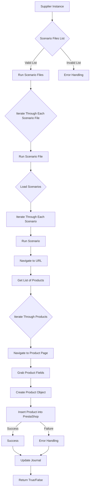
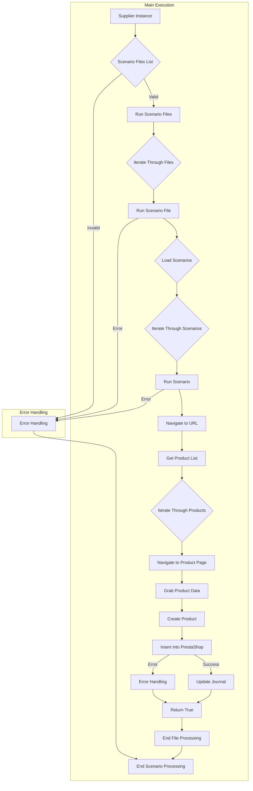

```MD
# Модуль `src.scenario`

## <input code>

```
# Module `src.scenario`

## Overview

The `src.scenario` module is designed to automate interactions with suppliers using scenarios described in JSON files. It streamlines the process of extracting and processing product data from supplier websites and synchronizing this information with a database (e.g., PrestaShop). The module includes functionality for reading scenarios, interacting with websites, processing data, logging execution details, and organizing the entire workflow.

## Table of Contents

* [Module `src.scenario`](#module-src-scenario)
* [Overview](#overview)
* [Core Functions of the Module](#core-functions-of-the-module)
* [Main Components of the Module](#main-components-of-the-module)
    * [`run_scenario_files(s, scenario_files_list)`](#run_scenario_files-s-scenario_files_list)
    * [`run_scenario_file(s, scenario_file)`](#run_scenario_file-s-scenario_file)
    * [`run_scenario(s, scenario)`](#run_scenario-s-scenario)
    * [`dump_journal(s, journal)`](#dump_journal-s-journal)
    * [`main()`](#main)
* [Example Scenario](#example-scenario)
* [How It Works](#how-it-works)

## Core Functions of the Module

1. **Reading Scenarios**: Loading scenarios from JSON files containing product information and URLs on the supplier's website.
2. **Interacting with Websites**: Processing URLs from scenarios to extract product data.
3. **Processing Data**: Transforming extracted data into a format suitable for the database and saving it.
4. **Logging Execution**: Maintaining logs with details of scenario execution and results for tracking progress and identifying errors.


## <algorithm>

The algorithm proceeds as follows:

1. A list of scenario files is checked.
2. Each valid file is processed.
3. For each file, scenarios are loaded and processed sequentially.
4. Each scenario involves fetching a list of products from a website.
5. Each product is processed (navigating to product pages, extracting data, and creating a product object).
6. The product objects are inserted into the PrestaShop database.
7. The execution progress is logged in a journal.
8. Errors (invalid files, website issues, database errors) are handled appropriately.


## <mermaid>



**Dependencies:**

* `requests`: For interacting with web servers.
* `json`: For parsing JSON scenario files.
* `logging`: For logging execution details.
* `settings`: Likely for managing configuration.
* `prestashop_api`: (implied) For interacting with PrestaShop database.


## <explanation>

**Импорты:**
The code likely imports necessary libraries like `requests` for interacting with websites, `json` for handling JSON data, and `logging` for recording events. The `settings` module is critical for configuring aspects of the application (like database connections, API keys).  `prestashop_api` is a presumed module specifically designed for interacting with the PrestaShop API or database. The specific code given is a conceptual overview, not a fully functioning example.

**Классы:**
The code doesn't define classes within the provided snippet.  Classes would likely handle the structure of the scenarios (e.g., a `Scenario` class to represent the data from JSON files), and objects relating to data structures for product handling or data access.

**Функции:**
* **`run_scenario_files`**: Takes a settings object (`s`) and a list of scenario file paths. It processes each file sequentially using `run_scenario_file`.
* **`run_scenario_file`**: Loads a scenario file, parses it as JSON, and calls `run_scenario` for each scenario found.
* **`run_scenario`**: Executes a single scenario. This is the core function responsible for fetching data, extracting information, creating product objects, and saving data to the database.  It directly interacts with the PrestaShop database (or other relevant API).
* **`dump_journal`**: Records the execution logs for each scenario.
* **`main`**: The entry point of the script. It configures any required settings and starts the scenario processing.

**Переменные:**
The provided example shows that `scenario_files_list` is a list of strings (file paths), and `scenario` is a dictionary representing a single scenario from a JSON file.

**Возможные ошибки и улучшения:**

* **Error Handling**: The code should include more comprehensive error handling. For example, if the website returns an error, the scenario should attempt a retry, or log the failure with a detailed explanation.
* **Rate Limiting**: Be mindful of rate limits imposed by supplier websites. Implement delays or backoff strategies to prevent exceeding limits.
* **Data Validation**: Validate data extracted from the website and ensure the PrestaShop insertion data conforms to database standards.


**Взаимосвязь с другими частями проекта:**
The `src.scenario` module depends on other parts of the application, including a configuration file for settings (`settings`), and presumably a `prestashop_api` module or similar database interaction code.