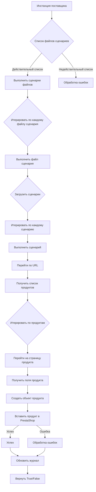

```MD
# Модуль `src.scenario`

## 1. <input code>

```
# Модуль `src.scenario`

## Обзор

Модуль `src.scenario` предназначен для автоматизации взаимодействия с поставщиками с использованием сценариев, описанных в JSON-файлах. Он оптимизирует процесс извлечения и обработки данных о продуктах с веб-сайтов поставщиков и синхронизации этой информации с базой данных (например, PrestaShop). Модуль включает функциональность для чтения сценариев, взаимодействия с веб-сайтами, обработки данных, ведения журнала выполнения и организации всего рабочего процесса.

## Содержание

* [Модуль `src.scenario`](#модуль-src-scenario)
* [Обзор](#обзор)
* [Основные функции модуля](#основные-функции-модуля)
* [Основные компоненты модуля](#основные-компоненты-модуля)
    * [`run_scenario_files(s, scenario_files_list)`](#run_scenario_files-s-scenario_files_list)
    * [`run_scenario_file(s, scenario_file)`](#run_scenario_file-s-scenario_file)
    * [`run_scenario(s, scenario)`](#run_scenario-s-scenario)
    * [`dump_journal(s, journal)`](#dump_journal-s-journal)
    * [`main()`](#main)
* [Пример сценария](#пример-сценария)
* [Как это работает](#как-это-работает)

## Основные функции модуля

1. **Чтение сценариев**: Загрузка сценариев из JSON-файлов, содержащих информацию о продуктах и URL-адреса на веб-сайте поставщика.
2. **Взаимодействие с веб-сайтами**: Обработка URL-адресов из сценариев для извлечения данных о продуктах.
3. **Обработка данных**: Преобразование извлеченных данных в формат, подходящий для базы данных, и сохранение их.
4. **Ведение журнала выполнения**: Поддержание журналов с деталями выполнения сценария и результатами для отслеживания прогресса и выявления ошибок.




## 2. <algorithm>

(Пошаговая блок-схема представлена в mermaid-коде выше)

## 3. <mermaid>


## 4. <explanation>

**Импорты:**

В коде нет явных импортов, так как он описывает структуру модуля, а не его функциональную реализацию.  Импорты будут содержаться в файлах Python, которые этот модуль использует.  Например, импорты будут необходимы для работы с JSON, веб-запросами (requests), базой данных (PrestaShop API) и другими библиотеками.

**Классы:**

Описание предполагает, что используются классы для работы с настройками (`s`, например, объект конфигурации с данными о базе данных), и потенциально для представления данных о продуктах.  Эти классы определены в других модулях проекта.

**Функции:**

* `run_scenario_files(s, scenario_files_list)`:  Принимает список файлов сценариев и последовательно выполняет их.  Важно, что в описании функции `s` - объект настроек. Это говорит о зависимости от другого модуля.
* `run_scenario_file(s, scenario_file)`: Загружает сценарии из указанного файла и выполняет `run_scenario` для каждого сценария.
* `run_scenario(s, scenario)`: Обрабатывает отдельный сценарий, переходит по URL, извлекает данные о продуктах и сохраняет их в базу данных.  Опять же, `s` - объект настроек.
* `dump_journal(s, journal)`: Сохраняет журнал выполнения в файл.
* `main()`: Точка входа в модуль.

**Переменные:**

Определены переменные, представляющие сценарий (`scenario`), список файлов (`scenario_files_list`), объект настроек (`s`) и журнал (`journal`).

**Возможные ошибки и улучшения:**

* **Обработка ошибок:** В описании присутствует обработка ошибок (`FileNotFoundError`, `JSONDecodeError`, `requests.exceptions.RequestException`, `Exception`). Но нужно учитывать потенциальные ошибки при взаимодействии с базой данных (например, проблемы с подключением). Важно добавить детализированную обработку ошибок и логгирование.
* **Детализация сценариев:** Сценарии описаны как JSON, но недостаточно подробной информации о формате. Важно предоставить точную спецификацию для разных типов данных и полей.
* **Тестирование:** Необходимо реализовать тестовые сценарии для проверки работоспособности модуля и обработки различных случаев.

**Взаимосвязи с другими частями проекта:**

Модуль `src.scenario` зависит от:

* **Модулей, которые обеспечивают взаимодействие с базой данных (PrestaShop API).**
* **Модулей, которые предоставляют функции веб-скрапинга.**
* **Модулей, которые обеспечивают работу с JSON.**
* **Объекта настроек (`s`), возможно в другом модуле (конфигурация, базы данных).**

В целом, предоставленный документ описывает структуру и назначение модуля `src.scenario`. Чтобы полностью понять реализацию, необходимо просмотреть исходный код Python-файлов, которые импортируются и реализуют описанные функции.