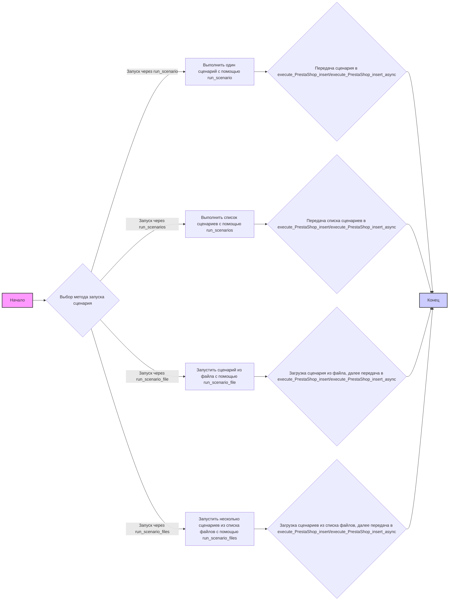
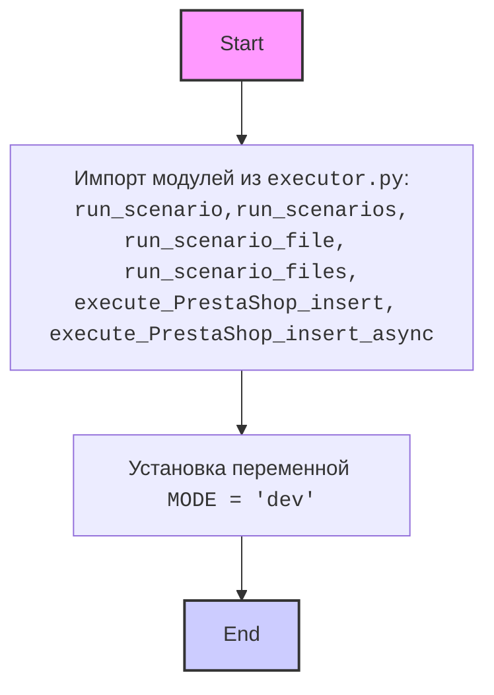

## АНАЛИЗ КОДА

### 1. <алгоритм>

**Блок-схема:**

**Примеры:**

*   **`run_scenario`**:
    *   **Входные данные**: `scenario` (словарь с данными о сценарии)
    *   **Действия**: Вызывает `execute_PrestaShop_insert` или `execute_PrestaShop_insert_async` для выполнения сценария.
    *   **Выходные данные**: Нет (в коде нет возвращаемого значения)

*   **`run_scenarios`**:
    *   **Входные данные**: `scenarios` (список словарей, каждый из которых представляет сценарий)
    *   **Действия**: Итерируется по списку сценариев и вызывает `execute_PrestaShop_insert` или `execute_PrestaShop_insert_async` для каждого из них.
    *   **Выходные данные**: Нет (в коде нет возвращаемого значения)

*   **`run_scenario_file`**:
    *   **Входные данные**: `file_path` (путь к JSON файлу со сценариями)
    *   **Действия**: Загружает сценарии из JSON файла, затем вызывает  `execute_PrestaShop_insert` или `execute_PrestaShop_insert_async` для каждого из них.
    *   **Выходные данные**: Нет (в коде нет возвращаемого значения)

*   **`run_scenario_files`**:
    *   **Входные данные**: `file_paths` (список путей к JSON файлам со сценариями)
    *   **Действия**: Итерируется по списку путей, загружает сценарии из каждого файла, затем вызывает  `execute_PrestaShop_insert` или `execute_PrestaShop_insert_async` для каждого сценария.
    *   **Выходные данные**: Нет (в коде нет возвращаемого значения)

### 2. <mermaid>

### 3. <объяснение>

**Импорты:**

*   `from .executor import ...`: Импортирует функции из модуля `executor.py`, находящегося в том же пакете `src.scenario`.
    *   `run_scenario`: Выполняет один сценарий. Принимает словарь с данными сценария.
    *   `run_scenarios`: Выполняет список сценариев. Принимает список словарей, где каждый словарь — сценарий.
    *   `run_scenario_file`: Выполняет сценарии, загружая их из одного файла. Принимает путь к файлу.
    *   `run_scenario_files`: Выполняет сценарии, загружая их из нескольких файлов. Принимает список путей к файлам.
    *    `execute_PrestaShop_insert`: Выполняет вставку данных в PrestaShop (вероятно синхронно).
     *   `execute_PrestaShop_insert_async`: Выполняет вставку данных в PrestaShop асинхронно.

**Переменные:**

*   `MODE = 'dev'`: Устанавливает режим работы модуля в `dev`. Это может влиять на поведение других частей кода, например, включение отладочных сообщений или использование тестовой базы данных.

**Функции:**

*   В данном коде нет явно определенных функций, за исключением импортированных.  Вся логика по обработке сценариев перенесена в `executor.py`. 
    *   **Логика:** Функции `run_scenario`, `run_scenarios`, `run_scenario_file`, и `run_scenario_files` являются точками входа для запуска обработки сценариев. Каждая из них подготавливает данные и передает их в `execute_PrestaShop_insert` или `execute_PrestaShop_insert_async` (эти функции импортируются из `executor.py`, соответственно их функциональность нужно смотреть в этом файле).

**Взаимосвязь с другими частями проекта:**

*   **`src.executor`**:  Этот модуль является ключевым, так как содержит логику обработки и вставки данных в PrestaShop. Модуль `src.scenario` полагается на функции из `src.executor`.

**Потенциальные ошибки и области для улучшения:**

*   **Обработка ошибок**: В коде не видно явной обработки ошибок.  Было бы полезно добавить блоки try-except в `executor.py`, особенно в функциях для работы с файлами и вставкой данных в PrestaShop.
*   **Логирование**:  Для отладки и мониторинга полезно добавить логирование, чтобы отслеживать, какие сценарии выполняются и какие ошибки происходят.
*   **Конфигурация**: Значение `MODE = 'dev'` захардкожено.  Лучше было бы использовать конфигурационный файл или переменные окружения для настройки режима работы.
*   **`execute_PrestaShop_insert/execute_PrestaShop_insert_async`**:  Необходимо убедится, что эти функции корректно обрабатывают данные сценариев.

**Цепочка взаимосвязей:**

1.  Пользователь вызывает `s.run()` в основном скрипте (как указано в документации).
2.  `s.run()` (метод класса `Supplier` - не определен в коде) определяет, какой из методов `run_scenario`, `run_scenarios`, `run_scenario_file`, или `run_scenario_files` из `src.scenario` нужно вызвать.
3.  Выбранная функция  обрабатывает переданные данные и вызывает `execute_PrestaShop_insert` или `execute_PrestaShop_insert_async` из `src.executor`.
4.  Функции из `src.executor` выполняют вставку данных в PrestaShop.

В целом, данный код представляет собой уровень абстракции для запуска различных типов сценариев для импорта данных в PrestaShop. Он полагается на функции, импортированные из модуля `executor.py`, для фактической обработки и вставки данных.