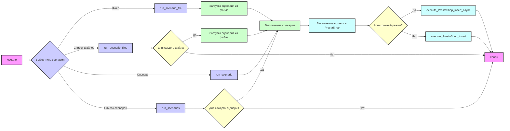
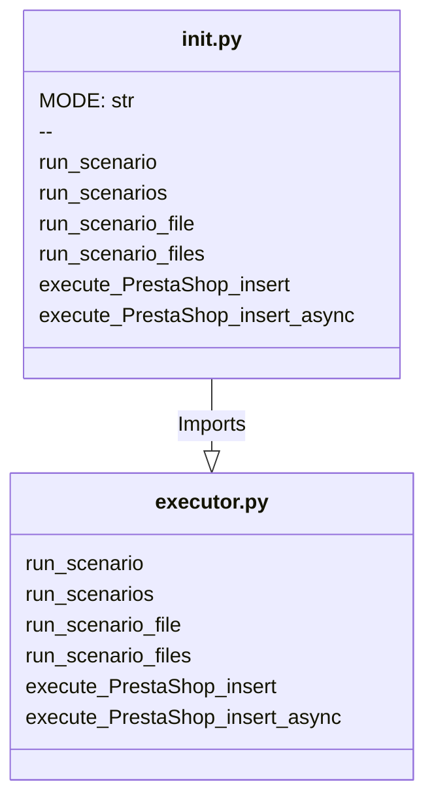

## Анализ кода `hypotez/src/scenario/__init__.py`

### 1. <алгоритм>

**Общее описание:** Модуль `src.scenario` предоставляет функции для выполнения сценариев, связанных с поставщиками. Сценарии могут быть представлены в виде файлов или словарей (структур данных). Модуль поддерживает как последовательное, так и асинхронное выполнение вставок данных в PrestaShop.

**Блок-схема:**

**Примеры:**

1. **`run_scenario_file(supplier, 'scenario1.json')`**:
   - Загружает сценарий из файла `scenario1.json`.
   - Выполняет сценарий для заданного поставщика (`supplier`).
   - Выполняет вставку данных в PrestaShop.

2. **`run_scenario_files(supplier, ['scenario1.json', 'scenario2.json'])`**:
   - Загружает и выполняет сценарии из `scenario1.json` и `scenario2.json` последовательно.
   - Выполняет вставку данных в PrestaShop для каждого сценария.

3.  **`run_scenario(supplier, {'url': '...', 'name': '...', 'condition': '...', 'presta_categories': {...}})`**:
    - Выполняет заданный сценарий (словарь) для указанного поставщика.
    - Выполняет вставку данных в PrestaShop.

4.  **`run_scenarios(supplier, [scenario1, scenario2, ...])`**:
    - Выполняет каждый сценарий (словарь) из списка последовательно.
    - Выполняет вставку данных в PrestaShop для каждого сценария.

### 2. <mermaid>

**Анализ зависимостей:**

- `__init__.py` импортирует функции `run_scenario`, `run_scenarios`, `run_scenario_file`, `run_scenario_files`, `execute_PrestaShop_insert`, `execute_PrestaShop_insert_async` из модуля `executor.py` (предположительно, файл `executor.py` находится в том же пакете `src.scenario`).
- `executor.py` (подразумевается) содержит основную логику выполнения сценариев и взаимодействия с PrestaShop.
- Между модулем `__init__.py` и модулем `executor.py` существует отношение зависимости: `__init__.py` использует функциональность, предоставляемую `executor.py`.

### 3. <объяснение>

**Импорты:**

- `from .executor import ...`: Импортирует функции из модуля `executor.py`, находящегося в том же пакете `src.scenario`. Это позволяет `__init__.py` предоставлять интерфейс для работы со сценариями, используя фактическую логику, реализованную в `executor.py`.

**Переменные:**

- `MODE = 'dev'`: Определяет режим работы модуля (в данном случае, режим разработки). Это может влиять на поведение модуля, например, на вывод отладочной информации или использование определенных конфигураций.

**Функции:**

Импортированные из `executor.py`:
- `run_scenario(supplier, scenario)`: Выполняет единичный сценарий, представленный словарем `scenario`, для заданного поставщика `supplier`.
- `run_scenarios(supplier, scenarios)`: Выполняет список сценариев `scenarios` для заданного поставщика `supplier`.
- `run_scenario_file(supplier, file_path)`: Выполняет сценарий, загруженный из файла с путем `file_path`, для заданного поставщика `supplier`.
- `run_scenario_files(supplier, file_paths)`: Выполняет список сценариев, загруженных из файлов, указанных в `file_paths`, для заданного поставщика `supplier`.
- `execute_PrestaShop_insert(data)`: Выполняет вставку данных `data` в PrestaShop.
- `execute_PrestaShop_insert_async(data)`: Выполняет асинхронную вставку данных `data` в PrestaShop.

**Объяснение:**

- `__init__.py` служит как точка входа в модуль `src.scenario`, предоставляя удобный интерфейс для выполнения сценариев.
- Функции `run_scenario`, `run_scenarios`, `run_scenario_file`, `run_scenario_files` обрабатывают различные форматы представления сценариев (словарь, список словарей, файл, список файлов) и передают их в `executor.py` для дальнейшей обработки.
- Функции `execute_PrestaShop_insert` и `execute_PrestaShop_insert_async` отвечают за взаимодействие с PrestaShop API, позволяя вставлять данные синхронно или асинхронно.
- Модуль использует режим `dev`, который может быть изменен для других режимов (например, `prod`).
- Использование `executor.py` позволяет разделить ответственность, вынося логику выполнения сценариев в отдельный модуль, что улучшает читаемость и поддерживаемость кода.

**Потенциальные ошибки и области для улучшения:**

- Отсутствует обработка ошибок, например, при загрузке файлов или при взаимодействии с PrestaShop API.
- Не хватает валидации данных, поступающих в функции.
- Желательно добавить логирование для отслеживания выполнения сценариев и отладки ошибок.
- Отсутствует информация о структуре данных, передаваемых в `execute_PrestaShop_insert` и `execute_PrestaShop_insert_async`.

**Цепочка взаимосвязей с другими частями проекта:**

- Модуль `src.scenario`, вероятно, взаимодействует с модулем `src.supplier`, который содержит информацию о поставщиках и их API.
- Модуль взаимодействует с API PrestaShop для вставки данных, и таким образом зависит от корректной работы API PrestaShop.
- Зависимость от `executor.py` для реализации логики выполнения сценариев.

В целом, модуль `src.scenario` предоставляет мощный инструмент для управления сценариями поставщиков и взаимодействия с PrestaShop, но требует дальнейшего развития в области обработки ошибок, валидации данных и логирования.