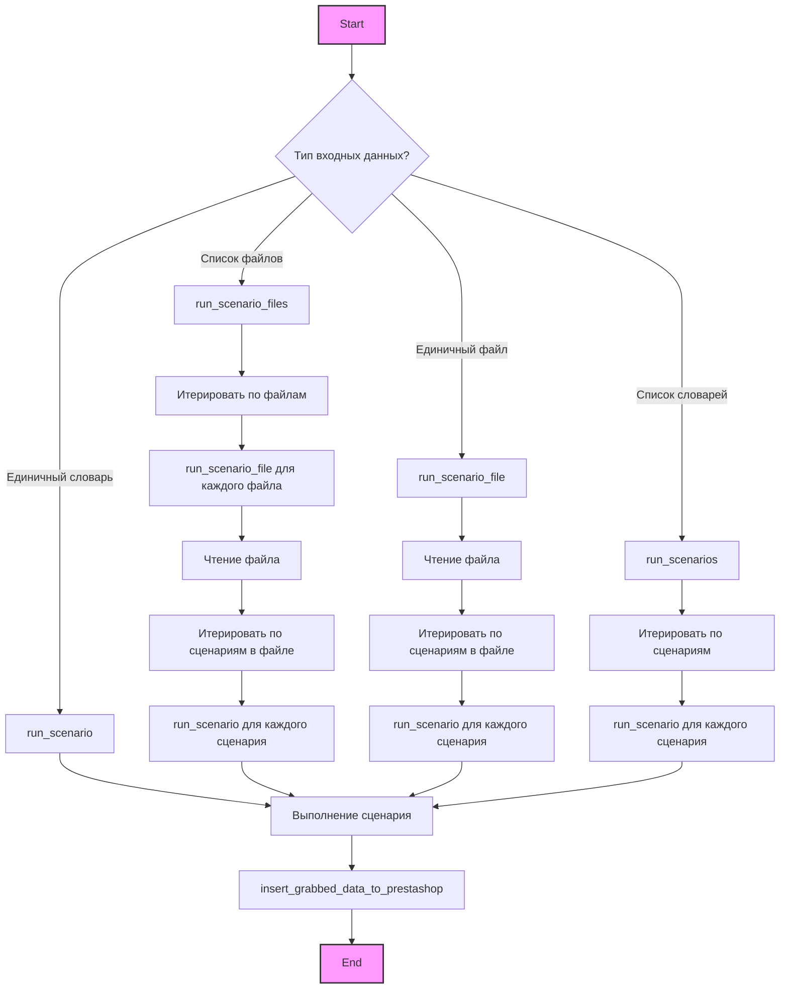
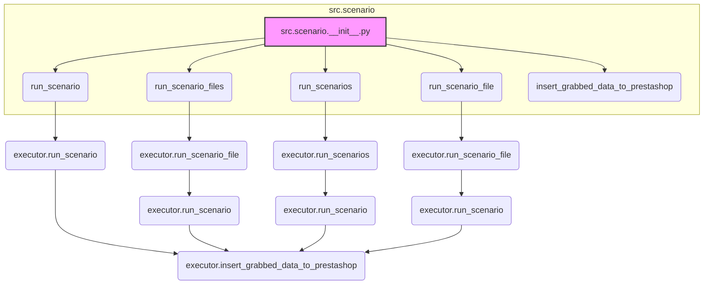

## АНАЛИЗ КОДА: `hypotez/src/scenario/__init__.py`

### 1. <алгоритм>

**Описание:**
Модуль `src.scenario` предоставляет функции для выполнения сценариев, связанных с обработкой данных от поставщиков (например, AliExpress) и их импортом в Prestashop. Модуль предоставляет четыре основные функции: `run_scenario`, `run_scenarios`, `run_scenario_file` и `run_scenario_files`, а также `insert_grabbed_data_to_prestashop`.

**Блок-схема:**

**Примеры:**

1.  **`run_scenario_files(s, ['file1.json', 'file2.json'])`:**
    *   Функция `run_scenario_files` получает список имен файлов (`['file1.json', 'file2.json']`).
    *   Для каждого файла вызывается `run_scenario_file`.
    *   `run_scenario_file` читает JSON файл, итерируется по сценариям в файле и для каждого сценария вызывает функцию `run_scenario`.
    *   `run_scenario` выполняет сценарий (загрузка страниц, парсинг данных и т.д) и результат отправляет в `insert_grabbed_data_to_prestashop`.

2.  **`run_scenarios(s, [{'url': 'url1', 'name': 'name1'}, {'url': 'url2', 'name': 'name2'}])`:**
    *   Функция `run_scenarios` получает список сценариев (список словарей).
    *   Для каждого сценария вызывает `run_scenario`.
    *   `run_scenario` выполняет сценарий (загрузка страниц, парсинг данных и т.д) и результат отправляет в `insert_grabbed_data_to_prestashop`.

3.  **`run_scenario_file(s, 'file1.json')`:**
    *   Функция `run_scenario_file` получает имя файла (`file1.json`).
    *   Читает JSON файл, итерируется по сценариям в файле и для каждого сценария вызывает функцию `run_scenario`.
    *   `run_scenario` выполняет сценарий (загрузка страниц, парсинг данных и т.д) и результат отправляет в `insert_grabbed_data_to_prestashop`.

4.  **`run_scenario(s, {'url': 'url1', 'name': 'name1'})`:**
     *  Функция `run_scenario` получает словарь со сценарием.
     *   Выполняет сценарий (загрузка страниц, парсинг данных и т.д) и результат отправляет в `insert_grabbed_data_to_prestashop`.

### 2. <mermaid>

**Объяснение зависимостей:**

*   `src.scenario.__init__.py` импортирует функции `run_scenario`, `run_scenarios`, `run_scenario_file`, `run_scenario_files`, `insert_grabbed_data_to_prestashop` из модуля `src.scenario.executor`.
*   Модуль `__init__.py` предоставляет API для использования этих функций в других частях проекта.
*   `run_scenario_files` вызывает `executor.run_scenario_file` для обработки каждого файла со сценариями.
*  `run_scenarios` вызывает `executor.run_scenarios` для обработки каждого сценария.
*   `run_scenario_file` вызывает `executor.run_scenario_file` для обработки одного файла со сценариями.
* `run_scenario` вызывает `executor.run_scenario` для обработки одного сценария.
*   `executor.run_scenario_file`, `executor.run_scenarios`, `executor.run_scenario` используют `executor.insert_grabbed_data_to_prestashop` для отправки обработанных данных в Prestashop.

### 3. <объяснение>

**Импорты:**
*   `from .executor import ( run_scenario, run_scenarios, run_scenario_file, run_scenario_files, insert_grabbed_data_to_prestashop )`:
    *   Импортирует функции `run_scenario`, `run_scenarios`, `run_scenario_file`, `run_scenario_files` и `insert_grabbed_data_to_prestashop` из модуля `executor`, находящегося в том же пакете `src.scenario`.
    *   Эти функции отвечают за фактическое выполнение сценариев, чтение файлов, и вставку данных в Prestashop.

**Классы:**
В данном файле классы не определены.

**Функции:**
*   Файл не содержит явных функций, только импорт. Однако, он экспортирует функции из `executor.py`.
*   `run_scenario_files(supplier, scenario_files)`:
    *   **Аргументы**:
        *   `supplier` (объект) - экземпляр класса поставщика (например, `Supplier('aliexpress')`).
        *   `scenario_files` (list) - список строк, представляющих имена файлов со сценариями.
    *   **Возвращаемое значение**: `None`
    *   **Назначение**: Вызывает функцию `run_scenario_file` для каждого файла в списке `scenario_files`.
*   `run_scenarios(supplier, scenarios)`:
    *   **Аргументы**:
        *   `supplier` (объект) - экземпляр класса поставщика.
        *   `scenarios` (list) - список словарей, где каждый словарь представляет сценарий.
    *   **Возвращаемое значение**: `None`
    *   **Назначение**: Вызывает функцию `run_scenario` для каждого сценария в списке `scenarios`.
*    `run_scenario_file(supplier, scenario_file)`:
      *   **Аргументы**:
           *   `supplier` (объект) - экземпляр класса поставщика.
          *    `scenario_file` (string) - строка, представляющая имя файла со сценариями.
      *   **Возвращаемое значение**: `None`
      *    **Назначение**: Читает файл со сценариями, вызывает функцию `run_scenario` для каждого сценария в файле.
*   `run_scenario(supplier, scenario)`:
    *   **Аргументы**:
        *   `supplier` (объект) - экземпляр класса поставщика.
        *   `scenario` (dict) - словарь, представляющий сценарий.
    *   **Возвращаемое значение**: `None`
    *   **Назначение**: Выполняет сценарий, то есть загрузку страниц, парсинг данных и отправку результата в `insert_grabbed_data_to_prestashop`
*   `insert_grabbed_data_to_prestashop(data, supplier)`:
    *   **Аргументы**:
        *   `data` (любой тип) - данные, полученные в результате выполнения сценария.
        *   `supplier` (объект) - экземпляр класса поставщика.
    *  **Возвращаемое значение**: `None`
    *   **Назначение**: Вставляет данные в Prestashop.

**Переменные:**
В файле нет явно объявленных переменных, используются импортированные функции.

**Потенциальные ошибки и области для улучшения:**

*   **Обработка ошибок:** В коде не показаны механизмы обработки ошибок. Стоит добавить try/except блоки для обработки исключений при чтении файлов, выполнении сценариев и вставке данных.
*   **Логирование:** Добавление логирования для отслеживания прогресса выполнения сценариев и диагностики ошибок.
*  **Типизация:** Добавление типов для большей читабельности и облегчения отладки.

**Взаимосвязь с другими частями проекта:**

*   Этот модуль используется другими частями проекта, которые хотят выполнить сценарии для поставщиков и вставить данные в Prestashop.
*   Модуль зависит от `src.scenario.executor` для реализации основной логики выполнения сценариев.
*   Он также зависит от модели `Supplier` (не определена в этом файле), которая, скорее всего, определена в другом модуле, например `src.supplier`.