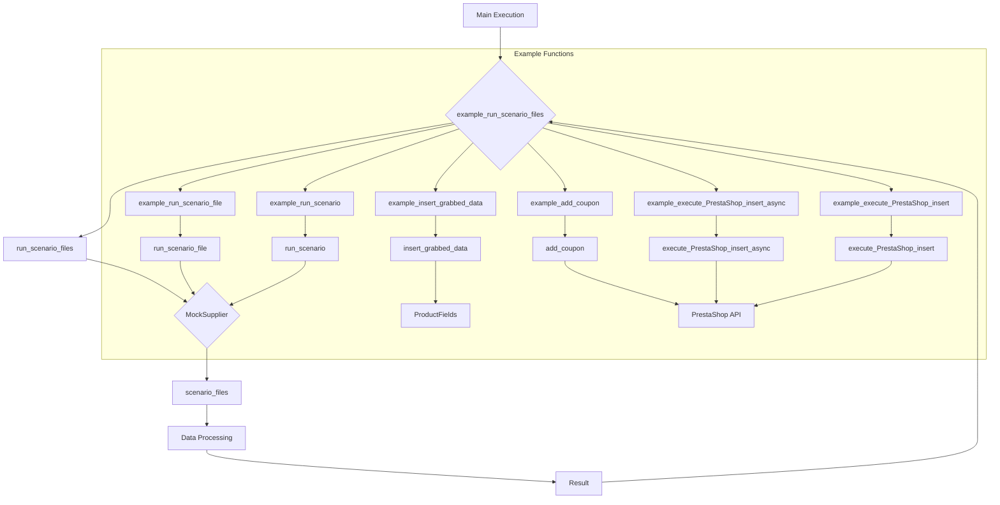

```MD
# <input code>

```python
## \file hypotez/src/scenario/_examples/_example_executor.py
# -*- coding: utf-8 -*-\
#! venv/Scripts/python.exe
#! venv/bin/python/python3.12

"""
.. module: src.scenario._examples 
	:platform: Windows, Unix
	:synopsis:

"""
MODE = 'dev'


"""
	:platform: Windows, Unix
	:synopsis:

"""


"""
	:platform: Windows, Unix
	:synopsis:

"""


"""
  :platform: Windows, Unix

"""
"""
  :platform: Windows, Unix
  :platform: Windows, Unix
  :synopsis:
"""MODE = 'dev'
  
""" module: src.scenario._examples """


...
"""
Examples for the `executor` module from `src.scenario.executor`.

This file contains examples of how to use the functions provided in the `executor` module.
The examples demonstrate how to run scenarios, handle scenario files, and interact with PrestaShop API.

@details
- `Example 1` shows how to run a list of scenario files.
- `Example 2` demonstrates how to run a single scenario file.
- `Example 3` illustrates how to run a single scenario.
- `Example 4` provides an example of executing a product page scenario.
- `Example 5` shows how to add a coupon using PrestaShop API.

@image html executor.png
"""

import asyncio
from pathlib import Path
from src.scenario.executor import run_scenario_files, run_scenario_file, run_scenarios, run_scenario, insert_grabbed_data, execute_PrestaShop_insert, execute_PrestaShop_insert_async, add_coupon
from src.utils import j_loads
from src.product import ProductFields
from src.endpoints.PrestaShop import PrestaShop

# Assuming `Supplier` class is available and has necessary methods and attributes
class MockSupplier:
    def __init__(self):
        self.supplier_abs_path = Path('/path/to/scenarios')
        self.scenario_files = [Path('scenarios/scenario1.json'), Path('scenarios/scenario2.json')]
        self.current_scenario = None
        self.supplier_settings = {'runned_scenario': []}
        self.related_modules = MockRelatedModules()
        self.driver = MockDriver()

class MockRelatedModules:
    def get_list_products_in_category(self, s):
        return ['http://example.com/product1', 'http://example.com/product2']

    def grab_product_page(self, s):
        return ProductFields(
            presta_fields_dict={'reference': 'REF123', 'name': [{'id': 1, 'value': 'Sample Product'}], 'price': 100},
            assist_fields_dict={'images_urls': ['http://example.com/image1.jpg'], 'default_image_url': 'http://example.com/default_image.jpg', 'locale': 'en'}
        )

    async def grab_page(self, s):
        return self.grab_product_page(s)

class MockDriver:
    def get_url(self, url):
        return True

# ... (rest of the code)
```

# <algorithm>

The code defines example functions for executing scenarios and interacting with the PrestaShop API.  It uses a `MockSupplier` class to simulate data retrieval and interaction with external services (e.g., file system).


**Example 1: run_scenario_files:**
1. Creates a `MockSupplier` instance.
2. Defines a list of scenario files.
3. Calls `run_scenario_files` to execute scenarios.
4. Checks the result and prints a success or failure message.

**Example 2: run_scenario_file:**
1. Creates a `MockSupplier` instance.
2. Defines a scenario file.
3. Calls `run_scenario_file` to execute the scenario.
4. Checks the result and prints a success or failure message.


**Example 3: run_scenario:**
1. Creates a `MockSupplier` instance.
2. Defines a scenario dictionary.
3. Calls `run_scenario` to execute the scenario.
4. Checks the result and prints a success or failure message.


The `example_insert_grabbed_data` function demonstrates inserting data from a `ProductFields` object into PrestaShop.

**Example 5: add_coupon:**
1. Defines credentials, coupon details.
2. Calls `add_coupon` to add a coupon.
3. Prints a success message.


**Example 6 and 7: Async and Sync PrestaShop inserts:**
Similar to the synchronous example, these examples demonstrate executing PrestaShop insertion using either synchronous or asynchronous methods.


Data flows between functions through arguments and return values, with the `MockSupplier` acting as an intermediary for interacting with scenario files and potentially other modules.

# <mermaid>



**Dependencies:**

The diagram shows dependencies on:
- `run_scenario_files`, `run_scenario_file`, `run_scenario`, `insert_grabbed_data`, etc. from `src.scenario.executor`.
- `j_loads` from `src.utils`.
- `ProductFields` from `src.product`.
- `PrestaShop` from `src.endpoints.PrestaShop`.

The `MockSupplier`, `MockRelatedModules`, and `MockDriver` classes are placeholders and aren't directly dependent on other modules, but they interact with functions that are.


# <explanation>

**Imports:**

- `asyncio`: For asynchronous operations, particularly relevant for interactions with potentially network-dependent functions (e.g., `execute_PrestaShop_insert_async`).
- `pathlib`: For handling file paths.
- `src.scenario.executor`: Contains functions for running scenarios, crucial to the project's core functionality.
- `src.utils`: Likely contains utility functions, potentially for data processing or JSON handling.
- `src.product`: Defines the `ProductFields` class, related to product data.
- `src.endpoints.PrestaShop`: Contains the `PrestaShop` class, interacting with the PrestaShop API.

**Classes:**

- `MockSupplier`: A mock class simulating a supplier. This is used for testing purposes to avoid interacting with external services (PrestaShop API).
- `MockRelatedModules`: Simulates calls to other services like PrestaShop grabbing.
- `MockDriver`: Simulates the driver for fetching URLs.
- `ProductFields`: Represents product data, likely containing fields to be used in PrestaShop insertion.


**Functions:**

- `example_run_scenario_files`, `example_run_scenario_file`, `example_run_scenario`: Example functions demonstrating different ways to run scenarios.  They call functions from `src.scenario.executor`.
- `insert_grabbed_data`: Inserts product data into PrestaShop.
- `execute_PrestaShop_insert`: Synchronously inserts product data into PrestaShop.
- `execute_PrestaShop_insert_async`: Asynchronously inserts product data into PrestaShop.
- `add_coupon`: Adds a coupon via the PrestaShop API.

**Variables:**

- `MODE`: A global variable set to 'dev', possibly used for configuration.
- `scenario_files`, `scenario_file`, `scenario`: Variables holding scenario data (either file paths or dictionaries).

**Possible Errors/Improvements:**

- **Missing error handling:** The example code lacks comprehensive error handling. Real-world code should include `try...except` blocks to catch exceptions during API calls, file operations, and scenario execution.  The functions from `src.scenario.executor` should either return a success/failure code or raise an exception for errors.
- **Hardcoded paths:** The `/path/to/scenarios` path is hardcoded.  Better practice would be to configure this path or use an environment variable.
- **Mock implementation:** The mock implementations are sufficient for this example, but for production, consider using proper mocking libraries.
- **PrestaShop API interaction:**  The `PrestaShop` class and its methods are not completely implemented or populated; you'd need to replace the placeholder `execute_PrestaShop_insert` and `add_coupon` implementations with the actual PrestaShop API calls.
- **Logging:**  Adding logging would significantly improve debugging and maintainability, especially for external interactions.

**Relationship to other parts of the project:**

This file relies heavily on functions from `src.scenario.executor`, `src.utils`, `src.product`, and `src.endpoints.PrestaShop`. This structure suggests a modular design where different parts of the system (scenarios, utility functions, product handling, PrestaShop integration) are separated.