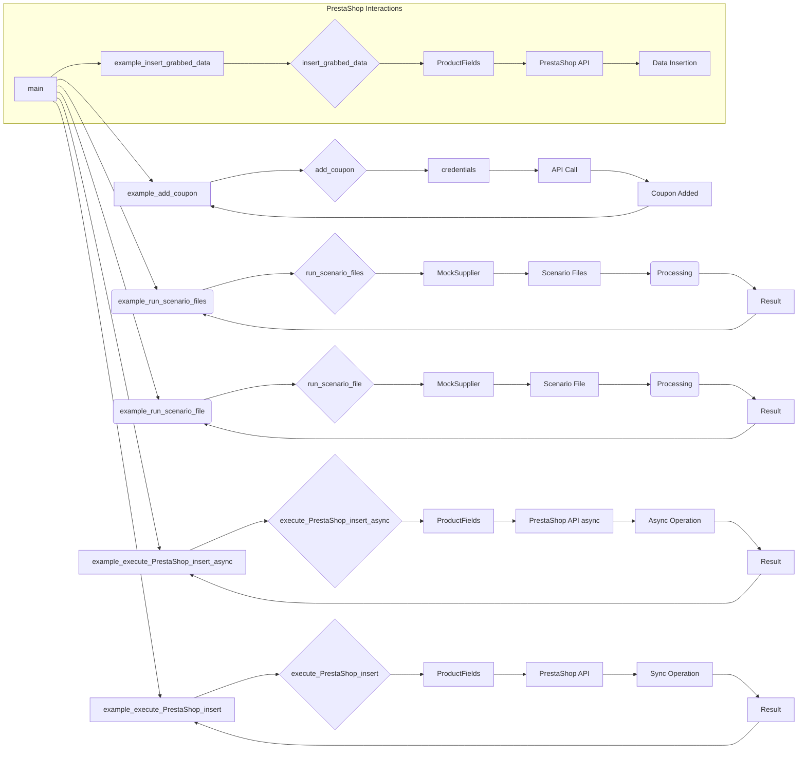

# <input code>

```python
## \file hypotez/src/scenario/_examples/_example_executor.py
# -*- coding: utf-8 -*-\n#! venv/Scripts/python.exe\n#! venv/bin/python/python3.12\n
"""
.. module:: src.scenario._examples 
	:platform: Windows, Unix
	:synopsis:

"""
MODE = 'dev'

"""
	:platform: Windows, Unix
	:synopsis:

"""


"""
	:platform: Windows, Unix
	:synopsis:

"""


"""
  :platform: Windows, Unix

"""
"""
  :platform: Windows, Unix
  :platform: Windows, Unix
  :synopsis:
"""MODE = 'dev'
  
""" module: src.scenario._examples """


...
"""
Examples for the `executor` module from `src.scenario.executor`.

This file contains examples of how to use the functions provided in the `executor` module.
The examples demonStarte how to run scenarios, handle scenario files, and interact with PrestaShop API.

@details
- `Example 1` shows how to run a list of scenario files.
- `Example 2` demonStartes how to run a single scenario file.
- `Example 3` illuStartes how to run a single scenario.
- `Example 4` provides an example of executing a product page scenario.
- `Example 5` shows how to add a coupon using PrestaShop API.

@image html executor.png
"""

import asyncio
from pathlib import Path
from src.scenario.executor import run_scenario_files, run_scenario_file, run_scenarios, run_scenario, insert_grabbed_data, execute_PrestaShop_insert, execute_PrestaShop_insert_async, add_coupon
from src.utils.jjson import j_loads_ns
from src.product.product_fields import ProductFields
from src.endpoints.PrestaShop import PrestaShop

# Assuming `Supplier` class is available and has necessary methods and attributes
class MockSupplier:
    def __init__(self):
        self.supplier_abs_path = Path('/path/to/scenarios')
        self.scenario_files = [Path('scenarios/scenario1.json'), Path('scenarios/scenario2.json')]
        self.current_scenario = None
        self.supplier_settings = {'runned_scenario': []}
        self.related_modules = MockRelatedModules()
        self.driver = MockDriver()

class MockRelatedModules:
    def get_list_products_in_category(self, s):
        return ['http://example.com/product1', 'http://example.com/product2']

    def grab_product_page(self, s):
        return ProductFields(
            presta_fields_dict={'reference': 'REF123', 'name': [{'id': 1, 'value': 'Sample Product'}], 'price': 100},
            assist_fields_dict={'images_urls': ['http://example.com/image1.jpg'], 'default_image_url': 'http://example.com/default_image.jpg', 'locale': 'en'}
        )

    async def grab_page(self, s):
        return self.grab_product_page(s)

class MockDriver:
    def get_url(self, url):
        return True


# ... (rest of the code)
```

# <algorithm>

The code defines several example functions demonStarting the usage of the `executor` module functions.  A `MockSupplier` class is used for testing purposes.  The `MockRelatedModules` class simulates fetching product data and `MockDriver` simulates driver functionality.  Each example function utilizes these functions and classes to execute various scenario types (multiple files, single file, single scenario).

**Example 1 (run_scenario_files):**
1. Creates a `MockSupplier` instance.
2. Defines a list of scenario files.
3. Calls `run_scenario_files` passing the `supplier` and `scenario_files` to execute each file.
4. Checks the result of `run_scenario_files` and prints appropriate messages.

**Example 2 (run_scenario_file):**
1. Creates a `MockSupplier` instance.
2. Defines a single scenario file.
3. Calls `run_scenario_file` passing the `supplier` and `scenario_file` to execute the file.
4. Checks the result and prints messages accordingly.

**Data Flow:**  Scenario data (`scenario_files`, `scenario`) is passed to the functions.  The `MockSupplier` class likely interacts with other parts of the project to retrieve and process the scenario data. The result, indicating success or failure, is then passed back to the calling function.


# <mermaid>



**Dependencies:** The diagram shows dependencies between the examples and the `run_scenario_files`, `run_scenario_file`, `insert_grabbed_data`, etc., functions, as well as dependencies on the  `MockSupplier`, `MockRelatedModules`, `MockDriver`, and `ProductFields` classes. It illuStartes that these example functions are responsible for calling the functions from the `executor` module.  The arrows also represent data flow between parts of the code.


# <explanation>

**Imports:**
- `asyncio`: Enables asynchronous operations, important for potentially time-consuming tasks like API calls.
- `pathlib`: Provides a way to work with file paths in a more object-oriented way, making code more readable and platform-independent.
- `src.scenario.executor`: Contains functions like `run_scenario_files`, `run_scenario_file`, etc. for executing scenarios, and it's crucial for the main functionality of the module.
- `src.utils.jjson`: Probably handles JSON parsing and serialization.
- `src.product.product_fields`: Contains the `ProductFields` class for storing and manipulating product data.
- `src.endpoints.PrestaShop`: Contains the `PrestaShop` class to interact with the PrestaShop API (likely for product insertion and coupon management).

**Classes:**

- `MockSupplier`: This is a mock class, used for testing purposes, representing a supplier of scenario data.  It simulates the behavior of a class responsible for managing scenario execution. It has attributes related to scenario files, settings, and interactions with other modules.
- `MockRelatedModules`:  Simulates fetching product details and handles the API calls.
- `MockDriver`: A mock class, critical for testing, simulating the functionality of a driver object, handling interactions with external systems or browsers.
- `ProductFields`: Represents product data, including PrestaShop fields and auxiliary data.

**Functions:**

- Example functions (`example_run_scenario_files`, `example_run_scenario_file`, etc.):  These functions demonStarte how to use the `executor` functions (`run_scenario_files`, `run_scenario_file`, `run_scenario`, `add_coupon`, etc.) and other functions related to interacting with the PrestaShop API to execute scenarios and manage data. They are the entry points for executing different test cases.
- `run_scenario_files`, `run_scenario_file`, `run_scenarios`, `run_scenario`, `insert_grabbed_data`, `execute_PrestaShop_insert`, `execute_PrestaShop_insert_async`, `add_coupon`: These functions are likely the core functions of the `executor` module, responsible for running scenarios, handling product data, interacting with the PrestaShop API, and performing other actions. The `run_` functions appear to deal with scenario execution (files, single scenarios, etc.), while the `insert_` and `execute_` functions are specific to PrestaShop interactions.

**Possible Improvements:**

- The use of mocks (`MockSupplier`, `MockRelatedModules`, etc.) is good for testing; however, consider making them into a more structured testing setup (e.g., using a testing framework like pytest) to improve testability and maintainability of the code.
- The example data in the function calls is very simple. Adding more diverse data, particularly for validating edge cases (empty files, malformed JSON, and invalid data) within the scenario files, would strengthen the test cases and robustness of the code.
- Logging within the example functions will greatly increase debugging capability and help track where a scenario fails.
- More descriptive variable names will improve readability, especially for function parameters.
- Clear error handling and exception management in the core functions would make the code more robust and easier to debug in case of errors during scenario execution.


**Relationships to Other Parts of the Project:**

The code heavily depends on the `executor` module, `jjson` utilities, the `ProductFields` class from the `product` package, and the `PrestaShop` class from the `endpoints` package.  The structure suggests a well-organized project with clear responsibilities.  The  `supplier`, `related_modules`, and `driver` parts could be more fleshed out to describe interactions and data flow to other components of the system.