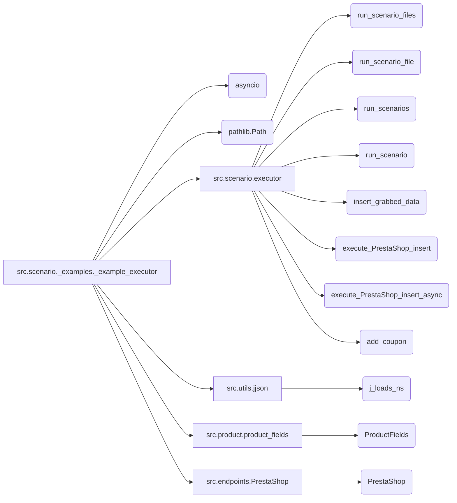

## <алгоритм>

1.  **Инициализация (Пример MockSupplier):**
    *   Создается экземпляр `MockSupplier`. Этот класс имитирует поставщика данных с путями к сценариям, списком файлов сценариев, текущим сценарием и настройками. Он также содержит моки для связанных модулей (`MockRelatedModules`) и драйвера (`MockDriver`).
        *   Пример: `supplier = MockSupplier()`
        *   Данные: `supplier_abs_path`, `scenario_files`, `current_scenario`, `supplier_settings`, `related_modules`, `driver`
2.  **Запуск сценариев из списка файлов (example_run_scenario_files):**
    *   Функция `example_run_scenario_files` создает экземпляр `MockSupplier` и список файлов сценариев.
    *   Вызывается `run_scenario_files` с поставщиком и списком файлов.
    *   Возвращается `True`, если все сценарии выполнены успешно, иначе `False`.
        *   Пример: `result = run_scenario_files(supplier, scenario_files)`
        *   Поток данных: `MockSupplier` -> `run_scenario_files` -> `True` / `False`
3.  **Запуск сценария из файла (example_run_scenario_file):**
    *   Функция `example_run_scenario_file` создает экземпляр `MockSupplier` и путь к файлу сценария.
    *   Вызывается `run_scenario_file` с поставщиком и путем к файлу.
    *   Возвращается `True`, если сценарий выполнен успешно, иначе `False`.
        *   Пример: `result = run_scenario_file(supplier, scenario_file)`
        *   Поток данных: `MockSupplier` -> `run_scenario_file` -> `True` / `False`
4.  **Запуск сценария (example_run_scenario):**
    *   Функция `example_run_scenario` создает экземпляр `MockSupplier` и структуру данных сценария.
    *   Вызывается `run_scenario` с поставщиком и сценарием.
    *   Возвращается `True`, если сценарий выполнен успешно, иначе `False`.
        *   Пример: `result = run_scenario(supplier, scenario)`
        *   Поток данных: `MockSupplier` -> `run_scenario` -> `True` / `False`
5.  **Вставка данных продукта (example_insert_grabbed_data):**
    *   Функция `example_insert_grabbed_data` создает экземпляр `ProductFields`.
    *   Вызывается `insert_grabbed_data` с данными продукта.
        *   Пример: `insert_grabbed_data(product_fields)`
        *   Поток данных: `ProductFields` -> `insert_grabbed_data`
6.  **Добавление купона (example_add_coupon):**
    *   Функция `example_add_coupon` собирает учетные данные, `reference`, код купона и даты.
    *   Вызывается `add_coupon` с собранными данными.
        *   Пример: `add_coupon(credentials, reference, coupon_code, start_date, end_date)`
        *   Поток данных: `credentials`, `reference`, `coupon_code`, `start_date`, `end_date` -> `add_coupon`
7.  **Асинхронная вставка данных продукта (example_execute_PrestaShop_insert_async):**
    *   Функция `example_execute_PrestaShop_insert_async` создает экземпляр `ProductFields`.
    *   Вызывается асинхронная функция `execute_PrestaShop_insert_async` с данными продукта.
        *   Пример: `await execute_PrestaShop_insert_async(product_fields)`
        *   Поток данных: `ProductFields` -> `execute_PrestaShop_insert_async`
8.  **Синхронная вставка данных продукта (example_execute_PrestaShop_insert):**
    *   Функция `example_execute_PrestaShop_insert` создает экземпляр `ProductFields`.
    *   Вызывается `execute_PrestaShop_insert` с данными продукта.
    *   Возвращается `True`, если вставка прошла успешно, иначе `False`.
        *   Пример: `result = execute_PrestaShop_insert(product_fields)`
        *   Поток данных: `ProductFields` -> `execute_PrestaShop_insert` -> `True` / `False`
9.  **Запуск примеров (if \_\_name\_\_ == "\_\_main\_\_"):**
    *   Последовательно вызываются все функции-примеры, демонстрирующие различные способы использования функций из `executor`. Асинхронная функция запускается с помощью `asyncio.run`.
        *   Последовательный вызов функций.
        *   Асинхронный вызов функции `example_execute_PrestaShop_insert_async` с `asyncio.run`.

## <mermaid>

```mermaid
graph LR
    A[MockSupplier Initialization] --> B(run_scenario_files);
    A --> C(run_scenario_file);
    A --> D(run_scenario);
    E[ProductFields Initialization] --> F(insert_grabbed_data);
    G[Credentials and Coupon Data] --> H(add_coupon);
    E --> I(execute_PrestaShop_insert_async);
    E --> J(execute_PrestaShop_insert);
    B --> K{Scenario Files Result};
    C --> L{Scenario File Result};
    D --> M{Scenario Result};
    I --> N{Async PrestaShop Insert};
    J --> O{Sync PrestaShop Insert};
    K -- True --> P[Print "All scenarios executed successfully."];
    K -- False --> Q[Print "Some scenarios failed."];
    L -- True --> R[Print "Scenario file executed successfully."];
    L -- False --> S[Print "Failed to execute scenario file."];
    M -- True --> T[Print "Scenario executed successfully."];
    M -- False --> U[Print "Failed to execute the scenario."];
    F --> V[Print "Product data inserted into PrestaShop."];
    H --> W[Print "Coupon added successfully."];
    N --> X[Print "Product data inserted into PrestaShop asynchronously."];
    O -- True --> Y[Print "Product data inserted into PrestaShop."];
    O -- False --> Z[Print "Failed to insert product data into PrestaShop."];

    style A fill:#f9f,stroke:#333,stroke-width:2px
    style E fill:#ccf,stroke:#333,stroke-width:2px
    style G fill:#ccf,stroke:#333,stroke-width:2px
```

**Зависимости и пояснения:**

*   `MockSupplier Initialization`: Имитация поставщика данных, инициализация необходимых атрибутов.
*   `ProductFields Initialization`: Инициализация структуры данных для представления информации о продукте.
*   `Credentials and Coupon Data`: Сбор данных для добавления купона через PrestaShop API.
*   `run_scenario_files`, `run_scenario_file`, `run_scenario`: Функции, выполняющие сценарии.
*   `insert_grabbed_data`, `execute_PrestaShop_insert_async`, `execute_PrestaShop_insert`: Функции для вставки данных о продукте в PrestaShop.
*   `add_coupon`: Функция для добавления купона через PrestaShop API.
*   `Scenario Files Result`, `Scenario File Result`, `Scenario Result`, `Async PrestaShop Insert`, `Sync PrestaShop Insert`: Результаты выполнения функций и их обработка.
*   Остальные узлы являются выводом в консоль в зависимости от результата работы предыдущих функций.

**Импорт зависимостей (в виде `mermaid`-диаграммы):**



**Объяснение:**

*   `src.scenario._examples._example_executor`: Основной модуль, содержащий примеры использования функций из модуля `src.scenario.executor`.
*   `asyncio`: Модуль для поддержки асинхронного программирования. Используется для `example_execute_PrestaShop_insert_async`.
*   `pathlib.Path`: Модуль для работы с путями к файлам и директориям. Используется для определения путей к файлам сценариев.
*   `src.scenario.executor`: Модуль, содержащий функции для выполнения сценариев и взаимодействия с PrestaShop API.
*   `src.utils.jjson`: Модуль для работы с JSON. Функция `j_loads_ns` используется для загрузки JSON-данных.
*   `src.product.product_fields`: Модуль, определяющий структуру данных для информации о продукте.
*   `src.endpoints.PrestaShop`: Модуль, предоставляющий интерфейс для взаимодействия с PrestaShop API.

## <объяснение>

**Импорты:**

*   `import asyncio`: Импортирует модуль `asyncio` для поддержки асинхронного программирования. Это необходимо для асинхронной вставки данных о продукте (`execute_PrestaShop_insert_async`).
*   `from pathlib import Path`: Импортирует класс `Path` из модуля `pathlib` для удобной работы с путями к файлам. Используется для указания путей к файлам сценариев.
*   `from src.scenario.executor import ...`: Импортирует функции из модуля `src.scenario.executor`, такие как `run_scenario_files`, `run_scenario_file`, `run_scenarios`, `run_scenario`, `insert_grabbed_data`, `execute_PrestaShop_insert`, `execute_PrestaShop_insert_async`, и `add_coupon`.
*   `from src.utils.jjson import j_loads_ns`: Импортирует функцию `j_loads_ns` из модуля `src.utils.jjson`, которая, вероятно, используется для загрузки JSON-данных.
*   `from src.product.product_fields import ProductFields`: Импортирует класс `ProductFields` из модуля `src.product.product_fields` для создания объектов, представляющих информацию о продукте.
*   `from src.endpoints.PrestaShop import PrestaShop`: Импортирует класс `PrestaShop` из модуля `src.endpoints.PrestaShop` для взаимодействия с PrestaShop API.

**Классы:**

*   **`MockSupplier`**:
    *   **Роль**: Имитирует класс поставщика данных, который в реальном приложении будет отвечать за загрузку и управление данными о сценариях, настройках и связанных модулях.
    *   **Атрибуты**:
        *   `supplier_abs_path`: `Path`-объект, представляющий абсолютный путь к директории со сценариями.
        *   `scenario_files`: Список `Path`-объектов, представляющих пути к файлам сценариев.
        *   `current_scenario`: Текущий сценарий (изначально `None`).
        *   `supplier_settings`: Словарь настроек поставщика.
        *   `related_modules`: Экземпляр `MockRelatedModules` для имитации взаимодействия с другими модулями.
        *   `driver`: Экземпляр `MockDriver` для имитации драйвера браузера.
    *   **Методы**:
        *   `__init__`: Конструктор, инициализирующий атрибуты класса.
*   **`MockRelatedModules`**:
    *   **Роль**: Имитирует класс, предоставляющий доступ к функциональности других модулей, таких как получение списка продуктов в категории и получение данных со страницы продукта.
    *   **Методы**:
        *   `get_list_products_in_category(self, s)`: Возвращает список URL продуктов.
        *   `grab_product_page(self, s)`: Возвращает экземпляр `ProductFields` с моковыми данными продукта.
        *    `async grab_page(self, s)`: Асинхронная версия `grab_product_page`.
*   **`MockDriver`**:
    *   **Роль**: Имитирует класс, предоставляющий функции для управления браузером.
    *   **Методы**:
        *   `get_url(self, url)`: Возвращает `True`, имитируя успешное открытие страницы.

**Функции:**

*   **`example_run_scenario_files()`**:
    *   **Аргументы**: Нет.
    *   **Возвращаемое значение**: Нет (выводит сообщение в консоль).
    *   **Назначение**: Демонстрирует запуск нескольких сценариев из списка файлов. Использует `run_scenario_files` из `src.scenario.executor`.
    *   **Пример**:
        ```python
        example_run_scenario_files()
        # Вывод: "All scenarios executed successfully." или "Some scenarios failed."
        ```
*   **`example_run_scenario_file()`**:
    *   **Аргументы**: Нет.
    *   **Возвращаемое значение**: Нет (выводит сообщение в консоль).
    *   **Назначение**: Демонстрирует запуск сценария из одного файла. Использует `run_scenario_file` из `src.scenario.executor`.
    *   **Пример**:
        ```python
        example_run_scenario_file()
        # Вывод: "Scenario file executed successfully." или "Failed to execute scenario file."
        ```
*   **`example_run_scenario()`**:
    *   **Аргументы**: Нет.
    *   **Возвращаемое значение**: Нет (выводит сообщение в консоль).
    *   **Назначение**: Демонстрирует запуск одного сценария. Использует `run_scenario` из `src.scenario.executor`.
    *   **Пример**:
        ```python
        example_run_scenario()
        # Вывод: "Scenario executed successfully." или "Failed to execute the scenario."
        ```
*   **`example_insert_grabbed_data()`**:
    *   **Аргументы**: Нет.
    *   **Возвращаемое значение**: Нет (выводит сообщение в консоль).
    *   **Назначение**: Демонстрирует вставку данных продукта в PrestaShop. Использует `insert_grabbed_data` из `src.scenario.executor`.
    *   **Пример**:
        ```python
        example_insert_grabbed_data()
        # Вывод: "Product data inserted into PrestaShop."
        ```
*   **`example_add_coupon()`**:
    *   **Аргументы**: Нет.
    *   **Возвращаемое значение**: Нет (выводит сообщение в консоль).
    *   **Назначение**: Демонстрирует добавление купона через PrestaShop API. Использует `add_coupon` из `src.scenario.executor`.
    *   **Пример**:
        ```python
        example_add_coupon()
        # Вывод: "Coupon added successfully."
        ```
*   **`example_execute_PrestaShop_insert_async()`**:
    *   **Аргументы**: Нет.
    *   **Возвращаемое значение**: Нет (выводит сообщение в консоль).
    *   **Назначение**: Демонстрирует асинхронную вставку данных продукта в PrestaShop. Использует `execute_PrestaShop_insert_async` из `src.scenario.executor`.
    *   **Пример**:
        ```python
        await example_execute_PrestaShop_insert_async()
        # Вывод: "Product data inserted into PrestaShop asynchronously."
        ```
*   **`example_execute_PrestaShop_insert()`**:
    *   **Аргументы**: Нет.
    *   **Возвращаемое значение**: Нет (выводит сообщение в консоль).
    *   **Назначение**: Демонстрирует синхронную вставку данных продукта в PrestaShop. Использует `execute_PrestaShop_insert` из `src.scenario.executor`.
    *   **Пример**:
        ```python
        example_execute_PrestaShop_insert()
        # Вывод: "Product data inserted into PrestaShop." или "Failed to insert product data into PrestaShop."
        ```

**Переменные:**

*   `MODE = 'dev'`: Константа, указывающая на режим разработки.
*   `supplier`: Экземпляр класса `MockSupplier`.
*   `scenario_files`: Список `Path`-объектов, представляющих пути к файлам сценариев.
*   `scenario_file`: `Path`-объект, представляющий путь к файлу сценария.
*   `scenario`: Словарь, представляющий структуру данных сценария.
*   `product_fields`: Экземпляр класса `ProductFields` для хранения данных о продукте.
*   `credentials`: Словарь с учетными данными для PrestaShop API.
*   `reference`: Строка, представляющая reference продукта.
*   `coupon_code`: Строка, представляющая код купона.
*   `start_date`, `end_date`: Строки, представляющие начальную и конечную даты действия купона.
*   `result`: Булева переменная, представляющая результат выполнения различных функций.

**Потенциальные ошибки и области для улучшения:**

*   **Отсутствие реальной реализации**: Классы `MockSupplier`, `MockRelatedModules` и `MockDriver` являются моками и не выполняют реальные операции. Для использования в реальном приложении необходимо реализовать их функциональность.
*   **Жестко заданные данные**: Многие данные, такие как пути к файлам, URL и учетные данные, жестко заданы. Необходимо сделать их настраиваемыми через конфигурационные файлы или аргументы командной строки.
*   **Обработка ошибок**: В коде отсутствует явная обработка исключений. Необходимо добавить блоки `try-except` для обработки возможных ошибок во время выполнения сценариев или взаимодействия с PrestaShop API.
*   **Логирование**: Отсутствует логирование действий. Необходимо добавить логирование для отслеживания прогресса выполнения и выявления проблем.
*   **Асинхронность**: Хотя используется `asyncio`, не все функции, которые могут быть асинхронными, реализованы как таковые (например, `run_scenario_files`, `run_scenario_file`, `run_scenario`).
*   **Модульность**:  Код можно сделать более модульным, выделив логику работы с PrestaShop API в отдельный модуль, чтобы упростить тестирование и поддержку.

**Цепочка взаимосвязей с другими частями проекта:**

*   Модуль `_example_executor.py` зависит от модуля `src.scenario.executor`, который предоставляет основную логику для выполнения сценариев и взаимодействия с PrestaShop API.
*   Он также использует модули `src.utils.jjson` для работы с JSON-данными, `src.product.product_fields` для представления информации о продукте и `src.endpoints.PrestaShop` для взаимодействия с PrestaShop API.
*   `MockSupplier` имитирует класс, который в реальном приложении может взаимодействовать с другими частями проекта, такими как базы данных, системы управления файлами или сторонние API.
*   `MockRelatedModules` имитирует связь с модулями, отвечающими за навигацию, парсинг и другие специфические операции.
*   `MockDriver` имитирует связь с модулем браузера для выполнения действий на странице.

Этот файл служит демонстрацией того, как можно использовать `src.scenario.executor` для выполнения сценариев, получения данных с веб-страниц и взаимодействия с PrestaShop API.