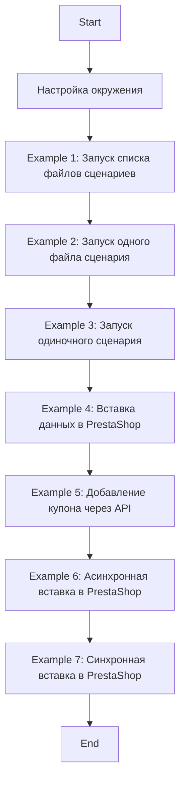
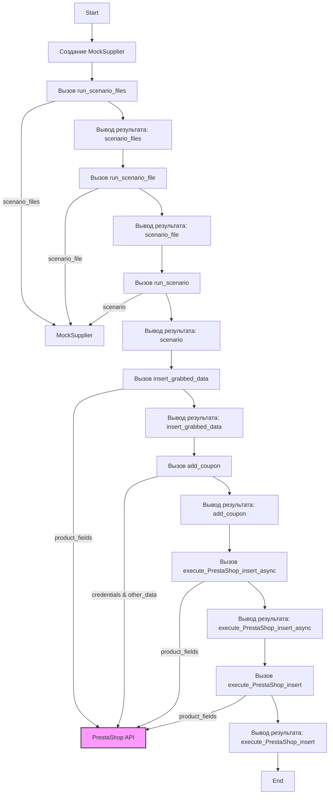

## АНАЛИЗ КОДА: `hypotez/src/scenario/_examples/_example_executor.py`

### 1. **<алгоритм>**

**Общая блок-схема работы программы:**



**Примеры для каждого логического блока:**

1.  **Настройка окружения (Setup):**
    *   Создание экземпляра `MockSupplier`, имитирующего поставщика данных.
    *   Импорт необходимых модулей, таких как `asyncio`, `Path`, и т.д.
    *   Инициализация моковых классов `MockRelatedModules` и `MockDriver`.

2.  **Example 1: Запуск списка файлов сценариев:**
    *   Создается список `scenario_files` из путей к файлам JSON.
    *   Вызывается функция `run_scenario_files` с экземпляром `MockSupplier` и списком файлов.
    *   Результат выводится в консоль.

    ```python
    # Пример
    supplier = MockSupplier()
    scenario_files = [Path('scenarios/scenario1.json'), Path('scenarios/scenario2.json')]
    result = run_scenario_files(supplier, scenario_files)
    # Пример вывода: "All scenarios executed successfully."
    ```

3.  **Example 2: Запуск одного файла сценария:**
    *   Определяется путь к одному файлу сценария `scenario_file`.
    *   Вызывается функция `run_scenario_file` с экземпляром `MockSupplier` и путем к файлу.
    *   Результат выводится в консоль.

    ```python
    # Пример
    supplier = MockSupplier()
    scenario_file = Path('scenarios/scenario1.json')
    result = run_scenario_file(supplier, scenario_file)
    # Пример вывода: "Scenario file executed successfully."
    ```

4.  **Example 3: Запуск одиночного сценария:**
    *   Определяется словарь `scenario` с данными для запуска.
    *   Вызывается функция `run_scenario` с экземпляром `MockSupplier` и словарем `scenario`.
    *   Результат выводится в консоль.

    ```python
    # Пример
    supplier = MockSupplier()
    scenario = {
        'url': 'http://example.com/category',
        'products': [{'url': 'http://example.com/product1'}, {'url': 'http://example.com/product2'}]
    }
    result = run_scenario(supplier, scenario)
    # Пример вывода: "Scenario executed successfully."
    ```

5.  **Example 4: Вставка данных в PrestaShop:**
    *   Создается экземпляр `ProductFields` с данными для вставки.
    *   Вызывается функция `insert_grabbed_data` с экземпляром `ProductFields`.
    *   Результат выводится в консоль.

    ```python
    # Пример
    product_fields = ProductFields(
        presta_fields_dict={'reference': 'REF123', 'name': [{'id': 1, 'value': 'Sample Product'}], 'price': 100},
        assist_fields_dict={'images_urls': ['http://example.com/image1.jpg'], 'default_image_url': 'http://example.com/default_image.jpg', 'locale': 'en'}
    )
    insert_grabbed_data(product_fields)
    # Пример вывода: "Product data inserted into PrestaShop."
    ```

6.  **Example 5: Добавление купона через API:**
    *   Определяются параметры для создания купона, такие как `credentials`, `reference`, `coupon_code`, `start_date`, `end_date`.
    *   Вызывается функция `add_coupon` с параметрами.
    *   Результат выводится в консоль.

    ```python
    # Пример
    credentials = {'api_domain': 'https://example.com/api', 'api_key': 'YOUR_API_KEY'}
    reference = 'REF123'
    coupon_code = 'SUMMER2024'
    start_date = '2024-07-01'
    end_date = '2024-07-31'
    add_coupon(credentials, reference, coupon_code, start_date, end_date)
    # Пример вывода: "Coupon added successfully."
    ```

7.  **Example 6: Асинхронная вставка в PrestaShop:**
    *   Создается экземпляр `ProductFields` с данными.
    *   Вызывается асинхронная функция `execute_PrestaShop_insert_async` с экземпляром `ProductFields`.
    *   Результат выводится в консоль.

    ```python
    # Пример
    product_fields = ProductFields(
    presta_fields_dict={'reference': 'REF123', 'name': [{'id': 1, 'value': 'Sample Product'}], 'price': 100},
        assist_fields_dict={'images_urls': ['http://example.com/image1.jpg'], 'default_image_url': 'http://example.com/default_image.jpg', 'locale': 'en'}
    )
    await execute_PrestaShop_insert_async(product_fields)
    # Пример вывода: "Product data inserted into PrestaShop asynchronously."
    ```

8. **Example 7: Синхронная вставка в PrestaShop:**
    * Создается экземпляр `ProductFields` с данными.
    * Вызывается функция `execute_PrestaShop_insert` с экземпляром `ProductFields`.
    * Результат выводится в консоль.
    ```python
    # Пример
    product_fields = ProductFields(
        presta_fields_dict={'reference': 'REF123', 'name': [{'id': 1, 'value': 'Sample Product'}], 'price': 100},
        assist_fields_dict={'images_urls': ['http://example.com/image1.jpg'], 'default_image_url': 'http://example.com/default_image.jpg', 'locale': 'en'}
    )
    result = execute_PrestaShop_insert(product_fields)
    # Пример вывода: "Product data inserted into PrestaShop." или  "Failed to insert product data into PrestaShop."
    ```

### 2. **<mermaid>**



**Объяснение зависимостей:**

*   **`Start`**: Начало выполнения программы.
*   **`MockSupplierCreation`**: Создается экземпляр класса `MockSupplier`, который имитирует поставщика данных и используется для передачи контекста в функции запуска сценариев.
*   **`RunScenarioFiles`**: Вызывает функцию `run_scenario_files` для обработки списка файлов сценариев.
    *   Зависимость: `MockSupplier` - используется как контекст для запуска сценариев.
*   **`PrintResult1`**: Выводит результат выполнения `run_scenario_files`.
*   **`RunScenarioFile`**: Вызывает функцию `run_scenario_file` для обработки одного файла сценария.
    *   Зависимость: `MockSupplier` - используется как контекст для запуска сценария.
*   **`PrintResult2`**: Выводит результат выполнения `run_scenario_file`.
*   **`RunScenario`**: Вызывает функцию `run_scenario` для обработки одного сценария.
    *   Зависимость: `MockSupplier` - используется как контекст для запуска сценария.
*   **`PrintResult3`**: Выводит результат выполнения `run_scenario`.
*    **`InsertGrabbedData`**: Вызывает функцию `insert_grabbed_data`, которая вставляет собранные данные в PrestaShop.
   * Зависимость: `ProductFields`, объект, содержащий данные для вставки.
   * Зависимость: `PrestaShopAPI`, который может быть мокирован или напрямую взаимодействует с PrestaShop API.
*   **`PrintResult4`**: Выводит результат выполнения `insert_grabbed_data`.
*   **`AddCoupon`**: Вызывает функцию `add_coupon`, которая добавляет купон через PrestaShop API.
    *   Зависимость: `credentials` & `other_data`,  необходимые для доступа к PrestaShop API и создания купона.
     *   Зависимость: `PrestaShopAPI`, который может быть мокирован или напрямую взаимодействует с PrestaShop API.
*   **`PrintResult5`**: Выводит результат выполнения `add_coupon`.
*   **`ExecutePrestaShopInsertAsync`**: Вызывает асинхронную функцию `execute_PrestaShop_insert_async` для вставки данных в PrestaShop.
    *   Зависимость: `ProductFields` - объект, содержащий данные для вставки.
     *   Зависимость: `PrestaShopAPI`, который может быть мокирован или напрямую взаимодействует с PrestaShop API.
*   **`PrintResult6`**: Выводит результат выполнения `execute_PrestaShop_insert_async`.
*   **`ExecutePrestaShopInsert`**: Вызывает синхронную функцию `execute_PrestaShop_insert` для вставки данных в PrestaShop.
      *   Зависимость: `ProductFields` - объект, содержащий данные для вставки.
     *   Зависимость: `PrestaShopAPI`, который может быть мокирован или напрямую взаимодействует с PrestaShop API.
*   **`PrintResult7`**: Выводит результат выполнения `execute_PrestaShop_insert`.
*   **`End`**: Конец выполнения программы.

### 3. **<объяснение>**

**Импорты:**

*   `import asyncio`: Используется для асинхронного программирования, например, для `example_execute_PrestaShop_insert_async`.
*   `from pathlib import Path`: Используется для работы с путями файлов.
*   `from src.scenario.executor import ...`: Импортирует функции из модуля `executor` для запуска сценариев и взаимодействия с PrestaShop.
    *   `run_scenario_files`: Запускает список файлов сценариев.
    *   `run_scenario_file`: Запускает один файл сценария.
    *   `run_scenarios`: Запускает список сценариев.
    *   `run_scenario`: Запускает один сценарий.
    *   `insert_grabbed_data`: Вставляет собранные данные в PrestaShop.
    *   `execute_PrestaShop_insert`: Синхронно вставляет данные в PrestaShop.
    *   `execute_PrestaShop_insert_async`: Асинхронно вставляет данные в PrestaShop.
    *   `add_coupon`: Добавляет купон через API PrestaShop.
*   `from src.utils.jjson import j_loads_ns`: Импортирует функцию `j_loads_ns` для работы с JSON.
*   `from src.endpoints.prestashop.product_fields import ProductFields`: Импортирует класс `ProductFields` для представления данных о товаре.
*   `from src.endpoints.PrestaShop import PrestaShop`: Импортирует класс `PrestaShop` для взаимодействия с API PrestaShop (хотя в данном коде он не используется напрямую).

**Классы:**

*   **`MockSupplier`**: Имитирует поставщика данных.
    *   **Атрибуты**:
        *   `supplier_abs_path`: Абсолютный путь к каталогу со сценариями.
        *   `scenario_files`: Список путей к файлам сценариев.
        *   `current_scenario`: Текущий сценарий (в данном случае не используется).
        *   `supplier_settings`: Настройки поставщика.
        *   `related_modules`: Экземпляр `MockRelatedModules`.
        *   `driver`: Экземпляр `MockDriver`.
    *   **Методы**: Нет. Используется для предоставления контекста функциям.

*   **`MockRelatedModules`**: Имитирует связанные модули.
    *   **Методы**:
        *   `get_list_products_in_category(self, s)`: Возвращает список URL продуктов в категории (замокирован).
        *   `grab_product_page(self, s)`: Возвращает объект `ProductFields` с моковыми данными о товаре.
        *   `async def grab_page(self, s)`: Асинхронная версия `grab_product_page`.

*   **`MockDriver`**: Имитирует драйвер веб-браузера.
    *   **Методы**:
        *   `get_url(self, url)`: Имитирует переход по URL (замокирован).

**Функции:**

*   **`example_run_scenario_files()`**: Запускает список файлов сценариев, используя `run_scenario_files` из `src.scenario.executor`.

*   **`example_run_scenario_file()`**: Запускает один файл сценария, используя `run_scenario_file` из `src.scenario.executor`.

*   **`example_run_scenario()`**: Запускает один сценарий, используя `run_scenario` из `src.scenario.executor`.

*   **`example_insert_grabbed_data()`**: Вставляет данные о товаре в PrestaShop, используя `insert_grabbed_data` из `src.scenario.executor`.

*   **`example_add_coupon()`**: Добавляет купон через API PrestaShop, используя `add_coupon` из `src.scenario.executor`.

*   **`async def example_execute_PrestaShop_insert_async()`**: Асинхронно вставляет данные в PrestaShop, используя `execute_PrestaShop_insert_async` из `src.scenario.executor`.

*    **`def example_execute_PrestaShop_insert()`**: Синхронно вставляет данные в PrestaShop, используя `execute_PrestaShop_insert` из `src.scenario.executor`.

**Переменные:**

*   **`supplier`**: Экземпляр `MockSupplier`.
*   **`scenario_files`**: Список `Path` объектов с путями к файлам сценариев.
*   **`scenario_file`**: `Path` объект с путем к одному файлу сценария.
*   **`scenario`**: Словарь, представляющий структуру сценария с URL и списком товаров.
*   **`product_fields`**: Экземпляр класса `ProductFields`, содержащий данные о товаре.
*   **`credentials`**: Словарь с учетными данными для доступа к API PrestaShop.
*   **`reference`**, **`coupon_code`**, **`start_date`**, **`end_date`**: Строки с данными для создания купона.

**Потенциальные ошибки и области для улучшения:**

*   **Мокирование:** В данном примере активно используются моки для имитации работы с файлами, браузером и API PrestaShop. В реальном приложении необходимо заменить моки на реальные классы и функции, взаимодействующие с PrestaShop API.
*   **Обработка ошибок:** В коде отсутствует явная обработка ошибок при выполнении функций. Стоит добавить обработку исключений для более устойчивой работы программы.
*   **Логирование:** Отсутствует логирование. Рекомендуется добавить логирование для отслеживания выполнения программы, ошибок и результатов.
*   **Конфигурация:** Параметры PrestaShop API (домен, ключ) и пути к файлам жестко закодированы. Рекомендуется вынести эти параметры в конфигурационный файл.

**Цепочка взаимосвязей:**
* Файл `_example_executor.py` использует `executor.py`, который в свою очередь взаимодействует с модулями `PrestaShop` и `ProductFields`. `PrestaShop`  взаимодействует с API PrestaShop, а `ProductFields` представляют данные о продуктах. `jjson` используется для работы с JSON данными, а `Path` из `pathlib` для работы с файловой системой. Модули из `src.scenario` используют функции из `src.utils` для обработки данных, и `src.endpoints` для работы с внешними API.

В целом, код представляет собой набор примеров использования функций из `src.scenario.executor` для запуска сценариев и взаимодействия с PrestaShop API. Он показывает, как можно использовать моки для тестирования логики, но требует доработки для использования в реальных условиях.