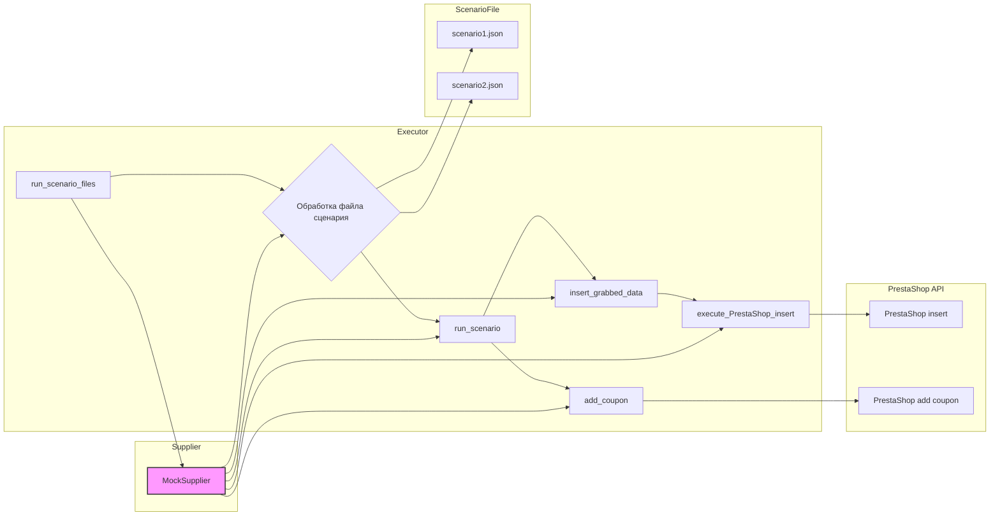

# Анализ кода модуля executor.py

## <input code>

```python
"""
Examples for the `executor` module from `src.scenario.executor`.

This file contains examples of how to use the functions provided in the `executor` module.
The examples demonstrate how to run scenarios, handle scenario files, and interact with PrestaShop API.

@details
- `Example 1` shows how to run a list of scenario files.
- `Example 2` demonstrates how to run a single scenario file.
- `Example 3` illustrates how to run a single scenario.
- `Example 4` provides an example of executing a product page scenario.
- `Example 5` shows how to add a coupon using PrestaShop API.

@image html executor.png
"""

from pathlib import Path
from src.scenario.executor import run_scenario_files, run_scenario_file, run_scenarios, run_scenario, insert_grabbed_data, execute_PrestaShop_insert, execute_PrestaShop_insert_async, add_coupon
from src.utils.jjson import j_loads_ns
from src.product.product_fields import ProductFields
from src.endpoints.PrestaShop import PrestaShop

# Assuming `Supplier` class is available and has necessary methods and attributes
class MockSupplier:
    def __init__(self):
        self.supplier_abs_path = Path('/path/to/scenarios')
        self.scenario_files = [Path('scenarios/scenario1.json'), Path('scenarios/scenario2.json')]
        self.current_scenario = None
        self.supplier_settings = {'runned_scenario': []}
        self.related_modules = MockRelatedModules()
        self.driver = MockDriver()

class MockRelatedModules:
    def get_list_products_in_category(self, s):
        return ['http://example.com/product1', 'http://example.com/product2']

    def grab_product_page(self, s):
        return ProductFields(
            presta_fields_dict={'reference': 'REF123', 'name': [{'id': 1, 'value': 'Sample Product'}], 'price': 100},
            assist_fields_dict={'images_urls': ['http://example.com/image1.jpg'], 'default_image_url': 'http://example.com/default_image.jpg', 'locale': 'en'}
        )

    async def grab_page(self, s):
        return self.grab_product_page(s)

class MockDriver:
    def get_url(self, url):
        return True

# ... (examples for functions)
```

## <algorithm>

(Блок-схема здесь не подходит, так как код демонстрирует примеры использования функций, а не сложный алгоритм).  Вместо этого представлен описание, что делает каждый пример:

* **Example 1:** Вызывает `run_scenario_files`, передавая экземпляр `MockSupplier` и список путей к файлам сценариев.  Функция `run_scenario_files` обрабатывает каждый файл сценария, передавая его `run_scenario`.

* **Example 2:**  Аналогично `Example 1`, но обрабатывает только один файл сценария.

* **Example 3:**  Вызывает `run_scenario` с экземпляром `MockSupplier` и  словарём сценария.

* **Example 4:**  Создаёт экземпляр `ProductFields` с данными о продукте. Вызывает `insert_grabbed_data`, передавая этот экземпляр.

* **Example 5:** Вызывает `add_coupon` с данными для добавления купона.

* **Example 6:**  Асинхронно выполняет `execute_PrestaShop_insert_async`, передавая экземпляр `ProductFields`.

* **Example 7:** Синхронно выполняет `execute_PrestaShop_insert`, передавая экземпляр `ProductFields`.

Данные передаются между функциями в виде аргументов.

## <mermaid>



## <explanation>

* **Импорты:**
    * `from pathlib import Path`:  Для работы с путями к файлам (например, к файлам сценариев).
    * `from src.scenario.executor import ...`: Импортирует функции для запуска сценариев (например, `run_scenario_files`, `run_scenario`). Это ключевая часть модуля `executor`, отвечающая за выполнение заданий.
    * `from src.utils.jjson import j_loads_ns`:  Вероятно, для обработки JSON данных,  используя `j_loads_ns`.
    * `from src.product.product_fields import ProductFields`: Импортирует класс `ProductFields`, необходимый для работы с данными о продуктах, хранящимися в структурах данных.
    * `from src.endpoints.PrestaShop import PrestaShop`: Импортирует класс `PrestaShop`, предоставляющий интерфейс для взаимодействия с API PrestaShop.


* **Классы:**
    * `MockSupplier`: Моковая реализация класса, используемая для тестирования. Содержит данные о сценариях, настройках и модулях.
    * `MockRelatedModules`: Моковая реализация модулей, которые взаимодействуют с `MockSupplier` (например, получение списка продуктов в категории).
    * `MockDriver`: Моковая реализация драйвера, который, вероятно, используется для работы с web-драйвером.


* **Функции:**
    * `run_scenario_files`, `run_scenario_file`, `run_scenario`: Функции для запуска сценариев, принимая на вход различные параметры (файлы, сценарий, и т.п.).
    * `insert_grabbed_data`: Вставляет данные о продуктах в систему PrestaShop.
    * `execute_PrestaShop_insert`, `execute_PrestaShop_insert_async`: Функции для работы с API PrestaShop.  `async` вариант - асинхронный.
    * `add_coupon`: Добавляет купоны.


* **Переменные:**
    * `scenario_files`, `scenario_file`, `scenario`: Содержат информацию о сценариях и файлах.
    * `product_fields`: Данные о продуктах, которые подготавливаются для вставки в PrestaShop.
    * `credentials`: Данные для доступа к API PrestaShop.


* **Возможные ошибки и улучшения:**
    * Отсутствие обработки ошибок:  Код не содержит проверки на корректность входных данных и обработку исключений, что может привести к сбою программы. Необходимо добавить `try...except` блоки для обработки потенциальных проблем.
    * Жестко заданные пути:  Путь `/path/to/scenarios` жестко задан, необходимо использовать переменные для большей гибкости.
    * Недостаточно описания `Supplier` и `ProductFields` : Для полного понимания кода необходимы определения `Supplier` и `ProductFields`, а так же методов, которые они содержат.
    * Не указаны сценарии. Необходимо иметь информацию о структуре сценариев.

**Цепочка взаимосвязей:**

Модуль `executor` взаимодействует с модулями `jjson` (для работы с JSON), `product_fields` (для работы с данными о продуктах), и `PrestaShop` (для взаимодействия с API PrestaShop). `MockSupplier` используется для тестирования функций `executor`, используя заглушки для взаимодействия с другими модулями.


**Примечание:** Без полного кода  `src.scenario.executor`, `src.utils.jjson`, `src.product.product_fields`, `src.endpoints.PrestaShop` и `Supplier` сложно дать более подробный анализ и построить более детальную блок-схему.