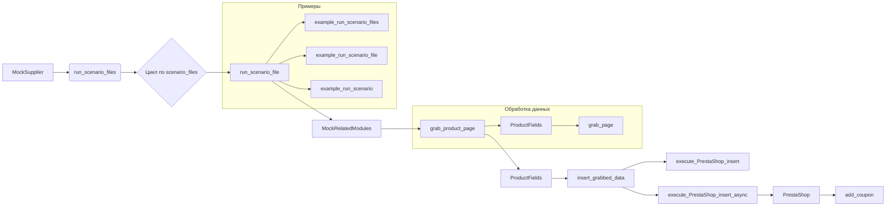

# Анализ кода модуля `executor.py`

```
Вот файл примеров для модуля `executor.py`, который иллюстрирует использование всех функций и методов, представленных в коде. В примерах показано, как можно использовать функции для выполнения сценариев, обработки файлов сценариев, работы с продуктами и взаимодействия с PrestaShop API.

```python
# ... (Код из исходного файла)
```

## <algorithm>

Алгоритм работы кода представлен в виде пошаговой блок-схемы, иллюстрирующей взаимодействие функций и классов:

1. **Инициализация:**
   - Создается экземпляр класса `MockSupplier`, который имитирует взаимодействие с поставщиком данных.  Он содержит пути к сценариям, список файлов сценариев, текущий сценарий, настройки поставщика и подключенные модули.

2. **Выполнение сценариев:**
   - `run_scenario_files`: Циклически запускает сценарии из переданного списка файлов.
   - `run_scenario_file`: Запускает сценарий из одного файла.
   - `run_scenario`: Выполняет конкретный сценарий, заданный в словаре.

3. **Обработка данных продуктов:**
   - `grab_product_page`: Извлекает данные о продукте с указанной страницы.
   - `insert_grabbed_data`: Вставляет данные о продукте в базу данных PrestaShop.

4. **Взаимодействие с API PrestaShop:**
   - `execute_PrestaShop_insert`: Синхронно выполняет вставку данных о продукте в PrestaShop.
   - `execute_PrestaShop_insert_async`: Асинхронно выполняет вставку данных о продукте в PrestaShop.
   - `add_coupon`: Добавляет купон в систему PrestaShop.

5. **Примеры:**
   - Различные функции `example_*` демонстрируют использование вышеперечисленных функций и классов, обрабатывая различные входные данные и выполняя соответствующие действия.


**Пример перемещения данных:**

`run_scenario_file` получает путь к файлу сценария.
`j_loads` загружает данные из файла, которые представляют собой сценарий.
`run_scenario` получает загруженные данные и взаимодействует с поставщиком.
Результат выполнения сценария возвращается, возможно, сохраняется в `supplier_settings`.
Если это вставка данных в PrestaShop, `insert_grabbed_data` получает данные о продукте, и они передаются в `execute_PrestaShop_insert`.


## <mermaid>



**Объяснение диаграммы:**

Модуль `MockSupplier` является точкой входа и вызывает функции для обработки сценариев.
`run_scenario_file` взаимодействует с `MockRelatedModules`, который отвечает за получение данных о продукте.
`ProductFields` — это объект, содержащий данные о продукте.
`insert_grabbed_data` и `execute_PrestaShop_insert` связаны, поскольку вставляют данные о продукте в PrestaShop.
Примеры демонстрируют использование всех этих функций.


## <explanation>

**Импорты:**

- `from pathlib import Path`: Импортирует класс `Path` для работы с путями к файлам.
- `from src.scenario.executor import ...`: Импортирует функции `run_scenario_files`, `run_scenario_file`, `run_scenarios`, `run_scenario`, `insert_grabbed_data`, `execute_PrestaShop_insert`, `execute_PrestaShop_insert_async`, `add_coupon` из модуля `executor` внутри пакета `src.scenario`. Это указывает на иерархическую структуру проекта.
- `from src.utils import j_loads`: Импортирует функцию `j_loads` для обработки JSON-данных из пакета `utils`.
- `from src.product import ProductFields`: Импортирует класс `ProductFields` из модуля `product` внутри пакета `src`.
- `from src.endpoints.PrestaShop import PrestaShop`: Импортирует класс `PrestaShop` из модуля `PrestaShop` внутри пакета `endpoints`.

**Классы:**

- `MockSupplier`: Имитирует взаимодействие с внешней системой, предоставляет данные о сценариях и взаимодействует с `MockRelatedModules` и `MockDriver`.  Он содержит пути, файлы сценариев и т.д., что нужно для запуска сценариев.
- `MockRelatedModules`: Имитирует модули, которые получают данные о продуктах, например, используя веб-парсинг.
- `MockDriver`: Имитирует взаимодействие с браузером или другими веб-сервисами.

**Функции:**

- `run_scenario_files`, `run_scenario_file`, `run_scenario`: Функции для управления сценариями и их выполнением.  Они принимают `supplier` объект для взаимодействия.
- `insert_grabbed_data`: Вставляет данные о продукте в PrestaShop.
- `execute_PrestaShop_insert`, `execute_PrestaShop_insert_async`: Функции для взаимодействия с API PrestaShop.
- `add_coupon`: Добавляет купон.

**Переменные:**

- `supplier`, `scenario_files`, `scenario_file`, `scenario`: Переменные, содержащие данные, необходимые для выполнения сценариев.


**Возможные ошибки и улучшения:**

- Отсутствует валидация входных данных (например, формат файла сценария).
- Нет обработки ошибок (например, ошибки при чтении файлов, ошибки API).
- `MockSupplier`, `MockRelatedModules` и `MockDriver` - это заглушки, а не реальные классы, что делает их менее полезными в реальной системе.


**Взаимосвязь с другими частями проекта:**

- Модуль `executor` зависит от `src.scenario`, `src.utils`, `src.product`, `src.endpoints.PrestaShop`.
- Модуль `executor` отвечает за координацию выполнения сценариев и взаимодействие с другими компонентами, такими как API PrestaShop.


**Выводы:**

Код демонстрирует структурированный подход к управлению сценариями и взаимодействию с системами, но требует улучшений в плане обработки ошибок и валидации входных данных.  Использование заглушек (`Mock`) упрощает тестирование, но делает его неподходящим для использования в реальном проекте.