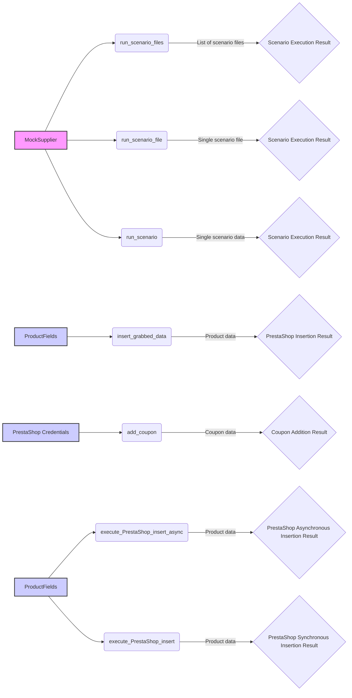

## Анализ кода `executor.md`

### <алгоритм>

1.  **Инициализация `MockSupplier`:**
    *   Создается экземпляр класса `MockSupplier`, имитирующий поставщика с путями к сценариям, списком файлов сценариев и настройками.
    *   Пример: `supplier = MockSupplier()`.
2.  **`example_run_scenario_files`:**
    *   Берется список файлов сценариев.
    *   Вызывается функция `run_scenario_files`, которая обрабатывает каждый файл сценария.
    *   Если все сценарии выполнены успешно, выводится сообщение "All scenarios executed successfully.", иначе "Some scenarios failed.".
    *   Пример: `result = run_scenario_files(supplier, scenario_files)`.
3.  **`example_run_scenario_file`:**
    *   Берется один файл сценария.
    *   Вызывается функция `run_scenario_file` для выполнения сценария из этого файла.
    *   Если сценарий выполнен успешно, выводится сообщение "Scenario file executed successfully.", иначе "Failed to execute scenario file.".
    *   Пример: `result = run_scenario_file(supplier, scenario_file)`.
4.  **`example_run_scenario`:**
    *   Создается словарь, представляющий сценарий с URL и списком продуктов.
    *   Вызывается функция `run_scenario` для выполнения этого сценария.
    *   Если сценарий выполнен успешно, выводится сообщение "Scenario executed successfully.", иначе "Failed to execute the scenario.".
    *   Пример: `result = run_scenario(supplier, scenario)`.
5.  **`example_insert_grabbed_data`:**
    *   Создается объект `ProductFields` с данными о продукте.
    *   Вызывается функция `insert_grabbed_data` для вставки этих данных.
    *   Выводится сообщение "Product data inserted into PrestaShop.".
    *   Пример: `insert_grabbed_data(product_fields)`.
6.  **`example_add_coupon`:**
    *   Определяются параметры для добавления купона, включая учетные данные API, код купона, дату начала и окончания.
    *   Вызывается функция `add_coupon` для добавления купона в PrestaShop.
    *   Выводится сообщение "Coupon added successfully.".
    *   Пример: `add_coupon(credentials, reference, coupon_code, start_date, end_date)`.
7.  **`example_execute_PrestaShop_insert_async`:**
    *   Создается объект `ProductFields` с данными о продукте.
    *   Вызывается асинхронная функция `execute_PrestaShop_insert_async` для асинхронной вставки данных.
    *   Выводится сообщение "Product data inserted into PrestaShop asynchronously.".
    *   Пример: `await execute_PrestaShop_insert_async(product_fields)`.
8.  **`example_execute_PrestaShop_insert`:**
    *    Создается объект `ProductFields` с данными о продукте.
    *    Вызывается функция `execute_PrestaShop_insert` для синхронной вставки данных.
    *    Если вставка прошла успешно, выводится сообщение "Product data inserted into PrestaShop.", иначе "Failed to insert product data into PrestaShop.".
    *   Пример: `result = execute_PrestaShop_insert(product_fields)`.
9.  **Вызов примеров:**
    *   В `if __name__ == "__main__":` последовательно вызываются все примеры, включая асинхронный вызов с помощью `asyncio.run()`.

### <mermaid>



**Объяснение `mermaid` диаграммы:**

*   **`MockSupplier`**: Представлен как `A`, имитирует поставщика данных, предоставляющего пути к файлам и настройки.
*   **`run_scenario_files`**: Функция `B`, принимает от `MockSupplier` список файлов сценариев для выполнения.
*   **`run_scenario_file`**: Функция `C`, принимает от `MockSupplier` один файл сценария.
*   **`run_scenario`**: Функция `D`, принимает от `MockSupplier` данные для одного сценария.
*    **`ProductFields`**: Представлен как `E` и `I`, объекты, содержащие данные о продуктах для вставки.
*   **`insert_grabbed_data`**: Функция `F`, принимает `ProductFields` и вставляет данные.
*   **`PrestaShop Credentials`**: Представлен как `G`, содержит учетные данные для API PrestaShop.
*   **`add_coupon`**: Функция `H`, принимает учетные данные и данные купона для добавления купона.
*   **`execute_PrestaShop_insert_async`**: Функция `J`, принимает `ProductFields` и асинхронно вставляет данные.
*   **`execute_PrestaShop_insert`**: Функция `K`, принимает `ProductFields` и синхронно вставляет данные.
*   **`L, M, N, O, P, Q, R`**: блоки, обозначающие результаты выполнения функций, которые возвращают результат операций.

Диаграмма показывает поток данных от имитированного поставщика (`MockSupplier`) к функциям управления сценариями, а также поток данных о продуктах к функциям вставки и добавления купонов, демонстрируя зависимости и последовательность вызовов функций.

### <объяснение>

**Импорты:**

*   `from pathlib import Path`: Импортирует класс `Path` для работы с путями к файлам.
*   `from src.scenario.executor import run_scenario_files, run_scenario_file, run_scenarios, run_scenario, insert_grabbed_data, execute_PrestaShop_insert, execute_PrestaShop_insert_async, add_coupon`: Импортирует функции из модуля `executor`, которые выполняют сценарии, обрабатывают данные продуктов и взаимодействуют с PrestaShop.
*   `from src.utils.jjson import j_loads_ns`: Импортирует функцию для загрузки JSON.
*   `from src.product.product_fields import ProductFields`: Импортирует класс `ProductFields`, который представляет данные о продукте.
*   `from src.endpoints.PrestaShop import PrestaShop`: Импортирует класс `PrestaShop` для работы с API PrestaShop.
*  **asyncio**: Используется для асинхронного выполнения функций.

**Классы:**

*   **`MockSupplier`**:
    *   **Роль**: Имитация поставщика данных, который предоставляет информацию о путях к сценариям, списке файлов и настройках.
    *   **Атрибуты**:
        *   `supplier_abs_path`: Абсолютный путь к каталогу со сценариями.
        *   `scenario_files`: Список путей к файлам сценариев.
        *   `current_scenario`: Текущий сценарий.
        *   `supplier_settings`: Настройки поставщика, включая список выполненных сценариев.
        *  `related_modules`: Экземпляр класса `MockRelatedModules`.
        * `driver`: Экземпляр класса `MockDriver`
    *   **Методы**: `__init__` для инициализации атрибутов.
*   **`MockRelatedModules`**:
    *   **Роль**: Имитация связанных модулей для получения данных о продуктах и страницах.
    *   **Методы**:
        *    `get_list_products_in_category(self, s)`: Возвращает список URL продуктов в категории.
        *   `grab_product_page(self, s)`: Возвращает экземпляр `ProductFields`, имитирующий данные, полученные со страницы продукта.
        *   `async grab_page(self, s)`: Асинхронная версия `grab_product_page`
*   **`MockDriver`**:
    *   **Роль**: Имитация драйвера для навигации по сайту.
    *   **Методы**: `get_url(self, url)`: Имитация получения URL.

**Функции:**

*   **`example_run_scenario_files()`:**
    *   **Аргументы**: Нет.
    *   **Возвращаемое значение**: Нет.
    *   **Назначение**: Запускает несколько файлов сценариев с использованием функции `run_scenario_files`.
    *   **Пример**:
        ```python
        supplier = MockSupplier()
        scenario_files = [Path('scenarios/scenario1.json'), Path('scenarios/scenario2.json')]
        result = run_scenario_files(supplier, scenario_files)
        ```
*   **`example_run_scenario_file()`:**
    *   **Аргументы**: Нет.
    *   **Возвращаемое значение**: Нет.
    *   **Назначение**: Запускает один файл сценария с использованием функции `run_scenario_file`.
    *   **Пример**:
        ```python
        supplier = MockSupplier()
        scenario_file = Path('scenarios/scenario1.json')
        result = run_scenario_file(supplier, scenario_file)
        ```
*   **`example_run_scenario()`:**
    *   **Аргументы**: Нет.
    *   **Возвращаемое значение**: Нет.
    *   **Назначение**: Запускает один сценарий, представленный в виде словаря, с использованием функции `run_scenario`.
    *   **Пример**:
        ```python
        supplier = MockSupplier()
        scenario = {'url': 'http://example.com/category', 'products': [{'url': 'http://example.com/product1'}, {'url': 'http://example.com/product2'}]}
        result = run_scenario(supplier, scenario)
        ```
*   **`example_insert_grabbed_data()`:**
    *   **Аргументы**: Нет.
    *   **Возвращаемое значение**: Нет.
    *   **Назначение**: Вставляет данные о продукте, используя функцию `insert_grabbed_data`.
    *   **Пример**:
        ```python
        product_fields = ProductFields(presta_fields_dict={'reference': 'REF123', 'name': [{'id': 1, 'value': 'Sample Product'}], 'price': 100}, assist_fields_dict={'images_urls': ['http://example.com/image1.jpg'], 'default_image_url': 'http://example.com/default_image.jpg', 'locale': 'en'})
        insert_grabbed_data(product_fields)
        ```
*   **`example_add_coupon()`:**
    *   **Аргументы**: Нет.
    *   **Возвращаемое значение**: Нет.
    *   **Назначение**: Добавляет купон через API PrestaShop, используя функцию `add_coupon`.
    *   **Пример**:
        ```python
        credentials = {'api_domain': 'https://example.com/api', 'api_key': 'YOUR_API_KEY'}
        reference = 'REF123'
        coupon_code = 'SUMMER2024'
        start_date = '2024-07-01'
        end_date = '2024-07-31'
        add_coupon(credentials, reference, coupon_code, start_date, end_date)
        ```
*   **`example_execute_PrestaShop_insert_async()`:**
    *   **Аргументы**: Нет.
    *   **Возвращаемое значение**: Нет.
    *   **Назначение**: Асинхронно вставляет данные о продукте, используя функцию `execute_PrestaShop_insert_async`.
    *   **Пример**:
        ```python
        product_fields = ProductFields(presta_fields_dict={'reference': 'REF123', 'name': [{'id': 1, 'value': 'Sample Product'}], 'price': 100}, assist_fields_dict={'images_urls': ['http://example.com/image1.jpg'], 'default_image_url': 'http://example.com/default_image.jpg', 'locale': 'en'})
        await execute_PrestaShop_insert_async(product_fields)
        ```
*   **`example_execute_PrestaShop_insert()`:**
    *   **Аргументы**: Нет.
    *   **Возвращаемое значение**: Нет.
    *   **Назначение**: Синхронно вставляет данные о продукте, используя функцию `execute_PrestaShop_insert`.
    *   **Пример**:
        ```python
        product_fields = ProductFields(presta_fields_dict={'reference': 'REF123', 'name': [{'id': 1, 'value': 'Sample Product'}], 'price': 100}, assist_fields_dict={'images_urls': ['http://example.com/image1.jpg'], 'default_image_url': 'http://example.com/default_image.jpg', 'locale': 'en'})
        result = execute_PrestaShop_insert(product_fields)
        ```
**Переменные:**

*   `supplier`: Экземпляр класса `MockSupplier`.
*   `scenario_files`: Список путей к файлам сценариев (тип `list[Path]`).
*   `scenario_file`: Путь к файлу сценария (тип `Path`).
*   `scenario`: Словарь, представляющий один сценарий.
*   `product_fields`: Экземпляр класса `ProductFields`, содержащий данные о продукте.
*   `credentials`: Словарь, содержащий учетные данные для PrestaShop API.
*   `reference`, `coupon_code`, `start_date`, `end_date`: Строковые переменные для параметров купона.
*   `result`: Переменная для хранения результатов выполнения функций (тип `bool` или None).

**Потенциальные ошибки и области для улучшения:**

*   **Зависимость от моков:** Использование `MockSupplier`, `MockRelatedModules` и `MockDriver` делает примеры изолированными, но не отражает реальное взаимодействие с системой. Для полноценного тестирования необходимы более реалистичные имитации или использование реальных зависимостей.
*   **Обработка ошибок:** Примеры в основном выводят сообщения об успехе или неудаче. В реальном приложении необходима более детальная обработка исключений и логирование.
*   **Отсутствие реального API:** В примере `add_coupon` отсутствуют реальные вызовы PrestaShop API.
*   **Неполнота асинхронности**: Используется только `execute_PrestaShop_insert_async`,  остальные функции выполняются синхронно. В реальном приложении, где требуется работа с API, большая часть функций должна быть асинхронной.

**Взаимосвязи с другими частями проекта:**

*   `src.scenario.executor`: Данный файл является примером использования функций из этого модуля.
*   `src.utils.jjson`: Используется для работы с JSON файлами (хотя в примерах напрямую не показано).
*   `src.product.product_fields`: Используется для представления данных о продукте.
*  `src.endpoints.PrestaShop`: Используется для взаимодействия с PrestaShop API.

Этот анализ предоставляет подробное представление о коде, его структуре и функциональности, а также показывает связи с другими частями проекта.