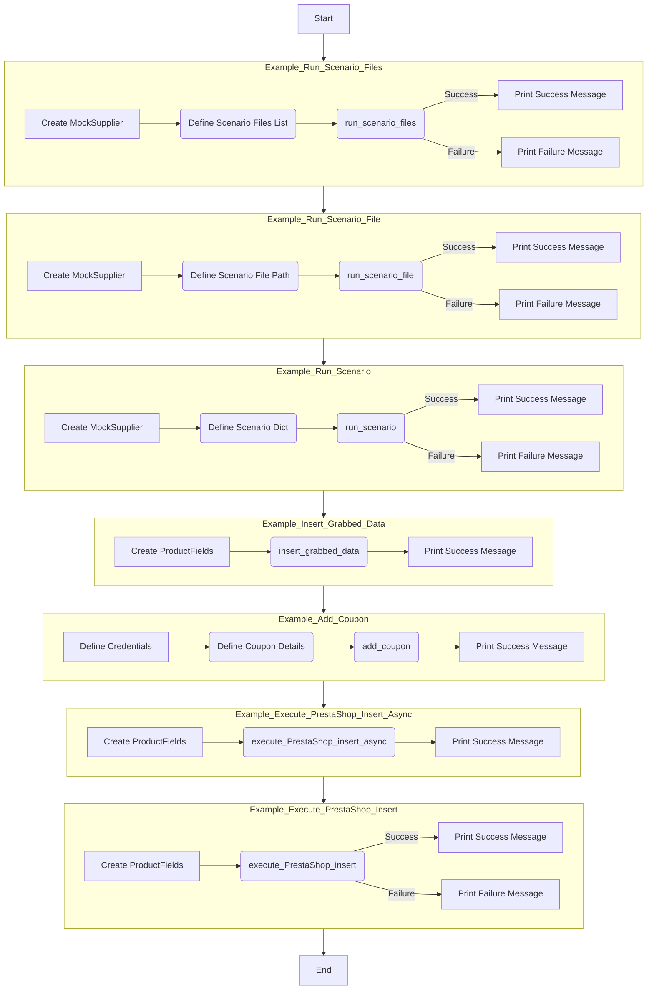

## <алгоритм>

1. **Инициализация Мок-объектов:**
   - Создается `MockSupplier`, который имитирует поставщика данных со структурой, необходимой для работы функций.
   - `MockSupplier` содержит атрибуты: `supplier_abs_path` (путь к сценариям), `scenario_files` (список файлов сценариев), `current_scenario` (текущий сценарий), `supplier_settings` (настройки поставщика), `related_modules` (модули связанные с поставщиком) и `driver`.
   - `MockRelatedModules` содержит методы `get_list_products_in_category`, имитирующий получение списка продуктов в категории, `grab_product_page` имитирующий захват данных со страницы продукта и `grab_page` асинхронный захват страницы.
   - `MockDriver` имеет метод `get_url`, который имитирует открытие URL.

2.  **`example_run_scenario_files`:**
    - Создается экземпляр `MockSupplier`.
    - Определяется список файлов сценариев `scenario_files`.
    - Вызывается функция `run_scenario_files` с поставщиком и списком файлов.
    - Если все сценарии выполнятся успешно, выводится сообщение "All scenarios executed successfully.", иначе "Some scenarios failed."
    - *Пример:* `run_scenario_files(supplier, [Path('scenarios/scenario1.json'), Path('scenarios/scenario2.json')])`

3.  **`example_run_scenario_file`:**
    - Создается экземпляр `MockSupplier`.
    - Определяется путь к одному файлу сценария `scenario_file`.
    - Вызывается функция `run_scenario_file` с поставщиком и файлом сценария.
    - Если выполнение файла сценария успешно, выводится "Scenario file executed successfully.", иначе "Failed to execute scenario file."
    - *Пример:* `run_scenario_file(supplier, Path('scenarios/scenario1.json'))`

4.  **`example_run_scenario`:**
    - Создается экземпляр `MockSupplier`.
    - Определяется словарь `scenario`, содержащий URL категории и список продуктов.
    - Вызывается функция `run_scenario` с поставщиком и сценарием.
    - Если сценарий выполнен успешно, выводится сообщение "Scenario executed successfully.", иначе "Failed to execute the scenario."
    - *Пример:* `run_scenario(supplier, {'url': 'http://example.com/category', 'products': [{'url': 'http://example.com/product1'}, {'url': 'http://example.com/product2'}]})`

5.  **`example_insert_grabbed_data`:**
    - Создается объект `ProductFields` с данными о продукте.
    - Вызывается функция `insert_grabbed_data` с данными о продукте.
    - Выводится сообщение "Product data inserted into PrestaShop."
    - *Пример:* `insert_grabbed_data(ProductFields(...))`

6.  **`example_add_coupon`:**
    - Определяются данные для подключения к PrestaShop API (`credentials`),  артикул продукта (`reference`), код купона (`coupon_code`), дата начала действия (`start_date`) и дата окончания действия (`end_date`).
    - Вызывается функция `add_coupon` с данными о купоне.
    - Выводится сообщение "Coupon added successfully."
    - *Пример:* `add_coupon({'api_domain': 'https://example.com/api', 'api_key': 'YOUR_API_KEY'}, 'REF123', 'SUMMER2024', '2024-07-01', '2024-07-31')`

7. **`example_execute_PrestaShop_insert_async`:**
   - Создается объект `ProductFields` с данными о продукте.
   - Вызывается асинхронная функция `execute_PrestaShop_insert_async` с данными о продукте.
   - Выводится сообщение "Product data inserted into PrestaShop asynchronously."
   - *Пример:* `await execute_PrestaShop_insert_async(ProductFields(...))`

8.  **`example_execute_PrestaShop_insert`:**
    - Создается объект `ProductFields` с данными о продукте.
    - Вызывается функция `execute_PrestaShop_insert` с данными о продукте.
    - Если вставка данных выполнена успешно, выводится "Product data inserted into PrestaShop.", иначе "Failed to insert product data into PrestaShop."
     - *Пример:* `execute_PrestaShop_insert(ProductFields(...))`

9.  **Запуск примеров:**
    - В блоке `if __name__ == "__main__":` последовательно вызываются все функции примеров.

## <mermaid>

**Анализ зависимостей `mermaid`:**

Диаграмма в формате `mermaid` представляет собой блок-схему, отображающую поток выполнения кода в примерах. Каждый пример представлен как подграф, где стрелками показан порядок выполнения операций.

-   `Example_Run_Scenario_Files`: Показывает процесс запуска списка файлов сценариев. Начинается с создания `MockSupplier`, затем определения списка файлов сценариев, вызова функции `run_scenario_files` и заканчивается выводом сообщения об успехе или неудаче.
-   `Example_Run_Scenario_File`: Показывает процесс запуска одного файла сценария. Аналогично предыдущему, начинается с создания `MockSupplier`, определения пути к файлу, вызова `run_scenario_file` и вывода результата.
-   `Example_Run_Scenario`: Отображает процесс запуска одного сценария,  начиная с создания `MockSupplier`, определения словаря сценария, вызова `run_scenario` и вывода результата.
-   `Example_Insert_Grabbed_Data`: Показывает процесс вставки данных продукта, начинается с создания `ProductFields`, вызова `insert_grabbed_data` и вывода сообщения.
-   `Example_Add_Coupon`: Отображает процесс добавления купона,  начиная с определения данных для PrestaShop API и деталей купона, вызова `add_coupon` и вывода сообщения.
-   `Example_Execute_PrestaShop_Insert_Async`: Отображает асинхронную вставку данных, начинается с создания `ProductFields`, вызова `execute_PrestaShop_insert_async` и вывода сообщения.
-   `Example_Execute_PrestaShop_Insert`: Показывает синхронную вставку данных,  начиная с создания `ProductFields`, вызова `execute_PrestaShop_insert` и вывода результата.

## <объяснение>

**Импорты:**

-   `pathlib.Path`: Используется для работы с путями к файлам и директориям. Упрощает операции с файловой системой.
-   `src.scenario.executor`: Импортирует функции `run_scenario_files`, `run_scenario_file`, `run_scenarios`, `run_scenario`, `insert_grabbed_data`, `execute_PrestaShop_insert`, `execute_PrestaShop_insert_async`, `add_coupon` из модуля `executor`. Эти функции отвечают за выполнение сценариев и взаимодействие с PrestaShop.
-   `src.utils.jjson.j_loads_ns`: Используется для загрузки JSON-данных с применением неймспейсов.
-   `src.product.product_fields.ProductFields`: Класс, представляющий поля продукта, используется для хранения данных о продукте.
-   `src.endpoints.PrestaShop.PrestaShop`: Класс для взаимодействия с PrestaShop API.

**Классы:**

-   `MockSupplier`:
    -   Роль: Имитирует поставщика данных, предоставляя необходимые атрибуты для выполнения сценариев.
    -   Атрибуты:
        -   `supplier_abs_path`: Абсолютный путь к директории со сценариями.
        -   `scenario_files`: Список путей к файлам сценариев.
        -   `current_scenario`: Текущий выполняемый сценарий.
        -   `supplier_settings`: Настройки поставщика, включая список выполненных сценариев.
        -   `related_modules`: Объект, имитирующий связанные модули.
        -   `driver`: Объект, имитирующий драйвер для выполнения браузерных действий.
    -   Методы: Отсутствуют, но атрибуты используются для эмуляции данных поставщика.
-   `MockRelatedModules`:
    -   Роль: Имитирует связанные модули, необходимые для выполнения сценариев, предоставляя методы для эмуляции захвата данных.
    -   Атрибуты: Отсутствуют
    -   Методы:
        -   `get_list_products_in_category(s)`: Имитирует получение списка URL продуктов в категории.
        -   `grab_product_page(s)`: Имитирует захват данных со страницы продукта и возвращает объект `ProductFields`.
        -   `grab_page(s)`: Асинхронная версия `grab_product_page`.
-   `MockDriver`:
     -   Роль: Имитирует драйвер для открытия URL.
     -   Атрибуты: Отсутствуют
     -   Методы:
        -   `get_url(url)`: Имитирует открытие URL.

**Функции:**

-   `example_run_scenario_files()`:
    -   Аргументы: Нет.
    -   Возвращаемое значение: Нет.
    -   Назначение: Запускает выполнение списка файлов сценариев, используя `run_scenario_files` и выводит результат.
-   `example_run_scenario_file()`:
    -   Аргументы: Нет.
    -   Возвращаемое значение: Нет.
    -   Назначение: Запускает выполнение одного файла сценария, используя `run_scenario_file` и выводит результат.
-   `example_run_scenario()`:
    -   Аргументы: Нет.
    -   Возвращаемое значение: Нет.
    -   Назначение: Запускает выполнение одного сценария, используя `run_scenario` и выводит результат.
-   `example_insert_grabbed_data()`:
    -   Аргументы: Нет.
    -   Возвращаемое значение: Нет.
    -   Назначение: Вставляет данные продукта в PrestaShop, используя `insert_grabbed_data`.
-   `example_add_coupon()`:
    -   Аргументы: Нет.
    -   Возвращаемое значение: Нет.
    -   Назначение: Добавляет купон в PrestaShop, используя `add_coupon`.
-   `example_execute_PrestaShop_insert_async()`:
    -   Аргументы: Нет.
    -   Возвращаемое значение: None (асинхронная функция).
    -   Назначение: Асинхронно вставляет данные продукта в PrestaShop, используя `execute_PrestaShop_insert_async`.
-   `example_execute_PrestaShop_insert()`:
    -   Аргументы: Нет.
    -   Возвращаемое значение: Нет.
    -   Назначение: Синхронно вставляет данные продукта в PrestaShop, используя `execute_PrestaShop_insert`.

**Переменные:**

-   `supplier`: Объект `MockSupplier`, имитирующий поставщика данных.
-   `scenario_files`: Список объектов `Path` к файлам сценариев.
-   `scenario_file`: Объект `Path` к одному файлу сценария.
-   `scenario`: Словарь, представляющий сценарий с URL и списком продуктов.
-   `product_fields`: Объект `ProductFields`, содержащий данные о продукте.
-    `credentials`: Словарь с данными для подключения к PrestaShop API.
-    `reference`: Артикул продукта.
-    `coupon_code`: Код купона.
-   `start_date`, `end_date`: Даты начала и окончания действия купона.

**Взаимосвязи с другими частями проекта:**

-   Модуль `executor.py` используется для выполнения сценариев, которые определяются в файлах.
-   Модуль `jjson.py` используется для загрузки настроек и данных из файлов JSON.
-   Модуль `product_fields.py` используется для определения структуры данных о продукте.
-   Модуль `PrestaShop.py` используется для взаимодействия с PrestaShop API.

**Потенциальные ошибки и области для улучшения:**

-   Мок-объекты (`MockSupplier`, `MockRelatedModules`, `MockDriver`) сильно упрощены и могут не отражать реальное поведение системы. Необходимо создать более точные моки, если тестирование требует большей детализации.
-   Отсутствует реальное выполнение API-запросов PrestaShop. В примерах используется заглушка, выводящая сообщение. Для полноценного тестирования необходимо мокировать реальный API.
-   Отсутствует обработка исключений и ошибок. Необходимо добавить проверки и обработку возможных ошибок при выполнении сценариев.
-   Код не использует асинхронность в полной мере. Только один пример использует асинхронную функцию. Остальные примеры могут быть переписаны для использования асинхронных операций, чтобы повысить производительность.
-   Примеры используют жестко закодированные пути к файлам и данным, необходимо сделать конфигурацию более гибкой.

**Дополнительные замечания:**

-   Код является демонстрационным и не предназначен для реального использования без доработок.
-   Используются мок-объекты для имитации зависимостей, что упрощает тестирование и изолирует модули.
-   Примеры показывают основные способы использования функций модуля `executor`, но не охватывают все возможные варианты использования.

Этот анализ предоставляет подробное объяснение функциональности кода, его архитектуры, зависимостей, и потенциальных проблем, а также предлагает пути для улучшения.