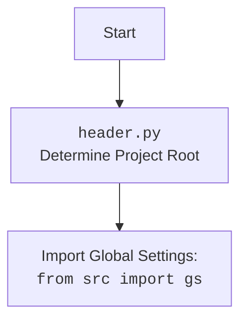

## <алгоритм>

**1. `run_scenario_files(s, scenario_files_list)`:**

   - **Начало:** Функция принимает экземпляр поставщика (`s`) и список путей к файлам сценариев (`scenario_files_list`) (либо один путь).
   - **Пример:** `s` - объект поставщика, `scenario_files_list` - `[Path('scenario1.json'), Path('scenario2.json')]` или `Path('scenario.json')`.
   - **Преобразование `scenario_files_list`:** Если `scenario_files_list` является `Path`, преобразует его в список. Если это не список и не путь, вызывает `TypeError`.
   - **Инициализация журнала:** Создает журнал `_journal` и вкладывает в него пустой словарь по ключу `scenario_files`
   - **Цикл по файлам сценариев:**  Итерируется по каждому файлу в `scenario_files_list`.
      - **Пример:** Для `scenario_file = Path('scenario1.json')`, создается запись  `_journal['scenario_files']['scenario1.json'] = {}`.
      - **Вызов `run_scenario_file()`:** Вызывает функцию `run_scenario_file()` для обработки текущего файла.
         - Если `run_scenario_file()` возвращает `True`, записывает в журнал `_journal['scenario_files']['scenario_file.name']['message'] = f'{scenario_file} completed successfully!'` и выводит сообщение об успехе в лог.
         - Если `run_scenario_file()` возвращает `False`, записывает в журнал `_journal['scenario_files']['scenario_file.name']['message'] = f'{scenario_file} FAILED!'` и выводит сообщение об ошибке в лог.
         - В случае ошибки  выводится сообщение об ошибке в лог и в журнал.
   - **Конец:** Возвращает `True` после обработки всех сценариев.

**2. `run_scenario_file(s, scenario_file)`:**

   - **Начало:** Функция принимает экземпляр поставщика (`s`) и путь к файлу сценария (`scenario_file`).
   - **Пример:** `s` - объект поставщика, `scenario_file` - `Path('scenario1.json')`.
   - **Загрузка сценариев:** Загружает JSON из `scenario_file` и извлекает словарь со сценариями `scenarios_dict`.
   - **Цикл по сценариям:** Итерируется по каждому сценарию в `scenarios_dict`.
      - **Пример:** Для `scenario_name = 'scenario_1'`, `scenario` - словарь, представляющий сценарий.
      - **Установка текущего сценария:** Устанавливает `s.current_scenario` равным текущему сценарию `scenario`.
      - **Вызов `run_scenario()`:** Вызывает функцию `run_scenario()` для выполнения текущего сценария.
         - Если `run_scenario()` возвращает `True`, выводится сообщение об успехе в лог.
         - Если `run_scenario()` возвращает `False`, выводится сообщение об ошибке в лог.
   - **Обработка ошибок:**  Возвращает `False`, если возникает `FileNotFoundError` или `json.JSONDecodeError`.
   - **Конец:** Возвращает `True` после обработки всех сценариев в файле.

**3. `run_scenarios(s, scenarios=None, _journal=None)`:**

   - **Начало:** Принимает экземпляр поставщика `s`, список сценариев `scenarios` (или один сценарий в виде словаря) и `_journal`.
   - **Пример:** `s` - объект поставщика, `scenarios` - `[{'url':'url1'}, {'url':'url2'}]`, либо `{'url':'url1'}` или `None`.
   - **Подготовка сценариев:** Если `scenarios` не указаны, то берется значение `s.current_scenario`.  Преобразует `scenarios` в список, если это словарь.
   - **Цикл по сценариям:** Итерируется по каждому сценарию в списке.
     - **Пример:** Для `scenario = {'url':'url1'}`.
     - **Вызов `run_scenario()`:**  Вызывает `run_scenario()` для выполнения текущего сценария. Результат сохраняет в `res`.
     - **Обновление журнала:** Добавляет результат выполнения `scenario` в журнал.
     - **Сохранение журнала:** Вызывает `dump_journal()` для сохранения журнала.
   - **Конец:** Возвращает `res` - результат выполнения сценариев.

**4. `run_scenario(supplier, scenario, scenario_name)`:**

   - **Начало:** Функция принимает экземпляр поставщика (`supplier`), словарь с данными сценария (`scenario`) и имя сценария (`scenario_name`).
   - **Пример:** `supplier` - объект поставщика, `scenario` - `{'url':'url1', ...}`, `scenario_name` - `'scenario_1'`.
   - **Инициализация:** Назначает `s = supplier`, выводит сообщение о начале сценария в лог, устанавливает текущий сценарий `s.current_scenario` и получает драйвер браузера `d` из `s`.
   - **Переход по URL:** Открывает URL из сценария с помощью `d.get_url(scenario['url'])`.
   - **Получение списка продуктов:** Вызывает `s.related_modules.get_list_products_in_category(s)` для получения списка ссылок на продукты в категории.
   - **Проверка списка продуктов:** Если список продуктов пуст, выводит предупреждение в лог и возвращает `False`.
   - **Цикл по продуктам:** Итерируется по каждой ссылке на продукт `url` в списке `list_products_in_category`.
      - **Пример:** `url` - `'product1_url'`.
      - **Переход на страницу продукта:** Открывает страницу продукта `url` с помощью `d.get_url(url)`. Если не получается перейти, выводит ошибку в лог и переходит к следующему продукту.
      - **Сбор полей продукта:** Вызывает `s.related_modules.grab_product_page(s)` для сбора данных со страницы. Затем асинхронно вызывает `s.related_modules.grab_page(s)`, результат которого присваивается `f`.
      - **Проверка наличия данных:** Если `f` пуст (не получилось собрать данные), выводит ошибку в лог и переходит к следующему продукту.
      - **Создание продукта:** Извлекает `presta_fields_dict` и `assist_fields_dict` из `f`. Создает экземпляр класса `Product`, передавая ему необходимые поля. Вызывает `insert_grabbed_data(f)`.
      - **Обработка ошибок создания:** Ловит исключения при создании и сохранении продукта, выводит ошибку в лог и переходит к следующему продукту.
   - **Конец:** Возвращает `list_products_in_category` после обработки всех продуктов.

**5. `insert_grabbed_data_to_prestashop(f, coupon_code=None, start_date=None, end_date=None)`:**
    - **Начало:** Функция принимает объект `ProductFields` (`f`) и опциональные параметры для купона и дат акций.
    - **Пример:** `f` - содержит данные продукта, `coupon_code` - `"SUMMER20"`, `start_date` - "2024-07-01", `end_date` - "2024-07-31".
    - **Создание экземпляра PrestaShop:** Создает экземпляр класса `PrestaShop`.
    - **Отправка данных в PrestaShop:** Асинхронно вызывает метод `post_product_data` объекта `presta`, передавая ему данные продукта из `f`, а также данные купона и дат акций.
    - **Обработка ошибок:** Если отправка данных завершается с ошибкой, выводится сообщение об ошибке в лог.
    - **Конец:** Возвращает `True` при успешном добавлении данных в PrestaShop или `False` при ошибке.
    
**Поток данных:**
1. `run_scenario_files` получает список файлов сценариев и итерируется по ним.
2.  Для каждого файла `run_scenario_file` загружает сценарии и итерируется по ним.
3. `run_scenarios` получает список сценариев и итерируется по ним, вызывая `run_scenario`.
4.  `run_scenario` получает URL из сценария, переходит на страницу, собирает данные продуктов.
5.  После сбора данных вызывается `insert_grabbed_data_to_prestashop` для сохранения данных продукта в PrestaShop.
6.  Данные о выполнении сохраняются в журнал, а также в лог.

## <mermaid>

```mermaid
flowchart TD
    Start[Start] --> run_scenario_files_call{run_scenario_files(s, scenario_files_list)};
    run_scenario_files_call --> Check_scenario_files_list{Is scenario_files_list a Path?};
    Check_scenario_files_list -- Yes --> Convert_to_list{scenario_files_list=[scenario_files_list]};
    Check_scenario_files_list -- No --> Check_if_list{Is scenario_files_list a list?};
    Check_if_list -- Yes --> Initialize_journal{_journal['scenario_files']={}};
    Check_if_list -- No --> TypeError_exception[Raise TypeError];
    Initialize_journal --> For_each_scenario_file{for scenario_file in scenario_files_list};
     For_each_scenario_file --> Create_journal_entry{_journal['scenario_files'][scenario_file.name]={}};
    Create_journal_entry --> run_scenario_file_call{run_scenario_file(s, scenario_file)};
    run_scenario_file_call -- Success --> Log_success{logger.success()};
    run_scenario_file_call -- Fail --> Log_fail{logger.error()};
    run_scenario_file_call -- Exception --> Log_exception{logger.critical()};
    Log_success --> Update_journal_message_success{_journal['scenario_files'][scenario_file.name]['message'] = 'success'};
    Log_fail --> Update_journal_message_fail{_journal['scenario_files'][scenario_file.name]['message'] = 'fail'};
     Log_exception --> Update_journal_message_exception{_journal['scenario_files'][scenario_file.name]['message'] = 'exception'};
    Update_journal_message_success --> For_each_scenario_file;
    Update_journal_message_fail --> For_each_scenario_file;
    Update_journal_message_exception --> For_each_scenario_file;
    For_each_scenario_file -- No more files --> Return_True_from_run_scenario_files{return True};
    Return_True_from_run_scenario_files --> Stop[Stop];

    Convert_to_list --> Initialize_journal;
    TypeError_exception --> Stop;


    run_scenario_file_call --> Start_run_scenario_file[Start run_scenario_file];
     Start_run_scenario_file --> Load_scenarios{scenarios_dict = j_loads(scenario_file)['scenarios']};
    Load_scenarios -- FileNotFoundError/JSONDecodeError --> Log_critical_error_file{logger.critical()};
    Load_scenarios -- Success --> For_each_scenario_item{for scenario_name, scenario in scenarios_dict.items()};
    Log_critical_error_file --> Return_False_from_run_scenario_file{return False};
     For_each_scenario_item --> Set_current_scenario{s.current_scenario = scenario};
    Set_current_scenario --> run_scenario_call{run_scenario(s, scenario, scenario_name)};
    run_scenario_call -- Success --> Log_scenario_success{logger.success()};
    run_scenario_call -- Fail --> Log_scenario_fail{logger.error()};
    Log_scenario_success --> For_each_scenario_item;
    Log_scenario_fail --> For_each_scenario_item;
    For_each_scenario_item -- No more scenarios --> Return_True_from_run_scenario_file2{return True};
     Return_True_from_run_scenario_file2 --> run_scenario_files_call;
    Return_False_from_run_scenario_file --> run_scenario_files_call;


    run_scenario_call --> Start_run_scenario[Start run_scenario];
    Start_run_scenario --> Log_scenario_start{logger.info(f'Starting scenario: {scenario_name}')};
    Log_scenario_start --> Set_current_scenario_in_run_scenario{s.current_scenario = scenario};
    Set_current_scenario_in_run_scenario --> Get_driver{d=s.driver};
    Get_driver --> Navigate_to_url{d.get_url(scenario['url'])};
    Navigate_to_url --> Get_list_products{list_products_in_category = s.related_modules.get_list_products_in_category(s)};
     Get_list_products --> Check_if_products_list_empty{if not list_products_in_category};
    Check_if_products_list_empty -- Yes --> Log_no_products_warning{logger.warning()};
    Log_no_products_warning --> Return_False_from_run_scenario{return False};
    Check_if_products_list_empty -- No --> For_each_product_url{for url in list_products_in_category};
    For_each_product_url --> Navigate_to_product_page{d.get_url(url)};
    Navigate_to_product_page -- Fail --> Log_product_page_navigation_error{logger.error()};
    Log_product_page_navigation_error --> For_each_product_url;
    Navigate_to_product_page -- Success --> Grab_product_page{grabbed_fields = s.related_modules.grab_product_page(s)};
    Grab_product_page --> Grab_page{f = asyncio.run(s.related_modules.grab_page(s))};
    Grab_page --> Check_if_fields_empty{if not f};
    Check_if_fields_empty -- Yes --> Log_fields_collection_error{logger.error()};
    Log_fields_collection_error --> For_each_product_url;
    Check_if_fields_empty -- No --> Extract_fields{presta_fields_dict, assist_fields_dict = f.presta_fields_dict, f.assist_fields_dict};
    Extract_fields --> Create_product{product = Product(supplier_prefix=s.supplier_prefix, presta_fields_dict=presta_fields_dict)};
    Create_product --> insert_grabbed_data_call{insert_grabbed_data(f)};
    insert_grabbed_data_call -- Exception --> Log_product_save_error{logger.error()};
    Log_product_save_error --> For_each_product_url;
    insert_grabbed_data_call -- Success --> For_each_product_url;
    For_each_product_url -- No more product urls --> Return_list_products_from_run_scenario{return list_products_in_category};
    Return_list_products_from_run_scenario --> run_scenario_file_call;
    Return_False_from_run_scenario --> run_scenario_file_call;


    run_scenarios_call{run_scenarios(s, scenarios=None, _journal=None)} --> Check_if_scenarios_is_empty{if not scenarios};
    Check_if_scenarios_is_empty -- Yes --> Set_scenarios_to_current{scenarios=[s.current_scenario]};
    Check_if_scenarios_is_empty -- No --> Set_scenarios_from_input{scenarios = scenarios};
    Set_scenarios_from_input --> Check_if_scenarios_is_list{Is scenarios a list?};
     Set_scenarios_to_current --> Check_if_scenarios_is_list;
    Check_if_scenarios_is_list -- Yes --> Init_res{res = []};
     Check_if_scenarios_is_list -- No --> Convert_scenarios_to_list{scenarios=[scenarios]};
    Convert_scenarios_to_list --> Init_res;
    Init_res --> For_each_scenario_run_scenarios{for scenario in scenarios};
    For_each_scenario_run_scenarios --> run_scenario_call_2{res = run_scenario(s, scenario)};
    run_scenario_call_2 --> Update_journal_run_scenarios{_journal['scenario_files'][-1][scenario] = str(res)};
    Update_journal_run_scenarios --> dump_journal_call{dump_journal(s, _journal)};
    dump_journal_call --> For_each_scenario_run_scenarios;
    For_each_scenario_run_scenarios -- No more scenarios --> Return_res_from_run_scenarios{return res};
     Return_res_from_run_scenarios --> run_scenario_files_call;

    insert_grabbed_data_call --> Start_insert_grabbed_data{Start insert_grabbed_data_to_prestashop(f, coupon_code, start_date, end_date)};
    Start_insert_grabbed_data --> Create_PrestaShop_instance{presta = PrestaShop()};
     Create_PrestaShop_instance --> Post_product_data{await presta.post_product_data()};
    Post_product_data -- Success --> Return_True_from_insert_data{return True};
    Post_product_data -- Exception --> Log_insert_product_data_error{logger.error()};
     Log_insert_product_data_error --> Return_False_from_insert_data{return False};
    Return_True_from_insert_data --> run_scenario_call;
    Return_False_from_insert_data --> run_scenario_call;
```


## <объяснение>

**Импорты:**

-   `os`, `sys`: Стандартные модули Python для взаимодействия с операционной системой и интерпретатором.
-   `requests`: Библиотека для выполнения HTTP-запросов, используется для взаимодействия с PrestaShop API (в коде не используется напрямую, но может быть использована в `PrestaShop`).
-   `asyncio`: Библиотека для асинхронного программирования.
-   `time`: Модуль для работы со временем, может использоваться для задержек или измерения времени выполнения.
-   `tempfile`: Модуль для работы с временными файлами.
-   `datetime`: Модуль для работы с датой и временем.
-   `math`: Модуль для математических функций (используется `log` и `prod`, но в коде не используются)
-   `pathlib`: Модуль для работы с путями файлов и каталогов в объектно-ориентированном стиле.
-   `typing`: Модуль для аннотаций типов.
-   `json`: Модуль для работы с данными в формате JSON.
-   `header`: Пользовательский модуль для определения корневого каталога проекта.
-   `src.gs`: Глобальные настройки проекта (может включать общие параметры, например, текущее время `gs.now`).
-   `src.utils.printer`: Модуль для красивого вывода сообщений (в коде не используется).
-   `src.utils.jjson`: Модуль для работы с JSON, включая загрузку и сохранение.
-   `src.endpoints.prestashop.product_async`: Модуль для асинхронного взаимодействия с PrestaShop API. Содержит класс `ProductAsync` и `ProductFields`.
-   `src.db`: Модуль для взаимодействия с базой данных. Содержит класс `ProductCampaignsManager` (в коде не используется напрямую).
-   `src.logger.logger`: Модуль для ведения логов.
-   `src.logger.exceptions`: Модуль для пользовательских исключений.

**Переменные:**

-   `_journal`: Глобальный словарь для хранения информации о выполнении сценариев (ключ `scenario_files` хранит результаты выполнения сценариев).
-   `timestamp`: Метка времени начала выполнения скрипта, присваивается `gs.now`.

**Функции:**

-   `dump_journal(s, journal)`: Сохраняет словарь `journal` в JSON файл в директорию `_journal` поставщика `s`.
-   `run_scenario_files(s, scenario_files_list)`:
    -   **Args:**
        -   `s`: Экземпляр поставщика.
        -   `scenario_files_list`: Список или путь к файлу сценария.
    -   **Returns:** `True` при успешном выполнении всех сценариев, `False` в случае ошибки (напрямую не возвращается)
    -   Выполняет сценарии из списка файлов или одного файла.
    -   Логирует успешное/неуспешное выполнение каждого файла.
-   `run_scenario_file(s, scenario_file)`:
    -   **Args:**
        -   `s`: Экземпляр поставщика.
        -   `scenario_file`: Путь к файлу сценария.
    -   **Returns:** `True` при успешном выполнении всех сценариев из файла, `False` если ошибка при загрузке или разборе JSON.
    -   Загружает сценарии из JSON файла и выполняет их.
-   `run_scenarios(s, scenarios=None, _journal=None)`:
    -   **Args:**
        -   `s`: Экземпляр поставщика.
        -   `scenarios`: Список словарей сценариев или один словарь сценария.
        -   `_journal`: Журнал выполнения (необязательный).
    -   **Returns:** Результат выполнения сценариев или `False` в случае ошибки.
    -   Выполняет список сценариев или один сценарий.
    -   Сохраняет результаты выполнения в журнал.
-   `run_scenario(supplier, scenario, scenario_name)`:
    -   **Args:**
        -  `supplier`: Экземпляр поставщика.
        -  `scenario`: Словарь с данными сценария.
        -  `scenario_name`: Имя сценария.
    -   **Returns:** Список URL продуктов в категории.
    -   Основная логика выполнения одного сценария: открывает URL, собирает список продуктов, итерируется по продуктам, собирает данные продукта и вызывает `insert_grabbed_data_to_prestashop`.
-  `insert_grabbed_data_to_prestashop(f, coupon_code=None, start_date=None, end_date=None)`:
    -   **Args:**
        -  `f`: Экземпляр `ProductFields`, содержащий данные продукта.
        -   `coupon_code`: Код купона (необязательно).
        -   `start_date`: Дата начала акции (необязательно).
        -   `end_date`: Дата окончания акции (необязательно).
    -   **Returns:** `True` если данные успешно добавлены в PrestaShop, иначе `False`.
    -   Добавляет данные о продукте в PrestaShop.

**Классы:**

-   `ProductFields`: Класс для представления полей продукта (импортируется из `src.endpoints.prestashop.product_async`, но сам класс в файле не используется).
-   `Product`: Класс, представляющий продукт, создается с `supplier_prefix` и `presta_fields_dict`.
-   `PrestaShop`: Класс для взаимодействия с PrestaShop API (в данном файле используется неявно, через метод `post_product_data`).

**Взаимосвязи с другими частями проекта:**

-   **`header.py`**: Используется для определения корневого каталога проекта.
-   **`src.gs`**: Используется для доступа к глобальным настройкам, например, текущему времени.
-   **`src.utils.jjson`**: Используется для загрузки и сохранения JSON-файлов со сценариями и журналов.
-   **`src.endpoints.prestashop.product_async`**: Используется для получения класса `ProductFields`, а также для взаимодействия с PrestaShop через класс `ProductAsync` (в примере неявно используется класс `PrestaShop` с асинхронным методом `post_product_data`).
-  **`src.logger.logger`**: Используется для логирования сообщений о процессе выполнения сценариев.
-   **`src.db`**: Может использоваться для взаимодействия с базой данных, но напрямую не используется в представленном коде.

**Потенциальные ошибки и области для улучшения:**

-   Обработка ошибок: Некоторые ошибки обрабатываются с помощью `try-except`, но не всегда ясно, как они влияют на ход выполнения. Можно добавить более детальное логирование ошибок и/или их обработку.
-   Асинхронность: Хотя в коде есть импорт `asyncio`, в `run_scenario` асинхронно выполняется только `grab_page`, в `insert_grabbed_data_to_prestashop` асинхронность используется.
-   Модульность:  Функции `run_scenario_files`, `run_scenario_file`, `run_scenarios` и `run_scenario` имеют схожую логику и могут быть реорганизованы для улучшения читаемости и уменьшения дублирования кода.
-   Использование `prod` и `log` из `math` не происходит.
-   `ProductCampaignsManager` не используется.
-   Не используется `src.utils.printer`.
-  В функции `run_scenarios` в `_journal` используется ключ `-1`, что может вызывать непонимание.

**Цепочка взаимосвязей:**

`executor.py` -> `header.py` -> `src.gs` -> `src.utils.jjson` -> `src.endpoints.prestashop.product_async` -> `src.logger.logger`