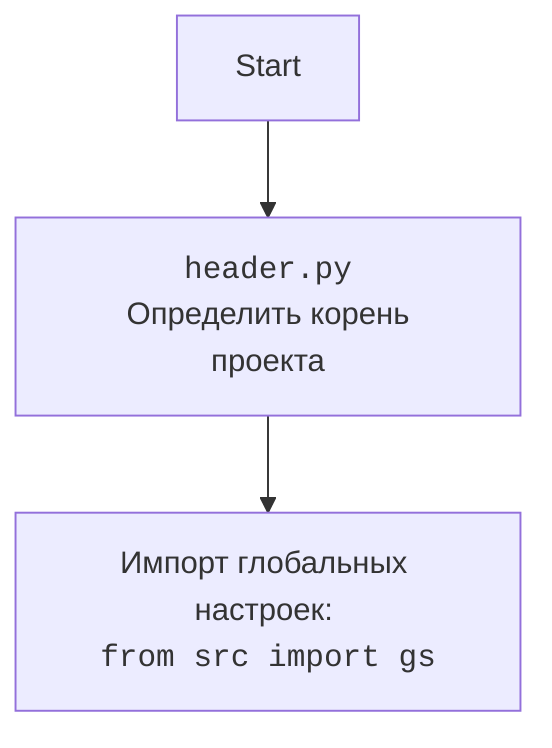

# Проект `hypotez`
# Роль `code explainer`
## АНАЛИЗ:

### 1. <алгоритм>

#### Общий рабочий процесс:

1.  **Инициализация**:
    *   Модуль инициализируется с импортом необходимых библиотек и модулей, включая `header` и `src.gs`.
    *   Определяются глобальные переменные, такие как `_journal`, для отслеживания выполнения сценариев.

2.  **Выполнение сценариев**:
    *   Функция `run_scenario_files` является точкой входа для выполнения одного или нескольких файлов сценариев.
        *   Принимает на вход экземпляр поставщика (`s`) и список путей к файлам сценариев (`scenario_files_list`).
        *   Если `scenario_files_list` является единичным путем, он преобразуется в список.
        *   Для каждого файла сценария вызывается функция `run_scenario_file`.

3.  **Загрузка и выполнение сценария из файла**:
    *   Функция `run_scenario_file` загружает сценарии из указанного файла.
        *   Использует `j_loads` для загрузки содержимого JSON из файла сценария.
        *   Итерируется по каждому сценарию в файле и вызывает функцию `run_scenario` для выполнения.

4.  **Выполнение отдельных сценариев**:
    *   Функция `run_scenario` выполняет отдельные сценарии.
        *   Принимает экземпляр поставщика (`supplier`), словарь сценария (`scenario`) и имя сценария (`scenario_name`).
        *   Инициализирует драйвер и переходит по URL, указанному в сценарии.
        *   Собирает список товаров в категории, используя `s.related_modules.get_list_products_in_category(s)`.
        *   Итерируется по URL-адресам товаров и собирает данные о товарах, используя `s.related_modules.grab_product_page(s)`.
        *   Вставляет полученные данные о товаре, используя функцию `insert_grabbed_data`.

5.  **Сбор и вставка данных**:
    *   Функция `grab_product_page` (из `s.related_modules`) извлекает поля продукта со страницы.
    *   Функция `insert_grabbed_data` подготавливает и вставляет данные о продукте в PrestaShop.

6.  **Вставка данных в PrestaShop**:
    *   Функция `insert_grabbed_data_to_prestashop` вставляет данные о товаре в PrestaShop, используя `PrestaShop().post_product_data`.

7.  **Ведение журнала и обработка ошибок**:
    *   `_journal` используется для отслеживания хода выполнения сценария.
    *   `dump_journal` сохраняет данные журнала в JSON-файл.
    *   В ходе выполнения регистрируются ошибки и исключения с использованием модуля `logger`.

#### Блок-схема:

```mermaid
graph LR
    A[Начало: run_scenario_files] --> B{scenario_files_list?};
    B -- Да --> C{Цикл: Для каждого scenario_file};
    B -- Нет --> E[Ошибка: Недопустимый тип];
    C --> D[run_scenario_file(s, scenario_file)];
    D -- Успех --> F{Запись в журнал: Успешно};
    D -- Ошибка --> G{Запись в журнал: Ошибка};
    F --> H{Следующий scenario_file?};
    G --> H;
    H -- Да --> C;
    H -- Нет --> I[Конец: run_scenario_files];
    I --> J[dump_journal(s, _journal)];
    J --> K[Завершение];
    E --> K;

    subgraph run_scenario_file
        S[Начало: run_scenario_file] --> L[j_loads(scenario_file)];
        L --> M{Цикл: Для каждого scenario в scenarios_dict};
        M --> N[run_scenario(s, scenario, scenario_name)];
        N -- Успех --> O{Логирование: Успешно};
        N -- Ошибка --> P{Логирование: Ошибка};
        O --> Q{Следующий сценарий?};
        P --> Q;
        Q -- Да --> M;
        Q -- Нет --> R[Конец: run_scenario_file];
        L -- Ошибка загрузки --> P;
    end

    subgraph run_scenario
        T[Начало: run_scenario] --> U[d.get_url(scenario['url'])];
        U --> V[list_products_in_category = s.related_modules.get_list_products_in_category(s)];
        V --> W{list_products_in_category?};
        W -- Да --> X{Цикл: Для каждого url в list_products_in_category};
        W -- Нет --> Y[Логирование: Нет товаров];
        X --> Z[d.get_url(url)];
        Z --> AA[grabbed_fields = s.related_modules.grab_product_page(s)];
        AA --> BB[insert_grabbed_data(grabbed_fields)];
        BB --> CC{Следующий URL?};
        CC -- Да --> X;
        CC -- Нет --> DD[Конец: run_scenario];
        Y --> DD;
    end

    subgraph insert_grabbed_data
        EE[Начало: insert_grabbed_data] --> FF[Создание экземпляра Product];
        FF --> GG[insert_grabbed_data_to_prestashop(product)];
        GG -- Успех --> HH[Конец: insert_grabbed_data];
        GG -- Ошибка --> II[Обработка ошибок];
        II --> HH;
    end

    subgraph insert_grabbed_data_to_prestashop
        JJ[Начало: insert_grabbed_data_to_prestashop] --> KK[presta = PrestaShop()];
        KK --> LL[await presta.post_product_data(...)];
        LL -- Успех --> MM[Возврат: True];
        LL -- Ошибка --> NN[Возврат: False];
    end
```

### 2. <mermaid>

```mermaid
flowchart TD
    subgraph executor.py
        A[run_scenario_files] --> B{Path | List[Path] scenario_files_list};
        B -- Path --> C[Преобразование в List[Path]];
        B -- List[Path] --> D{Обход scenario_files_list};
        D --> E[run_scenario_file(s, scenario_file: Path)];
    end

    subgraph run_scenario_file
        F[run_scenario_file] --> G[j_loads(scenario_file: Path) -> scenarios_dict: dict];
        G --> H{Обход scenarios_dict.items()};
        H --> I[run_scenario(s, scenario: dict, scenario_name: str)];
    end

    subgraph run_scenario
        J[run_scenario] --> K[d.get_url(scenario['url']: str)];
        K --> L[list_products_in_category: list = s.related_modules.get_list_products_in_category(s)];
        L --> M{Обход list_products_in_category};
        M --> N[d.get_url(url: str)];
        N --> O[grabbed_fields: ProductFields = s.related_modules.grab_product_page(s)];
        O --> P[insert_grabbed_data(grabbed_fields: ProductFields)];
    end

    subgraph insert_grabbed_data
        Q[insert_grabbed_data] --> R[product: Product = Product(supplier_prefix=s.supplier_prefix, presta_fields_dict=presta_fields_dict)];
        R --> S[insert_grabbed_data_to_prestashop(f: ProductFields)];
    end

    subgraph insert_grabbed_data_to_prestashop
        T[insert_grabbed_data_to_prestashop] --> U[presta: PrestaShop = PrestaShop()];
        U --> V[await presta.post_product_data(...)];
    end

    A --> F
    E --> F
    F --> J
    I --> J
    J --> Q
    P --> Q
    Q --> T
    S --> T
```

**Зависимости:**

*   **`os`**: Предоставляет функции для взаимодействия с операционной системой, например, для работы с путями к файлам.
*   **`sys`**: Предоставляет доступ к некоторым переменным и функциям, взаимодействующим с интерпретатором Python.
*   **`requests`**: Используется для выполнения HTTP-запросов, например, для получения содержимого веб-страниц.
*   **`asyncio`**: Предоставляет инфраструктуру для написания однопоточного параллельного кода с использованием сопрограмм, что позволяет выполнять асинхронные операции.
*   **`time`**: Предоставляет функции для работы со временем, например, для измерения времени выполнения операций.
*   **`tempfile`**: Используется для создания временных файлов и каталогов.
*   **`datetime`**: Предоставляет классы для работы с датой и временем.
*   **`math`**: Предоставляет математические функции, такие как `log` и `prod`.
*   **`pathlib.Path`**: Предоставляет способ представления путей к файлам и каталогам в виде объектов.
*   **`typing`**: Предоставляет инструменты для аннотации типов, такие как `Dict`, `List`, `Optional`.
*   **`json`**: Используется для работы с данными в формате JSON, например, для загрузки и сохранения конфигурационных файлов.
*   **`header`**: Содержит общие настройки и функции, специфичные для проекта `hypotez`.
*   **`src.gs`**: Содержит глобальные настройки и константы для проекта.
*   **`src.utils.printer.pprint`**: Функция для удобной печати данных.
*   **`src.utils.jjson.j_loads` и `src.utils.jjson.j_dumps`**: Функции для загрузки и сохранения JSON-данных с обработкой исключений.
*   **`src.endpoints.prestashop.product_async.PrestaProductAsync` и `src.endpoints.prestashop.product_async.ProductFields`**: Классы для взаимодействия с PrestaShop и представления данных о товарах.
*   **`src.db.ProductCampaignsManager`**: Класс для управления кампаниями товаров в базе данных.
*   **`src.logger.logger.logger`**: Объект логгера для записи сообщений о ходе выполнения и ошибках.
*   **`src.logger.exceptions.ProductFieldException`**: Пользовательское исключение для обработки ошибок, связанных с полями товаров.



### 3. <объяснение>

#### Импорты:

*   `os`: Предоставляет функции для взаимодействия с операционной системой, такие как работа с путями к файлам.
*   `sys`: Предоставляет доступ к переменным и функциям, которые взаимодействуют с интерпретатором Python.
*   `requests`: Используется для выполнения HTTP-запросов (не используется напрямую в предоставленном коде, но может использоваться в связанных модулях).
*   `asyncio`: Предоставляет инструменты для написания асинхронного кода, что позволяет выполнять несколько задач параллельно.
*   `time`: Предоставляет функции для работы со временем.
*   `tempfile`: Используется для создания временных файлов и каталогов.
*   `datetime`: Предоставляет классы для работы с датой и временем.
*   `math`: Предоставляет математические функции, такие как `log` и `prod`.
*   `pathlib.Path`: Предоставляет способ представления путей к файлам и каталогам в виде объектов.
*   `typing`: Предоставляет инструменты для аннотации типов, такие как `Dict`, `List`, `Optional`.
*   `json`: Используется для работы с данными в формате JSON, например, для загрузки и сохранения конфигурационных файлов.
*   `header`: Пользовательский модуль, вероятно, содержащий общие настройки и функции для проекта.
*   `src.gs`: Содержит глобальные настройки и константы для проекта.
*   `src.utils.printer.pprint`: Функция для удобной печати данных.
*   `src.utils.jjson.j_loads` и `src.utils.jjson.j_dumps`: Функции для загрузки и сохранения JSON-данных с обработкой исключений.
*   `src.endpoints.prestashop.product_async.PrestaProductAsync` и `src.endpoints.prestashop.product_async.ProductFields`: Классы для взаимодействия с PrestaShop и представления данных о товарах.
*   `src.db.ProductCampaignsManager`: Класс для управления кампаниями товаров в базе данных.
*   `src.logger.logger.logger`: Объект логгера для записи сообщений о ходе выполнения и ошибках.
*   `src.logger.exceptions.ProductFieldException`: Пользовательское исключение для обработки ошибок, связанных с полями товаров.

#### Функции:

*   `dump_journal(s, journal: dict) -> None`:
    *   Сохраняет данные журнала в файл JSON.
    *   Аргументы:
        *   `s`: Экземпляр поставщика.
        *   `journal`: Словарь, содержащий данные журнала.
    *   Возвращает: `None`.
*   `run_scenario_files(s, scenario_files_list: List[Path] | Path) -> bool`:
    *   Выполняет список файлов сценариев.
    *   Аргументы:
        *   `s`: Экземпляр поставщика.
        *   `scenario_files_list`: Список путей к файлам сценариев или один путь.
    *   Возвращает: `True`, если все сценарии выполнены успешно, `False` в противном случае.
    *   Вызывает `run_scenario_file` для каждого файла сценария.
*   `run_scenario_file(s, scenario_file: Path) -> bool`:
    *   Загружает и выполняет сценарии из файла.
    *   Аргументы:
        *   `s`: Экземпляр поставщика.
        *   `scenario_file`: Путь к файлу сценария.
    *   Возвращает: `True`, если сценарий выполнен успешно, `False` в противном случае.
    *   Использует `j_loads` для загрузки данных JSON из файла.
    *   Вызывает `run_scenario` для каждого сценария в файле.
*   `run_scenarios(s, scenarios: Optional[List[dict] | dict] = None, _journal=None) -> List | dict | bool`:
    *   Выполняет список сценариев (НЕ ФАЙЛОВ).
    *   Аргументы:
        *   `s`: Экземпляр поставщика.
        *   `scenarios`: Список сценариев или один сценарий в виде словаря. По умолчанию `None`.
    *   Возвращает: Результат выполнения сценариев или `False` в случае ошибки.
    *   Вызывает `run_scenario` для каждого сценария.
*   `run_scenario(supplier, scenario: dict, scenario_name: str, _journal=None) -> List | dict | bool`:
    *   Выполняет полученный сценарий.
    *   Аргументы:
        *   `supplier`: Экземпляр поставщика.
        *   `scenario`: Словарь, содержащий детали сценария.
        *   `scenario_name`: Имя сценария.
    *   Возвращает: Результат выполнения сценария.
    *   Получает список товаров в категории, используя `s.related_modules.get_list_products_in_category(s)`.
    *   Итерируется по URL-адресам товаров и собирает данные о товарах, используя `s.related_modules.grab_product_page(s)`.
    *   Вставляет полученные данные о товаре, используя функцию `insert_grabbed_data`.
*   `insert_grabbed_data_to_prestashop(f: ProductFields, coupon_code: Optional[str] = None, start_date: Optional[str] = None, end_date: Optional[str] = None) -> bool`:
    *   Вставляет данные о товаре в PrestaShop.
    *   Аргументы:
        *   `f`: Экземпляр `ProductFields`, содержащий информацию о товаре.
        *   `coupon_code`: Код купона (необязательный).
        *   `start_date`: Дата начала акции (необязательная).
        *   `end_date`: Дата окончания акции (необязательная).
    *   Возвращает: `True`, если вставка прошла успешно, `False` в противном случае.
    *   Использует `PrestaShop().post_product_data` для вставки данных.

#### Переменные:

*   `_journal`: Глобальный словарь для отслеживания выполнения сценариев.
    *   `'scenario_files'`: Словарь для хранения информации о выполненных файлах сценариев.
    *   `'name'`: Временная метка запуска сценария.
*   `s`: Экземпляр поставщика.
*   `scenario_files_list`: Список путей к файлам сценариев.
*   `scenario_file`: Путь к файлу сценария.
*   `scenarios_dict`: Словарь, содержащий сценарии, загруженные из файла.
*   `scenario`: Словарь, содержащий детали сценария.
*   `scenario_name`: Имя сценария.
*   `list_products_in_category`: Список URL-адресов товаров в категории.
*   `url`: URL-адрес товара.
*   `grabbed_fields`: Данные о товаре, извлеченные со страницы.
*   `f`: Экземпляр `ProductFields`, содержащий данные о товаре.
*   `presta_fields_dict`: Словарь, содержащий поля товара для PrestaShop.
*   `assist_fields_dict`: Словарь, содержащий дополнительные поля товара.
*   `product`: Экземпляр класса `Product`, представляющий товар.
*   `presta`: Экземпляр класса `PrestaShop`, используемый для взаимодействия с PrestaShop.

#### Взаимосвязи:

*   `run_scenario_files` вызывает `run_scenario_file` для каждого файла сценария.
*   `run_scenario_file` вызывает `run_scenario` для каждого сценария в файле.
*   `run_scenario` использует методы из `s.related_modules` для сбора данных о товарах.
*   `insert_grabbed_data` использует `PrestaShop().post_product_data` для вставки данных в PrestaShop.
*   `_journal` используется для отслеживания хода выполнения сценариев во всех функциях.

#### Потенциальные ошибки и области для улучшения:

*   Обработка исключений:
    *   В блоках `try...except` следует логировать конкретные типы исключений, чтобы упростить отладку.
    *   Рассмотреть возможность повторных попыток выполнения сценария или отдельных шагов при возникновении временных ошибок.
*   Параллелизм:
    *   Рассмотреть возможность использования `asyncio.gather` для параллельного выполнения нескольких сценариев или шагов в сценарии, чтобы ускорить процесс.
*   Ведение журнала:
    *   Добавить более подробные сообщения журнала, чтобы упростить отслеживание хода выполнения и выявление проблем.
*   Конфигурация:
    *   Вынести параметры конфигурации (например, URL-адреса, учетные данные) в отдельные файлы конфигурации, чтобы упростить их изменение.
*   Повторное использование кода:
    *   Рассмотреть возможность создания общих функций или классов для выполнения повторяющихся задач, таких как сбор данных о товарах и вставка их в PrestaShop.
*   Обработка ошибок:
    *   Реализовать более надежную обработку ошибок, чтобы предотвратить сбой всего процесса при возникновении ошибки в одном сценарии.
*   Проверки:
    *   Добавить проверки для обеспечения того, чтобы данные, извлеченные со страниц товаров, соответствовали ожидаемым форматам и типам.