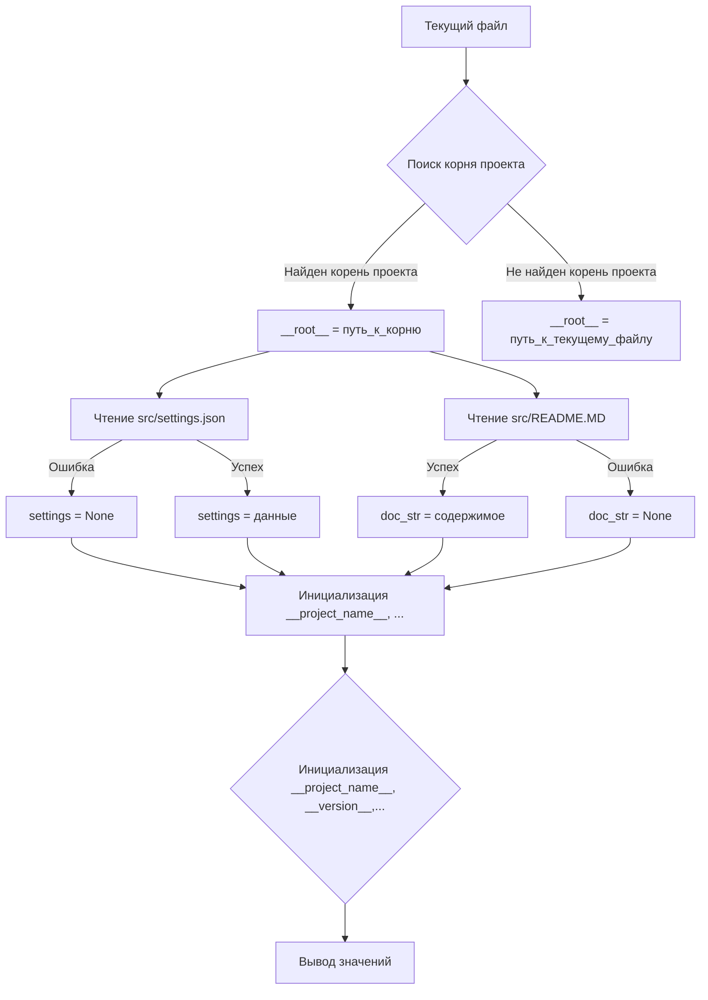

```MD
# <input code>

```python
## \file hypotez/src/scenario/header.py
# -*- coding: utf-8 -*-
#! venv/Scripts/python.exe
#! venv/bin/python/python3.12

"""
.. module: src.scenario 
	:platform: Windows, Unix
	:synopsis:

"""
MODE = 'dev'

import sys
import json
from packaging.version import Version

from pathlib import Path
def set_project_root(marker_files=('pyproject.toml', 'requirements.txt', '.git')) -> Path:
    """
    Finds the root directory of the project starting from the current file's directory,
    searching upwards and stopping at the first directory containing any of the marker files.

    Args:
        marker_files (tuple): Filenames or directory names to identify the project root.
    
    Returns:
        Path: Path to the root directory if found, otherwise the directory where the script is located.
    """
    __root__:Path
    current_path:Path = Path(__file__).resolve().parent
    __root__ = current_path
    for parent in [current_path] + list(current_path.parents):
        if any((parent / marker).exists() for marker in marker_files):
            __root__ = parent
            break
    if __root__ not in sys.path:
        sys.path.insert(0, str(__root__))
    return __root__


# Get the root directory of the project
__root__ = set_project_root()
"""__root__ (Path): Path to the root directory of the project"""

from src import gs

settings:dict = None
try:
    with open(gs.path.root / 'src' / 'settings.json', 'r') as settings_file:
        settings = json.load(settings_file)
except (FileNotFoundError, json.JSONDecodeError):
    ...

doc_str:str = None
try:
    with open(gs.path.root / 'src' / 'README.MD', 'r') as settings_file:
        doc_str = settings_file.read()
except (FileNotFoundError, json.JSONDecodeError):
    ...


__project_name__ = settings.get("project_name", 'hypotez') if settings  else 'hypotez'
__version__: str = settings.get("version", '')  if settings  else ''
__doc__: str = doc_str if doc_str else ''
__details__: str = ''
__author__: str = settings.get("author", '')  if settings  else ''
__copyright__: str = settings.get("copyrihgnt", '')  if settings  else ''
__cofee__: str = settings.get("cofee", "Treat the developer to a cup of coffee for boosting enthusiasm in development: https://boosty.to/hypo69")  if settings  else "Treat the developer to a cup of coffee for boosting enthusiasm in development: https://boosty.to/hypo69"
```

# <algorithm>

**Шаг 1:** Функция `set_project_root`.
   - Принимает кортеж `marker_files` (спискок файлов для определения корня проекта).
   - Находит корневую директорию проекта, начиная с директории текущего файла и идя вверх по дереву директорий.
   - Проверяет существование файлов из `marker_files` в каждой директории.
   - Если найден корень проекта, добавляет его в `sys.path`.
   - Возвращает путь к корневой директории.

**Пример:**

Если текущий файл находится в `hypotez/src/scenario`, а корневой директорий - `hypotez`, и файлы `pyproject.toml`, `requirements.txt`, `.git` есть в `hypotez`, то функция вернет путь к директории `hypotez`.

**Шаг 2:** Получение корня проекта
   - Вызывается функция `set_project_root()`.
   - Результат присваивается переменной `__root__`.

**Шаг 3:** Чтение настроек из `settings.json`
   - Открывает файл `src/settings.json` в корне проекта.
   - Загружает данные из файла в переменную `settings`. Обрабатывает ошибки: `FileNotFoundError`, `json.JSONDecodeError`.

**Пример:** Если файл `src/settings.json` существует и содержит корректные данные, `settings` будет содержать загруженные настройки.


**Шаг 4:** Чтение документации из `README.MD`
   - Открывает файл `src/README.MD` в корне проекта.
   - Считывает содержимое файла в переменную `doc_str`. Обрабатывает ошибки: `FileNotFoundError`, `json.JSONDecodeError`.

**Шаг 5:** Инициализация переменных
   - Используя метод `get()` для безопасного доступа к значениям в словаре `settings`, инициализирует переменные проекта (`__project_name__`, `__version__`, `__author__`, `__copyright__`, `__cofee__`, `__doc__`). Инициализирует значение переменных с помощью значений по умолчанию в случае, если соответствующий ключ не найден.
  - Если `doc_str` пуст, то значение `__doc__` устанавливается в пустую строку.

# <mermaid>



**Объяснение зависимостей:**

* `sys`: стандартная библиотека Python для работы с системными функциями, в частности, с `sys.path`.
* `json`: стандартная библиотека Python для работы с JSON-данными.
* `packaging.version`: пакет для работы с версиями пакетов.
* `pathlib`: стандартная библиотека Python для работы с путями.
* `gs`: предполагается, что это модуль (или класс) из пакета `src`, отвечающий за работу с корнем проекта.  Его роль состоит в обеспечении доступа к корневой папке проекта.

# <explanation>

* **Импорты**:
    * `sys`: позволяет получить и манипулировать переменной `sys.path`.
    * `json`: необходим для работы с файлом настроек `settings.json`.
    * `packaging.version`: используется для работы с версиями пакетов, но в данном конкретном коде не используется.
    * `pathlib`: предоставляет удобный способ работы с файловыми путями.
    * `gs`: импортирует модуль `gs` из пакета `src`, необходимый для работы с корневым каталогом проекта.


* **Классы**: Нет явно определенных классов. Используется класс `Path` из `pathlib` для работы с путями.

* **Функции**:
    * `set_project_root(marker_files=...)`: Находит корень проекта, поднимаясь по иерархии директорий. Аргумент `marker_files` позволяет задать критерии поиска корня. Возвращает `Path` к корневому каталогу.


* **Переменные**:
    * `MODE`: строковая константа, вероятно, для обозначения режима работы (например, 'dev', 'prod').
    * `__root__`: содержит `Path` к корню проекта.
    * `settings`: словарь, содержащий настройки проекта (из `settings.json`).
    * `doc_str`: строка с содержимым файла `README.MD`.
    * `__project_name__`, `__version__`, `__doc__`, `__details__`, `__author__`, `__copyright__`, `__cofee__`: переменные, содержащие информацию о проекте, полученную из `settings.json`.


* **Возможные ошибки или области для улучшений**:
    * **Обработка ошибок:** Обработка `FileNotFoundError` и `json.JSONDecodeError` — хорошая практика, но можно добавить более подробные сообщения об ошибках.
    * **`gs.path.root`**: Непонятно, что представляет собой `gs.path.root`. В идеале, необходимо добавить docstrings к классу или функции для более четкого объяснения.
    * **`marker_files`**: Можно сделать этот параметр необязательным.
    * **Названия переменных:** Можно использовать более информативные имена, например, `project_root` вместо `__root__`.

**Цепочка взаимосвязей**:

Код в `hypotez/src/scenario/header.py` зависит от `src/gs` для определения корня проекта и чтения настроек, а также от файлов `settings.json` и `README.MD` для получения информации о проекте.  Эта информация используется в последующих модулях сценария.