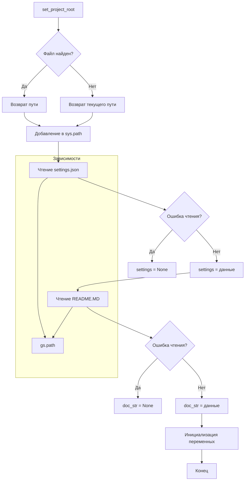

# <input code>

```python
## \file hypotez/src/scenario/header.py
# -*- coding: utf-8 -*-\
#! venv/Scripts/python.exe
#! venv/bin/python/python3.12

"""
.. module: src.scenario 
	:platform: Windows, Unix
	:synopsis:

"""
MODE = 'dev'

import sys
import json
from packaging.version import Version

from pathlib import Path
def set_project_root(marker_files=('pyproject.toml', 'requirements.txt', '.git')) -> Path:
    """
    Finds the root directory of the project starting from the current file's directory,
    searching upwards and stopping at the first directory containing any of the marker files.

    Args:
        marker_files (tuple): Filenames or directory names to identify the project root.
    
    Returns:
        Path: Path to the root directory if found, otherwise the directory where the script is located.
    """
    __root__:Path
    current_path:Path = Path(__file__).resolve().parent
    __root__ = current_path
    for parent in [current_path] + list(current_path.parents):
        if any((parent / marker).exists() for marker in marker_files):
            __root__ = parent
            break
    if __root__ not in sys.path:
        sys.path.insert(0, str(__root__))
    return __root__


# Get the root directory of the project
__root__ = set_project_root()
"""__root__ (Path): Path to the root directory of the project"""

from src import gs

settings:dict = None
try:
    with open(gs.path.root / 'src' /  'settings.json', 'r') as settings_file:
        settings = json.load(settings_file)
except (FileNotFoundError, json.JSONDecodeError):
    ...

doc_str:str = None
try:
    with open(gs.path.root / 'src' /  'README.MD', 'r') as settings_file:
        doc_str = settings_file.read()
except (FileNotFoundError, json.JSONDecodeError):
    ...


__project_name__ = settings.get("project_name", 'hypotez') if settings  else 'hypotez'
__version__: str = settings.get("version", '')  if settings  else ''
__doc__: str = doc_str if doc_str else ''
__details__: str = ''
__author__: str = settings.get("author", '')  if settings  else ''
__copyright__: str = settings.get("copyrihgnt", '')  if settings  else ''
__cofee__: str = settings.get("cofee", "Treat the developer to a cup of coffee for boosting enthusiasm in development: https://boosty.to/hypo69")  if settings  else "Treat the developer to a cup of coffee for boosting enthusiasm in development: https://boosty.to/hypo69"
```

# <algorithm>

**Алгоритм**

1. **Получение корневого каталога проекта (set_project_root):**
   - Начинается с директории текущего файла.
   - Перебирает родительские директории.
   - Проверяет наличие в каждой родительской директории одного из файлов `pyproject.toml`, `requirements.txt`, или `.git`.
   - Если найден, возвращает родительский каталог. Иначе возвращает текущий каталог.

2. **Добавление корневого каталога в `sys.path`:**
   - Проверяет, находится ли найденный корневой каталог в пути `sys.path`.
   - Если нет, добавляет его в начало списка `sys.path`

3. **Чтение настроек из файла `settings.json`:**
   - Пытается открыть файл `settings.json` в подкаталоге `src`.
   - Если файл существует и читается без ошибок, загружает данные JSON в переменную `settings`.
   - Если файл не найден или произошла ошибка при разборе JSON, то ничего не делается

4. **Чтение документации из файла `README.MD`:**
   - Пытается открыть файл `README.MD` в подкаталоге `src`.
   - Если файл существует и читается без ошибок, загружает данные в переменную `doc_str`.
   - Если файл не найден или произошла ошибка при чтении, то ничего не делается

5. **Инициализация переменных проекта:**
   - На основе загруженных данных из `settings.json` или используя значения по умолчанию, инициализируются переменные `__project_name__`, `__version__`, `__doc__`, `__author__`, `__copyright__`, и `__cofee__`.


**Пример данных:**

Если в `pyproject.toml` задан `project_name = "MyProject"` и `version = "1.0.0"`, то соответствующие переменные в коде будут содержать эти значения.

**Перемещение данных:**

- Функция `set_project_root` возвращает путь к корневому каталогу, который сохраняется в переменной `__root__`.
- Данные из `settings.json` и `README.MD` загружаются в соответствующие переменные.
- Эти переменные, содержащие информацию о проекте, используются для инициализации других переменных, например, `__project_name__`.

# <mermaid>



**Объяснение диаграммы:**

Диаграмма отображает последовательность действий скрипта. `set_project_root` находит корневой каталог проекта, добавляет его в `sys.path` и возвращает путь.  Затем происходит чтение файлов `settings.json` и `README.MD`. Если чтение проходит без ошибок,  содержимое этих файлов используется для заполнения переменных, отвечающих за информацию о проекте (`__project_name__`, `__version__`, и т.д.). Если чтение файла `settings.json` или `README.MD` неуспешно, соответствующие переменные принимают значения по умолчанию или `None`.
Ключевые зависимости:
- `gs.path`: Предполагается, что существует модуль или класс `gs` с атрибутом `path`, предоставляющим методы для работы с путями, например, `gs.path.root`.

# <explanation>

**Импорты:**

- `sys`:  Используется для управления путём `sys.path`.
- `json`: Для работы с файлами JSON.
- `packaging.version`: Для работы с версиями пакетов (в данном случае, вероятно, для проверки версии пакета).
- `pathlib`: Для работы с путями файлов и каталогов.
- `src.gs`:  Импортируется модуль или класс `gs`, вероятно, предоставляющий функции для работы с файловой системой (вероятно, для получения пути к корневому каталогу проекта).

**Классы:**

- Нет явных определённых классов. Используются встроенные классы `Path` из `pathlib` и функции для работы с ними

**Функции:**

- `set_project_root(marker_files)`: Находит корневой каталог проекта.
    - `marker_files`: Кортеж с именами файлов/каталогов, используемых для определения корневого каталога (по умолчанию: `pyproject.toml`, `requirements.txt`, `.git`).
    - Возвращает `Path`: Путь к корневому каталогу.
    - Рекурсивно проверяет родительские каталоги, пока не найдёт каталог, содержащий один из указанных маркеров.  Если корневой каталог не найден, возвращает директорию, в которой находится текущий файл.

**Переменные:**

- `MODE`: Переменная со строковым значением, вероятно, для настройки режима работы (например, `dev`, `prod`).
- `__root__`:  Путь к корневому каталогу проекта, полученный из функции `set_project_root`.
- `settings`: Словарь, содержащий настройки проекта, считанные из файла `settings.json`.
- `doc_str`: Строка, содержащая содержимое файла `README.MD`.
- `__project_name__`, `__version__`, `__doc__`, `__details__`, `__author__`, `__copyright__`, `__cofee__`:  Переменные, хранящие информацию о проекте, полученные из файла `settings.json` или значения по умолчанию.

**Возможные ошибки и улучшения:**

- Отсутствие обработки ошибок при чтении файла `settings.json`:  Код обрабатывает `FileNotFoundError` и `json.JSONDecodeError`, но мог бы быть более гибким, например, логировать ошибки.
- Неясная роль модуля `gs`: Без дополнительного контекста сложно понять, как именно он работает и что он представляет собой.  Необходимо определить, что именно делает этот модуль.
- Дополнительная обработка ошибок: Рекомендуется добавить более подробные логирование или исключения для отслеживания ошибок при чтении файла или других операций с файловой системой.


**Цепочка взаимосвязей:**

Файл `header.py` использует `gs`, вероятно, находящийся в одном из подпакетов проекта (`src`) для определения корневого каталога проекта. Он использует данные из `settings.json` и `README.MD` для получения информации о проекте.  Эта информация затем используется другими частями проекта, например, модулями для инициализации или отображения информации о проекте.  Без знания конкретной структуры проекта сложно определить полную цепочку взаимосвязей.