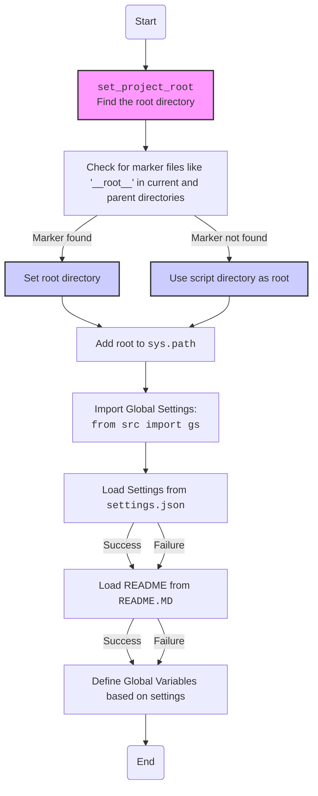
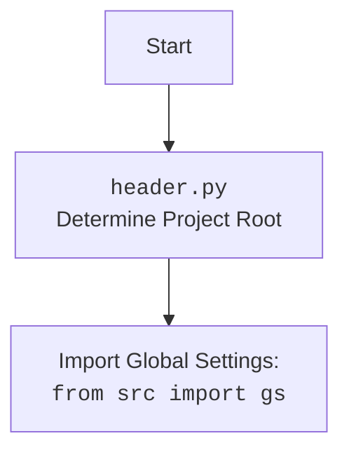

## <алгоритм>

1. **Начало**: Инициализация модуля `header.py`. Устанавливается режим `MODE = 'dev'`.
2.  **Определение `set_project_root`**:
    -   Определяется функция `set_project_root`, которая принимает `marker_files` (кортеж строк) в качестве аргумента. Значение по умолчанию `marker_files = ('__root__',)`.
    -   Определяется текущий путь к файлу `current_path`.
    -   Устанавливается начальное значение корневой директории проекта `__root__` как текущий путь.
    -   Цикл перебирает родительские директории от текущей до самой верхней.
    -   Для каждой родительской директории проверяется наличие любого из `marker_files`.
        -   **Пример**: Если текущая директория `/hypotez/src/scenario` и `marker_files` равен `('__root__',)`, и файл `__root__` есть в `/hypotez`, то `__root__` станет `/hypotez`.
    -   Если найдена директория с одним из `marker_files`, `__root__` обновляется, цикл прерывается.
    -   Добавляем `__root__` в `sys.path`, если его там нет. Это позволяет импортировать модули из корневой директории.
    -   Функция возвращает `__root__`.
3. **Вызов `set_project_root`**:
    -  Вызывается функция `set_project_root()` и результат присваивается глобальной переменной `__root__`. Теперь `__root__` содержит путь к корневой директории проекта.
4. **Импорт `src.gs`**: Импортируется модуль `gs` из пакета `src`.
5. **Загрузка настроек из `settings.json`**:
    -   Пытаемся открыть и прочитать файл `settings.json` (полный путь: `gs.path.root/src/settings.json`).
        -   **Пример**: Если `gs.path.root = /hypotez`, то путь файла будет `/hypotez/src/settings.json`.
    -   Если файл найден и JSON валидный, загруженные данные сохраняются в переменную `settings`.
    -   В случае исключения `FileNotFoundError` или `json.JSONDecodeError`, `settings` остаётся `None`.
6. **Загрузка содержимого из `README.MD`**:
    -   Пытаемся открыть и прочитать файл `README.MD` (полный путь: `gs.path.root/src/README.MD`).
        -   **Пример**: Если `gs.path.root = /hypotez`, то путь файла будет `/hypotez/src/README.MD`.
    -   Если файл найден, его содержимое сохраняется в переменную `doc_str`.
    -   В случае исключения `FileNotFoundError` или `json.JSONDecodeError`, `doc_str` остаётся `None`.
7. **Определение глобальных переменных**:
    -   `__project_name__`: Имя проекта берется из `settings.get("project_name")` или по умолчанию `hypotez`.
    -   `__version__`: Версия проекта берется из `settings.get("version")` или по умолчанию пустая строка.
    -   `__doc__`: Описание проекта берется из `doc_str` или по умолчанию пустая строка.
    -   `__details__`: Детали проекта, по умолчанию пустая строка.
    -   `__author__`: Автор проекта берется из `settings.get("author")` или по умолчанию пустая строка.
    -   `__copyright__`: Копирайт проекта берется из `settings.get("copyrihgnt")` или по умолчанию пустая строка.
    -   `__cofee__`: Сообщение для разработчика, берется из `settings.get("cofee")` или по умолчанию строка приглашения поддержать разработчика.

## <mermaid>

## <объяснение>

**Импорты:**

-   `sys`: Используется для доступа к переменным и функциям, связанным с интерпретатором Python, в частности, для изменения `sys.path`.
-   `json`: Используется для работы с JSON-файлами (загрузка настроек).
-   `packaging.version`: Используется для работы с версиями, в данном коде не используется, но импортируется.
-   `pathlib.Path`: Используется для работы с путями в файловой системе.
-   `src.gs`: Импортируется модуль `gs` из пакета `src`, который, вероятно, содержит глобальные настройки и константы, включая `gs.path.root`, который используется для построения пути к файлам настроек и документации.

**Функции:**

-   `set_project_root(marker_files: tuple = ('__root__',)) -> Path`:
    -   **Аргументы**: `marker_files` (кортеж строк) - имена файлов или директорий, по наличию которых определяется корневая директория проекта. По умолчанию - `('__root__',)`.
    -   **Возвращаемое значение**: `Path` - путь к корневой директории проекта. Если не найдена директория, содержащая `marker_files`, то возвращается путь к директории, в которой находится сам скрипт.
    -   **Назначение**: Функция определяет корневую директорию проекта, проходя вверх по дереву директорий, пока не найдет маркерный файл (например, `__root__`). Это позволяет запускать скрипт из любой поддиректории проекта. Она также добавляет корневую директорию в `sys.path`, чтобы можно было импортировать модули из нее.
    -   **Пример**: Если скрипт расположен в `/project/src/scenario/header.py` и в `/project` существует файл с именем `__root__`, то функция вернет `/project`.

**Переменные:**

-   `MODE`: Устанавливает режим работы приложения, в данном случае `'dev'`.
-   `__root__`: Глобальная переменная `Path`, хранит путь к корневой директории проекта, полученный из функции `set_project_root()`.
-   `settings`: Словарь (`dict`), который хранит данные, загруженные из `settings.json`. Если файл не найден или JSON невалидный, то значение `None`.
-   `doc_str`: Строка (`str`), которая хранит содержимое `README.MD`. Если файл не найден или JSON невалидный, то значение `None`.
-   `__project_name__`: Строка (`str`), имя проекта, взятое из файла настроек или по умолчанию `hypotez`.
-   `__version__`: Строка (`str`), версия проекта, взятая из файла настроек или по умолчанию пустая строка.
-   `__doc__`: Строка (`str`), описание проекта, взятое из файла README.MD или по умолчанию пустая строка.
-   `__details__`: Строка (`str`), детали проекта, по умолчанию пустая строка.
-   `__author__`: Строка (`str`), автор проекта, взятый из файла настроек или по умолчанию пустая строка.
-   `__copyright__`: Строка (`str`), копирайт проекта, взятый из файла настроек или по умолчанию пустая строка.
-   `__cofee__`: Строка (`str`), сообщение для разработчиков, взятое из файла настроек или по умолчанию строка приглашения поддержать разработчика.

**Цепочка взаимосвязей с другими частями проекта:**

-   Модуль `header.py` является ключевым для всего проекта, поскольку он определяет корневую директорию и загружает общие настройки.
-   Он зависит от модуля `src.gs`, который, вероятно, хранит общие пути и настройки.
-   Он также зависит от файлов `settings.json` и `README.MD`, которые используются для получения информации о проекте.
-   Значения переменных, определенных в `header.py`, используются другими модулями проекта.

**Потенциальные ошибки и области для улучшения:**

-   Обработка исключений: Обработка ошибок при загрузке `settings.json` и `README.MD` происходит, но только для случаев `FileNotFoundError` и `json.JSONDecodeError`. Можно добавить больше обработки ошибок.
-   Зависимость от `__root__`:  Модуль `header.py` полагается на файл с именем '__root__', но это может быть не оптимально. Можно добавить возможность настройки этого параметра.
-   Избыточный импорт `from packaging.version import Version` : не используется в коде.

**Дополнительно:**

-   Модуль `header.py` выполняет важную роль в инициализации проекта, определяя корневую директорию и загружая настройки.
-   Используя `sys.path`, модули из корневой директории могут быть импортированы из любого места в проекте, что упрощает его организацию.