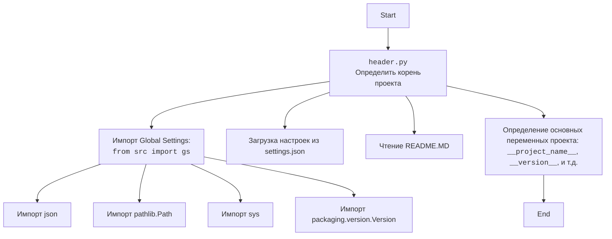

## Анализ кода `hypotez/src/scenario/header.py`

### 1. <алгоритм>

1.  **`set_project_root(marker_files)`**:
    *   Начинает поиск от директории, в которой находится текущий файл.
    *   Перебирает родительские директории.
    *   Проверяет наличие хотя бы одного из `marker_files` (по умолчанию `'__root__'` или `'.git'`) в текущей родительской директории.
        *   Пример: Если `marker_files` содержит `'.git'`, и `.git` найден в одной из родительских директорий, то эта директория считается корневой.
    *   Если маркерный файл найден, устанавливает текущую родительскую директорию как корневую (`__root__`) и прекращает поиск.
    *   Добавляет корневую директорию в `sys.path`, если её там нет.
    *   Возвращает путь к корневой директории.

2.  **Определение `__root__`**:
    *   Вызывает `set_project_root()` для определения корневой директории проекта.
    *   Результат сохраняется в переменной `__root__`.

3.  **Импорт `gs`**:
    *   Импортирует модуль `gs` из пакета `src`.

4.  **Чтение `settings.json`**:
    *   Пытается открыть и прочитать файл `settings.json`, расположенный в директории `src` относительно корневой директории проекта.
    *   Если файл успешно прочитан и распарсен как JSON, его содержимое сохраняется в переменной `settings`.
    *   Если возникает `FileNotFoundError` или `json.JSONDecodeError`, блок `try` переходит к `except`, где ничего не происходит (`...`).

5.  **Чтение `README.MD`**:
    *   Пытается открыть и прочитать файл `README.MD`, расположенный в директории `src` относительно корневой директории проекта.
    *   Если файл успешно прочитан, его содержимое сохраняется в переменной `doc_str`.
    *   Если возникает `FileNotFoundError` или `json.JSONDecodeError`, блок `try` переходит к `except`, где ничего не происходит (`...`).

6.  **Определение глобальных переменных**:
    *   Определяет ряд глобальных переменных (`__project_name__`, `__version__`, `__doc__`, `__details__`, `__author__`, `__copyright__`, `__cofee__`) на основе данных из `settings`, если `settings` не `None`. Если `settings` `None`, устанавливает значения по умолчанию.

### 2. <mermaid>

```mermaid
flowchart TD
    subgraph set_project_root(marker_files)
        A[Начало: Поиск корневой директории] --> B{Найти родительские директории}
        B --> C{Проверить маркерные файлы (".git", "__root__")}
        C -- Да --> D[Установить корневую директорию]
        C -- Нет --> B
        D --> E{Проверить sys.path}
        E -- Нет --> F[Добавить корневую директорию в sys.path]
        E -- Да --> G[Вернуть корневую директорию]
        F --> G
        B --> H[Родительских директорий больше нет]
        H --> G
    end

    subgraph main_script
        Start --> set_project_root
        set_project_root --> Import_gs[Импорт: from src import gs]
        Import_gs --> Load_settings{Загрузка settings.json}
        Load_settings -- Успех --> Load_readme{Загрузка README.MD}
        Load_settings -- Ошибка --> Load_readme
        Load_readme -- Успех --> Set_global_vars[Определение глобальных переменных]
        Load_readme -- Ошибка --> Set_global_vars
        Set_global_vars --> End
    end
```



**Объяснение зависимостей:**

*   **`pathlib`**: Используется для работы с путями к файлам и директориям. Это позволяет удобно манипулировать путями, проверять их существование и т.д.
*   **`sys`**: Используется для работы с системными параметрами и функциями, в частности, для добавления пути к корневой директории проекта в `sys.path`.
*   **`json`**: Используется для чтения данных из JSON файла (`settings.json`).
*   **`packaging.version.Version`**: Используется для работы с версиями пакетов, что может быть полезно для сравнения версий или определения совместимости.

### 3. <объяснение>

**Импорты:**

*   **`sys`**: Предоставляет доступ к некоторым переменным и функциям, взаимодействующим с интерпретатором Python и операционной системой. Здесь используется для изменения `sys.path`.
*   **`json`**: Модуль для работы с данными в формате JSON. Используется для чтения файла `settings.json`.
*   **`packaging.version.Version`**: Класс для представления и сравнения версий программного обеспечения.
*   **`pathlib.Path`**: Класс для представления путей к файлам и директориям. Позволяет выполнять операции с файловой системой в объектно-ориентированном стиле.
*   **`src.gs`**: Импортирует модуль `gs` из пакета `src`. Вероятно, `gs` содержит глобальные настройки или константы проекта.

**Функции:**

*   **`set_project_root(marker_files: tuple[str] = ('__root__', '.git')) -> Path`**:
    *   **Аргументы:**
        *   `marker_files` (tuple): Кортеж с именами файлов или директорий, которые используются для определения корневой директории проекта. По умолчанию `('__root__', '.git')`.
    *   **Возвращаемое значение:**
        *   `Path`: Объект `Path`, представляющий путь к корневой директории проекта.
    *   **Назначение:**
        *   Функция ищет корневую директорию проекта, начиная с директории, в которой находится текущий файл, и двигаясь вверх по дереву директорий.
        *   Поиск прекращается, когда найдена директория, содержащая хотя бы один из файлов или директорий, перечисленных в `marker_files`.
        *   Если корневая директория не найдена, возвращается директория, в которой находится текущий файл.
        *   Функция добавляет корневую директорию в `sys.path`, если ее там еще нет.
    *   **Пример:**
        ```python
        root_path = set_project_root()
        print(root_path) # Выводит путь к корневой директории проекта
        ```

**Переменные:**

*   `__root__`: Объект `Path`, представляющий путь к корневой директории проекта.  Определяется путем вызова функции `set_project_root()`.
*   `settings`: Словарь, содержащий настройки проекта, загруженные из файла `settings.json`. Может быть `None`, если файл не найден или не может быть распарсен.
*   `doc_str`: Строка, содержащая содержимое файла `README.MD`.  Может быть `None`, если файл не найден или не может быть прочитан.
*   `__project_name__`: Название проекта, взятое из `settings.json` или `'hypotez'` по умолчанию.
*   `__version__`: Версия проекта, взятая из `settings.json` или `''` по умолчанию.
*   `__doc__`: Содержимое файла `README.MD`, если он существует, или `''` по умолчанию.
*   `__details__`: Пустая строка.
*   `__author__`: Автор проекта, взятый из `settings.json` или `''` по умолчанию.
*   `__copyright__`: Информация об авторских правах, взятая из `settings.json` или `''` по умолчанию.
*   `__cofee__`: Сообщение, предлагающее поддержать разработчика, взятое из `settings.json` или сообщение по умолчанию.

**Потенциальные ошибки и области для улучшения:**

*   Обработка ошибок при чтении `settings.json` и `README.MD` выполняется с использованием `try...except`, но блок `except` содержит только `...`, что эквивалентно `pass`.  Вместо этого следует логировать ошибку с использованием `logger.error` из `src.logger.logger`, чтобы можно было отслеживать проблемы.
*   Переменные `__details__` всегда присваивается пустая строка. Возможно, это заготовка для будущего функционала, но в текущем виде это выглядит избыточно.

**Взаимосвязи с другими частями проекта:**

*   Данный модуль является частью пакета `src.scenario`. Он определяет глобальные переменные, которые могут использоваться другими модулями в проекте.
*   Модуль `src.gs` (предположительно, "global settings") предоставляет доступ к глобальным настройкам проекта.
*   Файл `settings.json` содержит настройки проекта, которые используются для инициализации глобальных переменных.
*   Файл `README.MD` содержит документацию проекта, которая сохраняется в переменной `__doc__`.