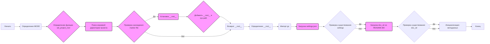

## Анализ кода `hypotez/src/scenario/header.py`

### <алгоритм>
1.  **Инициализация:**
    *   Задается переменная `MODE` (строка, значение по умолчанию `'dev'`).
    *   Импортируются необходимые модули: `sys`, `json`, `Version` из `packaging.version`, `Path` из `pathlib`.
2.  **Определение функции `set_project_root`:**
    *   Принимает кортеж `marker_files` (по умолчанию `('pyproject.toml', 'requirements.txt', '.git')`) для поиска корневой директории проекта.
    *   Находит абсолютный путь к директории текущего файла (`__file__`).
    *   Итерирует по текущей директории и всем её родительским директориям.
    *   Проверяет, существует ли в текущей родительской директории хотя бы один из файлов-маркеров.
    *   Если маркер найден, устанавливает корневую директорию, добавляет ее в `sys.path` для импорта модулей и выходит из цикла.
    *   Если маркер не найден возвращает директорию, где был запущен скрипт
    *   Возвращает путь к корневой директории проекта.
    *  **Пример**: Если скрипт находится в `/home/user/project/src/scenario/` и в `/home/user/project/` есть файл `pyproject.toml`, то функция вернет `Path('/home/user/project/')`
3.  **Определение корневой директории:**
    *   Вызывается функция `set_project_root` для определения корневой директории проекта, результат сохраняется в переменную `__root__`.
4.  **Импорт модуля `gs`:**
    *   Импортируется модуль `gs` из `src`.
5.  **Загрузка настроек из `settings.json`:**
    *   Инициализируется переменная `settings` как `None`.
    *   Пытается открыть и прочитать файл `settings.json` (предположительно, путь к файлу: `{__root__}/src/settings.json`).
    *   Загружает данные из файла `settings.json` в переменную `settings` как словарь.
    *   Обрабатывает исключения `FileNotFoundError` и `json.JSONDecodeError` (ошибки при открытии или декодировании файла JSON), в случае ошибки `settings` остается `None`.
    *   **Пример**: если `settings.json` содержит `{"project_name": "hypotez", "version": "0.1.0"}`, то после выполнения `settings` будет словарем `{'project_name': 'hypotez', 'version': '0.1.0'}`.
6.  **Загрузка документации из `README.MD`:**
     *   Инициализируется переменная `doc_str` как `None`.
    *   Пытается открыть и прочитать файл `README.MD` (предположительно, путь к файлу: `{__root__}/src/README.MD`).
    *   Загружает данные из файла `README.MD` в переменную `doc_str` как строку.
    *   Обрабатывает исключения `FileNotFoundError` и `json.JSONDecodeError` (ошибки при открытии или декодировании файла JSON), в случае ошибки `doc_str` остается `None`.
    *  **Пример**: если в `README.MD` находится строка "This is the project documentation.", то после выполнения переменная `doc_str` будет равна этой строке.
7.  **Инициализация метаданных проекта:**
    *   `__project_name__`: Получает название проекта из словаря `settings` по ключу `"project_name"` или использует значение по умолчанию `'hypotez'`, если `settings` не существует или ключ отсутствует.
    *   `__version__`: Получает версию проекта из словаря `settings` по ключу `"version"` или использует пустую строку `''`, если `settings` не существует или ключ отсутствует.
    *   `__doc__`: Присваивает значение `doc_str`, если `doc_str` не `None`, в противном случае пустую строку.
    *  `__details__`: Присваивает пустую строку
    *   `__author__`: Получает имя автора из словаря `settings` по ключу `"author"` или использует пустую строку `''`, если `settings` не существует или ключ отсутствует.
    *   `__copyright__`: Получает информацию об авторских правах из словаря `settings` по ключу `"copyrihgnt"` или использует пустую строку `''`, если `settings` не существует или ключ отсутствует.
    *   `__cofee__`: Получает строку с информацией для пожертвования на кофе для разработчика из словаря `settings` по ключу `"cofee"` или использует значение по умолчанию "Treat the developer to a cup of coffee for boosting enthusiasm in development: https://boosty.to/hypo69", если `settings` не существует или ключ отсутствует.

### <mermaid>

**Объяснение зависимостей:**

*   **`A` (Начало) -> `B` (Определение MODE):**  Начало выполнения скрипта, инициализация константы MODE.
*   **`B` -> `C` (Определение функции set_project_root):** Объявляется функция `set_project_root` для поиска корневой директории.
*   **`C` -> `D` (Поиск корневой директории проекта):** Вызов функции `set_project_root` с  заданными marker file.
*   **`D` -> `E` (Проверка нахождения marker file):** Проверка наличия файлов маркеров в текущей директории и ее родительских директориях.
*   **`E` -- Да --> `F` (Установка `__root__`):** Если маркер найден, корневая директория сохраняется в переменной `__root__`.
*  **`F` -> `G` (Добавить `__root__` в `sys.path`):**  Добавление корневой директории в `sys.path` для корректной работы импортов.
*   **`G` -> `H` (Возврат `__root__`):** Возврат корневой директории.
*    **`E` -- Нет --> `H` (Возврат `__root__`):** Если маркер не найден, возвращается директория скрипта
*   **`H` -> `I` (Определение `__root__`):** Присвоение переменной `__root__` значения возвращенного функцией `set_project_root`.
*   **`I` -> `J` (Импорт `gs`):** Импорт модуля `gs` из пакета `src`.
*   **`J` -> `K` (Загрузка `settings.json`):** Попытка загрузки данных из файла `settings.json`.
*   **`K` -> `L` (Проверка существования `settings`):** Проверка загрузки `settings` из JSON файла.
*    **`L` -- Да --> `M` (Загрузка `doc_str` из `README.MD`):** Загрузка документации из файла `README.MD`.
*   **`L` -- Нет --> `M` (Загрузка `doc_str` из `README.MD`):** Загрузка документации из файла `README.MD`.
*   **`M` -> `N` (Проверка существования `doc_str`):** Проверка загрузки документации из `README.MD`
*  **`N` -- Да --> `O` (Инициализация метаданных):** Инициализация метаданных проекта из settings и doc_str.
*  **`N` -- Нет --> `O` (Инициализация метаданных):** Инициализация метаданных проекта из settings и doc_str.
*   **`O` -> `P` (Конец):** Конец выполнения скрипта.

### <объяснение>
**Импорты:**

*   `sys`: Модуль `sys` используется для доступа к некоторым переменным и функциям, взаимодействующим с интерпретатором Python. В данном случае, он используется для добавления пути к корневой директории проекта в список путей поиска модулей (`sys.path`). Это позволяет импортировать модули из проекта, даже если они не находятся в стандартных путях.
*   `json`: Модуль `json` используется для работы с данными в формате JSON. В данном случае, он используется для загрузки настроек проекта из файла `settings.json`.
*   `packaging.version.Version`: Модуль `packaging.version.Version` используется для работы с версиями, в данной версии используется как тип для данных, однако не используется по факту.
*   `pathlib.Path`: Модуль `pathlib.Path` используется для работы с файловыми путями в объектно-ориентированном стиле. Это упрощает работу с путями по сравнению с использованием обычных строк.

**Функции:**

*   `set_project_root(marker_files)`:
    *   **Аргументы:**
        *   `marker_files` (tuple): Кортеж, содержащий имена файлов или директорий, которые указывают на корневую директорию проекта. По умолчанию `('pyproject.toml', 'requirements.txt', '.git')`.
    *   **Возвращаемое значение:**
        *   `Path`: Объект `Path`, представляющий путь к корневой директории проекта.
    *   **Назначение:**
        *   Функция определяет корневую директорию проекта путем поиска вверх по дереву директорий от директории, где находится текущий файл, до тех пор, пока не будет найдена директория, содержащая хотя бы один из файлов-маркеров. Найденная директория считается корневой. Также добавляет путь к корневой директории в `sys.path` чтобы при импортах использовался путь проекта, а не путь от куда запущен файл.
    *   **Примеры:**
        *   Если запустить скрипт из `src/scenario` а маркер `pyproject.toml` находится в корне проекта, например `project/pyproject.toml`, то вернет `Path('project/')`.
        *   Если маркер не найден то вернет путь где расположен текущий файл.

**Переменные:**

*   `MODE` (str): Используется для определения режима работы приложения. Значение по умолчанию `'dev'`.
*   `__root__` (Path): Переменная хранит путь к корневой директории проекта, который определяется с помощью функции `set_project_root`.
*   `settings` (dict): Словарь, содержащий настройки проекта, загруженные из файла `settings.json`. Если файл не найден или не может быть декодирован, то остается `None`.
*   `doc_str` (str): Переменная хранит строку с документацией проекта, загруженной из файла `README.MD`. Если файл не найден или не может быть декодирован, то остается `None`.
*   `__project_name__` (str): Название проекта, взятое из `settings` или, если `settings` нет, по умолчанию `'hypotez'`.
*   `__version__` (str): Версия проекта, взятая из `settings` или, если `settings` нет, по умолчанию пустая строка `''`.
*    `__doc__` (str): Строка документации проекта, взятая из `doc_str`, либо, если `doc_str` нет, по умолчанию пустая строка `''`.
*   `__details__` (str): Строка деталей проекта, по умолчанию `''`.
*   `__author__` (str): Имя автора проекта, взятое из `settings` или, если `settings` нет, по умолчанию пустая строка `''`.
*   `__copyright__` (str): Информация об авторских правах, взятая из `settings` или, если `settings` нет, по умолчанию пустая строка `''`.
*   `__cofee__` (str): Строка с призывом поддержать разработчика, взятая из `settings` или, если `settings` нет, по умолчанию `Treat the developer to a cup of coffee for boosting enthusiasm in development: https://boosty.to/hypo69`.

**Взаимосвязь с другими частями проекта:**

*   Модуль `gs` из `src` используется для получения путей к файлам относительно корневой директории.
*   Файл `settings.json` используется для хранения конфигурационных данных проекта.
*   Файл `README.MD` используется для хранения документации проекта.
*   Функция `set_project_root` необходима для правильной работы импортов в проекте, обеспечивая использование относительных путей от корневой директории.

**Потенциальные ошибки и области для улучшения:**

*   Отсутствует обработка ошибок при отсутствии необходимых ключей в `settings`, при отсутствии ключа в `settings` по умолчанию ставится пустая строка или дефолтное значение, что может вызвать `KeyError` при дальнейшей работе, лучше предусмотреть проверку существования ключей и обработку ошибок.
*  `json.JSONDecodeError` обрабатывается в блоке `except`, однако не обрабатывается ошибка чтения файла `FileNotFoundError` можно добавить логирование ошибок для отслеживания проблем.
*  Отсутсвует тип данных для `settings` и `doc_str`, лучше добавить типизацию переменных.
* Не используется переменная `Version` из `packaging.version`, следует убрать импорт либо использовать его в дальнейшем.
*   При работе с файлами может понадобиться дополнительная обработка ошибок, например, проверка прав доступа.
*   Стоит добавить проверку, что маркеры (`marker_files`) заданы корректно.

**Цепочка взаимосвязей:**

1.  Скрипт `header.py` находит корневую директорию проекта с помощью функции `set_project_root`, которая использует модули `pathlib` и `sys`.
2.  Загружает настройки из файла `settings.json` с использованием модуля `json` и модуля `gs` для путей.
3.  Загружает документацию из файла `README.MD`.
4.  Инициализирует метаданные проекта (`__project_name__`, `__version__`, `__doc__`, `__author__`, `__copyright__`, `__cofee__`) на основе загруженных настроек и документации.
5.  Другие модули проекта могут использовать эти метаданные и настройки.