## АНАЛИЗ JSON ФАЙЛА: `bug.json`

### 1. <алгоритм>

1.  **Начало**: Чтение JSON-файла `bug.json`.
2.  **Разбор основных свойств**:
    *   Определение `supplier` как "bug".
    *   Определение `supplier_prefix` как "BUG-".
    *   Определение `start_url` как "https://www.bug.co.il/".
    *   Определение `if_list` как "first".
    *   Определение `use_mouse` как `false`.
    *   Определение `mandatory` как `true`.
    *   Определение `price_rule` как "1".
    *   Определение `num_items_4_flush` как 300.
3.  **Обработка `scenario_files`**:
    *   `scenario_files` представляет собой массив массивов строк.
    *   Каждый внутренний массив представляет собой группу файлов сценариев для обработки.
    *   Пример:
        *   Первый массив: `["cdata_categories_aio_asus.json", "cdata_categories_aio_dell.json", "cdata_categories_aio_hp.json"]`
            *   Представляет сценарии для категорий "всё в одном" (aio) от разных производителей.
        *   Второй массив: `["cdata_categories_desktops.json", "cdata_categories_gaming_desktops.json", "cdata_categories_workstatios.json"]`
            *   Представляет сценарии для категорий "десктопы", "игровые десктопы" и "рабочие станции".
        *   И т.д.
4.  **Обработка `last_runned_scenario`**:
    *   `last_runned_scenario` - это строка, представляющая последний запущенный сценарий (изначально пустая).

```mermaid
flowchart TD
    Start[Начало: Чтение bug.json] --> ParseProperties[Парсинг основных свойств: supplier, supplier_prefix, start_url, if_list, use_mouse, mandatory, price_rule, num_items_4_flush];
    ParseProperties --> ProcessScenarioFiles[Обработка массива scenario_files]
    ProcessScenarioFiles --> LoopStart[Начало цикла по массивам в scenario_files];
     LoopStart -->  ProcessScenarioGroup[Обработка группы файлов сценариев в текущем массиве]
     ProcessScenarioGroup --> LoopEnd[Конец цикла по массивам в scenario_files]
     LoopEnd -->  LastRunnedScenario[Обработка last_runned_scenario]
    LastRunnedScenario --> End[Конец]

    subgraph "Массив scenario_files"
    ProcessScenarioGroup -->  ScenarioFile1[cdata_categories_aio_asus.json]
     ProcessScenarioGroup -->  ScenarioFile2[cdata_categories_aio_dell.json]
      ProcessScenarioGroup -->  ScenarioFile3[cdata_categories_aio_hp.json]
       ProcessScenarioGroup -->  Dots1[ ... ]
    end
     subgraph "Массив scenario_files"
    ProcessScenarioGroup -->  ScenarioFile4[cdata_categories_desktops.json]
    ProcessScenarioGroup -->  ScenarioFile5[cdata_categories_gaming_desktops.json]
    ProcessScenarioGroup -->  ScenarioFile6[cdata_categories_workstatios.json]
     ProcessScenarioGroup --> Dots2[ ... ]
   end
   subgraph "Массив scenario_files"
     ProcessScenarioGroup -->  ScenarioFile7[cdata_categories_laptops_asus.json]
    ProcessScenarioGroup -->  ScenarioFile8[cdata_categories_laptops_dell.json]
      ProcessScenarioGroup -->  ScenarioFile9[cdata_categories_laptops_hp.json]
     ProcessScenarioGroup -->  ScenarioFile10[cdata_categories_gaming_laptops_asus.json]
    ProcessScenarioGroup -->  ScenarioFile11[cdata_categories_gaming_laptops_dell.json]
     ProcessScenarioGroup --> ScenarioFile12[cdata_categories_gaming_laptops_hp.json]
      ProcessScenarioGroup --> Dots3[ ... ]
   end
    subgraph "Массив scenario_files"
     ProcessScenarioGroup -->  ScenarioFile13[cdata_categories_monitors_apple.json]
      ProcessScenarioGroup -->  ScenarioFile14[cdata_categories_monitors_dell.json]
     ProcessScenarioGroup --> ScenarioFile15[cdata_categories_monitors_hp.json]
      ProcessScenarioGroup -->  Dots4[ ... ]
    end
    subgraph "Массив scenario_files"
     ProcessScenarioGroup -->  ScenarioFile16[cdata_categories_keyboards.json]
        ProcessScenarioGroup --> Dots5[ ... ]
   end
   subgraph "Массив scenario_files"
        ProcessScenarioGroup -->  ScenarioFile17[cdata_categories_printers.json]
      ProcessScenarioGroup --> Dots6[ ... ]
   end
     subgraph "Массив scenario_files"
         ProcessScenarioGroup -->  ScenarioFile18[cdata_categories_webcams.json]
       ProcessScenarioGroup --> Dots7[ ... ]
    end
    subgraph "Массив scenario_files"
      ProcessScenarioGroup -->   ScenarioFile19[cdata_categories_video.json]
      ProcessScenarioGroup --> Dots8[ ... ]
   end
   subgraph "Массив scenario_files"
       ProcessScenarioGroup --> ScenarioFile20[cdata_categories_ups.json]
     ProcessScenarioGroup --> Dots9[ ... ]
   end

```

### 2. <mermaid>

**Описание диаграммы:**

Диаграмма представляет собой блок-схему, описывающую процесс обработки JSON-файла `bug.json`. 

1.  **Start**: Начало процесса - чтение файла `bug.json`.
2.  **ParseProperties**: Разбор основных свойств JSON объекта, таких как `supplier`, `supplier_prefix`, `start_url`, `if_list`, `use_mouse`, `mandatory`, `price_rule`, и `num_items_4_flush`.
3.  **ProcessScenarioFiles**: Обработка массива массивов `scenario_files`.
4.  **LoopStart**: Начало цикла по массивам внутри `scenario_files`.
5.  **ProcessScenarioGroup**: Обработка группы файлов сценариев в текущем массиве.
6.  **ScenarioFile1 - ScenarioFile20**: Представляют собой примеры конкретных файлов сценариев, которые будут обрабатываться.
7. **Dots1 - Dots9** : представляет собой многоточие, указывающее на то, что в массиве могут быть и другие файлы.
8. **LoopEnd**: Конец цикла по массивам внутри `scenario_files`.
9. **LastRunnedScenario**: Обработка свойства `last_runned_scenario`.
10. **End**: Конец процесса.

### 3. <объяснение>

**Общее описание:**

Файл `bug.json` представляет собой конфигурационный файл, содержащий настройки для веб-скрейпера, предназначенного для сбора данных с сайта `bug.co.il`. Файл определяет поставщика данных (`supplier`), префикс для идентификаторов (`supplier_prefix`), начальный URL (`start_url`), а также список файлов сценариев (`scenario_files`), которые определяют, как именно обрабатывать различные категории товаров.

**Поля файла:**

*   **`supplier`**: Строка, определяющая поставщика данных, в данном случае "bug".
*   **`supplier_prefix`**: Строка, используемая как префикс для идентификаторов товаров, в данном случае "BUG-".
*   **`start_url`**: Строка, представляющая URL начальной страницы для сбора данных.
*   **`if_list`**: Строка, определяющая поведение при работе со списками (в данном случае "first").
*   **`use_mouse`**: Логическое значение, указывающее, использовать ли мышь при взаимодействии со страницей (в данном случае `false`).
*   **`mandatory`**: Логическое значение, указывающее, является ли обязательным выполнение сценария (в данном случае `true`).
*   **`price_rule`**: Строка, определяющая правило для извлечения цены (в данном случае "1").
*   **`num_items_4_flush`**: Целое число, определяющее количество элементов для "сброса" (вероятно, для пакетной обработки данных), в данном случае 300.
*   **`scenario_files`**: Массив массивов строк. Каждый внутренний массив содержит имена файлов сценариев JSON, которые определяют, как обрабатывать конкретную категорию товара.
    *   Например, `["cdata_categories_aio_asus.json", "cdata_categories_aio_dell.json", "cdata_categories_aio_hp.json"]` - сценарии для категории "all-in-one" (aio) от производителей Asus, Dell и HP.
    *   Другие массивы содержат сценарии для различных категорий, таких как ноутбуки, мониторы, клавиатуры и т.д.
*   **`last_runned_scenario`**: Строка, содержащая имя последнего выполненного сценария (в начале пустая). Поле предназначено для контроля состояния выполнения сценариев.

**Взаимосвязь с другими частями проекта:**

Файл `bug.json` является частью системы сбора данных (веб-скрейпера) и используется как конфигурация для управления процессом. Сценарии, описанные в файлах, перечисленных в `scenario_files`, вероятно, находятся в той же директории (`hypotez/src/scenario/json`) или в поддиректории, и будут использованы для получения необходимых данных.

**Возможные улучшения и потенциальные проблемы:**

*   **Сложная структура `scenario_files`**: Двумерный массив может быть не очень удобен для чтения и сопровождения. Можно рассмотреть возможность использования словаря (или более сложной структуры), чтобы добавить больше контекста к каждой группе файлов.
*   **Отсутствие подробностей о файлах сценариев**: Из файла не ясно, какую структуру имеют файлы сценариев (например, `cdata_categories_aio_asus.json`). Потребуется анализ этих файлов для полного понимания процесса сбора данных.
*   **Жестко заданные имена файлов**: Имена файлов сценариев жестко прописаны в конфигурации, что может затруднить добавление или изменение сценариев. Можно было бы использовать более гибкую систему конфигурации.
*   **Значение `if_list`**: Необходимо понимание значения `if_list`  и  его влияние на работу скриптов.

**Заключение:**
Файл `bug.json` играет важную роль в настройке процесса веб-скрейпинга для магазина `bug.co.il`, предоставляя параметры для сбора данных по различным категориям товаров. Он использует массив `scenario_files` для разделения обработки на группы, что позволяет организовывать и поддерживать разные сценарии. Однако, для полного понимания системы необходимо также проанализировать структуру файлов сценариев, на которые он ссылается.