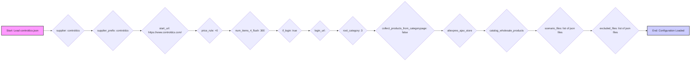

## <алгоритм>

**Описание рабочего процесса:**

1.  **Начало**: Загрузка конфигурационного файла `controldcs.json`. Этот файл содержит параметры для сбора данных с веб-сайта `controldcs.com` и AliExpress, настройки обработки данных и сценарии для сбора информации.

2.  **Инициализация**: 
    *   Устанавливается `supplier` ("controldcs") и `supplier_prefix` ("controldcs").
    *   Определяется `start_url` (https://www.controldcs.com/).
    *   Задаются правила для цен (`price_rule`: "+0").
    *   Устанавливается количество элементов для сброса (`num_items_4_flush`: 300).
    *   Указывается необходимость авторизации (`if_login`: true), хотя `login_url` пуст, что может потребовать дальнейшего уточнения.
    *   Определяется корневая категория (`root_category`: 3).
    *   Указывается, что товары не собираются со страниц категорий (`collect_products_from_categorypage`: false).

3.  **URL-адреса**: 
    *   Устанавливается URL для AJAX-запросов AliExpress (`aliexpres_ajax_store`).
    *   Определяются URL-адреса для каталогов товаров оптом по различным языковым версиям AliExpress (`catalog_wholesale-products`).

4.  **Сценарии**:
    *   Указываются файлы сценариев для сбора данных (`scenario_files`), например, `aliexpress_stores_elctronic_toys.json` и `aliexpress_stores_baby_clothing.json`.

5.  **Исключения**:
    *   Определяются файлы сценариев, которые следует исключить из обработки (`excluded`).  Например `aliexpress_stores_battery.json` и др.

6.  **Завершение**: На основе данных конфигурации будут выполняться сценарии сбора данных, указанные в `scenario_files`, и игнорируются сценарии в `excluded`.

**Примеры**:

*   `"supplier": "controldcs"`: Определяет поставщика данных.
*   `"start_url": "https://www.controldcs.com/"`: Указывает начальный URL сайта для сбора данных.
*   `"price_rule": "+0"`: Указывает правило для корректировки цен (в данном случае без изменений).
*   `"num_items_4_flush": 300`: Определяет количество товаров, после обработки которых данные будут сохранены.
*   `"if_login": true`: Указывает, что для сбора данных может потребоваться авторизация.
*   `"catalog_wholesale-products"`: Словарь, содержащий URL-адреса для оптовых категорий товаров на разных языках.

## <mermaid>

**Анализ зависимостей (mermaid):**

*   Диаграмма показывает последовательное чтение и инициализацию параметров конфигурации из `controldcs.json`.
*   Все параметры из JSON файла используются для настройки сбора и обработки данных.
*   Переменные, используемые в диаграмме, имеют понятные и описательные имена, которые отражают их назначение. Например, `start_url`, `price_rule`, `num_items_4_flush` и т. д.
*   Диаграмма наглядно демонстрирует поток данных, начиная с загрузки файла и заканчивая настройкой всех параметров.
*   `Start` и `End` блоки обозначают начало и конец процесса инициализации.

## <объяснение>

### Импорты

В данном коде нет явных импортов, так как это JSON-файл. Однако, этот файл будет использоваться другими компонентами системы, которые могут иметь свои собственные импорты. При обработке этого файла, компоненты могут использовать `src.gs` для доступа к глобальным настройкам, а также другие необходимые модули.

### Классы

В этом JSON-файле нет классов, но он предоставляет конфигурационные данные для классов, которые будут использоваться при обработке данных.

### Функции

В этом JSON-файле нет функций. Этот файл предоставляет конфигурационные данные для функций, которые будут использоваться при сборе данных.

### Переменные

Файл содержит ряд переменных, которые определяют настройки процесса сбора данных.

*   **`supplier`**: `str`, определяет поставщика данных (например, "controldcs").
*   **`supplier_prefix`**: `str`, префикс поставщика.
*   **`start_url`**: `str`, начальный URL для сбора данных.
*   **`wholesale_products_url`**: `str`, URL-адрес оптовых товаров, но в данном случае пуст.
*   **`price_rule`**: `str`, правило для изменения цены.
*   **`num_items_4_flush`**: `int`, количество элементов для сброса.
*   **`if_login`**: `bool`, указывает, нужна ли авторизация.
*   **`login_url`**: `str`, URL-адрес страницы авторизации, в данном случае пустой.
*   **`root_category`**: `int`, корневая категория.
*   **`collect_products_from_categorypage`**: `bool`, определяет, собирать ли товары со страниц категорий.
*   **`aliexpres_ajax_store`**: `str`, URL для AJAX-запросов AliExpress.
*   **`catalog_wholesale-products`**: `dict`, словарь с URL-адресами для каталогов оптовых товаров на разных языках.
*   **`scenario_files`**: `list`, список файлов сценариев для сбора данных.
*   **`excluded`**: `list`, список файлов сценариев, которые нужно исключить из обработки.

### Потенциальные ошибки и области для улучшения

1.  **`login_url`**:  Поле `login_url` пустое, хотя `if_login` установлено в `true`, что может привести к проблемам при попытке авторизации.
2.  **`wholesale_products_url`**: Аналогично, `wholesale_products_url` пустой, но возможно, это не является ошибкой, а значит, что информация берется из других источников.
3.  **Контроль URL**:  Необходимо добавить проверки на корректность URL-адресов.
4.  **Отсутствие схемы**:  Отсутствует схема JSON для валидации, что может привести к ошибкам при парсинге.
5.  **Необработанные исключения**:  Не определены явные механизмы обработки исключений при чтении и использовании этих настроек.

### Цепочка взаимосвязей с другими частями проекта

1.  Этот файл (`controldcs.json`) будет загружен и проанализирован кодом, который занимается сбором данных.
2.  Параметры из этого файла будут использованы для настройки веб-скрапера, который будет обращаться к сайтам `controldcs.com` и AliExpress.
3.  `scenario_files` будут использоваться для определения конкретных шагов сбора данных для разных видов товаров.
4.  Данные, собранные согласно этому конфигу, будут обрабатываться и сохраняться в базу данных проекта.
5.  Исключения в списке `excluded` гарантируют, что не будут обрабатываться лишние данные.

**Итого:** JSON файл `controldcs.json` играет ключевую роль в конфигурации системы сбора данных, предоставляя основные настройки и сценарии для ее работы. Корректная настройка этого файла гарантирует правильную работу всего процесса.