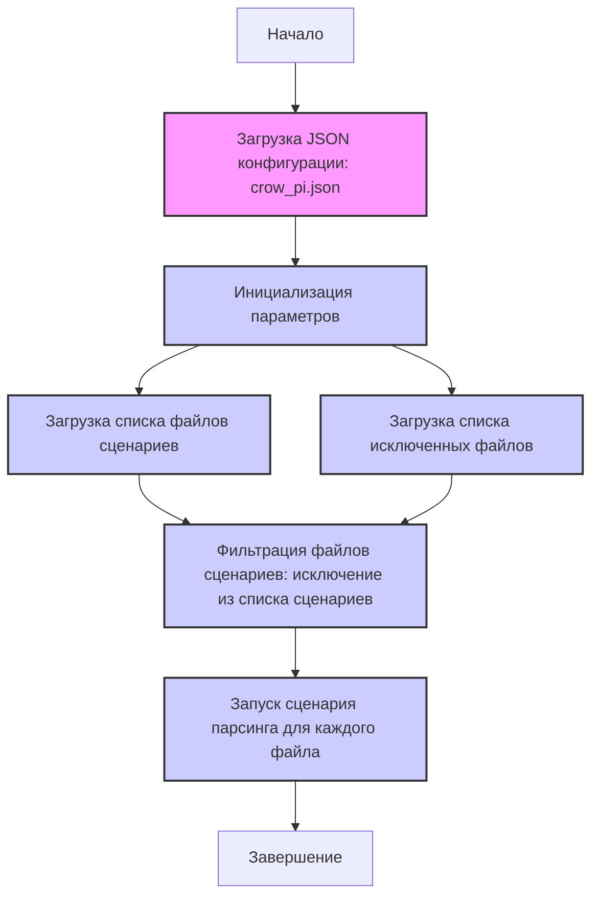

## <алгоритм>

1.  **Начало**: Загрузка JSON-файла конфигурации.
    *   _Пример_: Загружается файл `crow_pi.json`, содержащий настройки для парсинга сайта crow_pi.cc.

2.  **Инициализация**: Чтение основных параметров из JSON.
    *   _Пример_:
        *   `supplier` устанавливается в "crow_pi".
        *   `supplier_prefix` устанавливается в "crow_pi".
        *   `start_url` устанавливается в "https://www.crowpi.cc/".
        *   `price_rule` устанавливается в "+0".
        *   `if_login` устанавливается в `false`.
        *   `collect_products_from_categorypage` устанавливается в `false`.
        *   `root_category` устанавливается в `3`.
        *   `parcing method [webdriver|api]` устанавливается в `"web"`.
        *   `about method web scrapping [webdriver|api]` устанавливается в `"Если я работаю через API мне не нужен webdriver"`.

3.  **Чтение списка сценариев**: Загрузка списка файлов сценариев из `scenario_files`.
    *   _Пример_: `scenario_files` содержит [".json", "ksp_categories_wathces_apple.json"].

4.  **Чтение списка исключений**: Загрузка списка исключенных файлов сценариев из `excluded`.
    *   _Пример_: `excluded` содержит список файлов `ksp_categories_...json`, которые не нужно обрабатывать.

5.  **Обработка сценариев**: Для каждого файла в `scenario_files`, который не входит в `excluded`, запускается соответствующий сценарий парсинга. (Этот шаг подразумевается, но не выполняется в самом JSON).
    *   _Пример_: Файл "ksp_categories_wathces_apple.json" будет использован для парсинга категории часов Apple, так как ".json" это не файл сценария, а расширение которое говорит о формате файла.

6.  **Завершение**: Обновление `last_runned_scenario` после запуска сценария (это также подразумевается и не выполняется в JSON).

## <mermaid>

**Зависимости `mermaid`:**

*   Диаграмма показывает поток управления и зависимостей между этапами обработки конфигурации.
*   Начало (`Start`), загрузка файла (`LoadConfig`), инициализация параметров (`InitParams`), загрузка файлов сценариев (`LoadScenarioFiles`), загрузка исключенных файлов (`LoadExcludedFiles`), фильтрация файлов сценариев (`FilterScenarioFiles`), обработка сценариев (`ProcessScenarios`), и завершение (`Finish`) последовательно связаны друг с другом.
*   Диаграмма показывает, как конфигурационные данные управляют процессом парсинга, начиная с загрузки JSON-файла и заканчивая запуском сценариев.

## <объяснение>

**Импорты:**

*   В данном коде импорты отсутствуют. Это связано с тем, что представленный код является JSON-файлом конфигурации, а не исполняемым кодом на Python. Этот JSON-файл, вероятно, используется для настройки параметров скрипта парсинга.

**Классы:**

*   Классы в данном файле отсутствуют, так как это файл конфигурации. Однако, в Python-скриптах, которые могут использовать этот JSON, будут классы для реализации логики парсинга.

**Функции:**

*   Функции в данном файле также отсутствуют. Функции будут в Python-скриптах, использующих этот файл.
    *   _Пример_ : Функции могут включать:
        *   `load_config(file_path)`: Загружает JSON-файл конфигурации.
        *   `process_scenario(scenario_file)`: Выполняет парсинг в соответствии с файлом сценария.
        *   `filter_scenarios(scenario_files, excluded_files)`: Фильтрует список файлов сценариев.

**Переменные:**

*   `supplier`: Строка, указывающая поставщика ("crow_pi").
*   `supplier_prefix`: Строка, префикс для идентификации поставщика ("crow_pi").
*   `start_url`: Строка, URL стартовой страницы поставщика ("https://www.crowpi.cc/").
*   `price_rule`: Строка, правило для цены ("+0").
*   `if_login`: Логическое значение, флаг необходимости авторизации (false).
*   `collect_products_from_categorypage`: Логическое значение, флаг сбора продуктов со страницы категории (false).
*  `root_category`: целое число,  используется для обозначения корневой категории (3).
*   `parcing method [webdriver|api]`: Строка, метод парсинга ("web").
*   `about method web scrapping [webdriver|api]`: Строка, описание метода парсинга.
*   `scenario_files`: Список строк, содержащий имена файлов сценариев [".json", "ksp_categories_wathces_apple.json"].
*   `excluded`: Список строк, содержащий имена файлов сценариев, которые нужно исключить из обработки.
*   `last_runned_scenario`: Строка, хранящая имя последнего запущенного сценария (изначально пустая).

**Потенциальные ошибки и области для улучшения:**

1.  **Отсутствие валидации**: Отсутствует валидация JSON-данных, что может привести к ошибкам при использовании.
2.  **Жестко закодированные значения**: Некоторые параметры, такие как `price_rule` и `parcing method`, заданы как строковые литералы. В будущем может потребоваться гибкость.
3.  **Неточное описание**: Описание метода парсинга (`about method web scrapping`) является строкой, а не логическим флагом.
4. **Дублирование исключений** : В `excluded` есть дублирование файла `"ksp_categories_phones_philips.json"`

**Взаимосвязь с другими частями проекта:**

*   Данный JSON-файл является частью системы парсинга. Python-скрипты, использующие этот файл, будут выполнять следующие действия:
    1.  Загрузить JSON-файл.
    2.  Прочитать параметры (например, `start_url`, `scenario_files`, `excluded`).
    3.  Профильтровать файлы сценариев.
    4.  Выполнить парсинг веб-страниц для каждого сценария.
    5.  Сохранить данные.
*   JSON-файл определяет, какие веб-страницы и категории необходимо обрабатывать.
*   Взаимосвязь с `header.py` в данном контексте не требуется, так как JSON не импортирует `header`.

**Заключение:**

Этот JSON-файл представляет собой конфигурацию для парсинга веб-сайта crow_pi.cc. Он определяет общие параметры и список файлов сценариев, которые будут использоваться для сбора данных о продуктах. Файл используется как входные данные для системы парсинга, которая написана на Python, и управляет процессом парсинга через конфигурацию.