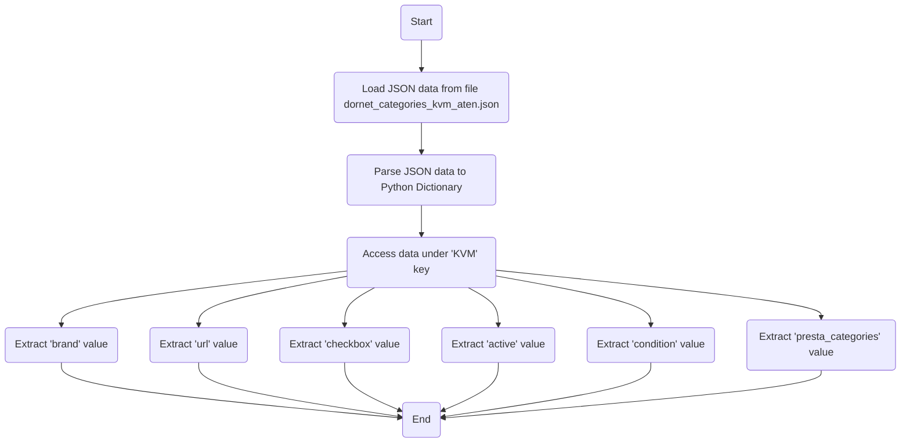

## Анализ JSON файла `dornet_categories_kvm_aten.json`

### 1. <алгоритм>

**Блок-схема:**

```mermaid
flowchart TD
    Start[Начало] --> LoadData[Загрузка JSON файла]
    LoadData --> ParseData[Разбор JSON в структуру данных]
    ParseData --> ProcessKVM[Обработка данных KVM]
    ProcessKVM --> ExtractBrand[Извлечение бренда ("ATEN")]
    ProcessKVM --> ExtractUrl[Извлечение URL ("https://www.cable.co.il/items.asp?Cat2Cat1ID=107&Cat2ID=301")]
    ProcessKVM --> ExtractCheckbox[Извлечение состояния checkbox (false)]
    ProcessKVM --> ExtractActive[Извлечение состояния активности (true)]
    ProcessKVM --> ExtractCondition[Извлечение состояния condition ("new")]
    ProcessKVM --> ExtractPrestaCategories[Извлечение presta_categories ("536")]
    ExtractBrand --> End[Конец]
    ExtractUrl --> End
    ExtractCheckbox --> End
    ExtractActive --> End
    ExtractCondition --> End
     ExtractPrestaCategories --> End
```

**Примеры:**

*   **LoadData**: Загружает строку из файла `dornet_categories_kvm_aten.json`.
*   **ParseData**: Преобразует JSON-строку в словарь Python, например: `{"KVM": {"brand": "ATEN", "url": "...", "checkbox": false, "active": true, "condition":"new","presta_categories": "536"}}`.
*  **ProcessKVM**: Получает доступ к  словаря KVM, например: `{"brand": "ATEN", "url": "...", "checkbox": false, "active": true, "condition":"new", "presta_categories": "536"}`.
*   **ExtractBrand**: Извлекает значение `"ATEN"` из ключа `brand`.
*   **ExtractUrl**: Извлекает значение `"https://www.cable.co.il/items.asp?Cat2Cat1ID=107&Cat2ID=301"` из ключа `url`.
*   **ExtractCheckbox**: Извлекает значение `false` из ключа `checkbox`.
*   **ExtractActive**: Извлекает значение `true` из ключа `active`.
*   **ExtractCondition**: Извлекает значение `"new"` из ключа `condition`.
*  **ExtractPrestaCategories**: Извлекает значение `"536"` из ключа `presta_categories`.

### 2. <mermaid>



**Объяснение:**

Диаграмма `mermaid` описывает процесс разбора и извлечения данных из JSON-файла `dornet_categories_kvm_aten.json`.

*   **LoadJSON**: Загружает JSON-данные из файла.
*   **ParseJSON**: Парсит JSON-строку в структуру данных словаря Python.
*   **AccessKVMData**: Получает доступ к  словаря KVM, используя ключ `'KVM'`.
*   **ExtractBrandData**: Извлекает значение, связанное с ключом `brand`.
*   **ExtractUrlData**: Извлекает значение, связанное с ключом `url`.
*   **ExtractCheckboxData**: Извлекает значение, связанное с ключом `checkbox`.
*   **ExtractActiveData**: Извлекает значение, связанное с ключом `active`.
*  **ExtractConditionData**: Извлекает значение, связанное с ключом `condition`.
*  **ExtractPrestaCategoriesData**: Извлекает значение, связанное с ключом `presta_categories`.
*   **End**: Завершение процесса.

### 3. <объяснение>

**Импорты:**

В представленном коде нет явных импортов. Это связано с тем, что это простой JSON-файл, и никакие внешние библиотеки или модули Python не требуются для его обработки.

**Классы:**

В этом файле нет классов. JSON представляет собой структуру данных, а не код, который нужно интерпретировать с помощью классов.

**Функции:**

В данном файле нет функций. Обычно JSON используется как источник данных, который затем обрабатывается с помощью функций в другом коде.

**Переменные:**

*   `KVM`:  Объект, содержащий набор параметров.
    *   `brand`: Строка, указывающая бренд KVM-переключателя ("ATEN").
    *   `url`: Строка, содержащая URL-адрес, связанный с данным продуктом.
    *   `checkbox`: Булево значение, указывающее состояние флажка (в данном случае `false`).
    *   `active`: Булево значение, показывающее, активен ли данный элемент (в данном случае `true`).
     *  `condition`: Строка, указывающая состояние товара (в данном случае `new`).
     *  `presta_categories`: Строка, представляющая идентификатор категории ("536").

**Объяснение:**

Этот JSON-файл представляет собой конфигурационные данные, описывающие KVM-переключатель от бренда ATEN.  Он содержит необходимую информацию, такую как URL, состояние чекбокса, статус активности, состояние и идентификатор категории, которые могут быть использованы для интеграции в систему e-commerce или для других целей, связанных с управлением каталогом товаров.

**Цепочка взаимосвязей:**

Данный JSON файл, вероятно, является частью конфигурации для системы управления товарами (например, интернет-магазин). Он может быть прочитан и обработан в backend-части веб-приложения на Python для:

1.  **Получения информации о продуктах**: Извлечение бренда, url, статуса и других параметров для отображения или обработки.
2.  **Фильтрации и поиска**: Использование параметров `active` и других для фильтрации товаров в системе.
3.  **Интеграции с PrestaShop**: Использование параметра `presta_categories` для сопоставления продуктов с категориями в PrestaShop.
4. **Загрузка на сайт**: Переменные, такие как `url`, могут быть использованы при добавлении товара на сайт.

**Потенциальные ошибки и области для улучшения:**

*   **Отсутствие проверки данных:**  В коде, который будет использовать этот JSON-файл, необходимо предусмотреть проверку на наличие обязательных ключей и типов данных.
*   **Жестко заданный URL**: URL-адрес жестко задан и может потребоваться его параметризация или вынесение в отдельную конфигурацию.
*   **Использование строк для идентификаторов**: Использование строк для `presta_categories` может привести к проблемам, лучше использовать целые числа для id.
*   **Отсутствие документации:** Отсутствует четкое описание структуры данных и назначения каждого параметра в JSON.