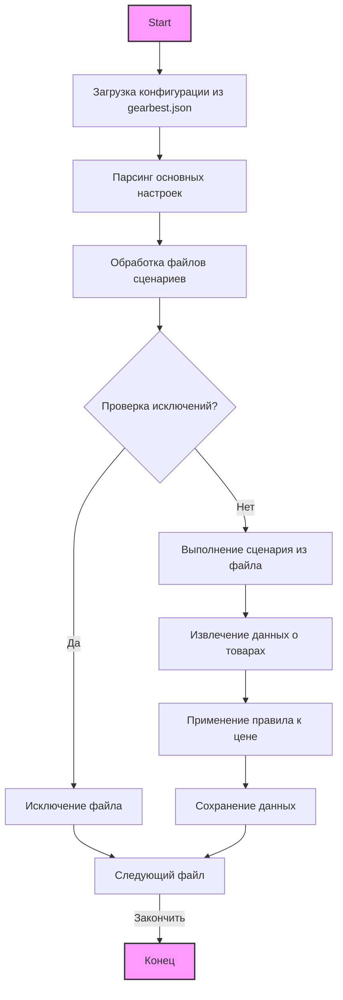

## АНАЛИЗ JSON ФАЙЛА `gearbest.json`

### 1. <алгоритм>

JSON файл `gearbest.json` представляет собой конфигурационный файл для сценария парсинга данных с веб-сайта KSP (ksp.co.il). Он определяет параметры и правила для извлечения информации о товарах. Вот пошаговое описание логики его использования:

1. **Инициализация**:
   - Считывание JSON файла.
   - Загрузка конфигурации в память.

2. **Основные настройки**:
   - `supplier`: Указывает поставщика (в данном случае "ksp").
   - `supplier_prefix`: Префикс поставщика ("ksp").
   - `start_url`: URL-адрес начальной страницы сайта поставщика ("https://www.ksp.co.il/").
   - `price_rule`: Правило корректировки цены (+100).
   - `num_items_4_flush`: Количество товаров для очистки (300).
   - `if_login`: Требуется ли вход в систему (false).
   - `parcing method`: Метод парсинга ("web").
   - `about method web scrapping`: Описание метода ("Если я работаю через API мне не нужен webdriver").
   - `collect_products_from_categorypage`: Собирать ли товары со страницы категории (false).
   - `last_runned_scenario`:  Последний запущенный сценарий (пустая строка).

3. **Обработка файлов сценариев**:
   - `scenario_files`: Список файлов сценариев, которые нужно запустить.
   - Пример: "ksp_categories_consoles_microsoft.json" и "ksp_categories_wathces_apple.json".

4. **Исключение файлов**:
   - `excluded`: Список файлов сценариев, которые следует исключить из обработки.
   - Пример:  файлы категорий телефонов разных брендов, наушники, планшеты, ноутбуки и тд..

5. **Итерация по файлам сценариев (не описано в файле, подразумевается в логике программы)**:
    - Для каждого файла из `scenario_files`:
        - Считывание и выполнение сценария парсинга, определенного в этом файле.
    - Игнорирование файлов из списка `excluded`.

6. **Применение правил парсинга**:
   - Для каждого товара:
       - Извлечение необходимой информации с веб-страницы.
       - Применение правила ценообразования `price_rule`.
       - Сохранение полученных данных.

**Пример работы:**

Предположим, что сценарий парсинга выполняется.
   - **Шаг 1:** Загрузка настроек из `gearbest.json`.
   - **Шаг 2:** Скрипт начнет обработку файлов из `scenario_files` ("ksp_categories_consoles_microsoft.json", "ksp_categories_wathces_apple.json").
   - **Шаг 3:** Будут проигнорированы все сценарии из списка `excluded`.
   - **Шаг 4:** При парсинге товаров будет применяться правило `price_rule`, то есть, к цене будет добавлено 100.
   - **Шаг 5:** Полученные данные о товарах будут сохранены.

### 2. <mermaid>

**Объяснение:**
Диаграмма показывает поток выполнения скрипта парсинга на основе конфигурации `gearbest.json`.

-   `Start` - начало выполнения скрипта.
-   `LoadConfig` - загрузка конфигурации из `gearbest.json`.
-    `ParseSettings` - парсинг основных параметров, таких как `supplier`, `start_url`, `price_rule` и другие.
-   `ProcessScenarioFiles` - начало обработки файлов сценариев из `scenario_files`.
-  `CheckExcludedFiles` - проверка, является ли текущий файл сценария исключенным из обработки.
    - Если файл находится в `excluded`, он исключается (`ExcludeFile`), и скрипт переходит к следующему файлу.
    - Если файл не исключен, выполняется сценарий парсинга (`ExecuteScenario`).
-   `ExecuteScenario` - выполнение сценария парсинга для конкретного файла.
-   `ExtractData` - извлечение данных о товарах.
-   `ApplyPriceRule` - применение правила ценообразования (`price_rule`).
-   `SaveData` - сохранение обработанных данных.
-    `NextFile` - переход к следующему файлу сценария, пока они не закончатся
-   `End` - конец выполнения скрипта.

### 3. <объяснение>

#### Основные моменты:
-   **JSON формат**: Файл `gearbest.json` использует формат JSON для структурирования данных. Это стандартный формат для обмена данными, который легко читается и обрабатывается программами.
-   **Конфигурация**: Этот файл является конфигурационным. Это означает, что он определяет параметры работы программы, а не сам код. Изменяя этот файл, можно менять поведение программы без изменения ее исходного кода.
-   **Поставщик**: Параметр `supplier` явно указывает, что данный файл настроен для работы с сайтом KSP.
-   **Исключения**: `excluded` список позволяет исключить определенные сценарии, тем самым гарантируя гибкость и настраиваемость.

#### Разбор полей:
-   **`supplier`**:
    -   Тип: Строка.
    -   Назначение: Название поставщика, в данном случае "ksp".
    -   Использование: Используется для идентификации поставщика в других частях системы.
-   **`supplier_prefix`**:
    -   Тип: Строка.
    -   Назначение: Префикс поставщика, "ksp".
    -   Использование: Вероятно, используется при формировании каких-либо идентификаторов или путей к файлам.
-   **`start_url`**:
    -   Тип: Строка.
    -   Назначение: URL адрес начальной страницы сайта поставщика.
    -   Использование: Адрес, с которого начинается сбор данных.
-   **`price_rule`**:
    -   Тип: Строка.
    -   Назначение: Правило для корректировки цены товара ("+100").
    -   Использование: Определяет, как будет изменена цена товара после извлечения (добавление 100 к цене).
-   **`num_items_4_flush`**:
    -   Тип: Число (целое).
    -   Назначение: Количество товаров, после которых происходит очистка.
    -   Использование: Управляет механизмом очистки данных (возможно, кеша или временных данных).
-   **`if_login`**:
    -   Тип: Булево значение.
    -   Назначение: Указывает, нужен ли вход на сайт.
    -   Использование: Если `true`, то будет выполняться логика входа на сайт.
-   **`parcing method`**:
    -   Тип: Строка.
    -   Назначение: Метод парсинга ("web").
    -   Использование: Выбор метода парсинга.
-  **`about method web scrapping`**:
    -   Тип: Строка.
    -   Назначение: Описание метода парсинга
    -   Использование: Комментарий к `parcing method`.
-  **`collect_products_from_categorypage`**:
   - Тип: Булево значение.
   - Назначение: Указывает, нужно ли собирать товары со страниц категорий.
   - Использование: `false` -  значит товары не собираются со страниц категорий.
-   **`scenario_files`**:
    -   Тип: Список строк.
    -   Назначение: Список файлов сценариев, которые нужно использовать.
    -   Использование: Перечень файлов, каждый из которых содержит свои правила для парсинга определенных категорий товаров.
-   **`excluded`**:
    -   Тип: Список строк.
    -   Назначение: Список файлов сценариев, которые нужно исключить из обработки.
    -   Использование: Позволяет выборочно отключать парсинг определенных категорий.
-   **`last_runned_scenario`**:
    -   Тип: Строка.
    -   Назначение: Последний запущенный сценарий.
    -   Использование: Отслеживание последнего использованного сценария, может использоваться для контроля или логирования.

#### Взаимосвязь с другими частями проекта:
-   **Парсер**: Этот файл используется как конфигурация для парсера, который обрабатывает данные с сайта KSP.
-   **Сценарии парсинга**: Файлы из `scenario_files` и `excluded` содержат более конкретные правила парсинга для отдельных категорий товаров.
-   **Логика обработки**: Параметры, такие как `price_rule`, `num_items_4_flush`, и `if_login`, управляют логикой обработки данных.
-   **Сохранение данных**: После обработки данные сохраняются в базе данных или в файле, в зависимости от реализации парсера.

#### Потенциальные ошибки и улучшения:
-   **Отсутствие проверки типов данных**: При чтении JSON файла следует проверить типы данных во избежание ошибок.
-   **Жестко заданные значения**: Некоторые параметры, такие как `price_rule`, могут быть более гибкими.
-   **Отсутствие обработки ошибок**: Необходимо добавить обработку ошибок при загрузке и парсинге JSON.
-   **Управление версиями**: Отсутствие явного управления версиями конфигурации может привести к проблемам совместимости.

#### Заключение:
Файл `gearbest.json` является важной частью системы парсинга. Он определяет, какие данные и как должны быть извлечены с веб-сайта KSP. Правильное понимание и использование этого файла обеспечивает гибкость и настраиваемость системы парсинга.