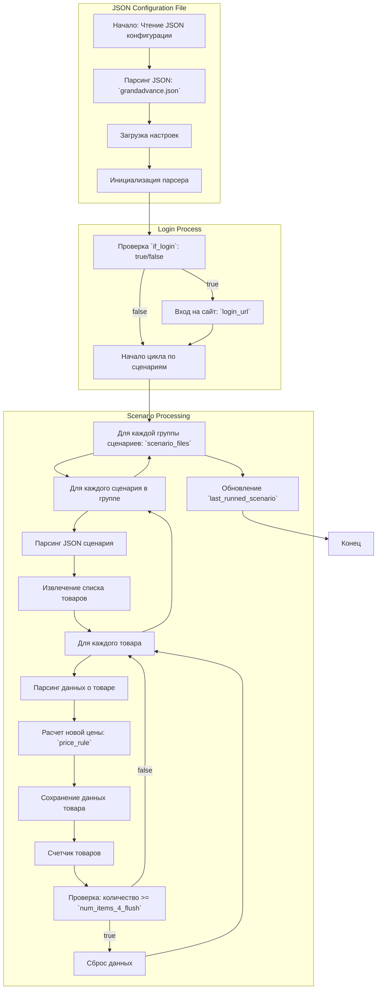

## АНАЛИЗ JSON КОНФИГУРАЦИИ

### 1. <алгоритм>

**Общий процесс:**

1.  **Чтение конфигурации:** JSON файл `grandadvance.json` читается для определения параметров работы парсера.

2.  **Инициализация парсера:** На основе прочитанных параметров инициализируется парсер для работы с сайтом `grandadvance.co.il`.

3.  **Аутентификация (если требуется):** Если `if_login` установлен в `true`, парсер выполняет вход на сайт, используя `login_url`.

4.  **Перебор сценариев:**
    *   `scenario_files` содержит список сценариев, сгруппированных по вложенным спискам.
    *   Сценарии выполняются последовательно. Сначала обрабатывается сценарий в первом подсписке, потом сценарии во втором подсписке параллельно, потом в третьем и тд
    *   Каждый сценарий представляет собой JSON-файл, описывающий парсинг определенной категории товаров.

5.  **Парсинг данных:**
    *   Для каждого товара из каждого сценария извлекаются необходимые данные, такие как наименование, цена и т.д.
    *   Цена товара умножается на коэффициент, заданный в `price_rule` (в данном случае `*1.43`).

6.  **Сброс данных (flush):** После обработки `num_items_4_flush` товаров, данные сбрасываются в хранилище (например, в базу данных или файл).

7.  **Запись последнего сценария:** В поле `last_runned_scenario` записывается имя последнего запущенного сценария.

**Примеры блоков:**

*   **Чтение конфигурации:** JSON файл `grandadvance.json` загружается и его данные сохраняются в виде словаря Python.
    ```python
    # Пример загрузки json файла:
    import json
    with open('grandadvance.json', 'r') as f:
        config = json.load(f)
    # config = {"supplier": "grandadvance", "supplier_prefix": "GRD-", ...}
    ```

*   **Инициализация парсера:** Создается экземпляр класса парсера, который получает параметры из `config` (например, URL, коэффициент цены).
    ```python
     # Пример инициализации парсера
    class Parser:
        def __init__(self, config):
            self.supplier = config['supplier']
            self.supplier_prefix = config['supplier_prefix']
            self.start_url = config['start_url']
            self.login_url = config['login_url']
            self.price_rule = config['price_rule']
            self.if_list = config['if_list']
            self.use_mouse = config['use_mouse']
            self.mandatory = config['mandatory']
            self.num_items_4_flush = config['num_items_4_flush']
            self.if_login = config['if_login']
            self.scenario_files = config['scenario_files']
            self.last_runned_scenario = config['last_runned_scenario']
    
    parser = Parser(config)
    ```

*   **Перебор сценариев:** Цикл обходит список сценариев, сгруппированных в подсписки.
    ```python
    # Пример перебора сценариев
    for scenario_group in config['scenario_files']:
        for scenario_file in scenario_group:
            print(f"Обработка сценария: {scenario_file}")
            # Обработка сценария...
    ```
*   **Парсинг данных:** Для каждого товара применяется функция парсинга (примерно).
    ```python
    # Пример парсинга товара:
    def parse_item(item_data, price_rule):
        item_price = item_data.get('price') # Допустим что 'item_data' содержит цену
        if item_price:
            item_price = float(item_price.replace('$','').replace(',','')) # удаляем знаки валюты
            new_price = item_price * float(price_rule.replace("*",""))
            return {'new_price': new_price}
        return {} # если нет цены то вернем пустой словарь
    item_data = {'price': '100$'}
    parsed_item = parse_item(item_data, "*1.43")
    # parsed_item = {'new_price': 143.0}
    ```

### 2. <mermaid>



**Объяснение диаграммы:**

*   **JSON Configuration File:**
    *   `Start`: Начало процесса загрузки и парсинга конфигурационного файла.
    *   `ParseConfig`: Загрузка и разбор JSON файла `grandadvance.json`.
    *   `LoadSettings`: Извлечение настроек из JSON, таких как URL, префикс поставщика и другие.
    *   `InitializeParser`: Инициализация парсера на основе загруженных настроек.
*   **Login Process:**
    *   `CheckLogin`: Проверка условия `if_login`.
    *   `Login`: Выполнение процедуры входа на сайт, если `if_login` равно `true`.
    *   `ScenarioLoop`: Начало цикла обработки сценариев.
*   **Scenario Processing:**
    *   `ForEachScenarioGroup`: Цикл по группам сценариев, которые могут выполняться параллельно.
    *    `ForEachScenario`: Цикл по сценариям в каждой группе.
    *   `ParseScenario`: Загрузка и разбор JSON файла сценария.
    *   `ExtractItems`: Извлечение списка товаров для парсинга.
    *   `ForEachItem`: Цикл по каждому товару.
    *   `ParseItemData`: Извлечение данных о конкретном товаре (название, цена).
    *   `CalculatePrice`: Вычисление новой цены товара с использованием `price_rule`.
    *   `SaveItemData`: Сохранение данных товара в промежуточное хранилище.
    *   `FlushCounter`: Увеличивает счетчик обработанных товаров.
    *   `CheckFlush`: Проверяет, нужно ли сбросить данные в постоянное хранилище.
    *   `FlushData`: Сбрасывает накопленные данные в базу или файл.
    *   `UpdateLastScenario`: Обновляет поле `last_runned_scenario`.
*   **End:** Конец процесса парсинга.

### 3. <объяснение>

**Импорты:**

В представленном коде нет явных `import`-ов. Однако, предполагается, что для работы с JSON-файлами и веб-парсингом будут использоваться библиотеки Python.

*   **`json`**: Библиотека для работы с JSON-файлами, используется для загрузки конфигурации.
*   **`requests` / `selenium`**: Одна из библиотек (или их комбинация) для работы с веб-страницами, загрузки HTML и взаимодействия с сайтом (веб-парсинг, авторизация).

**Переменные:**

*   **`supplier`**: (строка) Название поставщика, в данном случае `"grandadvance"`.
*   **`supplier_prefix`**: (строка) Префикс для идентификаторов товаров, `"GRD-"`.
*   **`start_url`**: (строка) URL главной страницы сайта поставщика, `"https://www.grandadvance.co.il/"`.
*   **`login_url`**: (строка) URL страницы авторизации, `"https://www.grandadvance.co.il/"`.
*   **`price_rule`**: (строка) Правило для расчета цены, `"*1.43"` (умножение на 1.43).
*  **`if_list`**: (строка) Правило определяющее тип списка при обработки JSON (например first - first item only), `"first"`
*   **`use_mouse`**: (логическое) Определяет, нужно ли использовать мышь при работе с сайтом. В этом случае `false`
*   **`mandatory`**: (логическое) Определяет, является ли обязательным использование данного сценария для парсинга. В данном случае `true`
*   **`num_items_4_flush`**: (число) Количество товаров для сброса данных в хранилище (базу или файл), `50`.
*   **`if_login`**: (логическое) Определяет, нужно ли выполнять вход на сайт, `true`.
*   **`scenario_files`**: (список списков строк) Список путей к JSON-файлам со сценариями парсинга. Каждый вложенный список представляет собой группу сценариев, которые можно выполнять параллельно.
*   **`last_runned_scenario`**: (строка) Имя последнего запущенного сценария (на момент запуска), `" ""`.

**Функции (предполагаемые):**

*   **`parse_item(item_data, price_rule)`**: Принимает данные товара и правило расчета цены, возвращает словарь с новой ценой.
*   **`flush_data(items)`**: Принимает список данных товаров, сбрасывает в хранилище.
*   **`login(login_url)`**: Принимает URL для авторизации, выполняет вход на сайт.

**Классы (предполагаемые):**

*   **`Parser`**:
    *   **Атрибуты:** Все переменные, описанные выше, а так же дополнительные переменные для внутреннего использования.
    *   **Методы:**
        *   `login()` - выполняет вход на сайт.
        *   `parse_scenario()` - загружает и обрабатывает сценарий.
        *   `parse_item()` - обрабатывает товар и рассчитывает цену.
        *   `flush_data()` - сбрасывает данные.

**Взаимосвязи с другими частями проекта:**

*   **`src/scenario/json/*.json`**: Другие JSON файлы содержат настройки для отдельных категорий товаров, по аналогии с `grandadvance_categories_keyboards_logitech.json` и тд.
*   **`src/parser`**: Модуль, который будет обрабатывать данные на основе конфигурации.
*   **`src/data_storage`**: Модуль, который отвечает за сохранение полученных данных (база данных, файлы).
*   **`src/login`**: Модуль, который отвечает за авторизацию.

**Потенциальные ошибки или области для улучшения:**

*   **Отсутствие обработки ошибок:** В коде не предусмотрена обработка ошибок при парсинге данных (например, отсутствие элемента на странице, неверный формат данных).
*   **Жесткая привязка к структуре JSON:** Код может стать уязвимым, если структура JSON-файла изменится.
*   **Отсутствие логгирования:** Отсутствие логгирования затруднит отладку и мониторинг работы парсера.
*   **Отсутствие кэширования:** Загрузка одних и тех же веб-страниц на несколько раз может привести к избыточному расходу ресурсов.
*   **Неявные зависимости:** Зависимости от сторонних библиотек (`requests`, `selenium`) должны быть явно указаны.
*   **Неописаны правила для `if_list`**: Необходимо описать возможные варианты `"first"` или другие доступные
*   **Неописаны правила для `use_mouse`**: Необходимо описать сценарии применения и различие от стандартного парсинга
*   **Неописано взаимодействие при `mandatory: true` или `mandatory: false`**: Необходимо описать правила поведения парсера при разных значениях.

**Цепочка взаимосвязей:**

1.  **`grandadvance.json`**: Этот файл является отправной точкой, он содержит настройки для парсера `grandadvance`.
2.  **`Parser`**: Класс `Parser` читает `grandadvance.json` и настраивается в соответствии с его параметрами.
3.  **`scenario_files`**: Парсер использует список сценариев из `scenario_files`.
4.  **`src/scenario/json/*.json`**: Сценарии в `scenario_files` описывают структуру веб-страниц и правила для парсинга конкретных категорий товаров.
5.  **`src/parser`**: На основе данных из `grandadvance.json` и файлов сценариев `src/parser` будет извлекать данные с веб-страниц, используя `src/login` для аутентификации.
6.  **`src/data_storage`**: После извлечения данные будут отправлены в `src/data_storage`.

Таким образом, файл `grandadvance.json` задает параметры для работы парсера, определяет список сценариев для парсинга и указывает, как взаимодействовать с другими частями проекта.