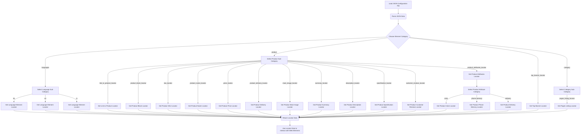

## ИНСТРУКЦИЯ:

Анализируй предоставленный код подробно и объясни его функциональность. Ответ должен включать три раздела:  

1.  **<алгоритм>**: Опиши рабочий процесс в виде пошаговой блок-схемы, включая примеры для каждого логического блока, и проиллюстрируй поток данных между функциями, классами или методами.  
2.  **<mermaid>**: Напиши код для диаграммы в формате `mermaid`, проанализируй и объясни все зависимости,
    которые импортируются при создании диаграммы.
    **ВАЖНО!** Убедитесь, что все имена переменных, используемые в диаграмме `mermaid`,
    имеют осмысленные и описательные имена. Имена переменных вроде `A`, `B`, `C`, и т.д., не допускаются!

    **Дополнительно**: Если в коде есть импорт `import header`, добавьте блок `mermaid` flowchart, объясняющий `header.py`:
    ```mermaid
    flowchart TD
        Start --> Header[<code>header.py</code><br> Determine Project Root]

        Header --> import[Import Global Settings: <br><code>from src import gs</code>]
    ```

3.  **<объяснение>**: Предоставьте подробные объяснения:
    - **Импорты**: Их назначение и взаимосвязь с другими пакетами `src.`.
    - **Классы**: Их роль, атрибуты, методы и взаимодействие с другими компонентами проекта.
    - **Функции**: Их аргументы, возвращаемые значения, назначение и примеры.
    - **Переменные**: Их типы и использование.
    - Выделите потенциальные ошибки или области для улучшения.

Дополнительно, постройте цепочку взаимосвязей с другими частями проекта (если применимо).

Это обеспечивает всесторонний и структурированный анализ кода.
## Формат ответа: `.md` (markdown)
**КОНЕЦ ИНСТРУКЦИИ**

## <алгоритм>

Представленный JSON-файл содержит конфигурацию локаторов для веб-элементов на странице, используемую, вероятно, для автоматизированного тестирования или веб-скрепинга. Алгоритм работы с этими данными следующий:

1.  **Загрузка данных:** Происходит загрузка JSON-файла в память программы.
2.  **Доступ к данным:** Данные структурированы в виде словаря, где ключи представляют различные категории и элементы на веб-странице. Например, `languages`, `infinity_scroll`, `category`, `top_banner_locator`, `product` и т.д.
3.  **Извлечение локаторов:** В зависимости от того, какой элемент на странице требуется найти, происходит обращение к соответствующему ключу и извлечение его свойств. Например, если нужно найти локатор для элемента выбора языка, используется ключ `languages`, затем ключ языка (`he`, `en`, `ru`). 
    *   Пример: Для языка 'he' извлекается:
        ```json
        {
            "logic for attribue[AND|OR|XOR|VALUE|null]": null,
            "attribute": "sendKeys(Keys.RETURN)",
            "by": "XPATH",
            "selector": "//li[@data-value='he']",
            "logic for action[AND|OR|XOR|VALUE|null]": null,
            "timeout": 0,
            "timeout_for_event": "presence_of_element_located",
            "event": null
        }
        ```
4.  **Использование локаторов:** Извлеченные данные могут быть использованы для взаимодействия с веб-страницей:
    *   **`by`:** Определяет стратегию поиска элемента (XPATH, CSS Selector).
    *   **`selector`:** Строка, идентифицирующая элемент.
    *   **`attribute`:** Атрибут элемента, с которым нужно взаимодействовать (например, извлечь его значение, "innerHTML", "innerText" , null )
    *   **`event`:** Действие, которое нужно выполнить с элементом (например, "sendKeys(Keys.RETURN)", "screenshot()").
    *   **`timeout`:** Максимальное время ожидания появления элемента, в секундах.
    *   **`timeout_for_event`:** Событие, которое нужно ожидать при поиске элемента (`presence_of_element_located` и др).
    *   **`logic for attribue[AND|OR|XOR|VALUE|null]`**: Тип логики проверки атрибута (не используется, null).
    *   **`logic for action[AND|OR|XOR|VALUE|null]`**: Тип логики действия (не используется, null).
5.  **Примеры использования:**
    *   Найти локатор для переключения языка на иврит: Используется путь `languages.he`.
    *   Найти локатор для ссылки на товар: Используется путь `product.link_to_product_locator`.
    *   Получить локатор для блока с описанием товара: Используется путь `product.description_locator`.
6.  **Сложные структуры**: Некоторые локаторы имеют более сложную структуру, например `product_attributes_locator`, содержащий вложенные локаторы для атрибутов товара.

## <mermaid>



**Объяснение `mermaid`:**

*   **Load JSON Configuration File:** Начало процесса, загрузка JSON-файла, содержащего локаторы.
*   **Parse JSON Data:** Разбор загруженного JSON-файла в структуру данных, с которой можно работать (словарь в Python).
*   **Choose Element Category:** Выбор основной категории элемента, локатор которого нужно получить (например, "languages", "product", "top_banner_locator", "category").
*   **Select Language Sub-Category:** При выборе категории "languages", выбирается конкретный язык ("he", "en", "ru").
*   **Get Language Element Locator:** Извлечение локатора для конкретного языка.
*    **Select Product Sub-Category:** При выборе категории "product" - выбор типа локатора продукта.
*   **Get Link to Product Locator:** Извлечение локатора для ссылки на товар.
*   **Get Product Block Locator:** Извлечение локатора для блока с товаром.
*   **Get Product SKU Locator:** Извлечение локатора для SKU товара.
*    **Get Product Name Locator:** Извлечение локатора для имени товара.
*    **Get Product Price Locator:** Извлечение локатора для цены товара.
*    **Get Product Delivery Locator:** Извлечение локатора для информации о доставке товара.
*   **Get Product Main Image Locator:** Извлечение локатора для главного изображения товара.
*   **Get Product Summary Locator:** Извлечение локатора для краткого описания товара.
*   **Get Product Description Locator:** Извлечение локатора для полного описания товара.
*   **Get Product Specification Locator:** Извлечение локатора для технических характеристик товара.
*   **Get Product Customer Reviews Locator:** Извлечение локатора для отзывов покупателей товара.
*    **Get Product Attributes Locator:** Извлечение локатора для атрибутов товара.
* **Select Product Attribute Category**: Выбор категории аттрибута товара.
*  **Get Product Color Locator:** Извлечение локатора для цвета товара.
*   **Get Product Phone Memory Locator:** Извлечение локатора для памяти телефона.
*   **Get Product Delivery Locator:** Извлечение локатора для вариантов доставки товара.
*   **Get Top Banner Locator:** Извлечение локатора для верхнего баннера.
*  **Select Category Sub-Category**: При выборе категории "category" - выбор типа локатора категории.
*    **Get Pages Listing Locator**: Извлечение локатора для списка страниц.
*   **Return Locator Data:** Возвращение извлеченных данных локатора.
*   **Use Locator Data to Interact with Web Elements:** Использование извлеченных локаторов для взаимодействия с веб-элементами на странице.

Диаграмма показывает поток управления и данных при использовании локаторов, демонстрируя процесс от загрузки конфигурации до использования полученных данных для взаимодействия с веб-элементами.

## <объяснение>

**Общее описание:**

Этот JSON-файл представляет собой конфигурацию локаторов для веб-элементов. Он позволяет стандартизировать поиск элементов на веб-странице с помощью различных стратегий (XPATH, CSS Selector) и действий (sendKeys, screenshot). Структура файла разбита на категории, такие как `languages`, `product`, `top_banner_locator`, `category`, что облегчает навигацию и использование.

**Разделы:**

*   **`languages`:** Содержит локаторы для выбора языка интерфейса. Ключи "he", "en", "ru" соответствуют ивриту, английскому и русскому языкам соответственно. Каждый элемент содержит:
    *   `attribute`: Атрибут элемента для взаимодействия (например, `sendKeys(Keys.RETURN)`).
    *   `by`: Метод поиска элемента (`XPATH`).
    *   `selector`: Строка, идентифицирующая элемент.
    *   `timeout`: Время ожидания появления элемента (0 секунд).
    *   `timeout_for_event`: Событие для ожидания (`presence_of_element_located`).
    *   `event`: Событие, которое нужно инициировать (например, `sendKeys(Keys.RETURN)`)

*   **`infinity_scroll`**: Логическое значение, указывающее на использование бесконечной прокрутки.

*   **`checkboxes_for_categories`**: Логическое значение, указывающее на наличие чекбоксов для категорий.

*   **`category`**: Содержит локаторы, связанные со списком страниц категорий.
    *   `pages_listing_locator`: Локатор для списка страниц, используется CSS-селектор `infinity_scroll` , берется атрибут `innerHTML`.

*   **`top_banner_locator`:** Содержит локаторы для верхнего баннера на странице.
    *   `attribute`: В данном случае это словарь `{"src" : null}`, для получения значения атрибута `src`, но его значение null, т.е по умолчанию не задано.
    *   `by`: Метод поиска элемента (`XPATH`).
    *   `selector`: Строка, идентифицирующая элемент (`//ul[contains(@class , 'slider animated')]//img`).

*   **`product`:** Содержит локаторы для различных элементов на странице товара.
    *   `link_to_product_locator`: Локатор для ссылки на товар.
    *   `product_block_locator`: Локатор для основного блока товара.
    *   `sku_locator`: Локатор для артикула товара.
    *   `product_name_locator`: Локатор для имени товара. Примечательно, что используется комментарий `replaced by driver.title`, это означает, что имя товара извлекается из заголовка страницы, а не из этого локатора.
    *   `price_locator`: Локатор для цены товара.
    *   `product_delivery_locator`: Локатор для вариантов доставки товара.
    *   `main_image_locator`: Локатор для основного изображения товара. Содержит действие `screenshot()`, которое делает скриншот элемента.
    *   `summary_locator`: Локатор для краткого описания товара.
    *    `description_locator`: Локатор для полного описания товара.
    *   `specification_locator`: Локатор для характеристик товара.
    *   `customer_reviews_locator`: В данный момент значение `null`, локатор для отзывов не задан.
    *   `product_attributes_locator`: Локатор для блока с атрибутами товара. Включает вложенные локаторы для конкретных атрибутов: `color`, `phone memory`, `delivery`.

**Импорты**:
В представленном коде отсутствуют явные импорты, поскольку это JSON-файл. Он предназначен для использования другими частями программы, которые могут импортировать и использовать данные о локаторах.

**Классы**:
В данном файле нет классов. Это конфигурационный файл, определяющий структуру данных, используемую другими классами в проекте.

**Функции**:
Функции отсутствуют. Данные, описанные в файле, используются функциями, которые обрабатывают веб-страницы и ищут элементы, опираясь на эти локаторы.

**Переменные**:
*   Ключи JSON-объекта представляют собой переменные, содержащие значения, необходимые для работы автоматизированной системы. Тип значения может быть словарь, список, строка, число, логический тип, null.
*   Внутри каждого локатора `selector`, `attribute`, `event`, `timeout`, и др. являются переменными (ключами JSON), содержащими информацию, необходимую для поиска веб-элементов.

**Потенциальные ошибки и области для улучшения:**

*   **Отсутствие обработки ошибок:** В конфигурации нет обработки ошибок при поиске элементов (например, элемент не найден).
*   **Жестко закодированные значения:** Значения таймаутов (везде 0) могут быть неадекватными для различных условий сети и загрузки страницы, необходимо настроить значение таймаута.
*   **Недостаточная документация:** Для некоторых локаторов (`customer_reviews_locator`) нет значений, нужно уточнить причину.
*   **Зависимость от структуры HTML:** Локаторы, основанные на XPATH, могут быть хрупкими и ломаться при изменении структуры HTML. Возможно, стоило бы использовать более устойчивые методы, такие как `data-testid` атрибуты, при наличии.
*   **Дублирование:** Наличие полей `logic for attribue`, `logic for action` во всех локаторах, при этом значения этих полей везде `null`. Возможно, стоит их удалить или вынести в отдельную сущность.
*   **Комментарии:** Отсутствуют комментарии, для чего предназначен тот или иной селектор.

**Цепочка взаимосвязей с другими частями проекта:**
Этот JSON-файл служит источником данных для тестовых фреймворков или веб-скрейперов, которые ищут элементы на веб-страницах. Он взаимодействует с:

1.  **Драйвером веб-браузера (например, Selenium WebDriver):** Использует `by` и `selector` для поиска элементов на странице.
2.  **Библиотеками автоматизации тестирования:** Предоставляет локаторы для написания тестов.
3.  **Скрейперами:** Использует локаторы для извлечения данных со страниц.
4.  **Системой конфигурации:** Позволяет централизованно управлять локаторами и их свойствами.
5. **Другими JSON файлами**, например, файлами со стрингами для локализации.

В целом, этот файл является важной частью инфраструктуры автоматизации, которая позволяет взаимодействовать с веб-страницей стандартизированным образом.