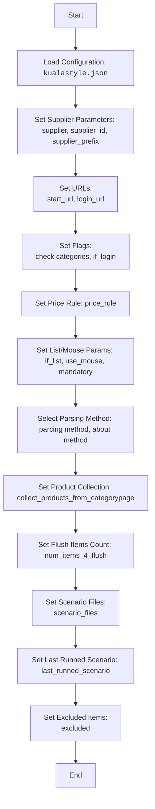

# Анализ `kualastyle.json`

## <алгоритм>

1.  **Инициализация**:
    *   Загрузка JSON-конфигурации `kualastyle.json`.
    *   Пример: Чтение файла и парсинг JSON в структуру данных.

2.  **Основные параметры**:
    *   Определение поставщика, его идентификатора и префикса (`supplier`, `supplier_id`, `supplier_prefix`).
        *   Пример: `"supplier": "kualastyle"` устанавливает поставщика.
    *   Установка начального и URL для входа (`start_url`, `login_url`).
        *   Пример: `"start_url": "https://kualastyle.com"` определяет начальную страницу.
    *   Настройка флагов: проверка категорий на сайте, необходимость входа (`check categories on site`, `if_login`).
        *   Пример: `"check categories on site": true` указывает, что категории нужно проверять.
    *   Правило для расчета цены (`price_rule`).
        *   Пример: `"price_rule": "*1"` - цена остается без изменений.
    *   Установка параметров для работы со списком и мышью (`if_list`, `use_mouse`, `mandatory`).
        *   Пример: `"if_list": "first"` выбирает первый элемент списка.

3.  **Метод парсинга**:
    *   Выбор метода парсинга: `web` (через webdriver) или `api` (`parcing method [webdriver|api]`).
         *   Пример: `"parcing method [webdriver|api]": "web"` использует webdriver.
    *   Описание выбора метода (`about method web scrapping [webdriver|api]`).

4.  **Парсинг продуктов**:
    *   Определение способа сбора продуктов: с отдельных страниц категорий или нет (`collect_products_from_categorypage`).
        *   Пример: `"collect_products_from_categorypage": false` - не собираем с отдельных страниц категорий.
    *   Установка количества элементов для очистки кэша (`num_items_4_flush`).
        *   Пример: `"num_items_4_flush": 500` - очищать кэш каждые 500 элементов.

5.  **Сценарии**:
    *   Определение списка файлов сценариев для парсинга категорий (`scenario_files`).
        *   Пример: `["kualastyle_categories_accessories.json", ...]` - список файлов с настройками парсинга категорий.
    *   Хранение имени последнего запущенного сценария (`last_runned_scenario`).

6.  **Исключения**:
    *   Список исключений (`excluded`).

## <mermaid>

## <объяснение>

### Импорты
В данном коде нет явных импортов. Однако, этот JSON файл конфигурационный и будет использоваться другими частями проекта для настройки процесса парсинга.

### Классы
В данном коде нет классов, это конфигурационный файл.

### Функции
В данном коде нет функций, это конфигурационный файл.

### Переменные

*   **`supplier`**: `str` - Имя поставщика (`kualastyle`).
*   **`supplier_id`**: `str` - Уникальный идентификатор поставщика (`11028`).
*   **`supplier_prefix`**: `str` - Префикс для идентификации поставщика (`kualastyle`).
*   **`start_url`**: `str` - Начальный URL сайта поставщика (`https://kualastyle.com`).
*   **`login_url`**: `str` - URL страницы входа на сайт поставщика (`https://kualastyle.com`).
*   **`check categories on site`**: `bool` - Флаг, указывающий, нужно ли проверять категории на сайте (`true`).
*   **`if_login`**: `bool` - Флаг, указывающий, требуется ли вход на сайт (`true`).
*   **`price_rule`**: `str` - Правило для расчета цены (`*1`).
*   **`if_list`**: `str` - Параметр для выбора элементов списка (`first`).
*   **`use_mouse`**: `bool` - Параметр, указывающий, использовать ли мышь (`false`).
*  **`mandatory`**: `bool` - Является ли обязательным (`true`).
*   **`parcing method [webdriver|api]`**: `str` - Метод парсинга (`web`).
*   **`about method web scrapping [webdriver|api]`**: `str` - Описание выбора метода парсинга.
*   **`collect_products_from_categorypage`**: `bool` - Флаг, указывающий, собирать ли продукты со страниц категорий (`false`).
*   **`num_items_4_flush`**: `int` - Количество элементов, после которого нужно очищать кэш (`500`).
*   **`scenario_files`**: `list` - Список файлов сценариев для категорий.
*   **`last_runned_scenario`**: `str` - Имя последнего запущенного сценария.
*   **`excluded`**: `list` - Список исключений.

### Потенциальные ошибки и улучшения

*   **Неявная зависимость от других файлов**: JSON-файл зависит от существования файлов сценариев, указанных в `scenario_files`.
*   **Отсутствие валидации**: Нет валидации данных JSON, например, проверка типов или допустимых значений.
*   **Отсутствие комментариев**: JSON файл не содержит комментариев, которые могли бы помочь в понимании.
*   **Жестко заданные значения**: Некоторые значения (например, `num_items_4_flush`) могут быть параметризованы.

### Взаимосвязи с другими частями проекта
Этот файл конфигурации будет использоваться модулями парсинга для настройки процесса сбора данных с сайта `kualastyle.com`. В частности, будут использоваться настройки:
   * URL (`start_url`, `login_url`) для навигации по сайту.
   * Метод парсинга (`parcing method [webdriver|api]`) для выбора инструмента парсинга (webdriver или api).
   * Список файлов сценариев (`scenario_files`) для запуска отдельных сценариев парсинга для разных категорий.
   * Правило цены `price_rule` для дальнейшей обработки данных.
   * Настройки для работы со списками и мышью (`if_list`, `use_mouse`)