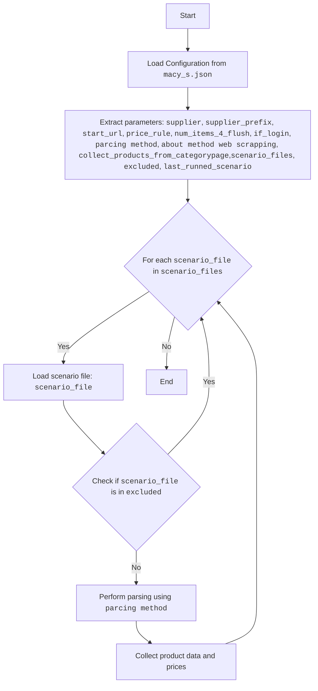

## <алгоритм>

1.  **Начало**: Загрузка JSON-файла конфигурации `macy_s.json`.
    *   Пример: `{ "supplier": "ksp", "supplier_prefix": "ksp", ... }`
2.  **Инициализация**: Извлечение основных параметров:
    *   `supplier` = "ksp" (поставщик)
    *   `supplier_prefix` = "ksp" (префикс поставщика)
    *   `start_url` = "https://www.ksp.co.il/" (начальный URL)
    *   `price_rule` = "+100" (правило ценообразования)
    *   `num_items_4_flush` = 300 (количество элементов для сброса)
    *   `if_login` = false (требуется ли вход)
    *   `parcing method` = "web" (метод парсинга)
    *   `about method web scrapping` = "Если я работаю через API мне не нужен webdriver" (описание метода)
    *   `collect_products_from_categorypage` = false (собирать ли продукты со страницы категории)
    *   `scenario_files` = ["ksp_categories_consoles_microsoft.json", "ksp_categories_wathces_apple.json"] (список файлов сценариев)
    *   `excluded` = [...] (список исключенных файлов)
    *    `last_runned_scenario` = "" (последний запущенный сценарий)
3.  **Обработка `scenario_files`**: Для каждого файла сценария в списке `scenario_files`:
    *   Загрузка файла сценария, например `ksp_categories_consoles_microsoft.json`.
    *   Выполнение парсинга для данного файла, используя метод парсинга, указанный в `parcing method`("web").
    *   Сбор данных о товарах и ценах.
4.  **Исключение**: Проверка каждого файла сценария из `excluded`, чтобы исключить его из обработки.
    *   Пример: если файл сценария `ksp_categories_speakers_google.json` находится в `excluded`, он не обрабатывается.
5.  **Завершение**: Сохранение результатов и завершение работы.

## <mermaid>



## <объяснение>

**Импорты**:

*   В данном фрагменте кода нет импортов, поскольку это JSON-файл, а не Python.
    Однако, если рассматривать этот JSON-файл как часть более крупной системы, то этот файл, вероятно, будет использован в Python-скрипте, где могут быть импорты из `src`, такие как:

    ```python
    from src import gs  # импорт глобальных настроек
    from src.utils import parse_data # импорт функций парсинга
    ```

    Взаимосвязь с другими пакетами `src`: Этот JSON файл служит как конфигурация для Python-скриптов, которые расположены в пакете `src`. Он определяет параметры для парсинга и загрузки данных.

**Классы**:

*   В этом JSON-файле нет классов, однако его структура предполагает, что он используется как входные данные для классов, которые занимаются парсингом веб-сайтов.

**Функции**:

*   В этом JSON файле нет функций. Однако, в `src` файлах, которые будут использовать данный JSON файл, будут функции для чтения JSON, парсинга HTML (если `parcing method` = "web"), и обработки данных.
    Например:
    * `load_json(filename)`: читает json file.
    * `parse_webpage(url, config)`:  парсит данные со страницы, используя конфигурации из json.
    * `save_data(data)`: сохраняет данные.

    *   **Пример**:
        ```python
          def parse_webpage(url, config):
            # логика парсинга
            data =  ... # данные о продуктах.
            return data
        ```

**Переменные**:

*   `supplier`: (string) Указывает на поставщика (в данном случае "ksp").
*   `supplier_prefix`: (string) Префикс поставщика, используется, например, для именования файлов.
*   `start_url`: (string) Начальный URL для парсинга.
*   `price_rule`: (string) Правило для расчета цен (например, "+100", что может означать добавление 100 к цене).
*   `num_items_4_flush`: (int) Количество элементов, после которого выполняется сброс (вероятно, данных).
*   `if_login`: (boolean) Указывает, требуется ли вход на сайт.
*   `parcing method`: (string) Метод парсинга ("web" или "api").
*   `about method web scrapping`: (string) Описание метода веб-скрепинга.
*   `collect_products_from_categorypage`: (boolean) Флаг, указывающий, нужно ли собирать продукты со страницы категории.
*   `scenario_files`: (array of strings) Список файлов сценариев для парсинга.
*   `excluded`: (array of strings) Список файлов сценариев, которые нужно исключить из парсинга.
*    `last_runned_scenario`: (string) Имя последнего запущенного сценария

**Потенциальные ошибки и области для улучшения**:

*   **Ошибки**:
    *   Неправильный формат JSON.
    *   Отсутствие необходимых ключей в JSON.
    *   Несовместимые значения параметров (например, некорректный `parcing method`).
    *   Ошибки в правиле ценообразования (`price_rule`).
    *   Некорректные имена файлов в `scenario_files` и `excluded`.
    *   Отсутствие проверки валидности URL в `start_url`.
*   **Улучшения**:
    *   Добавить проверку типов данных при загрузке JSON.
    *   Создать валидацию JSON-схемы для обеспечения правильной структуры файла.
    *   Реализовать более гибкое правило ценообразования.
    *   Добавить обработку ошибок и журналирование в скрипты, которые будут использовать этот JSON-файл.
    *   Вынести логику выбора метода парсинга в отдельную функцию.
    *   Добавить возможность указывать путь к файлу `scenario_files` и `excluded`.

**Взаимосвязи с другими частями проекта**:
    * Этот JSON файл является конфигурационным файлом, который управляет работой скриптов парсинга.
    * Файлы, указанные в `scenario_files`, скорее всего, представляют собой JSON-файлы, которые содержат детали о категориях, которые нужно спарсить.
    * `src/gs.py` содержит глобальные настройки проекта, которые используются вместе с этим файлом конфигурации.