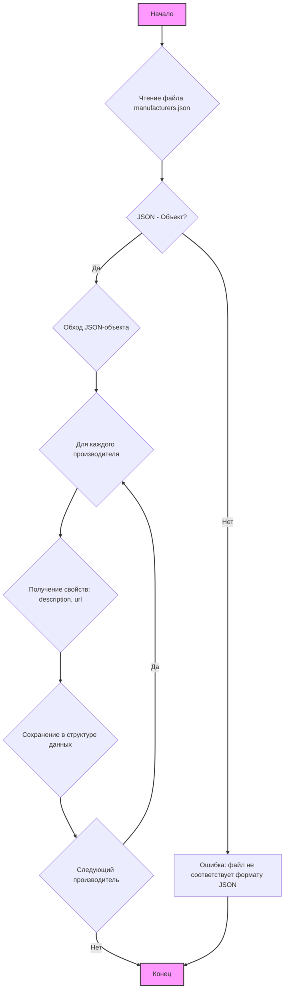
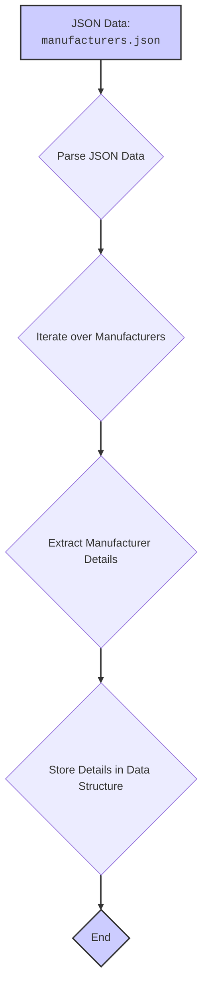

## АНАЛИЗ JSON-ФАЙЛА `manufacturers.json`

### 1. <алгоритм>

JSON-файл `manufacturers.json` представляет собой структуру данных в формате JSON, содержащую информацию о производителях.

**Блок-схема:**


**Примеры:**

1. **Чтение файла:** Файл `manufacturers.json` загружается в память.
2. **JSON-объект:** Содержимое файла проверяется на соответствие формату JSON-объекта. В данном случае - да.
3. **Обход объекта:** Ключ `"pemco-hardware"` используется для доступа к данным производителя.
4. **Получение свойств:** Извлекаются значения для ключей `"descripiton"` (описание) и `"url"` (URL-адрес).
5. **Сохранение в структуре данных:** Полученные данные о производителе сохраняются, например, в словаре или объекте Python.
6. **Следующий производитель:** Проверяется, есть ли ещё производители. В данном случае - нет, так как есть только один элемент.
7. **Конец:** Завершение обработки файла.

### 2. <mermaid>



**Описание `mermaid` диаграммы:**

1.  **`JSON Data: manufacturers.json`** - Начальный узел, представляющий JSON файл, содержащий данные о производителях.
2.  **`Parse JSON Data`** - Операция, преобразующая содержимое файла в объект данных (например, словарь в Python).
3.  **`Iterate over Manufacturers`** - Перебор каждого производителя, если их несколько.
4.  **`Extract Manufacturer Details`** - Получение информации о конкретном производителе (например, описание и URL).
5.  **`Store Details in Data Structure`** - Сохранение полученной информации в некоторой структуре данных для дальнейшего использования.
6.  **`End`** - Конечный узел, завершающий процесс обработки.

**Зависимости:**

В данном случае нет импортов, потому что это JSON-файл. Он является структурой данных, а не исполняемым кодом.

### 3. <объяснение>

**Объяснение:**

Файл `manufacturers.json` — это JSON-объект (словарь). Он содержит информацию о производителях, где каждый производитель представлен как ключ в словаре, а его значение - это словарь с информацией о нем.

**Описание элементов JSON-файла:**

-   **`"pemco-hardware"`:** Ключ (имя производителя), строка.
    -   **`"description"`:** Описание производителя, строка. В данном случае `"heavy industry"`.
    -   **`"url"`:** URL-адрес веб-сайта производителя, строка. В данном случае `"https://www.pemco-hardware.com"`.

**Использование и предназначение:**

Файл `manufacturers.json` предназначен для хранения и предоставления информации о производителях в формате, удобном для обработки программами. Он может использоваться для получения данных о производителях, их описания и веб-сайтов для различных целей, например, для отображения списка производителей на веб-сайте, импорта в базу данных или других процессов.

**Примеры использования:**

```python
import json

with open('hypotez/src/scenario/json/manufacturers.json', 'r') as f:
    data = json.load(f)

for manufacturer, details in data.items():
    print(f"Производитель: {manufacturer}")
    print(f"  Описание: {details['descripiton']}")
    print(f"  URL: {details['url']}")
    
# Вывод:
# Производитель: pemco-hardware
#   Описание: heavy industry
#   URL: https://www.pemco-hardware.com
```

**Возможные улучшения и замечания:**
1. **Ошибки:**
 -  Орфографическая ошибка в ключе `descripiton`.
2. **Дополнения**:
 - Файл может быть расширен для включения дополнительных данных, таких как контакты, регион, и т.п.
3. **Гибкость:**
 - Формат файла позволяет легко добавлять новых производителей без изменения логики программы, использующей файл.

**Цепочка взаимосвязей:**

Данный файл может быть связан с другими частями проекта, которые используют информацию о производителях, например:
*   Модулями, которые отображают данные о производителях в пользовательском интерфейсе.
*   Модулями, которые анализируют данные о производителях в базе данных.
*   Модулями, которые взаимодействуют с API веб-сайтов производителей.

В заключение, файл `manufacturers.json` представляет собой простой, но важный компонент проекта, который обеспечивает хранение и доступ к данным о производителях.