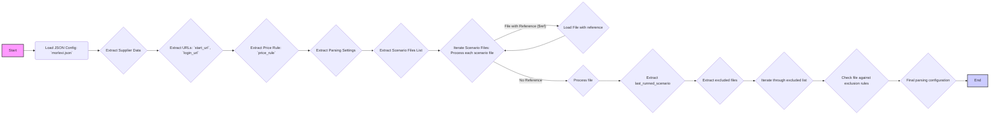

## АНАЛИЗ JSON ФАЙЛА

### 1. <алгоритм>

**Описание:** Данный JSON-файл описывает конфигурацию для парсинга веб-сайта поставщика "morlevi". Он содержит информацию о поставщике, URL-адреса, правила ценообразования, настройки парсинга и список сценариев для обработки различных категорий товаров.

**Блок-схема:**

```mermaid
graph LR
    A[Start] --> B{Load JSON Config};
    B --> C{Extract Supplier Info};
    C --> D{Extract URL Info};
    D --> E{Extract Price Rule};
    E --> F{Extract Parsing Settings};
    F --> G{Process Scenario Files};
    G --> H{Iterate through Scenario Files};
    H -- Scenario File --> I{Process Each File};
    I --> J{Check for References (like $ref)};
    J -- Reference found --> K{Resolve Reference to JSON File};
    K --> I;
    J -- No Reference --> I;
    I --> L{Extract Last Runned Scenario};
    L --> M{Process Excluded Files};
    M --> N{Iterate through Exclusion Lists};
    N --> O{Check Files against Exclusion Rules};
    O --> P{Final Configuration};
    P --> Q[End];
    style A fill:#f9f,stroke:#333,stroke-width:2px
    style Q fill:#ccf,stroke:#333,stroke-width:2px
```

**Примеры:**

*   **`Load JSON Config`**: Загрузка JSON-файла в структуру данных.
*   **`Extract Supplier Info`**:  Извлекаются данные: `"supplier": "morlevi"`, `"supplier_id": "2784"`, `"supplier_prefix": "mlv"`.
*   **`Extract URL Info`**:  Извлекаются данные:  `"start_url": "https://www.morlevi.co.il/"`, `"login_url": "https://www.morlevi.co.il/"`.
*   **`Extract Price Rule`**: Извлекается правило: `"price_rule": "*1.43"`.
*   **`Extract Parsing Settings`**: Извлекаются настройки: `"if_list":"first"`, `"use_mouse": false`, `"mandatory": true`, и т.д.
*    **`Process Scenario Files`**:
    *   Список файлов `"scenario_files": [...]` обрабатывается
    *  Файлы, содержащие `$ref`,  загружаются из указанных путей.
*   **`Extract Last Runned Scenario`**: Извлекается последний запущенный файл: `"last_runned_scenario": "morlevi_categories_mb_gigabyte.json"`.
*   **`Process Excluded Files`**:  Списки исключенных файлов в `"excluded": [...]` анализируются для фильтрации.

### 2. <mermaid>



**Объяснение:**

*   `A[Start]`: Начало процесса.
*   `B(Load JSON Config: morlevi.json)`: Загрузка конфигурационного JSON-файла.
*   `C{Extract Supplier Data}`: Извлечение данных о поставщике: `supplier`, `supplier_id`, `supplier_prefix`.
*   `D{Extract URLs: start_url, login_url}`: Извлечение URL-адресов для начала работы и авторизации.
*   `E{Extract Price Rule: price_rule}`: Извлечение правила для расчета цены.
*    `F{Extract Parsing Settings}`: Извлечение настроек парсинга: `if_list`, `use_mouse`, `mandatory` и т.д.
*    `G{Extract Scenario Files List}`: Извлечение списка файлов сценариев для парсинга категорий.
*   `H{Iterate Scenario Files: Process each scenario file}`: Итерация по списку файлов сценариев для обработки каждого из них.
*   `I{Load File with reference}`: Загрузка файла, на который есть ссылка ($ref).
*  `J{Process file}`: Обработка файла сценария.
*   `K{Extract last_runned_scenario}`: Извлечение имени последнего запущенного файла сценария.
*   `L{Extract excluded files}`: Извлечение списка исключенных файлов.
*    `M{Iterate through excluded list}`: Итерация по списку исключенных файлов.
*   `N{Check file against exclusion rules}`: Проверка, есть ли текущий файл в исключениях.
*   `O{Final parsing configuration}`: Формирование конечной конфигурации для парсинга.
*   `P[End]`: Конец процесса.

### 3. <объяснение>

**Импорты:**

В данном файле нет явных импортов. Это конфигурационный файл JSON, который используется для управления процессом парсинга.  Зависимости будут в коде, который будет использовать эту конфигурацию.

**Классы:**

В данном файле не определены классы.

**Функции:**

В данном файле не определены функции.

**Переменные:**

*   `supplier` (string): Название поставщика ("morlevi").
*   `supplier_id` (string): ID поставщика ("2784").
*   `supplier_prefix` (string): Префикс поставщика ("mlv").
*   `start_url` (string): URL главной страницы поставщика.
*   `login_url` (string): URL страницы для авторизации.
*   `price_rule` (string): Правило для расчета цены.
*   `if_list` (string): Настройка для обработки списков.
*   `use_mouse` (boolean): Флаг использования мыши в процессе парсинга.
*   `mandatory` (boolean): Флаг обязательности процесса парсинга.
*  `collect_products_from_categorypage` (boolean): Флаг сбора товаров со страницы категории.
*   `num_items_4_flush` (integer): Количество элементов для сброса.
*   `if_login` (boolean): Флаг необходимости авторизации.
*   `parcing method [webdriver|api]` (string): Метод парсинга ('web').
*   `about method web scrapping [webdriver|api]` (string): Описание метода веб-скрейпинга.
*   `scenario_files` (array): Список путей к файлам сценариев парсинга.
*   `last_runned_scenario` (string): Имя последнего запущенного файла сценария.
*   `excluded` (array of arrays): Список исключений.

**Взаимосвязи с другими частями проекта:**

*   Этот JSON-файл является конфигурационным и используется в основном коде приложения для парсинга, который, вероятно, будет написан на Python.
*   Файлы, указанные в `scenario_files`, являются отдельными конфигурациями для различных категорий товаров.
*   Значения в `excluded` используются для предотвращения парсинга определенных категорий.

**Потенциальные ошибки и области для улучшения:**

*   Использование `$ref` для вложенных конфигураций может усложнить отладку.
*   Вложенные списки `excluded` могут быть неудобны для редактирования и понимания.
*   Отсутствует описание типов данных в файле, что может привести к ошибкам при использовании.
*  Необходима валидация для `scenario_files`, чтобы убедиться, что все файлы существуют.

**Цепочка взаимосвязей:**

1.  **JSON-файл** → **Загрузка**: JSON-файл загружается в память приложения.
2.  **Разбор** → **Конфигурация**:  Данные из JSON преобразуются в конфигурационные параметры.
3.  **Сценарии** → **Запуск**:  На основании `scenario_files` запускаются парсеры для категорий товаров.
4.  **Исключения** → **Фильтрация**:  Исключения из `excluded` применяются для фильтрации.
5.  **Парсинг** → **Обработка**:  Полученные данные обрабатываются и сохраняются.

Данный анализ обеспечивает детальное понимание структуры и назначения этого конфигурационного файла, что позволяет эффективно использовать его в процессе парсинга.