1. <input code>
```graph TD
    A[Supplier Instance] --> B{Scenario Files List}
    B -- Valid List --> C[Run Scenario Files]
    B -- Invalid List --> D[Error Handling]
    C --> E{Iterate Through Each Scenario File}
    E --> F[Run Scenario File]
    F --> G{Load Scenarios}
    G --> H[Iterate Through Each Scenario]
    H --> I[Run Scenario]
    I --> J[Navigate to URL]
    J --> K[Get List of Products]
    K --> L{Iterate Through Products}
    L --> M[Navigate to Product Page]
    M --> N[Grab Product Fields]
    N --> O[Create Product Object]
    O --> P[Insert Product into PrestaShop]
    P -- Success --> Q[Success]
    P -- Failure --> R[Error Handling]
    Q --> S[Update Journal]
    R --> S
    S --> T[Return True/False]
```

2. <algorithm>
Пошаговый алгоритм работы сценария:

1. **Получение списка сценариев:**  Программа получает список файлов сценариев от экземпляра поставщика (A).
2. **Проверка списка:** Программа проверяет список сценариев (B). Если список валидный, выполняется дальнейшая обработка, иначе запускается обработка ошибок (D).
3. **Обработка файлов сценариев:** Программа итерируется по каждому файлу сценария (E).
4. **Запуск файла сценария:** Для каждого файла запускается отдельная функция (F).
5. **Загрузка сценариев:**  Функция загружает сценарии из файла (G).
6. **Итерация по сценариям:** Программа итерируется по каждому сценарию из загруженного файла (H).
7. **Выполнение сценария:**  Выполняется сценарий (I).
8. **Переход по URL:** Программа переходит на указанный URL-адрес (J).
9. **Получение списка продуктов:**  Программа получает список продуктов с указанного URL (K).
10. **Итерация по продуктам:** Программа перебирает каждый продукт из списка (L).
11. **Переход на страницу продукта:** Программа переходит на страницу продукта (M).
12. **Получение полей продукта:** Программа получает необходимые данные с страницы продукта (N).
13. **Создание объекта продукта:** Данные формируются в объект продукта (O).
14. **Добавление продукта в PrestaShop:** Объект продукта добавляется в базу данных PrestaShop (P).
15. **Обработка успешного/неуспешного выполнения:** В зависимости от результата (успех/ошибка) запускается соответствующая ветвь обработки (P -> Q или P -> R).
16. **Обновление журнала:** При успехе, выполняется обновление журнала (S).
17. **Возврат результата:** Программа возвращает результат выполнения (True/False) (T).

**Пример:** Предположим, сценарий предполагает добавление 3 продуктов.  Алгоритм выполнит шаги 8-17 трижды для каждого продукта, добавляя их в PrestaShop. Если один из продуктов не добавится, ветка ошибки (R) будет активирована, что повлияет на итоговый результат.

```mermaid
graph LR
    subgraph "Supplier Instance"
        A[Supplier Instance] --> B{Scenario Files List}
    end
    subgraph "Scenario Files Validation"
        B -- Valid List --> C[Run Scenario Files]
        B -- Invalid List --> D[Error Handling]
    end
    subgraph "Scenario File Execution"
        C --> E{Iterate Through Each Scenario File}
        E --> F[Run Scenario File]
    end
    subgraph "Scenario Loading"
        F --> G{Load Scenarios}
        G --> H[Iterate Through Each Scenario]
    end
    subgraph "Scenario Execution"
        H --> I[Run Scenario]
    end
    subgraph "Product Retrieval and Insertion"
        I --> J[Navigate to URL]
        J --> K[Get List of Products]
        K --> L{Iterate Through Products}
        L --> M[Navigate to Product Page]
        M --> N[Grab Product Fields]
        N --> O[Create Product Object]
        O --> P[Insert Product into PrestaShop]
    end
    subgraph "Result Handling"
        P -- Success --> Q[Success]
        P -- Failure --> R[Error Handling]
        Q --> S[Update Journal]
        R --> S
        S --> T[Return True/False]
    end
```


3. <mermaid>


**Объяснение диаграммы:** Диаграмма демонстрирует последовательность вызовов и обработки данных от экземпляра поставщика до возврата результата. Подключаемые зависимости: Престашоп (поскольку данные добавляются в базу данных Престашоп), система управления веб-сайтами (из-за доступа к страницам URL), логика сценариев (из-за выполнения действий сценария).

4. <explanation>

**Импорты:**  Код не содержит импортов, поэтому этот раздел не применим.

**Классы:** Код представляет собой блок-схему, а не код на конкретном языке программирования, поэтому в нём отсутствуют классы.

**Функции:**  Функции представлены как блоки в блок-схеме.  Например, `Run Scenario File` (F), `Load Scenarios` (G), `Run Scenario` (I), `Navigate to URL` (J) и т.д.

**Переменные:**  Блок-схема не указывает типы переменных, но предполагает, что переменные содержат имена файлов, результаты работы, параметры сценария и т.д.

**Возможные ошибки и улучшения:**

* **Отсутствие деталей реализации:**  Блок-схема не содержит деталей о реализации, что не дает понимания, *как* конкретные шаги будут реализованы. Например, `Error Handling` (D) не определен. Необходимо добавить код проверки валидности сценариев.

* **Неопределенность обработки ошибок:** Процесс `Error Handling` не описан, что не позволяет понять, как обрабатываются ошибки на разных этапах (например, если не удалось получить список продуктов или произошла ошибка при добавлении в PrestaShop).


**Взаимосвязь с другими частями проекта:**  Блок-схема предполагает, что существует экземпляр поставщика (Supplier Instance), файлы сценариев и система PrestaShop.  Необходимо знать, как эти части взаимодействуют друг с другом, например, как создается экземпляр поставщика, откуда берутся сценарии и как осуществляется взаимодействие с PrestaShop.