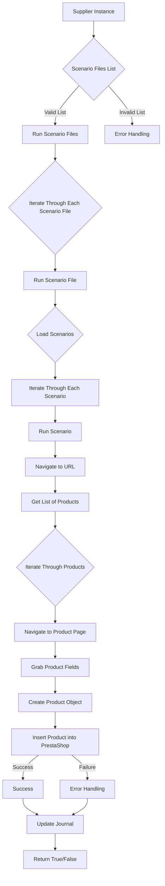

# Анализ кода scenario_executor.mmd

**1. <input code>**

```graph TD
    A[Supplier Instance] --> B{Scenario Files List}
    B -- Valid List --> C[Run Scenario Files]
    B -- Invalid List --> D[Error Handling]
    C --> E{Iterate Through Each Scenario File}
    E --> F[Run Scenario File]
    F --> G{Load Scenarios}
    G --> H[Iterate Through Each Scenario]
    H --> I[Run Scenario]
    I --> J[Navigate to URL]
    J --> K[Get List of Products]
    K --> L{Iterate Through Products}
    L --> M[Navigate to Product Page]
    M --> N[Grab Product Fields]
    N --> O[Create Product Object]
    O --> P[Insert Product into PrestaShop]
    P -- Success --> Q[Success]
    P -- Failure --> R[Error Handling]
    Q --> S[Update Journal]
    R --> S
    S --> T[Return True/False]
```

**2. <algorithm>**

Алгоритм работы представлен в виде блок-схемы.  Схема описывает процесс выполнения сценариев, поступающих от `Supplier Instance`.

1. **Получение списка сценариев:** `Supplier Instance` предоставляет список файлов сценариев.
2. **Проверка списка:** Проверяется валидность списка сценариев. Если список невалиден, происходит обработка ошибок (блок D).
3. **Запуск сценариев:** При валидном списке начинается обработка каждого файла сценария (блок C).
4. **Загрузка сценариев:** Каждый файл сценария загружается (блок F).
5. **Итерация по сценариям:** Внутри каждого файла сценария происходит итерация по каждому сценарию (блок H).
6. **Запуск сценария:** Сценарий запускается (блок I).
7. **Навигация по URL:** Происходит навигация по URL (блок J).
8. **Получение списка продуктов:** Извлекается список продуктов (блок K).
9. **Итерация по продуктам:** Происходит итерация по списку продуктов (блок L).
10. **Навигация по страницам продуктов:** Переход на страницы продуктов (блок M).
11. **Получение данных о продуктах:** Сбор данных о продуктах (блок N).
12. **Создание объекта продукта:** Создание объекта продукта на основе полученных данных (блок O).
13. **Вставка продукта в PrestaShop:** Объект продукта вставляется в базу данных PrestaShop (блок P).
14. **Обработка успешного/неуспешного выполнения:**  Если вставка успешна, происходит обновление журнала (блок Q), иначе - обработка ошибки (блок R).  В обоих случаях выполняется блок S.
15. **Возврат результата:** Возвращается True/False в зависимости от результата выполнения (блок T).


**Пример:**  Если `Supplier Instance` предоставляет список `['scenario1.json', 'scenario2.json']`, то алгоритм будет обрабатывать каждый файл поочередно, выполняя все шаги для каждого сценария внутри каждого файла.

**3. <mermaid>**



**4. <explanation>**

* **Импорты:**  В коде нет импортов, так как это блок-схема, а не исходный код. Импорты в реальном коде `scenario_executor.mmd` будут определять какие библиотеки и модули необходимы для работы конкретных функций (например, для работы с файлами, с базой данных, навигацией).

* **Классы:** Блок-схема не описывает классы. В реальном коде классы могли бы быть определены для `Supplier Instance`, `ScenarioFile`, `Scenario`, `Product`, и т.д.

* **Функции:** Функции (например, `RunScenarioFile`, `LoadScenarios`, `InsertProductIntoPrestaShop`)  последовательно обрабатывают различные этапы выполнения сценария. В действительности эти функции будут содержать подробный код, описывающий логику.

* **Переменные:** Переменные, например, список сценариев,  объект `Product`, содержат данные, необходимые для выполнения сценария.

* **Возможные ошибки/улучшения:**  Схема не указывает на методы обработки различных исключений (например, ошибка при загрузке сценария, ошибка подключения к базе данных).   Реальный код должен содержать механизмы обработки ошибок (try-except блоки),  чтобы программа не аварийно завершалась.  Также схема не указывает на логику валидации входных данных.

**Цепочка взаимосвязей:** `ScenarioExecutor` получает данные от `Supplier Instance`, обрабатывает сценарии и обновляет журнал. Связь с `PrestaShop` реализуется через функции взаимодействия с базой данных.  В реальном коде, скорее всего, будут классы для управления взаимодействием с `PrestaShop` (например, классы для работы с БД).