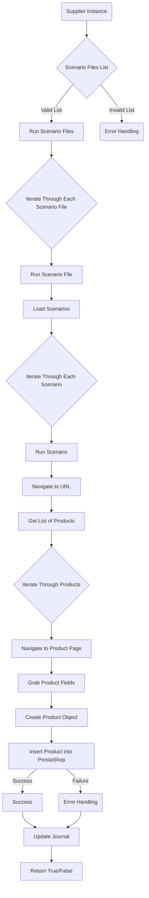

## Анализ кода `scenario_executor.mmd`

### <алгоритм>

1. **Начало**: Процесс начинается с экземпляра `Supplier Instance`, представляющего поставщика данных.
   *Пример*: `Supplier Instance` может быть объектом, содержащим методы для получения данных о товарах и сценариях.

2. **Получение списка файлов сценариев**: Из `Supplier Instance` извлекается список файлов сценариев.
   *Пример*: `Supplier Instance` вызывает метод, возвращающий список путей к файлам сценариев: `['scenario1.json', 'scenario2.json']`.

3. **Разделение списка на валидный и невалидный**: Список файлов проверяется на валидность. Валидные файлы передаются далее, невалидные — в обработку ошибок.
   *Пример*: Если `scenario1.json` валиден, а `invalid_scenario.json` нет, то `scenario1.json` попадёт в список валидных, `invalid_scenario.json` — в список невалидных.

4. **Запуск валидных файлов сценариев**:  Валидные файлы сценариев передаются для запуска.
    *Пример*: Запускается процесс, обрабатывающий каждый файл в списке, например, `['scenario1.json', 'scenario2.json']` по очереди.

5. **Итерация по файлам сценариев**:  Происходит итерация по каждому файлу сценария.
    *Пример*: Если список файлов сценариев `['scenario1.json', 'scenario2.json']`, то сначала будет обработан `scenario1.json`, а потом `scenario2.json`.

6. **Запуск файла сценария**: Каждый файл сценария запускается для обработки.
   *Пример*: `scenario1.json` загружается и начинает обрабатываться.

7. **Загрузка сценариев из файла**: Сценарии загружаются из каждого файла.
    *Пример*: Из `scenario1.json` загружаются сценарии, которые определяют последовательность действий.

8. **Итерация по сценариям**:  Происходит итерация по каждому сценарию.
    *Пример*: Если в загруженных сценариях два сценария, то сначала выполняется первый, а затем второй.

9. **Запуск сценария**: Каждый сценарий запускается для выполнения.
    *Пример*: Запускается сценарий, который определяет, какие действия нужно выполнить, например, переход на определённую страницу сайта, сбор данных.

10. **Переход на URL**: Происходит переход на указанный в сценарии URL.
    *Пример*: Браузер переходит на страницу товара `https://example.com/product/123`.

11. **Получение списка продуктов**: На странице получается список товаров, если требуется.
     *Пример*: Если нужно собрать данные со страницы каталога, то извлекается список товаров, отображаемых на странице.

12. **Итерация по продуктам**: Происходит итерация по каждому продукту.
     *Пример*: Если на странице каталога 3 товара, то выполняется итерация по каждому из них.

13. **Переход на страницу продукта**: Происходит переход на страницу каждого товара.
    *Пример*: Браузер переходит на страницу товара `https://example.com/product/123` поочередно для каждого продукта.

14. **Сбор полей продукта**: Со страницы продукта собираются необходимые поля (название, цена, описание и т.д.).
     *Пример*: Со страницы `https://example.com/product/123` извлекаются название, цена, описание товара.

15. **Создание объекта продукта**: На основе собранных полей создаётся объект продукта.
    *Пример*: Создаётся объект, содержащий поля `name`, `price`, `description` с соответствующими данными.

16. **Вставка продукта в PrestaShop**: Созданный объект продукта вставляется в базу данных PrestaShop.
    *Пример*: Созданный объект продукта добавляется как новый товар в PrestaShop.

17. **Обработка успеха/ошибки**: В зависимости от успешности вставки продукта либо возвращается успех, либо выполняется обработка ошибок.
    *Пример*: Если товар успешно вставлен, возвращается `Success`, иначе выполняется обработка ошибки.

18. **Обновление журнала**: Журнал обновляется, чтобы отразить результат вставки продукта.
   *Пример*: В журнале добавляется запись о том, что товар был успешно вставлен или произошла ошибка.

19. **Завершение**: Процесс возвращает `True`, если все сценарии успешно завершены, в противном случае `False`.

### <mermaid>

### <объяснение>

**Импорты**:
- В данном коде, который представлен в формате `mermaid`, нет явных импортов, так как это диаграмма, а не код на языке программирования. Однако, можно предположить, что в реальном коде, который эта диаграмма визуализирует, есть импорты.  Если говорить о контексте проекта, то можно предположить, что в нем будут импортированы модули для:
  * работы с файловой системой (для загрузки файлов сценариев);
  * сетевых запросов (для перехода по URL и получения данных);
  * обработки JSON (для парсинга файлов сценариев);
  * доступа к PrestaShop API или базе данных (для вставки продуктов);
  * ведения журнала (для логирования действий).

**Классы**:
-   `Supplier Instance`: Это объект, предоставляющий интерфейс для доступа к данным. Он может содержать методы для получения списка файлов сценариев.
-   Диаграмма не отображает остальные классы, но можно предположить их наличие:
    * `Scenario`: Класс, представляющий сценарий, содержит действия, которые необходимо выполнить.
    * `Product`: Класс, представляющий продукт, содержащий поля с его данными.

**Функции**:
-   `Run Scenario Files`: Функция, которая запускает обработку файлов сценариев.
-   `Run Scenario File`: Функция, которая запускает обработку одного файла сценария.
-   `Load Scenarios`: Функция, которая загружает сценарии из файла.
-   `Run Scenario`: Функция, которая запускает выполнение сценария.
-   `Navigate to URL`: Функция, которая переходит по указанному URL.
-   `Get List of Products`: Функция, которая получает список продуктов с текущей страницы.
-   `Navigate to Product Page`: Функция, которая переходит на страницу товара.
-   `Grab Product Fields`: Функция, которая извлекает поля товара со страницы.
-   `Create Product Object`: Функция, которая создаёт объект продукта.
-   `Insert Product into PrestaShop`: Функция, которая вставляет продукт в PrestaShop.
-   `Update Journal`: Функция, которая обновляет журнал.

**Переменные**:
-  `supplierInstance`: Экземпляр класса `Supplier Instance`, используется для доступа к данным.
-  `scenarioFilesList`: Список файлов сценариев, которые необходимо обработать.
-   `productsList`: Список продуктов, полученных на странице.
-   `productObject`: Объект продукта, созданный на основе собранных данных.
-  `errorHandling`:  Переменная или функция, отвечающая за обработку ошибок.
-  `successResult`: Переменная, указывающая на успешное выполнение операции.
-  `returnResult`: Переменная, указывающая на успешное или неуспешное выполнение всей цепочки операций.

**Потенциальные ошибки и области для улучшения**:
- **Обработка ошибок**: В диаграмме есть блоки `Error Handling`, но нет конкретной детализации обработки. В реальном коде необходимо проработать логику обработки исключений, ведения журнала, повторных попыток и т.д.
- **Валидация данных**: Необходимо убедиться, что данные, собранные со страниц продуктов, валидны, и в случае некорректных данных должна быть предусмотрена обработка ошибок.
- **Производительность**: Обработка каждого продукта может занять время. Может потребоваться оптимизация процесса, например, параллельная обработка продуктов.
- **Гибкость**: Сценарии могут быть жёстко запрограммированы. Было бы полезно сделать их более гибкими, например, через конфигурацию или шаблоны.

**Цепочка взаимосвязей с другими частями проекта**:
- Данный код может быть частью большего проекта, который занимается автоматизированным парсингом данных с сайтов и их импортом в PrestaShop.
- `Supplier Instance` может быть связан с модулем сбора данных.
- Функции вставки и обновления PrestaShop должны быть связаны с соответствующим API или базой данных PrestaShop.
- Система журналирования должна взаимодействовать с модулем логирования.
- Запуск данного кода может быть инициирован планировщиком задач или пользовательским интерфейсом.
- В более сложных вариантах может потребоваться взаимодействие с модулями для обработки изображений, ценообразования и прочее.

В целом, диаграмма описывает высокоуровневую структуру процесса. Более подробный анализ реального кода позволит выявить дополнительные детали и взаимосвязи.