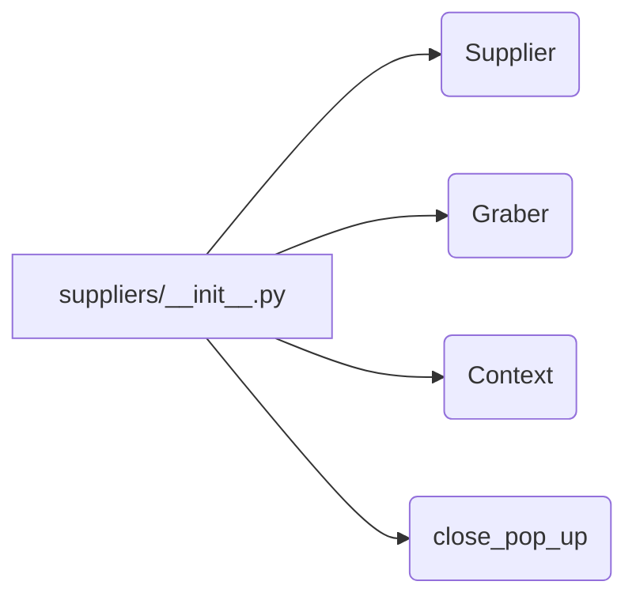

# <input code>

```python
## \file hypotez/src/suppliers/__init__.py
# -*- coding: utf-8 -*-\
#! venv/Scripts/python.exe
#! venv/bin/python/python3.12

"""
.. module: src.suppliers 
	:platform: Windows, Unix
	:synopsis: Модуль поставщика. Класс `Supplier`

Для каждого конкретного поставщика есть свои специфичные методы (функции) извлечения информации. 
Эти функции дополняют базовый класс `Supplier` и подключаются через интерфейс `supplier.related_functions`.

Методы каждого конкретного поставщика находятся в директориях с именем <supplier_prefix>, 
например: `amazon`, `aliexpress`, `morlevi`,...  
- `supplier_prefix` задается во время создания в системе нового поставщика и обычно основывается на сокращении имени или сайта поставщика.

## Взаимосвязь сущностей Supplier, Driver, Product
@image html supplier-warehouse-client.png

"""
MODE = 'dev'

# from .supplier import Supplier
# from .graber import Graber, Context, close_pop_up
```

# <algorithm>

(Здесь блок-схема не приводится, так как код не содержит конкретных алгоритмов, а лишь импорты и комментарии.  Схема была бы тривиальной, отображающей только импорт модулей.)


# <mermaid>



# <explanation>

Этот код представляет собой инициализационный файл (`__init__.py`) для пакета `suppliers` внутри проекта `hypotez`.

* **Импорты**:  
   Файл содержит комментарии о предстоящих импортах из подпапок `supplier` и `graber`.  Важно, что импорты самих классов `Supplier`, `Graber`, `Context` и `close_pop_up` *не* выполнены. Это означает, что в дальнейшем предполагается их импорт в других частях кода этого пакета.  Отсутствующие импорты не влияют на работу файла, но важны для понимания его роли в проекте.  Связь с другими пакетами (`src` в данном случае) осуществляется через импорт из подпапок.  Например, `from .supplier import Supplier`  указывает на импорт из текущей папки `suppliers` подмодуля `supplier`, в котором находится класс `Supplier`.

* **Классы**:
  Классы `Supplier`, `Graber`, `Context` и `close_pop_up`  описываются в документации как ключевые компоненты для работы с поставщиками данных. Но реализация этих классов находится в файлах в `src/suppliers` и *не* определена в `__init__.py`.  Этот файл служит лишь для описания этих классов и их предназначения.

* **Функции**:
  Функции не определены в данном файле. Документация подразумевает существование функций, которые, вероятно, реализуют логику извлечения данных от конкретных поставщиков.  Эти функции будут определены в других файлах и импортированы.

* **Переменные**:
   Переменная `MODE` хранит строку 'dev'.  Возможно, эта переменная определяет режим работы, например, для отладки или производства.

* **Возможные ошибки или области для улучшений**:
  - Отсутствие импорта классов:  Несмотря на подробные комментарии, нет импорта самих классов. Это может привести к ошибкам при попытке их использования.
  - Неопределенные функции:  Не определены функции, о которых упоминается в комментариях, что требует доработки.
  - Отсутствие документации: хотя документация по классу `Supplier` и другим элементам есть в `__init__.py`,  она может быть более подробной и расширенной для лучшей поддержки и понимания.

**Взаимосвязи с другими частями проекта**:
Этот файл является частью модуля `suppliers`, который, вероятно, отвечает за взаимодействие с различными источниками данных (поставщиками). Взаимодействие с другими частями проекта (например, с `Driver` и `Product`) должно быть реализовано через функции и методы, описанные в `src.suppliers` и импортируемые в другие части приложения.  Графическая иллюстрация (в комментариях `@image html supplier-warehouse-client.png`)  показывает, что `Supplier` связан с `Driver` и `Product`.  Подразумевается, что эти сущности (`Driver` и `Product`) хранятся в других модулях/файлах (`src.drivers`, `src.products` и т.д.).