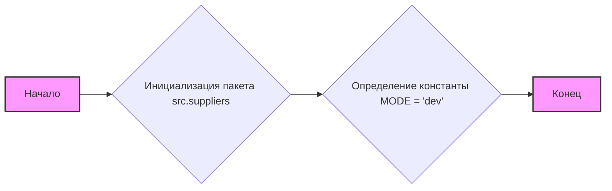
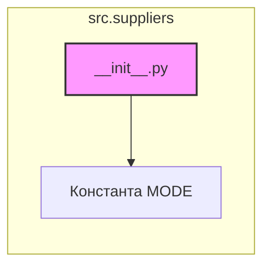

## Анализ кода `hypotez/src/suppliers/__init__.py`

### 1. <алгоритм>

**Описание:**
Файл `__init__.py` в пакете `src.suppliers` предназначен для инициализации пакета. В данном коде он выполняет роль точки входа и содержит метаданные для пакета, такие как описание модуля. 
На данный момент, в файле инициализации не происходит никакого импорта или определения переменных, за исключением объявления константы MODE.

**Блок-схема:**

**Примеры:**
1. **Начало:** Запускается python интерпретатор, инициируется загрузка модуля `src.suppliers`.
2. **Инициализация пакета src.suppliers:** Пакет `src.suppliers` загружается в память.
3. **Определение константы MODE = 'dev':** Переменной `MODE` присваивается строковое значение `'dev'`. Это значение может использоваться для управления режимом работы пакета (например, отладочным режимом).
4. **Конец:** Инициализация пакета завершена.

### 2. <mermaid>

**Объяснение зависимостей:**

- **`__init__.py`**: Этот файл является основным файлом для инициализации пакета `src.suppliers`. Он содержит метаданные и определяет поведение пакета при импорте. В данном случае файл содержит только объявление константы MODE.
- **`Константа MODE`**:  `__init__.py` объявляет константу `MODE` со значением `'dev'`. Это означает, что в данном пакете установлен режим разработки.

### 3. <объяснение>

**Импорты:**

-   В текущей версии кода отсутствуют импорты внутри `__init__.py`. Раскомментированные строки `# from .supplier import Supplier` и `# from .graber import Graber, Context, close_pop_up` показывают намерение импортировать классы `Supplier`, `Graber`, `Context` и функцию `close_pop_up` из других модулей в пакете `src.suppliers`. Но в текущей версии эти импорты отключены.
    
-   Если бы импорты были активны, то:
    -   `from .supplier import Supplier`: Импортировал бы класс `Supplier` из модуля `supplier.py`, находящегося в текущем пакете `src.suppliers`. Этот класс, вероятно, представляет базовую структуру поставщика.
    -   `from .graber import Graber, Context, close_pop_up`: Импортировал бы класс `Graber`, класс `Context` и функцию `close_pop_up` из модуля `graber.py`, находящегося в текущем пакете `src.suppliers`. Эти элементы, вероятно, используются для сбора данных с веб-сайтов поставщиков.
**Классы:**
- В текущем коде классы отсутствуют. Закомментированы строчки импорта классов.
- Если бы импорты были активны, то:
    - `Supplier`: Класс, представляющий поставщика. Вероятно, содержит общие атрибуты и методы, используемые для работы с разными поставщиками.
    - `Graber`: Класс, отвечающий за извлечение данных с веб-сайтов поставщиков. Может содержать методы для навигации по сайту, поиска нужных элементов и парсинга HTML.
    - `Context`: Класс, содержащий контекст выполнения сбора данных (например, текущий URL, параметры запроса).

**Функции:**

-   В текущем коде функции отсутствуют. Закомментирована строчка импорта функции.
    
-   Если бы импорт был активен, то:
    -   `close_pop_up`: Функция для закрытия всплывающих окон на веб-сайтах поставщиков.
    
**Переменные:**
-   `MODE`: Строковая константа, устанавливающая режим работы модуля. В данном случае, имеет значение `'dev'`, что означает режим разработки.

**Потенциальные ошибки и области для улучшения:**

1. **Отсутствие импортов:** Сейчас файл `__init__.py` по сути пустой. Его нужно наполнить, как минимум импортами для `Supplier`.
2. **Зависимости:** На данный момент не видны зависимости от других модулей пакета `src`, так как импорты закомментированы.
3. **Режим `dev`:** Использование строковой константы `MODE` для указания режима работы является базовым подходом. Возможно, в будущем стоит использовать более гибкие механизмы конфигурации.
4. **Документация:**  Хорошо, что есть docstring, описывающий назначение модуля.
5. **Комментарии:** Присутствуют комментарии, поясняющие назначение кода.

**Взаимосвязь с другими частями проекта:**

-   **Конфигурация:** Константа `MODE` может использоваться другими частями проекта для определения поведения программы (например, для включения отладочных сообщений или подключения тестовых баз данных).
-   **Извлечение данных:** Классы `Supplier`, `Graber` и другие сущности, если они импортируются в будущих версиях, будут использоваться для извлечения и обработки данных из различных веб-сайтов поставщиков.
-   **Модули поставщиков:** Модули отдельных поставщиков (например, `amazon`, `aliexpress`) будут использовать базовые классы и функции, определенные в пакете `src.suppliers`, для реализации специфичной логики сбора данных.

**Цепочка взаимосвязей:**
1.  Файл `__init__.py` инициализирует пакет `src.suppliers`, устанавливая основные настройки и импортируя необходимые компоненты (которые пока закомментированы).
2.  Класс `Supplier` является базовым классом для всех поставщиков. Он содержит общую логику работы с поставщиками.
3.  Модули отдельных поставщиков (например, `amazon`, `aliexpress`) наследуют класс `Supplier` и добавляют специфичные для каждого поставщика методы.
4.  Класс `Graber` и другие функции из модуля `graber` используются для извлечения данных с веб-сайтов поставщиков.
5.  Другие части проекта, использующие пакет `src.suppliers`, будут импортировать класс `Supplier` и его производные классы, а также использовать другие компоненты пакета для работы с поставщиками и их данными.