## АНАЛИЗ КОДА: `hypotez/src/suppliers/__init__.py`

### 1. <алгоритм>

**Блок-схема:**

```mermaid
flowchart TD
    Start[Начало] --> ModuleDescription[Описание модуля `src.suppliers`];
    ModuleDescription --> SupplierConcept[Концепция поставщика];
    SupplierConcept --> SupplierClass[Базовый класс `Supplier`];
    SupplierClass --> SpecificSupplier[Специфичные методы (функции) для каждого поставщика];
    SpecificSupplier --> RelatedFunctions[Интерфейс `supplier.related_functions`];
    RelatedFunctions --> SupplierDirectory[Директории с именем `<supplier_prefix>` (например, `amazon`, `aliexpress`, `morlevi`)];
    SupplierDirectory --> SupplierPrefix[`<supplier_prefix>` - задается при создании поставщика];
    SupplierPrefix --> Relationship[Взаимосвязь Supplier, Driver, Product];
    Relationship --> MODE_Variable[Глобальная переменная `MODE = 'dev'`];
    MODE_Variable --> End[Конец];
```

**Примеры:**

-   **Описание модуля**: Модуль `src.suppliers` отвечает за обработку данных от разных поставщиков.
-   **Концепция поставщика**: Каждый поставщик (например, Amazon, AliExpress) имеет свои особенности извлечения данных.
-   **Базовый класс**: `Supplier` – это базовый класс, от которого наследуются специфичные классы поставщиков.
-   **Специфичные методы**: Для каждого поставщика создаются методы для обработки конкретного формата данных (например, извлечение цен, описаний и т.д.).
-   **Интерфейс**: `supplier.related_functions` связывает базовый класс `Supplier` со специфичными методами конкретного поставщика.
-   **Директории**: Методы конкретного поставщика хранятся в отдельной директории с названием `<supplier_prefix>`.
-   **Префикс**: `amazon`, `aliexpress` и т.д. – это примеры префиксов поставщиков.
-    **Взаимосвязь**: `Supplier` связан с `Driver` (который управляет браузером) и `Product`.
-   **Глобальная переменная `MODE`**: В режиме разработки (`dev`) заданы определенные настройки.

```mermaid
flowchart TD
    subgraph src.suppliers
        Start[Начало] --> ModuleDescription[Описание модуля `src.suppliers`];
        ModuleDescription --> SupplierConcept[Концепция поставщика];
        SupplierConcept --> BaseSupplierClass[Базовый класс `Supplier`];
        BaseSupplierClass --> SpecificSupplierMethods[Специфичные методы поставщика];
        SpecificSupplierMethods --> RelatedFunctionsInterface[Интерфейс `supplier.related_functions`];
        RelatedFunctionsInterface --> SupplierDirectories[Директории `<supplier_prefix>`];
        SupplierDirectories --> SupplierPrefix[`<supplier_prefix>`];
        SupplierPrefix --> EntitiesRelationship[Взаимосвязь `Supplier`, `Driver`, `Product`];
        EntitiesRelationship --> GlobalModeVariable[Глобальная переменная `MODE = 'dev'`];
        GlobalModeVariable --> End[Конец];
    end
    
    style ModuleDescription fill:#f9f,stroke:#333,stroke-width:2px
    style EntitiesRelationship fill:#ccf,stroke:#333,stroke-width:2px
    style GlobalModeVariable fill:#afa,stroke:#333,stroke-width:2px
```

### 2. <mermaid>



**Объяснение `mermaid` диаграммы:**

Диаграмма описывает структуру и логику модуля `src.suppliers`. 
- **`src.suppliers`**: Основной контейнер, представляющий весь модуль.
- **`ModuleDescription`**: Описание модуля, его цели и принципов работы.
- **`SupplierConcept`**: Объясняет концепцию поставщиков и их различия.
- **`BaseSupplierClass`**:  Представляет базовый класс `Supplier`.
- **`SpecificSupplierMethods`**: Специфические методы для каждого поставщика.
- **`RelatedFunctionsInterface`**: Интерфейс `supplier.related_functions` как способ связи.
- **`SupplierDirectories`**: Директории с префиксами (`<supplier_prefix>`).
- **`SupplierPrefix`**:  Описание префикса поставщика.
-  **`EntitiesRelationship`**:  Связь между  `Supplier`, `Driver`, `Product`.
-  **`GlobalModeVariable`**:  Глобальная переменная `MODE`.
- **`Start` и `End`**: Начало и конец процесса.

### 3. <объяснение>

#### Импорты:

В данном коде импорты закомментированы:

```python
# from .supplier import Supplier
# from .graber import Graber, Context, close_pop_up
```

-   `from .supplier import Supplier`: Импортирует класс `Supplier` из модуля `supplier` в текущем пакете. Это базовый класс, который, вероятно, будет расширен для каждого конкретного поставщика.
-  `from .graber import Graber, Context, close_pop_up`: Импортирует классы и функции, связанные с парсингом веб-страниц. `Graber`, вероятно, отвечает за извлечение данных с сайта поставщика, `Context` может предоставлять контекст для парсинга, а `close_pop_up` может быть функцией для закрытия всплывающих окон.

#### Классы:

В данном файле классы не определены.
`Supplier`, `Graber` и `Context` находятся в других модулях, и они импортируются, когда раскомментированы.
-   `Supplier`: Базовый класс для всех поставщиков. Он предоставляет общие методы и атрибуты.
-   `Graber`: Класс для парсинга веб-страниц поставщика. Он может использовать различные инструменты (например, Selenium) для извлечения данных.
-    `Context`: Класс контекста, используемый для парсинга. Может хранить информацию о состоянии парсинга, сессиях браузера и т.д.

#### Функции:

В данном файле нет определения функций.
- `close_pop_up`: Вспомогательная функция для закрытия всплывающих окон, связанных с веб-страницами поставщика.

#### Переменные:

-   `MODE = 'dev'`: Глобальная переменная, определяющая режим работы модуля. В данном случае установлен режим разработки (`dev`). Это может влиять на различные настройки и параметры приложения.
    -   Тип: Строка (`str`).
    -   Использование:  Устанавливает режим работы (например, разработка, тестирование, производство).

#### Потенциальные ошибки и области для улучшения:

-   **Закомментированные импорты**: Код имеет закомментированные импорты, что может затруднить отладку и понимание зависимостей.
-   **Отсутствие конкретной реализации**: Файл `__init__.py` служит только для объявления общих понятий и констант, а не конкретной реализации классов, которые он описывает.
-   **Разброс функциональности**: Описанные классы и функции связаны с парсингом веб-страниц. Целесообразно рассмотреть более точное разделение ответственности между классами.

#### Взаимосвязи с другими частями проекта:

-   `src.suppliers` является частью проекта, отвечающей за работу с данными от разных поставщиков.
-   Модуль, вероятно, взаимодействует с другими частями проекта, такими как `src.products`, `src.drivers` и `src.settings` и тд.  через импорты и вызовы классов и функций.

```mermaid
flowchart TD
    subgraph src.suppliers
        A[src.suppliers.__init__.py]
    end
     A --> B[src.suppliers.supplier.py]
     A --> C[src.suppliers.graber.py]
    
     
     style A fill:#ccf,stroke:#333,stroke-width:2px
     style B fill:#afa,stroke:#333,stroke-width:2px
     style C fill:#afa,stroke:#333,stroke-width:2px