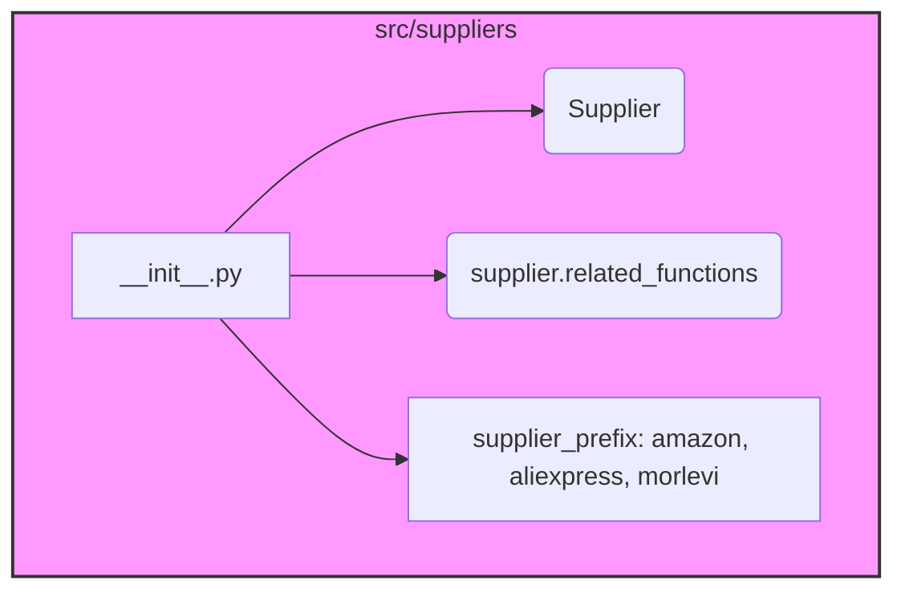

## Анализ кода `hypotez/src/suppliers/__init__.py`

### 1. <алгоритм>

Файл `__init__.py` в директории `src/suppliers` служит для инициализации пакета `suppliers`. Он содержит мета-информацию о модуле, такую как краткое описание его назначения и структуры.

1.  **Описание модуля**:
    *   Содержит общую информацию о модуле `src.suppliers`.
    *   Указывает на его платформу (Windows, Unix) и назначение (модуль поставщика).

2.  **Класс `Supplier`**:
    *   Упоминает класс `Supplier` как основной класс модуля.
    *   Подчеркивает, что каждый конкретный поставщик имеет свои методы извлечения информации.

3.  **Интерфейс `supplier.related_functions`**:
    *   Указывает на интерфейс `supplier.related_functions`, который используется для подключения специфичных методов поставщиков к базовому классу `Supplier`.

4.  **Структура директорий**:
    *   Описывает структуру директорий, где методы конкретных поставщиков находятся в директориях с именем `<supplier_prefix>`.
    *   Примеры: `amazon`, `aliexpress`, `morlevi`.
    *   `supplier_prefix` задается при создании нового поставщика.

5.  **Взаимосвязь сущностей**:
    *   Указывает на взаимосвязь сущностей `Supplier`, `Driver`, `Product` через диаграмму `supplier-warehouse-client.png`.

**Пример**:
Для поставщика `amazon` в директории `amazon` будут находиться методы, специфичные для извлечения информации с сайта `amazon`. Эти методы подключаются к базовому классу `Supplier` через интерфейс `supplier.related_functions`.

### 2. <mermaid>

**Объяснение зависимостей**:

*   `__init__.py`: Инициализирует пакет `suppliers` и содержит общую информацию о его структуре.
*   `Supplier`: Базовый класс для всех поставщиков.
*   `supplier.related_functions`: Интерфейс для подключения специфичных методов поставщиков к базовому классу `Supplier`.
*   `supplier_prefix`: Префикс, определяющий директорию с методами конкретного поставщика (например, `amazon`, `aliexpress`, `morlevi`).

### 3. <объяснение>

**Импорты**:

*   `# from .supplier import Supplier`: Импорт класса `Supplier` из модуля `supplier`. Закомментирован, но подразумевается его использование в пакете.
*   `# from .graber import Graber, Context, close_pop_up`: Импорт класса `Graber`, `Context` и функции `close_pop_up` из модуля `graber`. Закомментирован, но подразумевается их использование в пакете.

**Классы**:

*   `Supplier`: Базовый класс для конкретных поставщиков. Предоставляет общую функциональность, которая дополняется специфичными методами для каждого поставщика.
    *   Атрибуты: Могут включать информацию о поставщике, такую как имя, контактные данные и т.д.
    *   Методы: Могут включать методы для получения и обработки данных о продуктах.
*   `Graber`: Используется для сбора данных с веб-страниц.
    *   `Context`: Используется для управления контекстом выполнения задач.
    *   `close_pop_up`: Функция для закрытия всплывающих окон.

**Функции**:

*   Специфичные методы для каждого поставщика:
    *   Аргументы: Зависят от конкретного метода и могут включать параметры для поиска продуктов, фильтрации результатов и т.д.
    *   Возвращаемые значения: Данные о продуктах, полученные с сайта поставщика.
    *   Назначение: Извлечение информации о продуктах с сайта конкретного поставщика.

**Переменные**:

*   `supplier_prefix`: Строка, определяющая префикс имени поставщика и используемая для организации директорий с его специфичными методами.

**Потенциальные ошибки или области для улучшения**:

*   Необходимо убедиться, что все специфичные методы поставщиков корректно подключаются к базовому классу `Supplier` через интерфейс `supplier.related_functions`.
*   Следует обеспечить обработку ошибок при извлечении данных с сайтов поставщиков.
*   Диаграмма `supplier-warehouse-client.png` должна быть актуальной и отражать текущую структуру взаимосвязей между сущностями.

**Взаимосвязь с другими частями проекта**:

*   Модуль `suppliers` взаимодействует с модулем `products` для получения и обработки данных о продуктах.
*   Он также взаимодействует с модулем `drivers` для управления драйверами браузеров, используемыми для сбора данных.