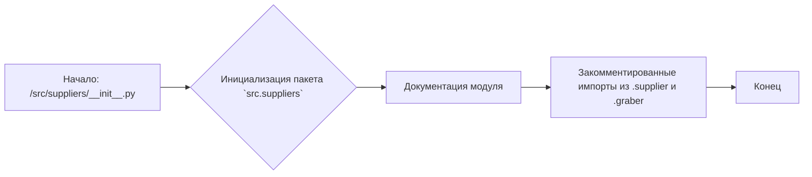
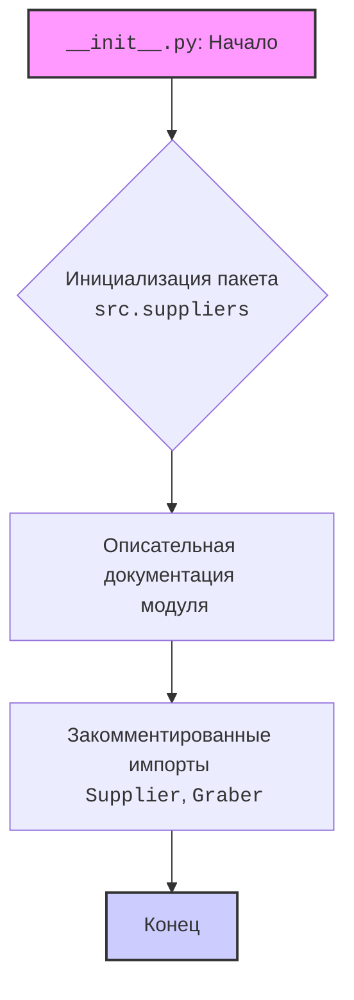

## АНАЛИЗ КОДА: `src/suppliers/__init__.py`

### 1. <алгоритм>

**Описание:**

Файл `__init__.py` в пакете `src.suppliers` выступает как точка входа для этого пакета, который отвечает за управление поставщиками.  Он не содержит исполняемого кода, а в основном содержит документацию и закомментированные импорты.  Идея заключается в том, что каждый поставщик (например, Amazon, AliExpress) будет иметь свой модуль, который будет расширять базовый класс `Supplier` и подключать специфичные функции через интерфейс `supplier.related_functions`. 

**Блок-схема:**

**Примеры:**

- **`Начало`**: Запуск интерпретатора Python, при обращении к пакету `src.suppliers`.
- **`Инициализация пакета src.suppliers`**:  `__init__.py` делает директорию `suppliers` пакетом Python.
- **`Документация модуля`**: Строка документации, описывающая модуль поставщиков, сущности `Supplier`, `Driver`, `Product` и структуру хранения методов поставщиков.
- **`Закомментированные импорты из .supplier и .graber`**: В будущем планируется использовать классы `Supplier` и `Graber` из этих модулей.
- **`Конец`**: Завершение обработки файла `__init__.py`.

### 2. <mermaid>

**Объяснение:**

- **`flowchart TD`**:  Указывает, что диаграмма является блок-схемой с направлением сверху вниз.
- **`A[__init__.py: Начало]`**: Начальная точка - файл `__init__.py`, который инициирует пакет.
- **`B{Инициализация пакета src.suppliers}`**: Представляет процесс инициализации пакета `src.suppliers`.
- **`C[Описательная документация модуля]`**: Описывает наличие документации в модуле, которая определяет его назначение и структуру.
- **`D[Закомментированные импорты Supplier, Graber]`**: Показывает закомментированные импорты, что означает, что они не используются, но могут быть задействованы в будущем.
- **`E[Конец]`**:  Конечная точка работы кода в файле.
- **`style A fill:#f9f,stroke:#333,stroke-width:2px`**:  Стилизация начального блока.
- **`style E fill:#ccf,stroke:#333,stroke-width:2px`**: Стилизация конечного блока.

### 3. <объяснение>

**Импорты:**

*   В текущем виде файл не содержит активных импортов. Закомментированные импорты (`from .supplier import Supplier` и `from .graber import Graber, Context, close_pop_up`) предполагают, что в будущем будут использоваться классы `Supplier` и `Graber` из модулей `supplier.py` и `graber.py` соответственно. 
*  `Supplier` вероятно будет базовым классом для всех поставщиков, предоставляя общие методы и атрибуты.
*  `Graber` вероятно отвечает за получение данных из источников, может иметь контекст и функцию для закрытия всплывающих окон (`close_pop_up`).

**Классы:**

*   На данный момент в `__init__.py` нет объявленных классов. Однако, из документации и закомментированных импортов можно сделать вывод, что в пакете `suppliers` будет использоваться класс `Supplier`, который является абстракцией для работы с различными поставщиками. Класс `Supplier`, предположительно, будет иметь методы для получения данных о продуктах от поставщика.

**Функции:**

*   В данном файле нет объявленных функций. Функциональность, относящаяся к конкретным поставщикам будет реализована в отдельных модулях, которые будут расширять `Supplier`.

**Переменные:**

*  В файле `__init__.py` нет переменных, это файл инициализации пакета.

**Потенциальные ошибки и области для улучшения:**

*   **Отсутствие импорта:** Файл в текущем виде не несет функциональности, поскольку импорты закомментированы. Чтобы пакет стал функциональным, необходимо раскомментировать импорты и реализовать классы `Supplier` и `Graber`.
*   **Неопределенность структуры модулей:** Необходимо более четко определить, как будут организованы модули для каждого поставщика, и как будет происходить взаимодействие с классом `Supplier`.

**Взаимосвязи с другими частями проекта:**

*   `src.suppliers` будет взаимодействовать с модулем `src.products`, поскольку будет предоставлять данные о продуктах от разных поставщиков.
*   Возможна связь с модулем `src.drivers`, если `Graber` использует драйверы для веб-скрапинга или других методов получения данных.
*   Взаимодействие с модулем `src.settings` (если используется) для хранения настроек по поставщикам.

**Дополнительные замечания:**

*   Документация в `__init__.py` является хорошим началом, но нужно расширить ее после реализации классов и методов.
*   Изображение `supplier-warehouse-client.png` подразумевает связь между поставщиком, складом и клиентом, что является важной концепцией для приложения.