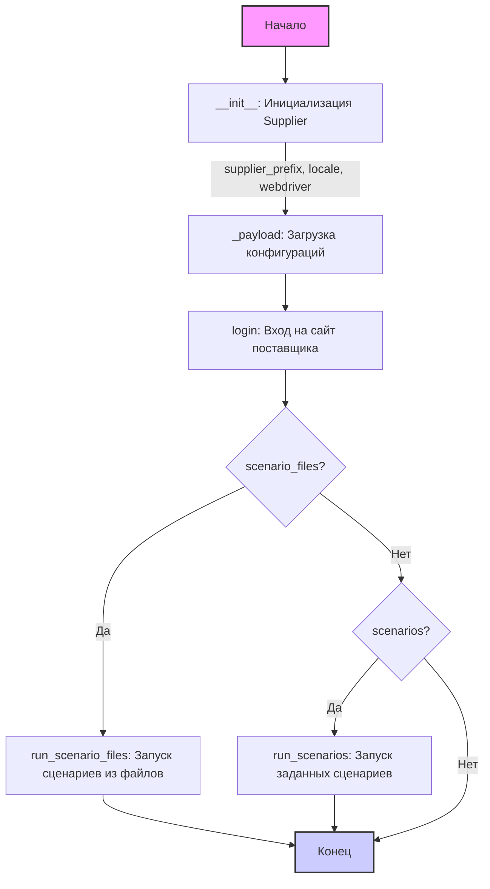

## Анализ класса `Supplier`

### <алгоритм>

**Блок-схема работы класса `Supplier`:**

1.  **Инициализация (`__init__`)**:
    *   При создании объекта `Supplier` передаются параметры: `supplier_prefix` (строка, например, 'aliexpress'), `locale` (строка, по умолчанию 'en'), `webdriver` (строка, объект `Driver` или `bool`, по умолчанию 'default'), дополнительные атрибуты `*attrs` и `**kwargs`.
        ```python
        supplier = Supplier(supplier_prefix='aliexpress', locale='en', webdriver='chrome')
        ```
    *   Сохраняются `supplier_prefix` и `locale`.
    *   Вызывается метод `_payload` для загрузки конфигураций и инициализации веб-драйвера.
    *   **Пример**: Создается объект `Supplier` для AliExpress с английской локалью и драйвером Chrome.

2.  **Загрузка конфигурации (`_payload`)**:
    *   Принимает параметр `webdriver` (строка, объект `Driver` или `bool`), дополнительные атрибуты `*attrs` и `**kwargs`.
        ```python
        def _payload(self, webdriver: str | Driver | bool, *attrs, **kwargs) -> bool:
            # Логика загрузки конфигурации и инициализации веб-драйвера
        ```
    *   Загружает настройки поставщика (`supplier_settings`), локаторы (`locators`) и другие параметры из конфигурационных файлов.
        *   **Пример:** Загружаются настройки, специфичные для AliExpress, из файла конфигурации.
    *   Инициализирует веб-драйвер на основе переданного значения параметра `webdriver`.
        *   **Пример:** Инициализируется драйвер Chrome для взаимодействия с сайтом.
    *   Возвращает `True` после успешной загрузки конфигураций и инициализации.

3.  **Логин (`login`)**:
    *   Метод `login` не принимает никаких аргументов.
        ```python
        def login(self) -> bool:
             # Логика входа на сайт поставщика
        ```
    *   Осуществляет вход на сайт поставщика, используя сохраненные учетные данные (`login_data`).
        *   **Пример:** Выполняется вход в аккаунт AliExpress.
    *   Возвращает `True` после успешного входа.

4.  **Запуск сценариев из файлов (`run_scenario_files`)**:
    *   Принимает параметр `scenario_files` (строка или список строк с именами файлов сценариев).
        ```python
        def run_scenario_files(self, scenario_files: str | List[str] = None) -> bool:
            # Логика запуска сценариев из файлов
        ```
    *   Загружает и выполняет каждый сценарий из списка файлов.
        *   **Пример:** Запускается сценарий, описанный в файле `example_scenario.json`.
    *   Возвращает `True` в случае успешного выполнения всех сценариев.

5.  **Запуск сценариев (`run_scenarios`)**:
    *   Принимает параметр `scenarios` (словарь или список словарей с описанием сценариев).
        ```python
        def run_scenarios(self, scenarios: dict | list[dict]) -> bool:
             # Логика запуска сценариев
        ```
    *   Выполняет каждый сценарий из переданного списка.
        *   **Пример:** Запускается сценарий, который выполняет скрапинг списка продуктов.
    *   Возвращает `True` в случае успешного выполнения всех сценариев.

### <mermaid>



**Объяснение `mermaid` диаграммы:**

1.  **`Start[Начало]`**: Начальная точка выполнения программы.
2.  **`Initialize[__init__: Инициализация Supplier]`**: Вызывается конструктор `__init__` класса `Supplier`. Принимает `supplier_prefix`, `locale`, `webdriver`, `*attrs` и `**kwargs`.
3.  **`Payload[_payload: Загрузка конфигураций]`**: Вызывается метод `_payload`, который загружает конфигурации поставщика, локаторы и инициализирует веб-драйвер.
4.  **`Login[login: Вход на сайт поставщика]`**: Вызывается метод `login`, который выполняет вход на сайт поставщика, если это необходимо.
5.   **`ScenarioFiles{scenario_files?}`**: Проверяется, переданы ли файлы сценариев. Если да, то переходим к запуску сценариев из файлов.
6. **`RunScenarioFiles[run_scenario_files: Запуск сценариев из файлов]`**: Вызывается метод `run_scenario_files`, который загружает и выполняет сценарии из указанных файлов.
7.   **`RunScenarios{scenarios?}`**: Проверяется, передан ли список словарей сценариев. Если да, то переходим к запуску заданных сценариев.
8.  **`RunSpecifiedScenarios[run_scenarios: Запуск заданных сценариев]`**: Вызывается метод `run_scenarios`, который выполняет сценарии, описанные в переданном словаре или списке словарей.
9.  **`End[Конец]`**: Конечная точка выполнения.

### <объяснение>

**Импорты**:

В предоставленном фрагменте кода нет явных импортов. Однако, из контекста подразумевается использование:

*   `Driver`: Предположительно, класс для работы с веб-драйверами (например, Selenium).
*   `List` из модуля `typing`: Используется для аннотации типов, в частности, для указания, что `scenario_files` может быть списком строк.
*   Конфигурационные файлы поставщика, которые не отображены явно, но подразумеваются из `_payload`.

**Класс `Supplier`**:

*   **Роль**: Базовый класс для управления поставщиками данных. Он служит шаблоном для создания классов, управляющих взаимодействием с конкретными поставщиками (например, Amazon, AliExpress).
*   **Атрибуты**:
    *   `supplier_id` (уникальный идентификатор поставщика).
    *   `supplier_prefix` (строка, например, 'aliexpress').
    *   `supplier_settings` (настройки поставщика, загруженные из конфигурационного файла).
    *   `locale` (локализация, например, 'en').
    *   `price_rule` (правило расчета цен).
    *   `related_modules` (модуль с функциями поставщика).
    *   `scenario_files` (список файлов сценариев).
    *   `current_scenario` (текущий выполняемый сценарий).
    *   `login_data` (данные для входа на сайт поставщика).
    *   `locators` (локаторы веб-элементов).
    *   `driver` (веб-драйвер).
    *   `parsing_method` (метод парсинга данных, например, 'webdriver', 'api', 'xls', 'csv').
*   **Методы**:
    *   `__init__`: Конструктор, инициализирует атрибуты класса.
    *   `_payload`: Загружает конфигурации и настраивает веб-драйвер.
    *   `login`: Выполняет вход на сайт поставщика.
    *   `run_scenario_files`: Запускает сценарии из файлов.
    *   `run_scenarios`: Запускает сценарии из переданных данных.
*   **Взаимодействие**: Класс предназначен для расширения. Дочерние классы могут переопределять методы для специфической логики каждого поставщика.

**Функции**:

*   `__init__`:
    *   **Аргументы**: `supplier_prefix`, `locale`, `webdriver`, `*attrs`, `**kwargs`.
    *   **Возвращаемое значение**: Нет (конструктор).
    *   **Назначение**: Инициализация атрибутов объекта класса `Supplier` при его создании.
    *   **Пример**: `Supplier(supplier_prefix='aliexpress', locale='en', webdriver='chrome')`.
*   `_payload`:
    *   **Аргументы**: `webdriver`, `*attrs`, `**kwargs`.
    *   **Возвращаемое значение**: `bool` (успех или неудача).
    *   **Назначение**: Загрузка конфигурации поставщика, инициализация веб-драйвера.
    *   **Пример**: Загружает файл с локаторами и параметрами для AliExpress.
*   `login`:
    *   **Аргументы**: Нет.
    *   **Возвращаемое значение**: `bool` (успех или неудача).
    *   **Назначение**: Выполнение входа на сайт поставщика.
    *   **Пример**: Вход на сайт AliExpress с использованием сохраненных учетных данных.
*   `run_scenario_files`:
    *   **Аргументы**: `scenario_files` (строка или список строк).
    *   **Возвращаемое значение**: `bool` (успех или неудача).
    *   **Назначение**: Запуск сценариев из указанных файлов.
    *   **Пример**: Запуск сценария из `example_scenario.json`.
*   `run_scenarios`:
    *   **Аргументы**: `scenarios` (словарь или список словарей).
    *   **Возвращаемое значение**: `bool` (успех или неудача).
    *   **Назначение**: Запуск сценариев, описанных в переданных данных.
    *   **Пример**: Запуск сценария для сбора списка продуктов: `run_scenarios([{'action': 'scrape', 'target': 'product_list'}])`.

**Переменные**:
* Атрибуты класса, такие как `supplier_prefix`, `locale`, `webdriver`,  `scenario_files`, `login_data`, `locators`, `driver`, и  `parsing_method`. Их типы включают строку (`str`), список строк (`List[str]`), словарь (`dict`), объект `Driver` или логическое значение (`bool`). 

**Потенциальные ошибки и области для улучшения**:

1.  **Обработка ошибок**: Не предусмотрена явная обработка исключений в методах `_payload`, `login`, `run_scenario_files`, `run_scenarios`.
2.  **Конфигурация драйвера**: Не описан процесс инициализации веб-драйвера в `_payload`, что может привести к проблемам при его настройке.
3.  **Сценарии**: Не детализирован формат сценариев, которые обрабатываются методами `run_scenario_files` и `run_scenarios`. Необходимо унифицировать и документировать их структуру.
4.  **Расширяемость**: Класс предоставляет базовую структуру. Необходимо четко определить интерфейсы для расширения класса, а также задокументировать архитектуру проекта для новых поставщиков.

**Взаимосвязи с другими частями проекта**:

*   Этот класс является центральным элементом для работы с поставщиками. Он может быть связан с модулями для парсинга данных, обработки и хранения данных, а также с пользовательским интерфейсом для запуска задач и отображения результатов.
*  Зависит от модуля `Driver`, который, скорее всего, является частью более широкой инфраструктуры для работы с веб-драйверами.

Этот анализ предоставляет подробное описание функциональности и структуры класса `Supplier`, что помогает понять его назначение и взаимодействие с другими компонентами проекта.