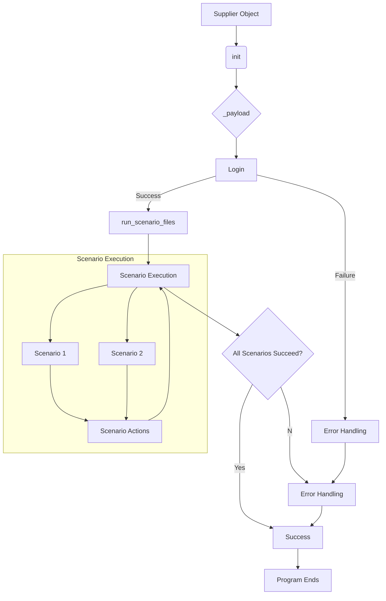

# <input code>

```python
Here's a detailed explanation of what the `Supplier` class does, in English:

### Overview of the `Supplier` Class

The `Supplier` class serves as a base class for managing data suppliers in your application. It provides a framework for interacting with various data sources, such as Amazon, AliExpress, Walmart, and others. This class handles the initialization of supplier-specific settings, manages scenarios for data collection, and provides methods for logging in and executing scenarios.

### Components of the `Supplier` Class

#### 1. **Class Attributes**
   - `supplier_id`: Unique identifier for the supplier.
   - `supplier_prefix`: Prefix for the supplier, e.g., `aliexpress` or `amazon`.
   - `supplier_settings`: Settings for the supplier, loaded from a configuration file.
   - `locale`: Localization code (e.g., `en` for English, `ru` for Russian).
   - `price_rule`: Rule for calculating prices (e.g., adding VAT or applying discounts).
   - `related_modules`: Module containing supplier-specific functions.
   - `scenario_files`: List of scenario files to be executed.
   - `current_scenario`: The currently executing scenario.
   - `login_data`: Login credentials for accessing the supplier’s website (if required).
   - `locators`: Locators for web elements on the supplier’s site.
   - `driver`: Web driver for interacting with the supplier’s site.
   - `parsing_method`: Method for data parsing (e.g., `webdriver`, `api`, `xls`, `csv`).

#### 2. **Methods**
   - `__init__`: Constructor that initializes attributes based on the supplier prefix and other parameters.
     ```python
     def __init__(self, supplier_prefix: str, locale: str = 'en', webdriver: str | Driver | bool = 'default', *attrs, **kwargs):
         # Initializes supplier prefix, locale, and web driver
     ```

   - `_payload`: Loads supplier-specific configurations, locators, and initializes the web driver.
     ```python
     def _payload(self, webdriver: str | Driver | bool, *attrs, **kwargs) -> bool:
         # Loads configuration files and initializes the web driver
     ```

   - `login`: Handles the login process for the supplier’s site if authentication is required.
     ```python
     def login(self) -> bool:
         # Performs login to the supplier's site
     ```

   - `run_scenario_files`: Executes one or more scenario files.
     ```python
     def run_scenario_files(self, scenario_files: str | List[str] = None) -> bool:
         # Executes scenario files and returns True if all scenarios are successfully completed
     ```

   - `run_scenarios`: Executes one or more scenarios.
     ```python
     def run_scenarios(self, scenarios: dict | list[dict]) -> bool:
         # Executes given scenarios and returns True if all scenarios are successfully completed
     ```
```

# <algorithm>

The algorithm describes the `Supplier` class's workflow.  Unfortunately, the provided documentation lacks the crucial code details. Therefore, a complete flowchart can't be created.

However, a high-level description of the algorithm's steps is possible:

1. **Initialization (`__init__`):**
    * Takes supplier prefix, locale, webdriver as input.
    * Initializes `supplier_prefix`, `locale`, etc.
    * Sets a default `webdriver` value, possibly "chrome".

2. **Configuration Loading (`_payload`):**
    * Loads configuration files (e.g., settings, locators).
    * Initializes the web driver (e.g., 'chrome', 'firefox').

3. **Login (`login`):**
    * Attempts to log in to the supplier's website. This will involve interacting with the web driver.
    * Returns `True` if successful, `False` otherwise.

4. **Scenario Execution (`run_scenario_files`, `run_scenarios`):**
    * Iterates over the list of scenarios (`scenario_files` or `scenarios`).
    * Executes each scenario. The specific actions within a scenario are defined in the external data or configurations.
    * Returns `True` if all scenarios succeed, `False` otherwise.


# <mermaid>




# <explanation>

The provided documentation describes a Python class `Supplier` designed for managing interactions with various e-commerce data providers. This is a crucial component for web scraping or data extraction applications.  However, the description lacks actual Python code. 

**Imports:**

No imports are shown in the code snippet, preventing an analysis of import relationships within the `src` package or any external dependencies.

**Classes:**

The `Supplier` class is the central component. It takes the `supplier_prefix`, `locale`, and the web driver as input in the constructor. The `_payload` method is critical for loading supplier-specific configuration files. The `login` method handles authentication, and `run_scenario_files` and `run_scenarios` are responsible for executing predefined actions (scenarios) to gather data.

**Functions:**

* `__init__(self, supplier_prefix, locale, webdriver, *attrs, **kwargs)`: Initializes the `Supplier` object.
* `_payload(self, webdriver, *attrs, **kwargs)`: Loads supplier-specific data (settings, locators).
* `login(self)`: Handles supplier-specific login procedures.
* `run_scenario_files(self, scenario_files)`: Executes a collection of scenarios (possibly from files).
* `run_scenarios(self, scenarios)`: Executes scenarios defined in a list of dictionaries.


**Variables:**

The variables (`supplier_id`, `supplier_prefix`, `locale`, `login_data`, `locators`, etc.) store relevant data about the supplier.


**Possible Errors/Improvements:**

* **Missing Code:** The documentation lacks the actual Python code, making it impossible to perform a complete analysis.
* **Error Handling:** The code should include robust error handling (e.g., `try...except` blocks) to manage potential issues like network problems, login failures, or invalid configuration data.
* **Dependency Management:** The code needs to properly specify and load dependencies for web drivers, configuration files, and data structures.
* **Data Validation:** Add checks to ensure the data received from the scenarios is valid.
* **Logging:**  Implement logging to monitor the progress and any errors encountered during data collection.
* **Concurrency:** Consider using threading or asyncio for concurrent data collection from multiple suppliers to improve performance.

**Relationships to Other Parts of the Project:**

The `Supplier` class likely depends on external libraries for web driver interaction (Selenium, Playwright) and file handling. The scenarios, data structures, and the logging mechanisms will likely be crucial in other parts of the application.  The `locale` parameter indicates that this system likely needs to interact with localized data.