## Анализ кода класса `Supplier`

### <алгоритм>

1.  **Инициализация (`__init__`)**:
    *   При создании объекта `Supplier` вызывается метод `__init__`.
    *   Принимает `supplier_prefix` (строка, например, 'aliexpress'), `locale` (строка, по умолчанию 'en') и `webdriver` (строка, объект `Driver` или `bool`, по умолчанию 'default'). А так же дополнительные параметры `*attrs` и `**kwargs`.
    *   Присваивает полученные значения атрибутам экземпляра (`supplier_prefix`, `locale`, `webdriver`).
    *   Вызывает метод `_payload` для загрузки настроек и инициализации веб-драйвера.
    *   Пример: `supplier = Supplier(supplier_prefix='amazon', locale='en', webdriver='chrome')`

2.  **Загрузка настроек (`_payload`)**:
    *   Принимает `webdriver` (строка, объект `Driver` или `bool`), и дополнительные параметры `*attrs` и `**kwargs`.
    *   Загружает конфигурации поставщика (`supplier_settings`), локаторы (`locators`), и связанные модули (`related_modules`) из файлов на основе `supplier_prefix`.
    *   Инициализирует веб-драйвер, если предоставлен, настраивая параметры `webdriver`, `driver`.
    *   Возвращает `True` в случае успешной загрузки и инициализации, иначе `False`.
    *   Пример: `supplier._payload(webdriver='chrome')`

3.  **Аутентификация (`login`)**:
    *   Метод `login` предназначен для аутентификации на веб-сайте поставщика.
    *   Загружает данные для входа (`login_data`) из конфигурации.
    *   Выполняет вход с помощью веб-драйвера, используя локаторы, полученные на предыдущем шаге.
    *   Возвращает `True` в случае успешного входа, иначе `False`.
    *   Пример: `supplier.login()`

4.  **Запуск сценариев из файлов (`run_scenario_files`)**:
    *   Принимает список имен файлов сценариев `scenario_files` (строка или список строк).
    *   Загружает каждый сценарий из файла.
    *   Для каждого сценария вызывает метод `run_scenarios`.
    *   Возвращает `True`, если все сценарии выполнены успешно, иначе `False`.
    *   Пример: `supplier.run_scenario_files(['scenario1.json', 'scenario2.json'])`

5.  **Запуск сценариев (`run_scenarios`)**:
    *   Принимает список или словарь сценариев `scenarios`.
    *   Каждый сценарий может содержать различные действия, например, `scrape` (сбор данных), и цели (`target`, например, `product_list`).
    *   Выполняет действия, описанные в сценарии, используя веб-драйвер и другие параметры.
    *   Возвращает `True`, если все сценарии выполнены успешно, иначе `False`.
    *   Пример: `supplier.run_scenarios([{'action': 'scrape', 'target': 'product_list'}])`

```mermaid
graph LR
    A[Supplier Class] --> B( __init__ )
    B --> C{_payload}
    C --> D[Load Settings, Locators, Modules]
    D --> E[Init Webdriver]
     E --> F(login)
     F --> G[Perform Authentication]
     G --> H(run_scenario_files)
     H --> I[Load Scenario Files]
     I --> J(run_scenarios)
    J --> K{Execute Scenarios}

    style A fill:#f9f,stroke:#333,stroke-width:2px
    style B fill:#ccf,stroke:#333,stroke-width:1px
    style C fill:#ccf,stroke:#333,stroke-width:1px
    style D fill:#ccf,stroke:#333,stroke-width:1px
    style E fill:#ccf,stroke:#333,stroke-width:1px
    style F fill:#ccf,stroke:#333,stroke-width:1px
    style G fill:#ccf,stroke:#333,stroke-width:1px
    style H fill:#ccf,stroke:#333,stroke-width:1px
    style I fill:#ccf,stroke:#333,stroke-width:1px
    style J fill:#ccf,stroke:#333,stroke-width:1px
    style K fill:#ccf,stroke:#333,stroke-width:1px
```

### <mermaid>

### <объяснение>

**Импорты:**
*   В предоставленном коде не указаны импорты, что обычно указывает на то, что используются базовые типы данных Python, и возможно, внутренние модули проекта, которые не импортируются явно в файле.

**Классы:**

*   **`Supplier`**:
    *   **Роль**: Базовый класс для управления поставщиками данных. Предоставляет общую структуру для взаимодействия с различными источниками данных, такими как Amazon, AliExpress и т. д.
    *   **Атрибуты**:
        *   `supplier_id` (строка или число): Уникальный идентификатор поставщика.
        *   `supplier_prefix` (строка): Префикс поставщика, например, 'aliexpress' или 'amazon'. Используется для загрузки соответствующих конфигурационных файлов.
        *   `supplier_settings` (словарь): Настройки поставщика, загруженные из файла конфигурации.
        *   `locale` (строка): Код локализации, например, 'en' для английского, 'ru' для русского.
        *   `price_rule` (объект): Правило для расчета цен.
        *   `related_modules` (модуль): Модуль, содержащий специфические для поставщика функции.
        *   `scenario_files` (список строк): Список файлов сценариев для выполнения.
        *   `current_scenario` (словарь или объект): Текущий выполняемый сценарий.
        *   `login_data` (словарь): Данные для входа на сайт поставщика.
        *   `locators` (словарь): Локаторы веб-элементов на сайте поставщика.
        *   `driver` (объект веб-драйвера): Веб-драйвер для взаимодействия с сайтом поставщика.
        *   `parsing_method` (строка): Метод для разбора данных (например, 'webdriver', 'api', 'xls', 'csv').
    *   **Методы**:
        *   `__init__(self, supplier_prefix, locale, webdriver, *attrs, **kwargs)`: Конструктор класса, инициализирует атрибуты, такие как префикс поставщика, локаль и веб-драйвер. Вызывает метод `_payload` для загрузки конфигураций и инициализации веб-драйвера.
        *   `_payload(self, webdriver, *attrs, **kwargs)`: Загружает специфические конфигурации, локаторы поставщика, и инициализирует веб-драйвер.
        *   `login(self)`: Выполняет аутентификацию на сайте поставщика, используя `login_data`.
        *   `run_scenario_files(self, scenario_files)`: Выполняет сценарии, загруженные из списка файлов.
        *   `run_scenarios(self, scenarios)`: Выполняет заданные сценарии.

**Функции:**
*   `__init__`, `_payload`, `login`, `run_scenario_files`, `run_scenarios`: Методы класса `Supplier`, описанные выше.

**Переменные:**
*   Переменные внутри методов класса (`self.supplier_prefix`, `self.locale`, и т.д.) - это атрибуты экземпляра, хранящие состояние объекта `Supplier`.

**Цепочка взаимосвязей с другими частями проекта:**

*   Класс `Supplier` является базовым, и на его основе могут создаваться классы для конкретных поставщиков (например, `AliExpressSupplier`, `AmazonSupplier`), которые будут наследовать функциональность `Supplier` и добавлять специфические для поставщика настройки и логику.
*   Используются конфигурационные файлы для хранения настроек, локаторов, login-данных.
*   Взаимодействует с веб-драйвером (например, Selenium) для автоматизации действий на сайтах поставщиков.
*   Использует сценарии (`scenario_files` или `scenarios`) для описания задач по сбору и обработке данных.

**Потенциальные ошибки и области для улучшения:**

1.  **Обработка ошибок**: Не указана обработка исключений при загрузке конфигурационных файлов, входе на сайт и выполнении сценариев.
2.  **Типизация**: В коде Python отсутствует типизация переменных. Желательно добавить для улучшения читаемости и избежания ошибок.
3.  **Настройка веб-драйвера**: Процесс настройки веб-драйвера может быть вынесен в отдельную функцию или класс для большей гибкости и повторного использования.
4.  **Динамическое определение parsing_method**: Метод `parsing_method` не используется в предоставленном коде, но в классе `Supplier` он присутствует. Возможно, реализация разбора данных должна осуществляться в дочерних классах с применением `parsing_method`.
5.  **Логирование**: Необходимо добавить логирование действий для отслеживания процесса выполнения и выявления ошибок.
6.  **Безопасность**: Хранение `login_data` может быть небезопасным. Желательно использовать более безопасные методы, например, хранение данных в зашифрованных файлах.

**Заключение:**
Класс `Supplier` предоставляет базовый функционал для управления поставщиками данных и автоматизированного сбора данных. При правильной реализации с учетом описанных выше замечаний, он может быть мощным инструментом в проекте.