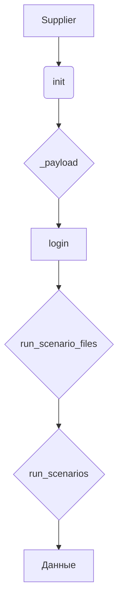
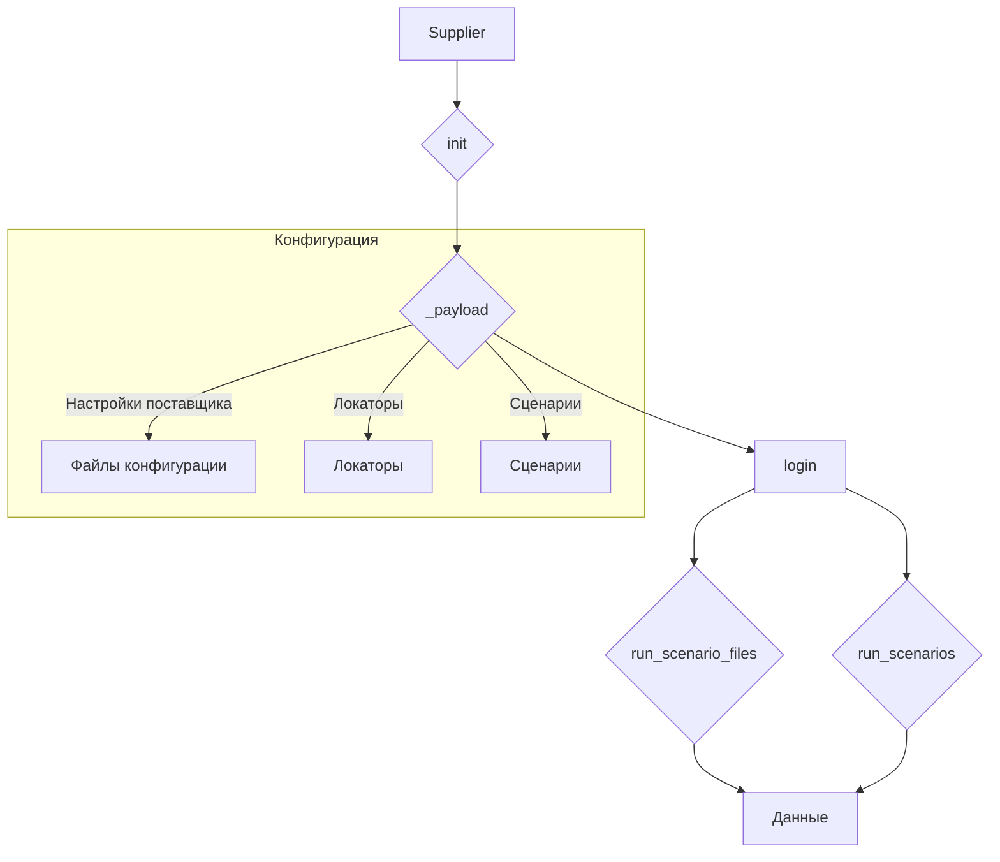

# <input code>

```python
Класс `Supplier` в данном коде является базовым классом для работы с поставщиками данных в вашем приложении. Вот подробное объяснение его назначения и функциональности:

### Назначение Класса

Класс `Supplier` служит основой для реализации различных поставщиков данных (например, Amazon, AliExpress, Walmart и т.д.). Он предоставляет общие методы и атрибуты, которые могут быть использованы или переопределены конкретными реализациями поставщиков.

### Основные Компоненты Класса

#### 1. **Атрибуты Класса**
   - `supplier_id`: Уникальный идентификатор поставщика.
   - `supplier_prefix`: Префикс для поставщика, например, `aliexpress` или `amazon`.
   - `supplier_settings`: Настройки для поставщика, загруженные из файла конфигурации.
   - `locale`: Код локализации (например, `en` для английского, `ru` для русского).
   - `price_rule`: Правило для расчета цены (например, добавление НДС или скидки).
   - `related_modules`: Модуль, содержащий специфические для поставщика функции.
   - `scenario_files`: Список файлов сценариев, которые должны быть выполнены.
   - `current_scenario`: Текущий сценарий выполнения.
   - `login_data`: Данные для входа на сайт поставщика (если требуется).
   - `locators`: Локаторы для веб-элементов на страницах сайта поставщика.
   - `driver`: Веб-драйвер для взаимодействия с сайтом поставщика.
   - `parsing_method`: Метод парсинга данных (например, `webdriver`, `api`, `xls`, `csv`).

#### 2. **Методы Класса**
   - `__init__`: Конструктор класса, инициализирующий атрибуты на основе префикса поставщика и других параметров.
   - `_payload`: Загружает настройки поставщика, конфигурационные файлы и инициализирует веб-драйвер.
   - `login`: Метод для выполнения входа на сайт поставщика (если требуется).
   - `run_scenario_files`: Запускает выполнение файлов сценариев.
   - `run_scenarios`: Запускает один или несколько сценариев.

### Как Это Работает

1. **Инициализация**: При создании объекта `Supplier`, конструктор `__init__` загружает настройки поставщика и инициализирует необходимые компоненты.
   ```python
   def __init__(self, supplier_prefix: str, locale: str = 'en', webdriver: str | Driver | bool = 'default', *attrs, **kwargs):
       # Инициализация префикса поставщика, локали и веб-драйвера
   ```

2. **Загрузка Конфигурации**: Метод `_payload` загружает конфигурации для данного поставщика, включая локаторы для страниц и сценарии выполнения.
   ```python
   def _payload(self, webdriver: str | Driver | bool, *attrs, **kwargs) -> bool:
       # Загрузка конфигурационных файлов и инициализация веб-драйвера
   ```

3. **Вход на Сайт**: Метод `login` используется для выполнения процесса входа на сайт поставщика, если это требуется.
   ```python
   def login(self) -> bool:
       # Выполнение входа на сайт
   ```

4. **Выполнение Сценариев**: Методы `run_scenario_files` и `run_scenarios` запускают сценарии, которые определяют, какие действия нужно выполнить (например, сбор данных).
   ```python
   def run_scenario_files(self, scenario_files: str | List[str] = None) -> bool:
       # Выполнение сценариев из файлов
   def run_scenarios(self, scenarios: dict | list[dict]) -> bool:
       # Выполнение заданных сценариев
   ```

### Визуальное Представление



### Заключение

В общем, класс `Supplier` — это обобщенная модель для работы с данными от различных поставщиков. Он инкапсулирует общую логику взаимодействия с сайтом, настройку драйвера, управление сценарием и парсинг данных. Конкретные реализации поставщиков будут наследовать этот класс и добавлять свою специфическую логику.
```

# <algorithm>

**Шаг 1:** Инициализация `Supplier`. Конструктор `__init__` получает имя поставщика (`supplier_prefix`), локаль и веб-драйвер.

**Пример:** `supplier = Supplier(supplier_prefix='aliexpress', locale='en', webdriver='chrome')`

**Шаг 2:** Загрузка настроек и инициализация. Метод `_payload` загружает конфигурацию поставщика (локаторы, сценарии).
**Пример:** `supplier._payload(webdriver='chrome')`

**Шаг 3:** Вход на сайт. Метод `login` выполняет авторизацию на сайте поставщика, если это необходимо.
**Пример:** `supplier.login()`

**Шаг 4:** Выполнение сценариев. Метод `run_scenario_files` выполняет сценарии, указанные в файлах.
**Пример:** `supplier.run_scenario_files(['scenario1.json', 'scenario2.json'])`

**Шаг 5:** Выполнение сценариев. Метод `run_scenarios` выполняет сценарии, указанные в виде списка словарей.
**Пример:** `supplier.run_scenarios([{'action': 'scrape', 'target': 'product_list'}])`


# <mermaid>



# <explanation>

**Импорты:**  Код импортов не представлен в данном фрагменте.  Чтобы проанализировать импорты, нужно увидеть полный исходный код класса `Supplier`.  Однако, исходя из названия, можно предположить, что будут импорты для работы с веб-драйвером (например, Selenium), чтением конфигурационных файлов, и, возможно, модулями для обработки данных (парсинга).

**Классы:**

* **`Supplier`:**  Базовый класс для работы с поставщиками данных.  Он определяет общие атрибуты (например, `supplier_prefix`, `locale`, `driver`) и методы (например, `_payload`, `login`, `run_scenario_files`), которые могут быть переопределены в дочерних классах (например, `AmazonSupplier`, `AliExpressSupplier`).  Это способствует DRY (Don't Repeat Yourself) принципу.

**Функции:**

* **`__init__`:** Конструктор класса, инициализирует атрибуты объекта `Supplier`.
* **`_payload`:** Загружает данные конфигурации для конкретного поставщика.  Важно, что она принимает веб-драйвер как аргумент, что предполагает гибкость в управлении сессией.
* **`login`:**  Выполняет вход на сайт поставщика (если требуется).
* **`run_scenario_files`:** Запускает сценарии, определенные в файлах.
* **`run_scenarios`:** Запускает сценарии, заданные в виде списка словарей (более гибкий подход).

**Переменные:**

Переменные в основном содержат данные о поставщике (ID, префикс), настройках, данных для входа и др.  Их типы соответствуют назначению.

**Возможные ошибки и улучшения:**

* **Отсутствие импортов:**  Необходимо явно указать, какие модули используются (например, `from selenium import webdriver`).
* **Обработка исключений:**  В методах `login`, `run_scenario_files`, `run_scenarios` необходимо добавить обработку возможных исключений (например, `FileNotFoundError`, `TimeoutException`, ошибки парсинга данных).
* **Документация:**  Документация для методов и атрибутов может быть более подробной.
* **Тестирование:**  Класс `Supplier` должен иметь тесты для проверки его корректной работы.
* **Объектно-ориентированность:**  Использование абстрактных методов (вместо пустых методов) было бы целесообразно.
* **Модульность:**  Логика работы с веб-драйвером, сценариями и парсингом могла бы быть более модульной.

**Взаимосвязи с другими частями проекта:**

Класс `Supplier` предполагает наличие:

1. **Конфигурационных файлов:** Содержащих данные для разных поставщиков.
2. **Файлов сценариев:** Определяющих действия, которые нужно выполнить при сборе данных.
3. **Модулей для обработки данных:** Обрабатывающих полученные данные.


В целом, класс `Supplier` хорошо структурирован, но требует более детальной реализации, включая обработку ошибок, более гибкую конфигурацию и тесты.