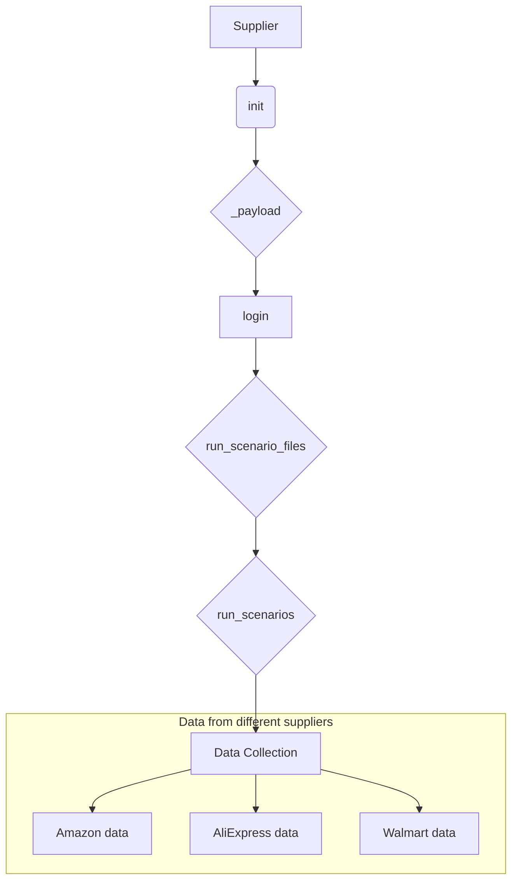
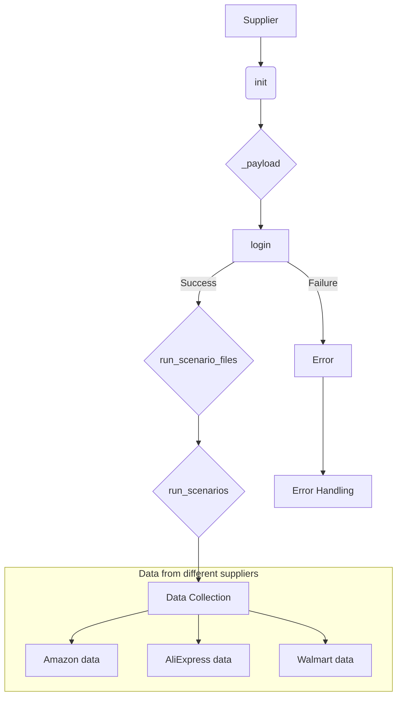

# <input code>

```python
Класс `Supplier` в данном коде является базовым классом для работы с поставщиками данных в вашем приложении. Вот подробное объяснение его назначения и функциональности:

### Назначение Класса

Класс `Supplier` служит основой для реализации различных поставщиков данных (например, Amazon, AliExpress, Walmart и т.д.). Он предоставляет общие методы и атрибуты, которые могут быть использованы или переопределены конкретными реализациями поставщиков.

### Основные Компоненты Класса

#### 1. **Атрибуты Класса**
   - `supplier_id`: Уникальный идентификатор поставщика.
   - `supplier_prefix`: Префикс для поставщика, например, `aliexpress` или `amazon`.
   - `supplier_settings`: Настройки для поставщика, загруженные из файла конфигурации.
   - `locale`: Код локализации (например, `en` для английского, `ru` для русского).
   - `price_rule`: Правило для расчета цены (например, добавление НДС или скидки).
   - `related_modules`: Модуль, содержащий специфические для поставщика функции.
   - `scenario_files`: Список файлов сценариев, которые должны быть выполнены.
   - `current_scenario`: Текущий сценарий выполнения.
   - `login_data`: Данные для входа на сайт поставщика (если требуется).
   - `locators`: Локаторы для веб-элементов на страницах сайта поставщика.
   - `driver`: Веб-драйвер для взаимодействия с сайтом поставщика.
   - `parsing_method`: Метод парсинга данных (например, `webdriver`, `api`, `xls`, `csv`).

#### 2. **Методы Класса**
   - `__init__`: Конструктор класса, инициализирующий атрибуты на основе префикса поставщика и других параметров.
   - `_payload`: Загружает настройки поставщика, конфигурационные файлы и инициализирует веб-драйвер.
   - `login`: Метод для выполнения входа на сайт поставщика (если требуется).
   - `run_scenario_files`: Запускает выполнение файлов сценариев.
   - `run_scenarios`: Запускает один или несколько сценариев.

### Как Это Работает

1. **Инициализация**: При создании объекта `Supplier`, конструктор `__init__` загружает настройки поставщика и инициализирует необходимые компоненты.
   ```python
   def __init__(self, supplier_prefix: str, locale: str = 'en', webdriver: str | Driver | bool = 'default', *attrs, **kwargs):
       # Инициализация префикса поставщика, локали и веб-драйвера
   ```

2. **Загрузка Конфигурации**: Метод `_payload` загружает конфигурации для данного поставщика, включая локаторы для страниц и сценарии выполнения.
   ```python
   def _payload(self, webdriver: str | Driver | bool, *attrs, **kwargs) -> bool:
       # Загрузка конфигурационных файлов и инициализация веб-драйвера
   ```

3. **Вход на Сайт**: Метод `login` используется для выполнения процесса входа на сайт поставщика, если это требуется.
   ```python
   def login(self) -> bool:
       # Выполнение входа на сайт
   ```

4. **Выполнение Сценариев**: Методы `run_scenario_files` и `run_scenarios` запускают сценарии, которые определяют, какие действия нужно выполнить (например, сбор данных).
   ```python
   def run_scenario_files(self, scenario_files: str | List[str] = None) -> bool:
       # Выполнение сценариев из файлов
   def run_scenarios(self, scenarios: dict | list[dict]) -> bool:
       # Выполнение заданных сценариев
   ```

### Пример Использования

```python
# Создаем объект для поставщика 'aliexpress'
supplier = Supplier(supplier_prefix='aliexpress', locale='en', webdriver='chrome')

# Выполняем вход на сайт поставщика
supplier.login()

# Запускаем сценарии из файлов
supplier.run_scenario_files(['example_scenario.json'])

# Или запускаем сценарии по определенным условиям
supplier.run_scenarios([{'action': 'scrape', 'target': 'product_list'}])
```

### Визуальное Представление



### Заключение

В общем, класс `Supplier` — это обобщенная модель для работы с данными от различных поставщиков. Он инкапсулирует общую логику взаимодействия с сайтом, настройку драйвера, управление сценарием и парсинг данных. Конкретные реализации поставщиков будут наследовать этот класс и добавлять свою специфическую логику.
```

# <algorithm>

Пошаговый алгоритм работы класса Supplier:

1. **Инициализация (метод `__init__`)**:
   - Принимает `supplier_prefix`, `locale`, `webdriver` и другие параметры.
   - Инициализирует атрибуты класса (`supplier_id`, `supplier_prefix`, `locale`, `driver`, ...).  
   - Пример: Создание объекта для AliExpress: `supplier = Supplier(supplier_prefix='aliexpress', locale='ru', webdriver='chrome')`

2. **Загрузка конфигурации (метод `_payload`)**:
   - Загружает настройки поставщика из конфигурационного файла, например, локаторы и сценарии.
   - Инициализирует веб-драйвер (`webdriver`).
   - Пример: Загрузка файла настроек для AliExpress, инициализация Chrome драйвера.

3. **Вход на сайт (метод `login`)**:
   - Если требуется, выполняется вход на сайт поставщика используя данные из `login_data`.
   - Возвращает True/False в зависимости от успешности входа.
   - Пример: Авторизация на сайте AliExpress.

4. **Выполнение сценариев из файлов (метод `run_scenario_files`)**:
   - Читает сценарии из переданных файлов (`scenario_files`).
   - Выполняет сценарии по порядку.
   - Возвращает True/False в зависимости от успешности выполнения.
   - Пример: Выполнение скрипта `example_scenario.json` с действиями по парсингу данных.

5. **Выполнение сценариев (метод `run_scenarios`)**:
   - Принимает список сценариев (`scenarios`).
   - Выполняет каждый сценарий, указанный в списке.
   - Возвращает True/False в зависимости от успешности выполнения.
   - Пример: Запуск сценариев с указанием действий ('scrape', 'target') для сбора данных с определенных страниц.


# <mermaid>



# <explanation>

**Импорты**:  Код импортов отсутствует в предоставленном фрагменте, но предполагается, что требуются необходимые библиотеки для работы с веб-драйвером (например, Selenium), для работы с файлами (например, `json`) и для работы с локализацией.


**Классы**: Класс `Supplier` — это абстрактный класс, который определяет общие методы и атрибуты для работы с поставщиками данных. Конкретные классы поставщиков (например, `AliExpressSupplier`, `AmazonSupplier`) должны наследовать от `Supplier` и переопределять методы для специфического взаимодействия с сайтами.


**Функции**:
- `__init__`: Конструктор класса, инициализирует атрибуты объекта.
- `_payload`: Загружает конфигурацию для конкретного поставщика.
- `login`: Выполняет вход на сайт поставщика (если требуется).
- `run_scenario_files`: Запускает сценарии, описанные в файлах.
- `run_scenarios`: Запускает сценарии, описанные в словарях/списках.


**Переменные**: Переменные в `Supplier` хранят данные о поставщике (идентификатор, префикс, настройки, локализация), данные для входа, локаторы элементов на страницах, веб-драйвер и т.д.


**Возможные ошибки или улучшения**:


* Отсутствует обработка исключений (например, ошибки при загрузке конфигурации, ошибках входа или выполнения сценариев). Необходимо добавить обработку исключений `try...except` в методы, чтобы приложение не падало при возникновении проблем.
* Отсутствует валидация входных данных. Необходимо убедиться, что переданные в методы данные соответствуют ожидаемому формату.
* Отсутствует логирование. Добавление логирования (`logging`) позволит отслеживать действия приложения и отлаживать проблемы.
* Отсутствует документация. Документировать функции и классы, чтобы сделать код более понятным и поддерживаемым.
* Необходимо явно указать типы возвращаемых значений функций (boolean, list, dict).

**Цепочка взаимосвязей**: Класс `Supplier` является основой для работы с данными от разных поставщиков.  Другие части проекта, скорее всего, будут использовать объекты `Supplier` для получения данных.  Например, могут быть модули для обработки полученных данных, для их сохранения или дальнейшей обработки.  Важно понимать, как `Supplier` взаимодействует с этими другими частями.