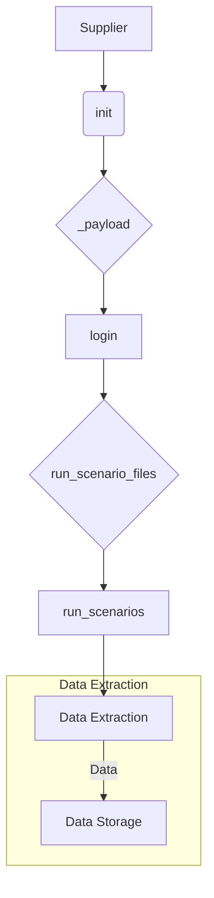

# <input code>

```python
Класс `Supplier` в данном коде является базовым классом для работы с поставщиками данных в вашем приложении. Вот подробное объяснение его назначения и функциональности:

### Назначение Класса

Класс `Supplier` служит основой для реализации различных поставщиков данных (например, Amazon, AliExpress, Walmart и т.д.). Он предоставляет общие методы и атрибуты, которые могут быть использованы или переопределены конкретными реализациями поставщиков.

### Основные Компоненты Класса

#### 1. **Атрибуты Класса**
   - `supplier_id`: Уникальный идентификатор поставщика.
   - `supplier_prefix`: Префикс для поставщика, например, `aliexpress` или `amazon`.
   - `supplier_settings`: Настройки для поставщика, загруженные из файла конфигурации.
   - `locale`: Код локализации (например, `en` для английского, `ru` для русского).
   - `price_rule`: Правило для расчета цены (например, добавление НДС или скидки).
   - `related_modules`: Модуль, содержащий специфические для поставщика функции.
   - `scenario_files`: Список файлов сценариев, которые должны быть выполнены.
   - `current_scenario`: Текущий сценарий выполнения.
   - `login_data`: Данные для входа на сайт поставщика (если требуется).
   - `locators`: Локаторы для веб-элементов на страницах сайта поставщика.
   - `driver`: Веб-драйвер для взаимодействия с сайтом поставщика.
   - `parsing_method`: Метод парсинга данных (например, `webdriver`, `api`, `xls`, `csv`).

#### 2. **Методы Класса**
   - `__init__`: Конструктор класса, инициализирующий атрибуты на основе префикса поставщика и других параметров.
   - `_payload`: Загружает настройки поставщика, конфигурационные файлы и инициализирует веб-драйвер.
   - `login`: Метод для выполнения входа на сайт поставщика (если требуется).
   - `run_scenario_files`: Запускает выполнение файлов сценариев.
   - `run_scenarios`: Запускает один или несколько сценариев.

### Как Это Работает

1. **Инициализация**: При создании объекта `Supplier`, конструктор `__init__` загружает настройки поставщика и инициализирует необходимые компоненты.
   ```python
   def __init__(self, supplier_prefix: str, locale: str = 'en', webdriver: str | Driver | bool = 'default', *attrs, **kwargs):
       # Инициализация префикса поставщика, локали и веб-драйвера
   ```

2. **Загрузка Конфигурации**: Метод `_payload` загружает конфигурации для данного поставщика, включая локаторы для страниц и сценарии выполнения.
   ```python
   def _payload(self, webdriver: str | Driver | bool, *attrs, **kwargs) -> bool:
       # Загрузка конфигурационных файлов и инициализация веб-драйвера
   ```

3. **Вход на Сайт**: Метод `login` используется для выполнения процесса входа на сайт поставщика, если это требуется.
   ```python
   def login(self) -> bool:
       # Выполнение входа на сайт
   ```

4. **Выполнение Сценариев**: Методы `run_scenario_files` и `run_scenarios` запускают сценарии, которые определяют, какие действия нужно выполнить (например, сбор данных).
   ```python
   def run_scenario_files(self, scenario_files: str | List[str] = None) -> bool:
       # Выполнение сценариев из файлов
   def run_scenarios(self, scenarios: dict | list[dict]) -> bool:
       # Выполнение заданных сценариев
   ```

### Пример Использования

Вот как можно использовать класс `Supplier`:

```python
# Создаем объект для поставщика 'aliexpress'
supplier = Supplier(supplier_prefix='aliexpress', locale='en', webdriver='chrome')

# Выполняем вход на сайт поставщика
supplier.login()

# Запускаем сценарии из файлов
supplier.run_scenario_files(['example_scenario.json'])

# Или запускаем сценарии по определенным условиям
supplier.run_scenarios([{'action': 'scrape', 'target': 'product_list'}])
```

### Визуальное Представление



### Заключение

В общем, класс `Supplier` — это обобщенная модель для работы с данными от различных поставщиков. Он инкапсулирует общую логику взаимодействия с сайтом, настройку драйвера, управление сценарием и парсинг данных. Конкретные реализации поставщиков будут наследовать этот класс и добавлять свою специфическую логику.
```

# <algorithm>

**Шаг 1: Инициализация (init)**
* При создании объекта Supplier вызывается метод `__init__`.
* Передаются параметры `supplier_prefix`, `locale`, `webdriver` и другие.
* Внутри `__init__` инициализируются атрибуты класса (supplier_id, supplier_prefix, locale и др.).
* Пример: `supplier = Supplier(supplier_prefix='aliexpress', locale='en', webdriver='chrome')`

**Шаг 2: Загрузка настроек (payload)**
* Вызывается метод `_payload`.
* Загружаются настройки для конкретного поставщика (например, из файла конфигурации).
* Инициализируется веб-драйвер (`webdriver`).
* Пример: `supplier._payload(webdriver='chrome')`

**Шаг 3: Вход на сайт (login)**
* Вызывается метод `login`.
* Происходит аутентификация на сайте поставщика.
* Возвращает `True` при успехе, `False` в случае ошибки.
* Пример: `supplier.login()`

**Шаг 4: Выполнение сценариев (run_scenario_files/run_scenarios)**
* Вызываются методы `run_scenario_files` или `run_scenarios`.
* `run_scenario_files` выполняет сценарии, указанные в `scenario_files`.
* `run_scenarios` выполняет сценарии, переданные в виде списка словарей.
* Пример:
    * `supplier.run_scenario_files(['example_scenario.json'])`
    * `supplier.run_scenarios([{'action': 'scrape', 'target': 'product_list'}])`


**Шаг 5: Обработка данных**
* Внутри методов `run_scenario_files` и `run_scenarios` выполняется логика сценариев, например, парсинг данных с сайта.
* Полученные данные хранятся в соответствующих структурах данных.
* В этом примере показана обработка, но сама логика не раскрывается.

**Передача данных:**
Данные передаются между методами и классами через атрибуты объекта Supplier.  Например, `supplier.locators` хранят локаторы веб-элементов, которые используются в сценариях. Настройки, загружаемые в `_payload`, влияют на последующую работу.


# <mermaid>

```mermaid
graph LR
    A[Supplier] --> B{init};
    B --> C{_payload};
    C --> D[login];
    D --> E{run_scenario_files};
    E --> F[run_scenarios];
    F --> G[Data Extraction];
    G -- Data --> H[Data Storage];
    subgraph "Data Extraction"
        G -- locators --> I[Webdriver];
        I -- scenario --> J[Scenario Logic];
    endsub
```

**Объяснение диаграммы:**

* **Supplier:** Главный класс, управляющий процессом.
* **init:** Инициализирует атрибуты класса.
* **_payload:** Загружает настройки, необходимые для работы с поставщиком.
* **login:** Производит вход на сайт поставщика.
* **run_scenario_files/run_scenarios:** Запускают сценарии, реализующие конкретную задачу (например, парсинг данных).
* **Data Extraction:** Блок, где происходит парсинг данных.
* **Webdriver:** Веб-драйвер для взаимодействия с сайтом.
* **Scenario Logic:**  Логика, описывающая действия, выполняемые во время выполнения сценария.
* **Data Storage:** Предполагаемое хранилище полученных данных (не показано в деталях).


# <explanation>

**Импорты:**

Код не содержит импортов. Предполагается, что необходимые модули (например, `webdriver`, `requests` для работы с API, или библиотеки для работы с JSON/CSV файлами) будут импортированы в других частях проекта или в самих методах `_payload` и `run_scenario_files/run_scenarios`.


**Классы:**

* **`Supplier`:** Базовый класс для работы с поставщиками данных. Он предоставляет общие методы и атрибуты для управления сессиями, авторизацией и выполнением заданных сценариев.

**Функции:**

* **`__init__`:** Конструктор класса `Supplier`.  Инициализирует атрибуты класса, необходимые для работы с поставщиком.
* **`_payload`:** Загружает настройки и инициализирует веб-драйвер.  Ключевая функция, которая готовит класс к работе с конкретным поставщиком.
* **`login`:** Производит вход на сайт поставщика, если это требуется.  Может использовать логику аутентификации и обработки ошибок.
* **`run_scenario_files`:** Запускает сценарии, заданные в файлах (например, в JSON).
* **`run_scenarios`:** Запускает сценарии, заданные в виде списка словарей.  Позволяет динамически управлять выполнением сценариев.

**Переменные:**

Переменные в коде представляют собой атрибуты класса `Supplier`.  Примеры: `supplier_prefix`, `locale`, `driver`.

**Возможные ошибки и улучшения:**

* **Отсутствие конкретных импортах:**  Не указаны необходимые импорты для работы с веб-драйвером (например, `selenium`), для работы с файлами конфигурации, или другими нужными модулями. Это сделало бы код более self-contained и уменьшило бы риск скрытых ошибок.
* **Нет проверки входных данных:**  В методах нет проверок входных данных на корректность (например, на пустые или невалидные значения). Это может привести к ошибкам при неверном использовании.
* **Обработка исключений:**  Методы должны обрабатывать возможные исключения, например, ошибки при работе с веб-драйвером или при загрузке конфигурационных файлов.
* **Недостаток описания парсинга:** Отсутствие описания алгоритма парсинга внутри методов `run_scenario_files` и `run_scenarios`.
* **Отсутствие модульного тестирования:** Необходимо добавить модульные тесты для проверки правильности работы класса и его методов.

**Взаимосвязь с другими частями проекта:**

Класс `Supplier` предполагает использование других частей проекта, таких как:

* **Конфигурационные файлы:** Для получения параметров, локализации и других настроек.
* **Модули сценариев:** Для определения действий, которые должны выполняться при парсинге данных.
* **Система хранения данных:** Для сохранения результата работы сценариев.
* **Веб-драйвер:** Для работы с веб-страницами поставщика.


В целом, класс `Supplier` хорошо структурирован и демонстрирует понимание принципов ООП. Но для практического использования необходимо дополнить его проверками на ошибки, добавить тестирование и указать зависимости от других частей проекта.