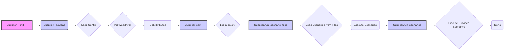

## Анализ кода класса `Supplier`

### <алгоритм>

1.  **Инициализация объекта `Supplier` (`__init__`)**:
    *   Принимает `supplier_prefix` (строка, например, 'aliexpress'), `locale` (строка, например, 'en', по умолчанию 'en'), `webdriver` (строка 'default', объект `Driver` или `bool`, по умолчанию 'default') и произвольные `*attrs`, `**kwargs`.
    *   Сохраняет `supplier_prefix`, `locale`, `webdriver`.
    *   Вызывает метод `_payload`, передавая `webdriver`, `*attrs`, `**kwargs` для загрузки настроек.

    *Пример:*
    ```python
    supplier = Supplier(supplier_prefix='amazon', locale='ru', webdriver='chrome')
    #  supplier_prefix = 'amazon', locale = 'ru', webdriver = 'chrome'
    ```

2.  **Загрузка настроек (`_payload`)**:
    *   Принимает `webdriver` (строка, объект `Driver` или `bool`), `*attrs`, `**kwargs`.
    *   Загружает настройки поставщика из конфигурационных файлов на основе `supplier_prefix` (например, `aliexpress.json`).
    *   Инициализирует веб-драйвер, используя `webdriver`.
    *   Сохраняет локаторы, `login_data`, правила цен, связанные модули и файлы сценариев в атрибутах объекта.

    *Пример:*
     ```python
    # Предположим, что загружаются конфигурации из файла 'amazon.json'
    # supplier.locators = { 'product_list': '.product-item' }
    # supplier.login_data = { 'username': 'user', 'password': 'password' }
    # supplier.scenario_files = ['main_scenario.json', 'special_offers.json']
    ```

3.  **Вход на сайт (`login`)**:
    *   Выполняет вход на сайт поставщика, используя `login_data`.
    *   Этот метод может быть переопределен в дочерних классах, для специфических сайтов.

    *Пример:*
    ```python
    #Используя selenium, метод может искать поле ввода логина, пароля, и нажимать кнопку "войти"
    supplier.login()
    # Вход выполнен
    ```

4.  **Запуск сценариев (`run_scenario_files`)**:
    *   Принимает `scenario_files` (строка или список строк с путями к файлам сценариев, может быть None).
    *   Выполняет сценарии, загруженные из файлов.
    *   Управляет последовательностью выполнения, `current_scenario`.
     
   *Пример:*
    ```python
    supplier.run_scenario_files(['main_scenario.json', 'promo_scenario.json'])
    # Сценарии из указанных файлов выполнены
    ```

5.  **Запуск сценариев (`run_scenarios`)**:
    *   Принимает `scenarios` (список словарей или словарь).
    *   Выполняет предоставленные сценарии, представляющие собой последовательность действий.
    *   Управляет последовательностью выполнения, `current_scenario`.

    *Пример:*
    ```python
    supplier.run_scenarios([{'action': 'scrape', 'target': 'product_list'}, {'action': 'filter', 'criteria': {'price': 100}}])
    # Сценарии сбора данных и фильтрации выполнены
    ```

### <mermaid>



**Описание зависимостей `mermaid`:**

*   `Supplier.__init__` (A) инициирует создание объекта `Supplier`.
*   `Supplier._payload` (B) загружает конфигурацию и инициализирует веб-драйвер.
*   `Load Config` (C) загружает конфигурационные файлы для конкретного поставщика.
*   `Init Webdriver` (D) инициализирует веб-драйвер, если это необходимо.
*   `Set Attributes` (E) устанавливает необходимые атрибуты объекта.
*   `Supplier.login` (F) отвечает за авторизацию на сайте поставщика.
*   `Login on site` (G) выполняет фактический процесс входа на сайт поставщика.
*   `Supplier.run_scenario_files` (H) запускает выполнение сценариев из файлов.
*   `Load Scenarios from Files` (I) загружает сценарии из файлов.
*    `Execute Scenarios`(J) Выполняет сценарии загруженные из файлов.
*    `Supplier.run_scenarios`(K) запускает выполнение предоставленных сценариев.
*    `Execute Provided Scenarios` (L) Выполняет сценарии, которые были переданы в качестве аргумента.
*   `Done` (M)  завершение процесса.
*   Класс `method` используется для стилизации  методов.

### <объяснение>

**Импорты:**
*   В предоставленном коде нет явных импортов. Это указывает на то, что данный класс может использовать базовые типы данных Python и предполагает наличие других модулей в проекте (`src.`), которые не отображаются.
*   Наличие зависимости от `Driver` подразумевает наличие реализации веб-драйвера.
**Классы:**
*   **`Supplier`**:
    *   **Роль**: Базовый класс для поставщиков данных, предоставляющий общую логику.
    *   **Атрибуты**:
        *   `supplier_id`: Уникальный идентификатор поставщика.
        *   `supplier_prefix`: Префикс поставщика (например, 'aliexpress').
        *   `supplier_settings`: Настройки поставщика, загруженные из конфигурационного файла.
        *   `locale`: Локализация (например, 'en', 'ru').
        *   `price_rule`: Правило расчета цены.
        *   `related_modules`: Модуль со специфическими функциями поставщика.
        *   `scenario_files`: Список файлов со сценариями.
        *   `current_scenario`: Текущий сценарий.
        *   `login_data`: Данные для входа на сайт.
        *   `locators`: Локаторы веб-элементов.
        *   `driver`: Веб-драйвер (например, Selenium).
        *   `parsing_method`: Метод парсинга (например, 'webdriver', 'api', 'xls', 'csv').
    *   **Методы**:
        *   `__init__(self, supplier_prefix: str, locale: str = 'en', webdriver: str | Driver | bool = 'default', *attrs, **kwargs)`:
            *   Конструктор класса, инициализирует атрибуты.
            *   Принимает префикс поставщика, локаль, веб-драйвер и дополнительные атрибуты.
        *   `_payload(self, webdriver: str | Driver | bool, *attrs, **kwargs) -> bool`:
            *   Загружает настройки поставщика и инициализирует веб-драйвер.
            *   Принимает веб-драйвер и дополнительные атрибуты.
        *   `login(self) -> bool`:
            *   Выполняет вход на сайт.
            *   Не имеет аргументов.
        *   `run_scenario_files(self, scenario_files: str | List[str] = None) -> bool`:
            *   Запускает сценарии из файлов.
            *   Принимает пути к файлам сценариев.
        *   `run_scenarios(self, scenarios: dict | list[dict]) -> bool`:
            *   Запускает сценарии, переданные в виде словаря или списка словарей.
            *   Принимает сценарии.

**Функции:**
*   В коде нет явных функций, все операции инкапсулированы в методы класса `Supplier`.

**Переменные:**
*   `supplier_prefix` (str): Префикс поставщика (например, 'aliexpress').
*   `locale` (str): Локализация (например, 'en').
*   `webdriver` (str | Driver | bool): Строка, объект `Driver` или булево значение для управления веб-драйвером.
*   `scenario_files` (str | List[str] | None): Путь или список путей к файлам сценариев.
*   `scenarios` (dict | list[dict]): Сценарии для выполнения.
*   Остальные переменные являются атрибутами класса, которые хранят состояния и конфигурации поставщика.

**Потенциальные ошибки и области для улучшения:**
*   **Обработка ошибок**: В коде отсутствует явная обработка исключений. Это может привести к проблемам, если, например, файл конфигурации не будет найден.
*   **Управление веб-драйвером**:  Управление веб-драйвером реализовано неявно. Возможно, стоит добавить механизм управления временем жизни драйвера.
*   **Расширяемость**: В текущем варианте класс `Supplier` довольно сложен, при добавлении большого количества полей, это усложнит его понимание. Можно разбить класс на части, применяя Composition.
*   **Логирование**: В коде отсутствуют механизмы логирования, что затруднит отладку и мониторинг.
*   **Типизация**: Необходимо добавить более подробную типизацию, особенно для `*args`, `**kwargs`.

**Взаимосвязи с другими частями проекта:**

*   **`src.config`**: Класс зависит от модулей, которые загружают конфигурационные файлы поставщиков (например, `aliexpress.json`).
*   **`src.drivers`**: Класс требует наличия модуля для работы с веб-драйвером (например, `src.drivers.Driver`), который инкапсулирует работу с Selenium или другим инструментом.
*   **`src.scenarios`**: Класс запускает сценарии, которые определяются в других модулях проекта.
*  **`src.parsing`**: Зависит от механизма парсинга, который задан в `parsing_method`.

**Заключение:**
Класс `Supplier` является центральным элементом для управления поставщиками данных, он обеспечивает механизм загрузки конфигурации, инициализации веб-драйвера, авторизацию, запуск сценариев.  Улучшения могут быть направлены на более явное управление ошибками, расширяемость, добавление логирования и  разделение функционала.