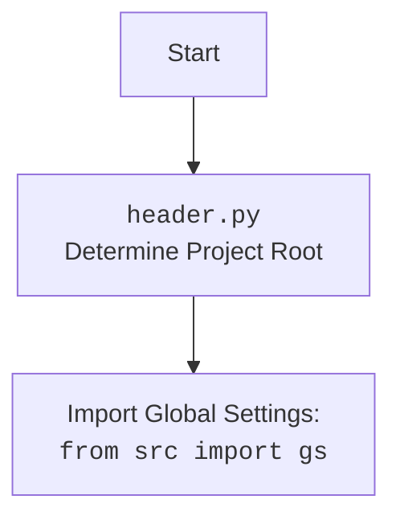

# АНАЛИЗ КОДА `hypotez/src/suppliers/_examples/header.py`

## <алгоритм>

1.  **Определение корневой директории проекта (`dir_root`)**:
    *   Используется функция `os.getcwd()` для получения текущей рабочей директории.
    *   Находится индекс последнего вхождения подстроки "hypotez" в текущей рабочей директории.
    *   Извлекается подстрока текущей рабочей директории до индекса последнего вхождения "hypotez" + 7 (длина "hypotez"). Это позволяет получить путь до корневой директории проекта.
    *   Создается объект `Path` из полученного пути.
    *   *Пример*: Если `os.getcwd()` возвращает "/home/user/projects/hypotez/src/suppliers", то `dir_root` будет "/home/user/projects/hypotez".

2.  **Добавление корневой директории в `sys.path`**:
    *   Корневая директория, представленная в виде строки, добавляется в `sys.path`, что позволяет импортировать модули из этой директории.

3.  **Определение директории `src` (`dir_src`)**:
    *   Создается объект `Path` для директории "src", которая находится внутри корневой директории.
    *   *Пример*: Если `dir_root` равен "/home/user/projects/hypotez", то `dir_src` будет "/home/user/projects/hypotez/src".

4.  **Добавление рабочей директории в `sys.path`**:
    *   Рабочая директория, которая по сути является корневой директорией, также добавляется в `sys.path`.

## <mermaid>

```mermaid
flowchart TD
    Start --> GetCurrentWorkingDirectory[Get Current Working Directory using <code>os.getcwd()</code>]
    GetCurrentWorkingDirectory --> FindHypotezIndex[Find Index of 'hypotez' in Current Directory String]
    FindHypotezIndex --> ExtractRootPath[Extract Root Path using slicing]
    ExtractRootPath --> CreateRootPathObject[Create Root Path object: <code>dir_root</code> using <code>pathlib.Path</code>]
    CreateRootPathObject --> AppendRootPathToSysPath[Append Root Path to <code>sys.path</code>]
    AppendRootPathToSysPath --> CreateSrcPathObject[Create src Path object: <code>dir_src</code> using <code>pathlib.Path</code>]
    CreateSrcPathObject --> AppendSrcPathToSysPath[Append Root Path to <code>sys.path</code>]
    AppendSrcPathToSysPath --> End
    
    
```


## <объяснение>

**Импорты:**

*   `os`: Модуль `os` используется для взаимодействия с операционной системой, в данном случае, для получения текущей рабочей директории с помощью `os.getcwd()`.
*   `sys`: Модуль `sys` предоставляет доступ к переменным и функциям, взаимодействующим с интерпретатором Python. Здесь `sys.path` используется для добавления путей поиска модулей. Это позволяет импортировать модули из указанных директорий.
*   `pathlib.Path`: Класс `Path` из модуля `pathlib` используется для работы с путями к файлам и директориям. Он предоставляет более удобный и объектно-ориентированный способ работы с путями, чем использование строк.

**Переменные:**

*   `dir_root` (`pathlib.Path`): Представляет корневую директорию проекта. Она вычисляется динамически, исходя из того где находиться файл и предполагается, что файл всегда находиться в поддиректориях `hypotez`.
*   `dir_src` (`pathlib.Path`): Представляет директорию `src` внутри корневой директории. Она используется для импорта модулей из этого места.

**Функции:**

*   `os.getcwd()`: Функция из модуля `os`, возвращающая текущую рабочую директорию в виде строки.
*   `str()`: Встроенная функция, преобразующая объект `Path` в строку.
*   `sys.path.append()`: Метод списка `sys.path`, добавляющий переданный путь в конец списка, что позволяет Python искать модули в добавленном месте.
*   `Path()`: Конструктор класса `Path` из модуля `pathlib`, создающий объект пути.

**Объяснения:**

1. **Логика определения корневой директории:**
   *   Код предполагает, что проект имеет структуру, в которой папка `hypotez` является корневой директорией.  
   *   Метод `rfind('hypotez')` ищет последнее вхождение 'hypotez' в строку текущей рабочей директории.  
   *   Добавляется `+7` для того что бы получить полный путь до  `/hypotez`, который является корневым.  
   *   Далее `Path` создает обьект типа `Path`.
2. **Добавление путей в `sys.path`:**
   *   Добавление корневой директории в `sys.path` позволяет импортировать модули, которые находятся в корне проекта, что полезно для модульной структуры.  
   *   Добавление рабочей директории может быть избыточным, если корневая директория уже добавлена.

**Потенциальные улучшения:**

1. **Избыточное добавление `sys.path`:** Добавление `dir_root` в `sys.path` дважды (сразу после ее определения и после определения `dir_src`) является избыточным. Достаточно добавить один раз.
2.  **Жесткая привязка к "hypotez":** Определение корневой директории жестко привязано к строке "hypotez". В случае переименования папки, код перестанет работать. Было бы лучше иметь переменную конфигурации или механизм автоматического обнаружения корневой папки.
3. **Комментарии:**  Хотя присутствует docstring, он явно не доработан.  Полезным было бы добавить комментарии, объясняющие логику определения корневой директории и  добавления путей в `sys.path`.

**Взаимосвязи с другими частями проекта:**
Этот файл `header.py` предназначен для определения корневой и рабочей директорий проекта и добавления их в `sys.path`. Он является базовым файлом для всего проекта, обеспечивая правильную работу импортов модулей из других частей проекта.  Зависит от наличия папки `hypotez` в структуре проекта.